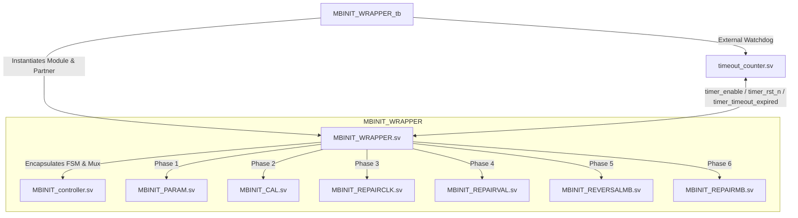
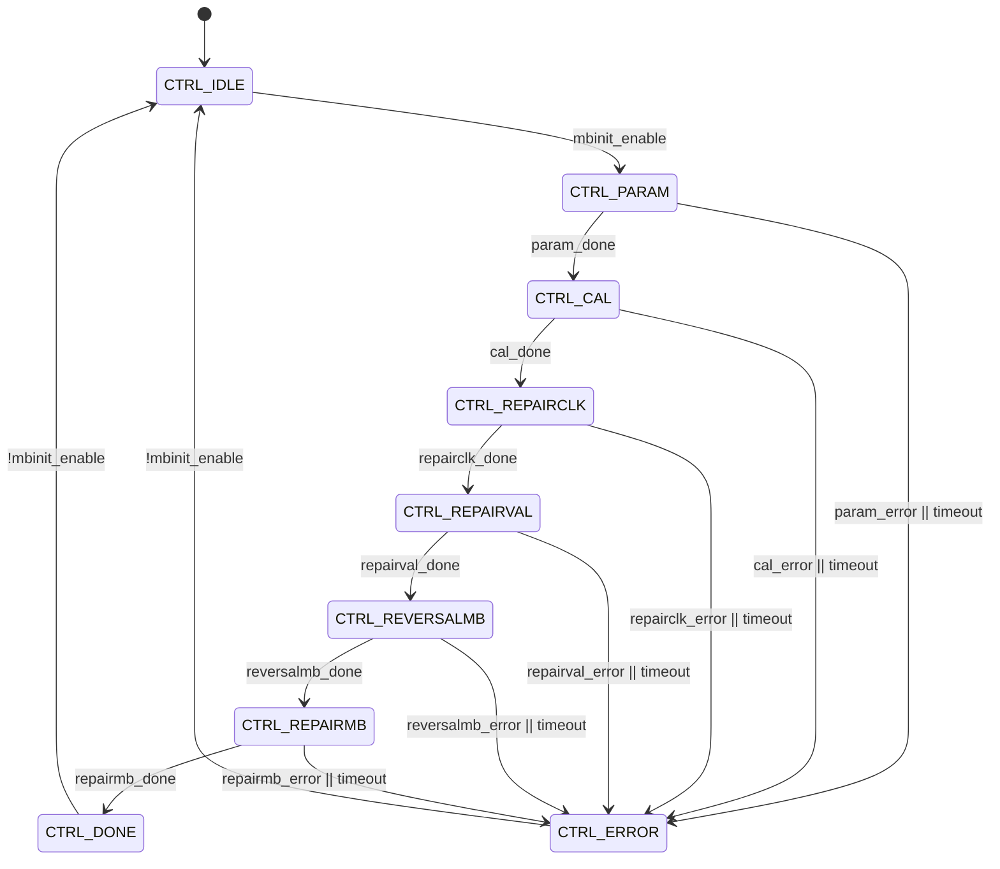

# UCIe 3.0 PHY Layer - Mainband Initialization (MBINIT) Architecture & Design Documentation

This document provides a comprehensive technical breakdown of the **Mainband Initialization (MBINIT)** block in the UCIe 3.0 PHY layer. It details the system architecture, module hierarchy, individual substate behaviors, FSM execution flows, timer/error subsystems, and latching mechanisms.

---

## 1. Executive Summary & Architectural Overview

The **MBINIT** block is a central coordinator within the UCIe Physical Layer Link Training and Status State Machine (LTSM). Its primary function is to initialize, calibrate, test, and repair the high-speed **Mainband (MB)** lanes using the low-latency **Sideband (SB)** message interface for link negotiation.

### Key Objectives
*   **Parameter Exchange & Agreement**: Dynamic capabilities alignment (widths, speeds, features).
*   **System Calibration**: Handshaking of active hardware calibration status.
*   **Clock Lane Repair**: Dynamic testing and redundancy-switching for critical clock lanes.
*   **Repair Validation**: Verification of corrected clock/valid training lines.
*   **Lane Reversal Handling**: Detection of physical cabling reversals and logic correction.
*   **Mainband Data Lane Repair**: High-precision point-testing, asymmetrical failure isolation, and width degradation (e.g., x16 → lower/upper x8 → x4).

---

## 2. Module Hierarchy

The MBINIT block uses a clean, highly decoupled modular architecture. The top-level **Wrapper** encapsulates a **FSM Controller** and **6 unique Substate Modules**, providing strict isolation between the states.



### Module Descriptions
1.  **`MBINIT_WRAPPER.sv`**: The top-level wrapper. It handles pin-level routing, integrates capability interfaces, houses submodules, drives unified mainband outputs, and exposes timer control signals to the external environment.
2.  **`MBINIT_controller.sv`**: The structural FSM controller. It sequences the submodules, handles the one-hot activation matrix, multiplexes sideband and pattern signals, manages the watchdog timer transitions, and sequentially latches negotiated maps.
3.  **`MBINIT_PARAM.sv`**: Executes Parameter Exchange.
4.  **`MBINIT_CAL.sv`**: Performs Calibration handshakes.
5.  **`MBINIT_REPAIRCLK.sv`**: Detects and repairs clock lane physical faults.
6.  **`MBINIT_REPAIRVAL.sv`**: Validates the active Clock & Valid lane signals.
7.  **`MBINIT_REVERSALMB.sv`**: Decides whether physical lane orientation is reversed.
8.  **`MBINIT_REPAIRMB.sv`**: Conducts data-lane point testing and handles width degradation.

---

## 3. Submodules Deep-Dive (The 6-Phase Training Flow)

Each of the six submodules is modeled as a split-state, request-response FSM to guarantee robust handshaking across the asynchronous sideband link.

---

### Phase 1: Parameter Exchange (`MBINIT_PARAM.sv`)

Exchanges and aligns Physical Layer capability structures. Both links agree on the target width, target speed, and supported features before moving forward.

```
       Die 0 (Module)                                  Die 1 (Partner)
             |                                               |
             | ---- [MBINIT_PARAM_init_req] (Local Caps) ---> |
             | <--- [MBINIT_PARAM_init_req] (Local Caps) ---- |
             |                                               |
             | ---- [MBINIT_PARAM_init_resp] (Aligned) -----> |
             | <--- [MBINIT_PARAM_init_resp] (Aligned) ------ |
             v                                               v
```

*   **Capabilities Aligned**:
    *   **Link Speed**: Aligned to the minimum supported speed between both modules.
    *   **Link Width**: Decided based on maximum capabilities and register setups (e.g. x16, x8, x4).
    *   **Clocking Features**: Clock Phase (Phase-0/1) and Clock Mode.
    *   **Special Flags**: PMO (Power Management), L2SPD (Low Speed), PSPT (Point-test Support), and TARR (Transmitter Receiver Redundancy).
*   **Error Condition**: Any mismatch in mandatory capabilities, or FSM timeout, triggers a transition to `MB_S5_ERROR`.

---

### Phase 2: System Calibration (`MBINIT_CAL.sv`)

Verifies that the hardware blocks (PLLs, high-speed clocks, and active transceivers) on both sides have achieved calibration lock.

*   **FSM Stages**:
    *   `MB_S1_CAL_REQ_SEND` / `MB_S1_CAL_REQ_WAIT`: Drives and waits for `MBINIT_CAL_Done_req` indicating local calibration lock.
    *   `MB_S1_CAL_RSP_SEND` / `MB_S1_CAL_RSP_WAIT`: Drives and waits for `MBINIT_CAL_Done_resp` confirming mutual lock.
*   **Handshake**: Sideband messages do not proceed until `ltsm_rdy` from the TX FIFO is active, preventing sideband message loss.
*   **Error Condition**: Failure to achieve system lock or transition timeout triggers a transition to `MB_S3_ERROR`.

---

### Phase 3: Clock Lane Repair (`MBINIT_REPAIRCLK.sv`)

Trains and repairs the physical clock lanes. Clock lines represent the heartbeat of the interface and are prioritized for repair before any data-lane validation.

*   **Redundancy Support (TARR)**:
    *   **RTRK**: Redundant Clock Lane.
    *   **RCKN / RCKP**: Normal differential clock signals.
*   **Execution Flow**:
    1.  The module configures the mainband transmitters to send a continuous Clock Pattern (`mb_tx_pattern_setup = 3'b100`).
    2.  The RX compares the received lanes. If `rckp_pass`, `rckn_pass`, or `rtrk_pass` fail, the hardware redirects the failed clock line to the redundant track.
    3.  A results-exchange handshake verifies mutual status.
*   **Error Condition**: If a clock lane fails and no redundant lanes are available, it transitions to `MB_S6_REPAIRCLK_ERROR`.

---

### Phase 4: Repair Validation (`MBINIT_REPAIRVAL.sv`)

Ensures that the repaired/aligned Clock lanes and Valid lanes are working as intended under normal pattern stresses.

*   **Execution Flow**:
    1.  Configures transmitters to stream valid patterns (`mb_tx_val_pattern_sel = 1'b1`).
    2.  RX enables the comparators on valid-line tracks (`mb_rx_compare_setup = 2'b10`).
    3.  Verifies the pass state of the valid lanes (`mb_rx_val_pass` is checked).
    4.  Exchanges the results using SB messages `MBINIT_REPAIRVAL_result_req` and `MBINIT_REPAIRVAL_result_resp`.
*   **Error Condition**: Any valid line validation failure transitions the submodule to `MB_S5_ERROR`.

---

### Phase 5: Lane Reversal Detection & Correction (`MBINIT_REVERSALMB.sv`)

Detects if the high-speed cables/tracks are physically reversed (e.g. Rx lane 0 mapped to Tx lane 15).

```
         Module TX Lanes                      Partner RX Lanes
             Lane 0   ------------------------>   Lane 15  (Reversed!)
             Lane 1   ------------------------>   Lane 14
             ...                                  ...
             Lane 15  ------------------------>   Lane 0
```

*   **Execution Flow**:
    1.  Mainband transmitters send the standard `LFSR / Per-Lane ID` patterns.
    2.  RX performs comparison. If failures occur on normal tracks, the module evaluates the reversed tracking.
    3.  **Level-Based Reversal Request**: If reversal is detected, `mb_lane_reversal_req` is asserted as a stable level-signal and remains high until FSM resets back to `MB_S0_IDLE`.
    4.  The controller sequentially latches this reversal state.
*   **Error Condition**: If both normal and reversed maps fail, or if majority success threshold is not achieved after retry, it goes to `MB_S7_REVERSAL_ERROR`.

---

### Phase 6: Mainband Data Lane Repair & Degradation (`MBINIT_REPAIRMB.sv`)

This represents the final and most complex phase of mainband link training. It runs high-precision point-testing across all active data lanes and executes degradation mapping if lane failures are observed.

*   **Point-Test Architecture**:
    *   Leverages the **D2C Point-Test Simulator** (`tx_pt_en`, `d2c_perlane_pass`, `test_d2c_done`).
    *   FSM goes to `MB_S2_D2C_POINT_TEST` where it stimulates physical data tracks.
*   **Degradation Logic Matrix**:
    *   If all 16 lanes pass → configured to **x16** full-width (`mbinit_rx/tx_data_lane_mask = 3'b011`).
    *   If lanes 0-7 pass, but 8-15 contain errors → degrades to **Lower x8** width (`3'b001`).
    *   If lanes 8-15 pass, but 0-7 contain errors → degrades to **Upper x8** width (`3'b010`).
    *   Under x4 allowances (e.g. SPMW strap or x8 start modes):
        *   Lanes 0-3 pass → **Lower x4** width (`3'b100`).
        *   Lanes 4-7 pass → **Upper x4** width (`3'b101`).
*   **Alignment Check**:
    *   Executes `MB_S8_ALIGN_CHECK` where Tx and Rx width vectors are intersected to guarantee symmetric link dimensions. If no common operational width is agreed, the block transitions to `MB_S6_REPAIR_ERROR`.

---

## 4. Controller FSM & Multiplexing Logic (`MBINIT_controller.sv`)

The **MBINIT Controller** acts as the central coordinator, driving state transitions and multiplexing common mainband paths.



### 1. One-Hot Activation Matrix
The controller activates exactly one substate module at any given clock cycle using a one-hot enable mask:
```systemverilog
always_comb begin
    param_enable      = 0;
    repairclk_enable  = 0;
    reversalmb_enable = 0;
    repairmb_enable   = 0;
    repairval_enable  = 0;
    cal_enable        = 0;

    case (current_state)
        CTRL_PARAM:      param_enable      = 1;
        CTRL_REPAIRCLK:  repairclk_enable  = 1;
        CTRL_REVERSALMB: reversalmb_enable = 1;
        CTRL_REPAIRMB:   repairmb_enable   = 1;
        CTRL_REPAIRVAL:  repairval_enable  = 1;
        CTRL_CAL:        cal_enable        = 1;
        default: ;
    endcase
end
```

### 2. Training & Comparison Mux
Common outputs going to the physical mainband analog front-end (AFE) are multiplexed combinatorially inside the controller based on the active state:
```systemverilog
always_comb begin
    mb_tx_pattern_en         = 1'b0;
    mb_tx_pattern_setup      = 3'b000;
    mb_tx_data_pattern_sel   = 2'b00;
    mb_tx_val_pattern_sel    = 1'b0;
    mb_rx_compare_en         = 1'b0;
    mb_rx_compare_setup      = 2'b00;
    clear_error_req          = 1'b0;

    case (current_state)
        CTRL_REPAIRCLK: begin
            mb_tx_pattern_en         = repairclk_tx_pattern_en;
            mb_tx_pattern_setup      = repairclk_tx_pattern_setup;
            mb_rx_compare_en         = repairclk_rx_compare_en;
            mb_rx_compare_setup      = repairclk_rx_compare_setup;
        end
        CTRL_REPAIRVAL: begin
            mb_tx_pattern_en         = repairval_tx_pattern_en;
            mb_tx_pattern_setup      = repairval_tx_pattern_setup;
            mb_tx_val_pattern_sel    = repairval_tx_val_pattern_sel;
            mb_rx_compare_en         = repairval_rx_compare_en;
            mb_rx_compare_setup      = repairval_rx_compare_setup;
        end
        CTRL_REVERSALMB: begin
            mb_tx_pattern_en         = reversalmb_tx_pattern_en;
            mb_tx_pattern_setup      = reversalmb_tx_pattern_setup;
            mb_tx_data_pattern_sel   = reversalmb_tx_data_pattern_sel;
            mb_rx_compare_en         = reversalmb_rx_compare_en;
            mb_rx_compare_setup      = reversalmb_rx_compare_setup;
            clear_error_req          = reversalmb_clear_error_req;
        end
        CTRL_REPAIRMB: begin
            clear_error_req          = repairmb_clear_error_req;
        end
        default: ;
    endcase
end
```

---

## 5. Wrapper Top-Level Integration (`MBINIT_WRAPPER.sv`)

The **Wrapper** acts as a structural parent module, mapping registers, LTSM inputs, and physical sideband buses to the internal submodules.

```
       LTSM / Registers                     MBINIT_WRAPPER                     Analog Mainband
     +-------------------+              +--------------------+              +-------------------+
     |                   |              |                    |              |                   |
     |  mbinit_enable ---+------------->|   +------------+   |------------->| mb_tx_pattern_en  |
     |  mbinit_done   <--+--------------|   | Controller |   |------------->| mb_tx_pattern_set |
     |  mbinit_error  <--+--------------|   +------------+   |              |                   |
     |                   |              |    |    |    |     |              +-------------------+
     |  SPMW / x8_ctrl --+------------->|    |    |    +-----+------------->| mbinit_tx_mask    |
     |                   |              |    v    v          |------------->| mbinit_rx_mask    |
     +-------------------+              |  +--------+        |              |                   |
                                        |  | Submod |        |              +-------------------+
       External Timer                   |  +--------+        |
     +-------------------+              |    |               |                Sideband MB Bus
     |                   |              |    +---------------+------------->| mb_tx_valid/msg   |
     |  timer_enable  <--+--------------+                    |<-------------| mb_rx_valid/msg   |
     |  timer_rst_n   <--+--------------+                    |              |                   |
     |  timeout_exp   ---+------------->+--------------------+              +-------------------+
     +-------------------+
```

---

## 6. Watchdog Timer & Global Error Subsystem

To guarantee liveness and prevent state lockups, a unified external watchdog timer structure is used.

### 1. Watchdog Control (Controller-to-External Timer)
The controller exposes three dedicated signals to drive an external watchdog timer (instantiated in the testbench or the top-level LTSM module):
*   `timer_enable`: High when FSM is active (`current_state` is in `CTRL_PARAM` through `CTRL_REPAIRMB`).
*   `timer_rst_n`: Active-low reset signal. The controller combinatorially detects state changes and pulses this signal low to auto-reset the watchdog count for the new substate:
    ```systemverilog
    logic timer_rst_n_reg;
    always_ff @(posedge clk or negedge rst_n) begin
        if (!rst_n)
            timer_rst_n_reg <= 1'b0;
        else if (next_state != current_state)
            timer_rst_n_reg <= 1'b0; // Auto-reset pulse on substate transition
        else
            timer_rst_n_reg <= 1'b1;
    end
    assign timer_rst_n = timer_rst_n_reg;
    ```
*   `timer_timeout_expired`: Input pin indicating that the active state exceeded its time budget (e.g. 8ms). Upon assertion, the controller transitions immediately to `CTRL_ERROR`.

### 2. Global Error Propagation
Submodules do not directly monitor timer signals. Instead, the wrapper routes the global error signal (`mbinit_error`) back to each sub-module's `global_error` port.
If the controller goes to `CTRL_ERROR` (due to any timeout or internal submodule error), `mbinit_error` rises, immediately triggering all submodules to enter their respective local error states.

---

## 7. Sequential Latching Mechanisms

Because the capability settings, lane maps, and reversal requests reset to their default values when substate modules transition back to `idle`, the controller implements **Sequential Latching Blocks** to freeze the negotiated maps before the substate modules deassert.

```
                   FSM transitions out of active training state
                                        |
                   +--------------------+--------------------+
                   |                                         |
         [CTRL_REPAIRMB State]                     [CTRL_REVERSALMB State]
                   |                                         |
    Latching negotiated Rx/Tx masks            Latching active Reversal Request
                   |                                         |
    mbinit_rx_data_lane_mask_reg               mb_lane_reversal_req_reg
    mbinit_tx_data_lane_mask_reg                             |
                   |                                         |
                   +--------------------+--------------------+
                                        |
                            Frozen outputs to top-level
```

### 1. Data Lane Mask Latching
Negotiated masks default to `3'b011` (x16). The controller latches active maps when `current_state == CTRL_REPAIRMB`, keeping the final value frozen when the submodule is disabled:
```systemverilog
always_ff @(posedge clk or negedge rst_n) begin
    if (!rst_n) begin
        mbinit_rx_data_lane_mask_reg <= 3'b011;
        mbinit_tx_data_lane_mask_reg <= 3'b011;
    end else if (current_state == CTRL_IDLE) begin
        mbinit_rx_data_lane_mask_reg <= 3'b011;
        mbinit_tx_data_lane_mask_reg <= 3'b011;
    end else if (current_state == CTRL_REPAIRMB) begin
        mbinit_rx_data_lane_mask_reg <= repairmb_rx_data_lane_mask;
        mbinit_tx_data_lane_mask_reg <= repairmb_tx_data_lane_mask;
    end
end
```

### 2. Lane Reversal Latching
The lane reversal state behaves identically, latching during `CTRL_REVERSALMB` and holding its value after the substate deasserts:
```systemverilog
always_ff @(posedge clk or negedge rst_n) begin
    if (!rst_n) begin
        mb_lane_reversal_req_reg <= 1'b0;
    end else if (current_state == CTRL_IDLE) begin
        mb_lane_reversal_req_reg <= 1'b0;
    end else if (current_state == CTRL_REVERSALMB) begin
        mb_lane_reversal_req_reg <= reversalmb_lane_reversal_req;
    end
end
```

This guarantees that aligned width limits and reversal configurations remain active and steady throughout the remaining phases of link training and operational link states.
