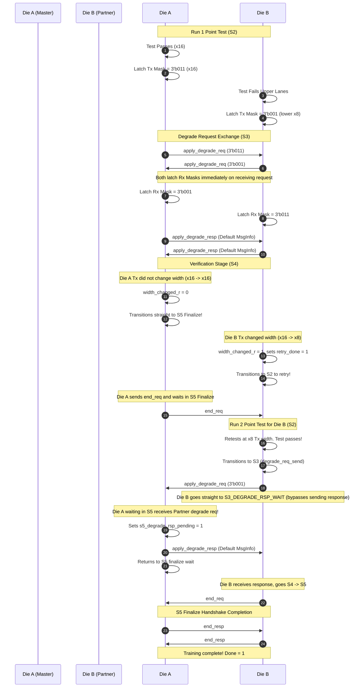

# UCIe 3.0 PHY Layer - MBINIT.REPAIRMB Substate Architecture

This document provides a highly detailed, comprehensive architectural breakdown of the **Mainband Lane Repair (REPAIRMB)** substate in the UCIe 3.0 PHY Layer Initialization. It explains the design logic, signal flows, handshake rules, and asymmetric/independent training support, complete with FSM and Sequence diagrams.

---

## 1. Architectural Overview & Design System

The `MBINIT_REPAIRMB` module implements a robust, deterministic, and highly responsive **split-state FSM architecture** to manage mainband data lane repair/degradation.

To achieve complete physical flexibility under the UCIe specification, our implementation supports **Independent Pair Training**. This means each training pair (Master Tx $\to$ Partner Rx, and Partner Tx $\to$ Master Rx) trains, decides to degrade, and retries **fully independently**. There is no lock-step negotiation of a single global width; the Tx and Rx widths of a single link are allowed to be completely asymmetric.

```
       +-----------------------------------------------+
       |             UCIe Physical Link                |
       |                                               |
       |  Die A (Master)               Die B (Partner) |
       |   +---------+                  +---------+    |
       |   | Tx Mask |==================> Rx Mask |    |
       |   |  (x16)  |   Data Lanes     |  (x16)  |    |
       |   +---------+                  +---------+    |
       |                                               |
       |   +---------+                  +---------+    |
       |   | Rx Mask <==================| Tx Mask |    |
       |   |  (x8)   |   Data Lanes     |  (x8)   |    |
       |   +---------+                  +---------+    |
       +-----------------------------------------------+
```

---

## 2. Complete FSM State Definitions

The FSM is structured into 10 discrete states:

| FSM State Enum | Stage / Purpose | Action on Entry / State Description |
| :--- | :--- | :--- |
| `MB_S0_IDLE` | **Idle / Reset** | Default state when `mb_repairmb_enable` is `0`. All masks reset to `3'b011` (x16). All handshake flags are cleared. |
| `MB_S1_READY_REQ_SEND` | **Readiness Handshake** | Asserts `mb_repairmb_tx_msg_id = MBINIT_REPAIRMB_start_req` to inform the partner we are ready. |
| `MB_S1_READY_REQ_WAIT` | **Readiness Handshake** | Waits for `s1_req_rcvd` (the partner's `start_req`). |
| `MB_S1_READY_RSP_SEND` | **Readiness Handshake** | Asserts `mb_repairmb_tx_msg_id = MBINIT_REPAIRMB_start_resp` to acknowledge the partner's readiness. |
| `MB_S1_READY_RSP_WAIT` | **Readiness Handshake** | Waits for `s1_rsp_rcvd` (the partner's `start_resp`). Once received, both sides are synchronized. |
| `MB_S2_D2C_POINT_TEST` | **Data-to-Clock Point Test** | Asserts `tx_pt_en = 1` to run the active pattern compare test. Evaluates per-lane pass results. |
| `MB_S3_DEGRADE_REQ_SEND` | **Degrade Resolution** | Transmits the calculated `local_lane_map` via `apply_degrade_req` to the partner. Immediately updates local Tx mask. |
| `MB_S3_DEGRADE_REQ_WAIT` | **Degrade Resolution** | Waits for the partner's `apply_degrade_req` (`s3_req_rcvd`). If we receive response (`s3_rsp_rcvd`) without receiving request (meaning partner didn't retry), we go directly to `RSP_WAIT`. |
| `MB_S3_DEGRADE_RSP_SEND` | **Degrade Resolution** | Transmits the degrade response message `apply_degrade_resp` to acknowledge the partner's request. Does **not** transmit the resolved final lane map or any other data; `MsgInfo` is driven at its default value (`MB_default_MSG_Info`). Returns to `S5` if responding to a late request. |
| `MB_S3_DEGRADE_RSP_WAIT` | **Degrade Resolution** | Waits for the partner's `apply_degrade_resp` (`s3_rsp_rcvd`) to proceed to verification. |
| `MB_S4_DEGRADE_VERIFICATION` | **Degrade Verification** | Checks test results. If local width changed, sets `retry_done` and goes back to S2 to retry. Otherwise goes to S5. |
| `MB_S5_FINALIZE_REQ_SEND` | **Finalization Handshake** | Asserts `mb_repairmb_tx_msg_id = MBINIT_REPAIRMB_end_req` to signal point test training completion. |
| `MB_S5_FINALIZE_REQ_WAIT` | **Finalization Handshake** | Waits for Partner's `end_req`. Intercepts and responds to degrade requests if partner is retrying. |
| `MB_S5_FINALIZE_RSP_SEND` | **Finalization Handshake** | Asserts `mb_repairmb_tx_msg_id = MBINIT_REPAIRMB_end_resp` to finalize the substate handshake. |
| `MB_S5_FINALIZE_RSP_WAIT` | **Finalization Handshake** | Waits for Partner's `end_resp` before finishing. |
| `MB_S6_REPAIR_ERROR` | **Training Error** | Terminal error state. Asserts `mb_repairmb_error = 1`. |
| `MB_S7_REPAIR_DONE` | **Training Complete** | Terminal success state. Asserts `mb_repairmb_done = 1`. |

---

## 3. Mermaid State Machine Diagram

```mermaid
stateDiagram-v2
    [*] --> MB_S0_IDLE : reset_n = 0 / enable = 0
    
    state MB_S0_IDLE {
        direction L_R
        note right of MB_S0_IDLE: Tx Mask = x16\nRx Mask = x16
    }
    
    MB_S0_IDLE --> MB_S1_READY_REQ_SEND : mb_repairmb_enable = 1
    
    MB_S1_READY_REQ_SEND --> MB_S1_READY_REQ_WAIT : ltsm_rdy & tx_valid(start_req)
    MB_S1_READY_REQ_WAIT --> MB_S1_READY_RSP_SEND : s1_req_rcvd = 1
    MB_S1_READY_RSP_SEND --> MB_S1_READY_RSP_WAIT : ltsm_rdy & tx_valid(start_resp)
    MB_S1_READY_RSP_WAIT --> MB_S2_D2C_POINT_TEST : s1_rsp_rcvd = 1
    
    state MB_S2_D2C_POINT_TEST {
        note right of MB_S2_D2C_POINT_TEST: tx_pt_en = 1\nRun test
    }
    
    MB_S2_D2C_POINT_TEST --> MB_S3_DEGRADE_REQ_SEND : test_d2c_done = 1
    
    MB_S3_DEGRADE_REQ_SEND --> MB_S3_DEGRADE_REQ_WAIT : ltsm_rdy & tx_valid(degrade_req)
    
    state MB_S3_DEGRADE_REQ_WAIT {
        [*] --> check_incoming
        check_incoming --> MB_S3_DEGRADE_RSP_SEND : s3_req_rcvd = 1\n(Normal / Partner also retrying)
        check_incoming --> MB_S3_DEGRADE_RSP_WAIT : s3_rsp_rcvd = 1\n(Partner didn't retry)
    }
    
    MB_S3_DEGRADE_RSP_SEND --> MB_S3_DEGRADE_RSP_WAIT : ltsm_rdy & s5_degrade_rsp_pending = 0
    MB_S3_DEGRADE_RSP_SEND --> MB_S5_FINALIZE_REQ_WAIT : ltsm_rdy & s5_degrade_rsp_pending = 1\n(Return to finalize)
    
    MB_S3_DEGRADE_RSP_WAIT --> MB_S4_DEGRADE_VERIFICATION : s3_rsp_rcvd = 1
    
    state MB_S4_DEGRADE_VERIFICATION {
        [*] --> verify_results
        verify_results --> MB_S6_REPAIR_ERROR : degrade_not_possible_r = 1
        verify_results --> MB_S2_D2C_POINT_TEST : width_changed_r = 1 & retry_done = 0\n(Trigger retry)
        verify_results --> MB_S6_REPAIR_ERROR : width_changed_r = 1 & retry_done = 1\n(Double failure)
        verify_results --> MB_S5_FINALIZE_REQ_SEND : width_changed_r = 0\n(Happy path / Successful retry)
    }
    
    MB_S5_FINALIZE_REQ_SEND --> MB_S5_FINALIZE_REQ_WAIT : ltsm_rdy & tx_valid(end_req)
    
    state MB_S5_FINALIZE_REQ_WAIT {
        [*] --> wait_req
        wait_req --> MB_S3_DEGRADE_RSP_SEND : rx_valid(degrade_req)\n(Partner retrying, send response)
        wait_req --> MB_S5_FINALIZE_RSP_SEND : s5_req_rcvd = 1\n(Both sides done)
    }
    
    MB_S5_FINALIZE_RSP_SEND --> MB_S5_FINALIZE_RSP_WAIT : ltsm_rdy & tx_valid(end_resp)
    MB_S5_FINALIZE_RSP_WAIT --> MB_S7_REPAIR_DONE : s5_rsp_rcvd = 1
    
    MB_S6_REPAIR_ERROR --> MB_S0_IDLE : mb_repairmb_enable = 0
    MB_S7_REPAIR_DONE --> MB_S0_IDLE : mb_repairmb_enable = 0
```

---

## 4. Sequence Walkthrough: Independent Pair Asymmetric Training (SCN 12)

This sequence diagram displays **Die A** (remains x16) and **Die B** (degrades to lower x8) performing independent asymmetric pair training.



---

## 5. Architectural Detail: Independent Verification Logic

### 5.1 Mask Updates
*   **Tx Mask (`mbinit_tx_data_lane_mask_r`)**: Updates only in the cycle we transition to `MB_S3_DEGRADE_REQ_SEND`. This guarantees that the point test is fully completed, errors are latched into `mb_rx_perlane_result`, and `local_lane_map` is fully computed before latching:
    ```systemverilog
    if (current_state == MB_S3_DEGRADE_REQ_SEND) begin
        mbinit_tx_data_lane_mask_r <= local_lane_map;
    end
    ```
*   **Rx Mask (`mbinit_rx_data_lane_mask_r`)**: Updates dynamically in any state upon receipt of a valid `apply_degrade_req` message from the partner:
    ```systemverilog
    if (mb_repairmb_rx_valid && (mb_repairmb_rx_msg_id == MBINIT_REPAIRMB_apply_degrade_req)) begin
        mbinit_rx_data_lane_mask_r <= mb_repairmb_rx_MsgInfo[2:0];
    end
    ```

### 5.2 Resolution Rules & Hardware Optimization (Asymmetric Compatibility)
The link capability parameters are configured to allow complete link asymmetry:
- Die A Tx uses `Die A local Tx Map` (`mbinit_tx_data_lane_mask_r`).
- Die A Rx uses `Die B local Tx Map` (`partner_lane_map`).

To minimize hardware area and gate count, the resolution logic is fully optimized:
*   **Highly Optimized Retry Pass Masking**: The complex and area-expensive 5-case conditional block previously used for `retry_rx_pass` is optimized into a simple combinational mask:
    ```systemverilog
    logic [15:0] partner_mask;
    always_comb begin
        case (partner_lane_map)
            3'b011:  partner_mask = 16'hFFFF;
            3'b001:  partner_mask = 16'h00FF;
            3'b010:  partner_mask = 16'hFF00;
            3'b100:  partner_mask = 16'h000F;
            3'b101:  partner_mask = 16'h00F0;
            default: partner_mask = 16'h0000;
        endcase
    end
    assign retry_rx_pass = ((mb_rx_perlane_result & partner_mask) == partner_mask);
    ```
*   **Elimination of Final Lane Map registers**: Since the Tx and Rx maps train completely independently (asymmetric link support), negotiating a single symmetrical `final_lane_map` was redundant. The wire `final_lane_map` and the register `final_lane_map_r` are completely removed, and `degrade_not_possible` is evaluated directly as a lightweight Boolean logic equation:
    ```systemverilog
    assign degrade_not_possible = (local_lane_map == 3'b000) ||
                                  (partner_lane_map == 3'b000) ||
                                  (retry_done && !retry_rx_pass) ||
                                  (retry_done && (partner_lane_map != prev_partner_lane_map));
    ```

---

## 6. Technical Takeaways
1. **Zero Deadlocks:** The FSM completely eliminates step-locking deadlocks by permitting different, asymmetric state routes depending on whether a module or its partner needs a retry.
2. **Robust Validation:** Double failures, timing violations, and mismatch events are actively captured combinational and sequential.
3. **Spec Compliance:** Supports full package x16 capability degrading dynamically to x8 or x4 as dictated by package signal integrity.
