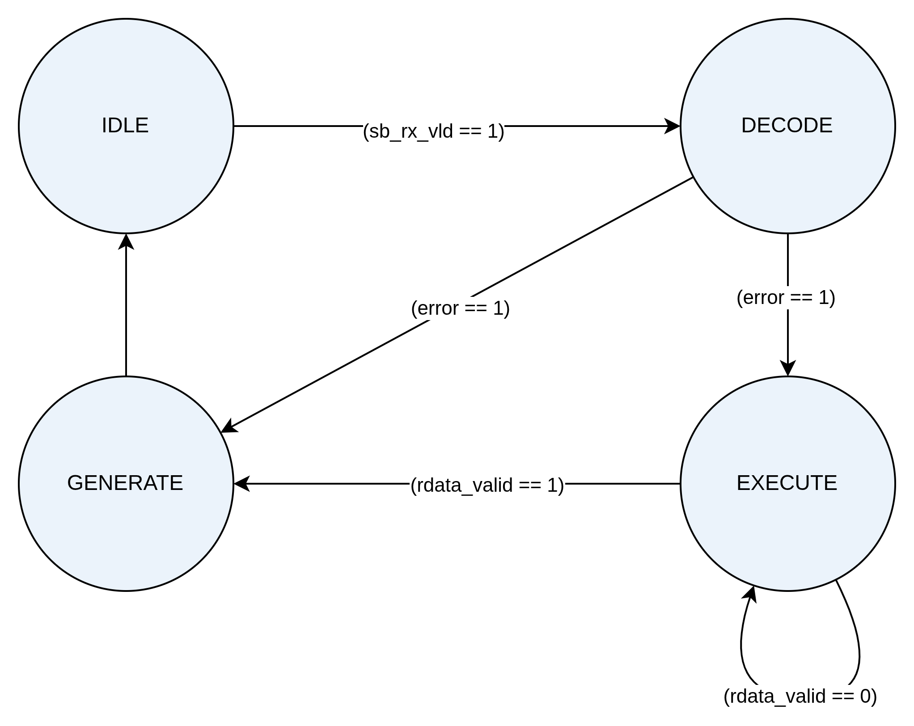

# SideBand (SB)

The sideband carries low-bandwidth, addressed register accesses (config/status)
and training messages between the two PHY partners, independent of the MainBand
datapath.

## Documents

| Doc | What it covers |
|---|---|
| [reg_access_design.md](reg_access_design.md) | **Full `Reg_Access` RTL design** — depacketizer, FSM, completion gen, reg-file |

## Figures

| Figure | Shows |
|---|---|
|  | The register-access FSM that turns a request into a packet and parses the completion |
| [SB_Reg_Access_arc.png](assets/SB_Reg_Access_arc.png) | Reg_Access block architecture |
| [SB_RDI_control_arch.png](assets/SB_RDI_control_arch.png) | RDI-control (sideband demux) architecture |
| [reg_file_layout.svg](assets/reg_file_layout.svg) | Register-file address-space layout |

`assets/gen_svg.py` regenerates `reg_file_layout.svg`.

## Register access model

A register access is a single addressed **request that returns a completion**
(ack for a write, data for a read) — not a stream. The FSM packetizes the
request, runs the credit handshake, and parses the returned status/data.

- Address is **25-bit** `rf_addr[24:0]`:
  - `rf_addr[23:0]` → carried in the packet header `addr` field.
  - `rf_addr[24]` (**space**) → CFG (0) vs MEM (1); encoded in the opcode, not
    the header.
- Opcodes: `SB_32_CFG_READ` / `SB_32_CFG_WRITE` (and the MEM-space variants).

The AXI4-Lite host-facing bridge for this interface, the address map, and the
credit/timeout behaviour are documented in
[../FPGA/README.md](../FPGA/README.md) (§2, §6) and implemented in
[`FPGA/rtl/axi4lite_sb_cfg_bridge.sv`](../../FPGA/rtl/axi4lite_sb_cfg_bridge.sv).
