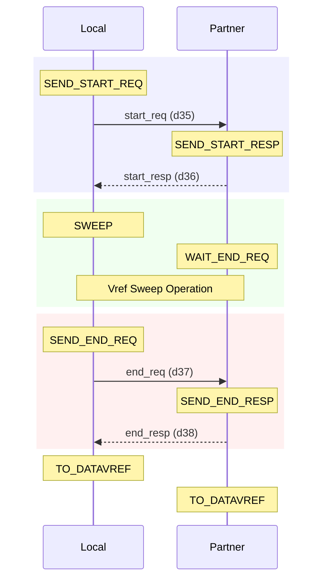
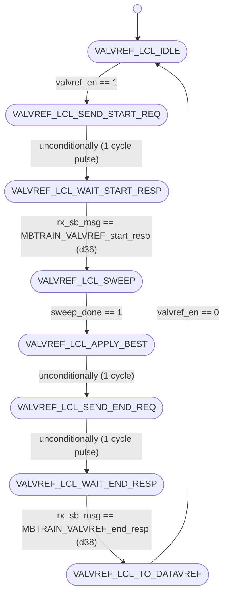
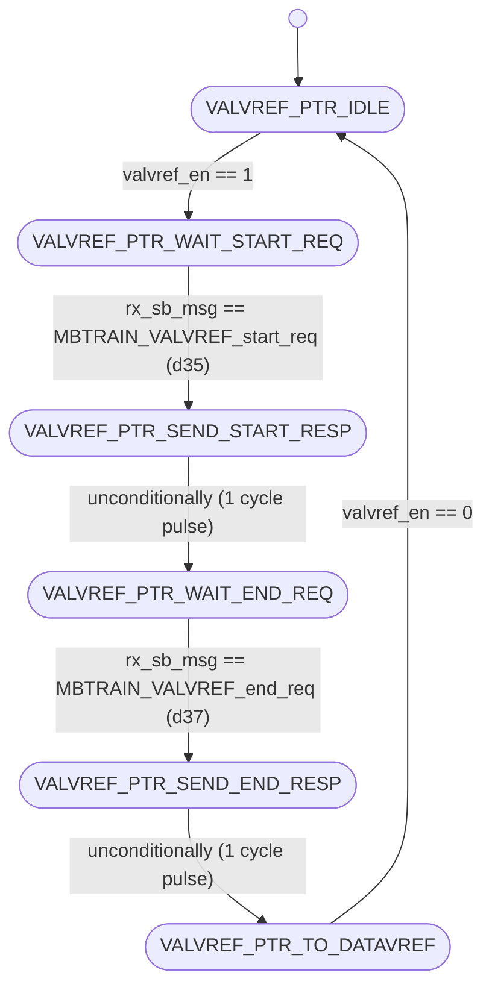

# UCIe PHY Layer: MBTRAIN.VALVREF Substate Design

This document details the architecture, finite state machines, interface ports, and sideband communication sequences for the first Main Base Training substate: **`VALVREF`** (Receiver Valid Lane Vref calibration).

---

## Section 1 — Substate Overview

### Why does this substate exist?

Main Base Training (MBTRAIN) establishes a clean high-speed communication link between two chiplets (dies) by compensating for physical shifts, trace lengths, and timing skew. The **`VALVREF`** substate is the very first stage in the training loop. Its objective is to calibrate the receiver reference voltage ($V_{\text{ref}}$) specifically for the **Valid** control lane on the mainband link. 

Because the Valid lane is responsible for transporting critical control handshake signals between the dies during high-speed modes, its voltage threshold must be calibrated before any data lane sweeps or clock centering can occur. The system searches for the upper and lower voltage bounds within which the Valid lane receiver successfully detects patterns, calculates the optimal electrical midpoint, and saves it.

### Objectives

1. **Calibration**: Perform a sweeping test of the Valid lane's receiver reference voltage ($V_{\text{ref}}$) at a base speed of 4 GT/s.
2. **Optimization**: Record the pass/fail bounds of the eye window, compute the midpoint, and program the receiver buffer with the optimal Vref code.

### Entry and Exit Conditions

* **Entry Condition**: Asserted `valvref_en` from the top-level sequencer (`unit_MBTRAIN_ctrl.sv`) when `mbtrain_en` goes high.
* **Exit Condition**: Complete status flag `valvref_done` asserted back to the sequencer, indicating both Local and Partner FSMs have successfully finished their handshake.

---

## Section 2 — Sideband Communication Sequence

The step-by-step sideband handshake protocol crosses the die boundary using the following sequence:



---

## Section 3 — FSM Architecture Overview

The system uses a **decoupled initiator/responder FSM architecture**:

* **Local FSM (Initiator)**: Runs on the receiver die under calibration. It drives `local_sweep_en` to control the external sweep engine (`unit_D2C_sweep.sv`), steps through $V_{\text{ref}}$ codes, monitors point tests, and registers the optimal midpoint value.
* **Partner FSM (Responder)**: Runs on the transmitter die. It responds to request messages, drives `partner_sweep_en` to command the physical transmitters, and sends a continuous training pattern (`VALTRAIN`) on the mainband Valid lane for the Local receiver to sample.

### Sideband Messaging Role

All handshakes across the die boundary are managed via the asynchronous sideband FIFO. The Local FSM acts as the initiator by sending request opcodes and waiting for the Partner FSM to reply with response opcodes.

---

## Section 4 — FSM Diagram

### Local FSM Diagram (Initiator)

The state transitions of `unit_VALVREF_local.sv` are documented below:



---

### Partner FSM Diagram (Responder)

The state transitions of `unit_VALVREF_partner.sv` are documented below:



---

## Section 5 — Local FSM State Table

| State ID (logic [2:0]) | State Name                    | Purpose / Active Actions                                                     | Transition Condition                                                                                         |
|:----------------------:|:----------------------------- |:---------------------------------------------------------------------------- |:------------------------------------------------------------------------------------------------------------ |
| **`3'd0`**             | `VALVREF_LCL_IDLE`            | Wait state. Clears best code register and output enables.                    | Transitions to `VALVREF_LCL_SEND_START_REQ` when `valvref_en` is asserted.                                   |
| **`3'd1`**             | `VALVREF_LCL_SEND_START_REQ`  | Asserts sideband TX message valid to request start of calibration.           | Unconditionally advances to `VALVREF_LCL_WAIT_START_RESP` on the next clock.                                 |
| **`3'd2`**             | `VALVREF_LCL_WAIT_START_RESP` | Polls receiver FIFO for start acknowledgement response from partner.         | Advances to `VALVREF_LCL_SWEEP` when `rx_sb_msg_valid && rx_sb_msg == MBTRAIN_VALVREF_start_resp` (d36).     |
| **`3'd3`**             | `VALVREF_LCL_SWEEP`           | Asserts `sweep_en` to control the external sweep engine and test Vref codes. | Advances to `VALVREF_LCL_APPLY_BEST` when `sweep_done` is high.                                              |
| **`3'd4`**             | `VALVREF_LCL_APPLY_BEST`      | 1-cycle pipeline delay state allowing registered optimal value to stabilize. | Unconditionally advances to `VALVREF_LCL_SEND_END_REQ` on the next clock.                                    |
| **`3'd5`**             | `VALVREF_LCL_SEND_END_REQ`    | Asserts sideband TX message valid to notify partner that sweep is complete.  | Unconditionally advances to `VALVREF_LCL_WAIT_END_RESP` on the next clock.                                   |
| **`3'd6`**             | `VALVREF_LCL_WAIT_END_RESP`   | Polls receiver FIFO for end acknowledgement response from partner.           | Advances to `VALVREF_LCL_TO_DATAVREF` when `rx_sb_msg_valid && rx_sb_msg == MBTRAIN_VALVREF_end_resp` (d38). |
| **`3'd7`**             | `VALVREF_LCL_TO_DATAVREF`     | Terminal state asserting completion flag `valvref_done`.                     | Holds state and `valvref_done` until `valvref_en` deasserts (returns to `IDLE`).                             |

---

## Section 6 — Partner FSM State Table

| State ID (logic [2:0]) | State Name                    | Purpose / Active Actions                                                 | Transition Condition                                                                                              |
|:----------------------:|:----------------------------- |:------------------------------------------------------------------------ |:----------------------------------------------------------------------------------------------------------------- |
| **`3'd0`**             | `VALVREF_PTR_IDLE`            | Wait state. Clears sideband outputs and partner sweep enable.            | Transitions to `VALVREF_PTR_WAIT_START_REQ` when `valvref_en` is asserted.                                        |
| **`3'd1`**             | `VALVREF_PTR_WAIT_START_REQ`  | Polls receiver FIFO for start request message from local initiator.      | Advances to `VALVREF_PTR_SEND_START_RESP` when `rx_sb_msg_valid && rx_sb_msg == MBTRAIN_VALVREF_start_req` (d35). |
| **`3'd2`**             | `VALVREF_PTR_SEND_START_RESP` | Asserts sideband TX message valid to acknowledge start request.          | Unconditionally advances to `VALVREF_PTR_WAIT_END_REQ` on the next clock.                                         |
| **`3'd3`**             | `VALVREF_PTR_WAIT_END_REQ`    | Drives `partner_sweep_en` high to sustain VALTRAIN pattern transmission. | Advances to `VALVREF_PTR_SEND_END_RESP` when `rx_sb_msg_valid && rx_sb_msg == MBTRAIN_VALVREF_end_req` (d37).     |
| **`3'd4`**             | `VALVREF_PTR_SEND_END_RESP`   | Asserts sideband TX message valid to acknowledge end request.            | Unconditionally advances to `VALVREF_PTR_TO_DATAVREF` on the next clock.                                          |
| **`3'd5`**             | `VALVREF_PTR_TO_DATAVREF`     | Terminal state asserting completion flag `valvref_done`.                 | Holds state and `valvref_done` until `valvref_en` deasserts (returns to `IDLE`).                                  |

---

## Section 7 — Local FSM Execution Flow

The Local FSM sequences through the training sequence as follows:

1. **Idle State (`VALVREF_LCL_IDLE`)**: The substate is enabled by setting `valvref_en = 1`. This immediately triggers a transition to `VALVREF_LCL_SEND_START_REQ`.
2. **Start Notification (`VALVREF_LCL_SEND_START_REQ` $\rightarrow$ `VALVREF_LCL_WAIT_START_RESP`)**: The Local FSM drives `tx_sb_msg_valid = 1` for exactly 1 cycle with opcode `MBTRAIN_VALVREF_start_req` (d35) to instruct the partner to prepare its transmitters. The FSM then moves to the wait state and polls for `MBTRAIN_VALVREF_start_resp` (d36).
3. **Margining Sweep (`VALVREF_LCL_SWEEP`)**: Once the start response is received, the FSM enters `VALVREF_LCL_SWEEP` and asserts `sweep_en = 1`. The external sweep engine starts testing Vref values, combinationally driving the Valid lane Vref via `phy_rx_valvref_ctrl` using `swept_code`. The Local receiver validates incoming pattern bits and returns point test passes back to the sweep engine.
4. **Capture & End Handshake (`VALVREF_LCL_APPLY_BEST` $\rightarrow$ `VALVREF_LCL_SEND_END_REQ` $\rightarrow$ `VALVREF_LCL_WAIT_END_RESP`)**: When the sweep engine asserts `sweep_done`, the FSM latches `best_code` into the `best_code_r` register. It spends 1 cycle in `VALVREF_LCL_APPLY_BEST` for values to stabilize, then transmits `MBTRAIN_VALVREF_end_req` (d37) to tell the partner that training has ended. It waits until `MBTRAIN_VALVREF_end_resp` (d38) is received from the partner.
5. **Completion State (`VALVREF_LCL_TO_DATAVREF`)**: Once end acknowledgement is received, the Local FSM transitions to its terminal state and asserts `valvref_done = 1` back to the top-level MBTRAIN controller.

---

## Section 8 — Partner FSM Execution Flow

The Partner FSM mirrors the Local FSM to provide the transmitter pattern:

1. **Idle State (`VALVREF_PTR_IDLE`)**: Upon observing `valvref_en = 1`, the Partner FSM transitions to `VALVREF_PTR_WAIT_START_REQ` to wait for sideband commands.
2. **Start Handshake (`VALVREF_PTR_WAIT_START_REQ` $\rightarrow$ `VALVREF_PTR_SEND_START_RESP` $\rightarrow$ `VALVREF_PTR_WAIT_END_REQ`)**: The FSM polls `rx_sb_msg` for `MBTRAIN_VALVREF_start_req` (d35). Once it arrives, the FSM transmits `MBTRAIN_VALVREF_start_resp` (d36) to notify the local die that the training pattern is ready, then transitions to `VALVREF_PTR_WAIT_END_REQ`.
3. **Pattern Transmission (`VALVREF_PTR_WAIT_END_REQ`)**: In this state, the Partner FSM asserts `partner_sweep_en = 1`. This overrides the physical mainband lane selectors, causing the partner's transmitters to continuously drive a forwarded clock (at center phase) and the `VALTRAIN` pattern (four 1s followed by four 0s) on the mainband Valid transmitter lane.
4. **End Handshake (`VALVREF_PTR_WAIT_END_REQ` $\rightarrow$ `VALVREF_PTR_SEND_END_RESP` $\rightarrow$ `VALVREF_PTR_TO_DATAVREF`)**: The Partner FSM remains in this state until the Local FSM finishes sweeping and transmits `MBTRAIN_VALVREF_end_req` (d37). Upon receipt, the Partner deasserts `partner_sweep_en`, transmits `MBTRAIN_VALVREF_end_resp` (d38) back to the local die, and moves to the terminal state `VALVREF_PTR_TO_DATAVREF` (asserting `valvref_done = 1`).

---

## Section 9 — Wrapper Architecture

The substate wrapper (**`wrapper_VALVREF.sv`**) integrates the Local and Partner modules to coordinate the training substate on a single die:

### Instantiated Modules

1. **`u_VALVREF_local`**: Initiator FSM executing sweeps, evaluating eyes, and capturing Vref control codes.
2. **`u_VALVREF_partner`**: Responder FSM managing partner handshakes and transmitter pattern configurations.

### Handshake Completion Logic

The wrapper performs a logical AND of the completion flags from both FSMs to assert the final complete status back to the top-level controller:

```systemverilog
assign valvref_done = local_valvref_done & partner_valvref_done;
```

This guarantees that the substate does not finish until both dies have completed their local receiver training and remote transmitter handshakes.

### Sideband TX Arbitration

Because both FSMs must transmit messages over the same sideband interface, the wrapper arbitrates the TX lines, giving priority to the Local FSM:

```systemverilog
assign tx_sb_msg_valid = local_tx_sb_msg_valid | partner_tx_sb_msg_valid;
assign tx_sb_msg       = local_tx_sb_msg_valid ? local_tx_sb_msg       : partner_tx_sb_msg;
assign tx_msginfo      = local_tx_sb_msg_valid ? local_tx_msginfo      : partner_tx_msginfo;
assign tx_data_field   = local_tx_sb_msg_valid ? local_tx_data_field   : partner_tx_data_field;
```

### Static Mainband Lane Configurations

Per UCIe specification §4.5.3.4.1, during `VALVREF` training, the mainband lanes must be locked to a static posture. The wrapper implements this statically via combinational assignments:

```systemverilog
assign mb_tx_clk_lane_sel  = 2'b01;  // Active clock (forwarded clock phase)
assign mb_tx_data_lane_sel = 2'b00;  // Driven low / Electrical idle
assign mb_tx_val_lane_sel  = 2'b01;  // Drives training pattern (VALTRAIN)
assign mb_tx_trk_lane_sel  = 2'b00;  // Driven low / Electrical idle
assign mb_rx_clk_lane_sel  = 1'b1 ;  // Enabled (Clock RX buffer active)
assign mb_rx_data_lane_sel = 1'b0 ;  // Disabled (Data RX buffers inactive)
assign mb_rx_val_lane_sel  = 1'b1 ;  // Enabled (Valid RX buffer active)
assign mb_rx_trk_lane_sel  = 1'b0 ;  // Disabled (Track RX buffer inactive)
```

---

## Section 10 — Wrapper Interface Table

The table below lists all interface ports on the substate wrapper `wrapper_VALVREF.sv`:

| Port Signal Name      | Direction | Bit Width | Functional Description / Encodings                                                                                                                                                                                                |
|:--------------------- |:---------:|:---------:|:--------------------------------------------------------------------------------------------------------------------------------------------------------------------------------------------------------------------------------- |
| `lclk`                | Input     | 1         | LTSM clock domain input (1 GHz or 2 GHz).                                                                                                                                                                                         |
| `rst_n`               | Input     | 1         | Asynchronous active-low global reset.                                                                                                                                                                                             |
| `soft_rst_n`          | Input     | 1         | Synchronous active-low soft reset (clears registers).                                                                                                                                                                             |
| `valvref_done`        | Output    | 1         | Sub-state complete handshake output to top controller (1 = Complete, 0 = In progress).                                                                                                                                            |
| `valvref_en`          | Input     | 1         | Sub-state enable signal from top controller (1 = Active, 0 = Disabled).                                                                                                                                                           |
| `phy_rx_valvref_ctrl` | Output    | 5         | Calibrated RX reference voltage control code for the Valid lane. <br>Values: 5-bit code value (`0` to `16`).                                                                                                                      |
| `partner_sweep_en`    | Output    | 1         | Command to partner die to keep the VALTRAIN pattern active (1 = Active, 0 = Disabled).                                                                                                                                            |
| `local_sweep_en`      | Output    | 1         | Command driven to the shared sweep engine to execute a Local sweep (1 = Sweep active, 0 = Idle).                                                                                                                                  |
| `swept_code`          | Input     | 5         | Current reference voltage sweeping code driven by the sweep engine. <br>Values: 5-bit code value (`0` to `16`).                                                                                                                   |
| `best_code`           | Input     | 5         | Final optimized Vref midpoint code received from the sweep engine. <br>Values: 5-bit code value (`0` to `16`).                                                                                                                    |
| `sweep_done`          | Input     | 1         | Complete status input from the shared sweep engine (1 = Completed, 0 = Sweeping).                                                                                                                                                 |
| `mb_tx_clk_lane_sel`  | Output    | 2         | Mainband Clock Transmitter multiplexer selector. <br>Values: `2'b00` = Low (0), `2'b01` = Active clock, `2'b10` = Hi-Z (Tri-state).                                                                                               |
| `mb_tx_data_lane_sel` | Output    | 2         | Mainband Data Transmitter multiplexer selector. <br>Values: same encoding as `mb_tx_clk_lane_sel`.                                                                                                                                |
| `mb_tx_val_lane_sel`  | Output    | 2         | Mainband Valid Transmitter multiplexer selector. <br>Values: same encoding as `mb_tx_clk_lane_sel`.                                                                                                                               |
| `mb_tx_trk_lane_sel`  | Output    | 2         | Mainband Track Transmitter multiplexer selector. <br>Values: same encoding as `mb_tx_clk_lane_sel`.                                                                                                                               |
| `mb_rx_clk_lane_sel`  | Output    | 1         | Mainband Clock Receiver enable. <br>Values: `1'b1` = Receiver enabled, `1'b0` = Disabled.                                                                                                                                         |
| `mb_rx_data_lane_sel` | Output    | 1         | Mainband Data Receiver enable. <br>Values: same encoding as `mb_rx_clk_lane_sel`.                                                                                                                                                 |
| `mb_rx_val_lane_sel`  | Output    | 1         | Mainband Valid Receiver enable. <br>Values: same encoding as `mb_rx_clk_lane_sel`.                                                                                                                                                |
| `mb_rx_trk_lane_sel`  | Output    | 1         | Mainband Track Receiver enable. <br>Values: same encoding as `mb_rx_clk_lane_sel`.                                                                                                                                                |
| `tx_sb_msg_valid`     | Output    | 1         | Strobe line driven to Async SB FIFO to launch a sideband message (1 = Strobe valid, 0 = Idle).                                                                                                                                    |
| `tx_sb_msg`           | Output    | 8         | Opcode of the sideband message to transmit. <br>Values: `d35` = `MBTRAIN_VALVREF_start_req`, `d37` = `MBTRAIN_VALVREF_end_req` (if Local); `d36` = `MBTRAIN_VALVREF_start_resp`, `d38` = `MBTRAIN_VALVREF_end_resp` (if Partner). |
| `tx_msginfo`          | Output    | 16        | Message info payload field sent on sideband (fixed at `16'h0000`).                                                                                                                                                                |
| `tx_data_field`       | Output    | 64        | 64-bit payload data field sent on sideband (fixed at `64'h0000000000000000`).                                                                                                                                                     |
| `rx_sb_msg_valid`     | Input     | 1         | Incoming message valid pulse from SB RX FIFO (1 = Valid message, 0 = Idle).                                                                                                                                                       |
| `rx_sb_msg`           | Input     | 8         | Opcode of the incoming sideband message. <br>Values: same encoding as `tx_sb_msg`.                                                                                                                                                |

---

## Section 11 — Internal Signal Summary

| Internal Signal Name      | Direction | Bit Width | Functional Description                                                           |
|:------------------------- |:---------:|:---------:|:-------------------------------------------------------------------------------- |
| `local_valvref_done`      | Internal  | 1         | Indication wire showing the Local FSM has completed its sweep and end handshake. |
| `partner_valvref_done`    | Internal  | 1         | Indication wire showing the Partner FSM has completed its end handshake.         |
| `local_tx_sb_msg_valid`   | Internal  | 1         | SB TX valid strobe driven by `u_VALVREF_local`.                                  |
| `local_tx_sb_msg`         | Internal  | 8         | Opcode driven by `u_VALVREF_local` (d35 or d37).                                 |
| `partner_tx_sb_msg_valid` | Internal  | 1         | SB TX valid strobe driven by `u_VALVREF_partner`.                                |
| `partner_tx_sb_msg`       | Internal  | 8         | Opcode driven by `u_VALVREF_partner` (d36 or d38).                               |

---

## Section 12 — D2C_PT Interaction

The `VALVREF` substate sweeps reference voltages on the Valid receiver lane using the **`RX_D2C_PT`** (Receiver-Initiated Point Test) architecture:

* **Sweep Parameter**: reference voltage ($V_{\text{ref}}$) for the Valid receiver buffer.
* **Initiator**: Local die FSM (asserts `local_sweep_en` to control the sweep engine).
* **Receiver**: Local die Valid Lane receiver (lane 0).
* **Test Direction**: The Partner die transmits a static continuous pattern (`VALTRAIN` pattern: `4'b1111_0000`) while the Local die receiver sweeps its Vref voltage step-by-step, evaluating the eye window margins.
* **Aggregated Results**: At the end of the sweep, the optimal Vref code (the midpoint of the pass/fail margins) is latched into `best_code_r` and combinationally driven to the Valid buffer via `phy_rx_valvref_ctrl`.

---

## Section 13 — Summary

The **`VALVREF`** substate design provides a robust, decoupled, and spec-compliant initialization of the Valid control lane's receiver reference voltage. By separating the Local initiator logic (which manages the sweeping parameter) and the Partner responder logic (which drives the transmitter pattern), the substate ensures that the control channel is fully calibrated and stable before the mainband data training steps begin. 

The wrapper module combines these FSM completions and arbitrates the sideband control lines, providing a clean, single-port interface bundle to the top-level sequencer.
