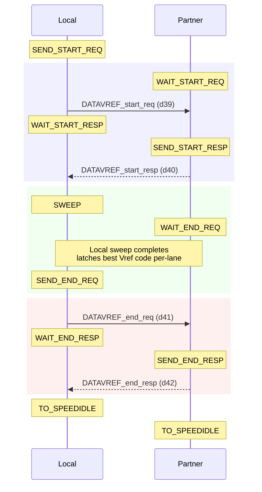
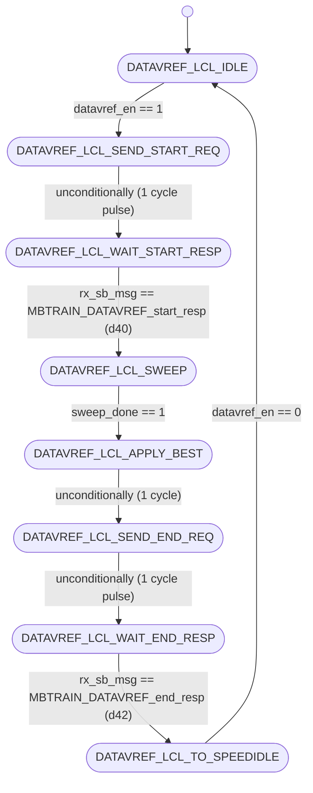
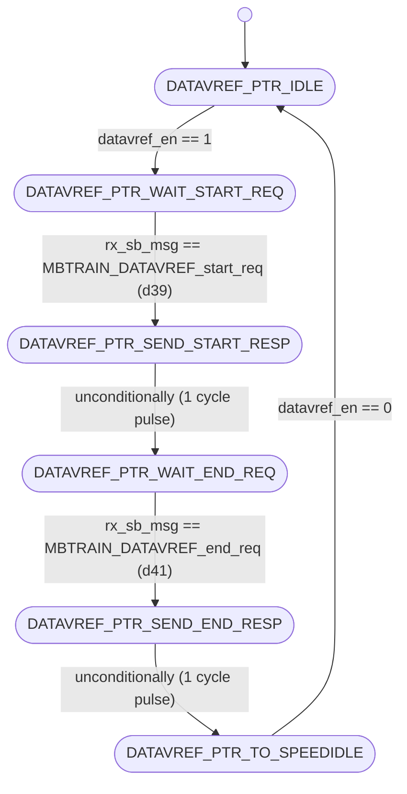

# UCIe PHY Layer: MBTRAIN.DATAVREF Substate Design

This document details the architecture, finite state machines, interface ports, and sideband communication sequences for the second Main Base Training substate: **`DATAVREF`** (Receiver Data Lanes Vref calibration).

---

## Section 1 — Substate Overview

### Why does this substate exist?
Once the Valid control lane's reference voltage is trained and calibrated in the `VALVREF` stage, the interconnect must calibrate the reference voltages ($V_{\text{ref}}$) for the active mainband data lanes. The **`DATAVREF`** substate is responsible for this task.

Because physical board trace length shifts and impedance variations differ from lane to lane, each of the 16 mainband data lanes must be calibrated independently. The receiver sweeps reference voltages from code 0 to 16, determines the operational eye margins (lower and upper fail limits) for each lane receiver buffer, computes the optimal midpoint, and stores a unique calibrated Vref code for each lane.

### Objectives
1. **Calibration**: Sweep the receiver reference voltage ($V_{\text{ref}}$) for all 16 Data lanes at the base speed of 4 GT/s.
2. **Optimization**: Record the eye boundaries for each lane separately, compute the midpoint, and program each receiver buffer with its optimal Vref code.

### Entry and Exit Conditions
* **Entry Condition**: Asserted `datavref_en` from the top-level sequencer (`unit_MBTRAIN_ctrl.sv`) after `VALVREF` completes.
* **Exit Condition**: Complete status flag `datavref_done` asserted back to the sequencer, indicating both Local and Partner FSMs have completed their handshakes.

---

## Section 2 — Sideband Communication Sequence

The step-by-step sideband handshake protocol crosses the die boundary using the following sequence:



---

## Section 3 — FSM Architecture Overview

The substate utilizes a **decoupled initiator/responder FSM architecture**:
* **Local FSM (Initiator)**: Runs on the receiver die under calibration. It asserts `local_sweep_en` to trigger the external sweep engine (`unit_D2C_sweep.sv`), runs Vref sweeps on all 16 data lanes simultaneously, gathers point test results, and captures the 16 best midpoint codes.
* **Partner FSM (Responder)**: Runs on the transmitter die. It responds to sideband handshakes and drives `partner_sweep_en` to keep the transmitters active, sending continuous calibration patterns on all mainband data lanes.

### Sideband Messaging Role
Handshakes across the die boundary are managed via the sideband FIFO. The Local FSM initiates by sending start and end request messages, and waits for the Partner FSM to return response acknowledgements before transitioning.

---

## Section 4 — FSM Diagram

### Local FSM Diagram (Initiator)
The state transitions of `unit_DATAVREF_local.sv` are documented below:



---

### Partner FSM Diagram (Responder)
The state transitions of `unit_DATAVREF_partner.sv` are documented below:



---

## Section 5 — Local FSM State Table

| State ID (logic [2:0]) | State Name                     | Purpose / Active Actions                                                                  | Transition Condition                                                                                            |
| :--------------------: | :----------------------------- | :---------------------------------------------------------------------------------------- | :-------------------------------------------------------------------------------------------------------------- |
|       **`3'd0`**       | `DATAVREF_LCL_IDLE`            | Wait state. Clears best code registers and output enables.                                | Transitions to `DATAVREF_LCL_SEND_START_REQ` when `datavref_en` is asserted.                                    |
|       **`3'd1`**       | `DATAVREF_LCL_SEND_START_REQ`  | Asserts sideband TX message valid to request start of data lane calibration.              | Unconditionally advances to `DATAVREF_LCL_WAIT_START_RESP` on the next clock.                                   |
|       **`3'd2`**       | `DATAVREF_LCL_WAIT_START_RESP` | Polls receiver FIFO for start acknowledgement response from partner.                      | Advances to `DATAVREF_LCL_SWEEP` when `rx_sb_msg_valid && rx_sb_msg == MBTRAIN_DATAVREF_start_resp` (d40).      |
|       **`3'd3`**       | `DATAVREF_LCL_SWEEP`           | Asserts `sweep_en` to control the external sweep engine and test Vref codes on all lanes. | Advances to `DATAVREF_LCL_APPLY_BEST` when `sweep_done` is high.                                                |
|       **`3'd4`**       | `DATAVREF_LCL_APPLY_BEST`      | 1-cycle pipeline delay state allowing registered optimal values to stabilize.             | Unconditionally advances to `DATAVREF_LCL_SEND_END_REQ` on the next clock.                                      |
|       **`3'd5`**       | `DATAVREF_LCL_SEND_END_REQ`    | Asserts sideband TX message valid to notify partner that sweep is complete.               | Unconditionally advances to `DATAVREF_LCL_WAIT_END_RESP` on the next clock.                                     |
|       **`3'd6`**       | `DATAVREF_LCL_WAIT_END_RESP`   | Polls receiver FIFO for end acknowledgement response from partner.                        | Advances to `DATAVREF_LCL_TO_SPEEDIDLE` when `rx_sb_msg_valid && rx_sb_msg == MBTRAIN_DATAVREF_end_resp` (d42). |
|       **`3'd7`**       | `DATAVREF_LCL_TO_SPEEDIDLE`    | Terminal state asserting completion flag `datavref_done`.                                 | Holds state and `datavref_done` until `datavref_en` deasserts (returns to `IDLE`).                              |

---

## Section 6 — Partner FSM State Table

| State ID (logic [2:0]) | State Name | Purpose / Active Actions | Transition Condition |
| :---: | :--- | :--- | :--- |
| **`3'd0`** | `DATAVREF_PTR_IDLE` | Wait state. Clears sideband outputs and partner sweep enable. | Transitions to `DATAVREF_PTR_WAIT_START_REQ` when `datavref_en` is asserted. |
| **`3'd1`** | `DATAVREF_PTR_WAIT_START_REQ` | Polls receiver FIFO for start request message from local initiator. | Advances to `DATAVREF_PTR_SEND_START_RESP` when `rx_sb_msg_valid && rx_sb_msg == MBTRAIN_DATAVREF_start_req` (d39). |
| **`3'd2`** | `DATAVREF_PTR_SEND_START_RESP` | Asserts sideband TX message valid to acknowledge start request. | Unconditionally advances to `DATAVREF_PTR_WAIT_END_REQ` on the next clock. |
| **`3'd3`** | `DATAVREF_PTR_WAIT_END_REQ` | Drives `partner_sweep_en` high to sustain VALTRAIN pattern transmission. | Advances to `DATAVREF_PTR_SEND_END_RESP` when `rx_sb_msg_valid && rx_sb_msg == MBTRAIN_DATAVREF_end_req` (d41). |
| **`3'd4`** | `DATAVREF_PTR_SEND_END_RESP` | Asserts sideband TX message valid to acknowledge end request. | Unconditionally advances to `DATAVREF_PTR_TO_SPEEDIDLE` on the next clock. |
| **`3'd5`** | `DATAVREF_PTR_TO_SPEEDIDLE` | Terminal state asserting completion flag `datavref_done`. | Holds state and `datavref_done` until `datavref_en` deasserts (returns to `IDLE`). |

---

## Section 7 — Local FSM Execution Flow

The Local FSM transitions through the following stages:
1. **Idle State (`DATAVREF_LCL_IDLE`)**: Upon receiving the enable pulse `datavref_en = 1`, the Local FSM transitions to `DATAVREF_LCL_SEND_START_REQ`.
2. **Start Notification (`DATAVREF_LCL_SEND_START_REQ` $\rightarrow$ `DATAVREF_LCL_WAIT_START_RESP`)**: The Local FSM drives `tx_sb_msg_valid = 1` for exactly 1 cycle with opcode `MBTRAIN_DATAVREF_start_req` (d39) to request that the partner responder drive the calibration pattern. The FSM then advances to `DATAVREF_LCL_WAIT_START_RESP` and waits for `MBTRAIN_DATAVREF_start_resp` (d40).
3. **Margining Sweep (`DATAVREF_LCL_SWEEP`)**: After receiving the start response, the Local FSM enters `DATAVREF_LCL_SWEEP` and asserts `sweep_en = 1`. The external sweep engine steps `swept_code` through the reference voltages, driving all 16 data lane receivers combinationally via `phy_rx_datavref_ctrl`. The Local receivers sample the incoming patterns and feed point test results back to the sweep engine.
4. **Capture & End Handshake (`DATAVREF_LCL_APPLY_BEST` $\rightarrow$ `DATAVREF_LCL_SEND_END_REQ` $\rightarrow$ `DATAVREF_LCL_WAIT_END_RESP`)**: When the sweep engine asserts `sweep_done`, the Local FSM captures the 16 unique best codes into the `best_code_r` register file. It spends 1 cycle in `DATAVREF_LCL_APPLY_BEST` for output stability, then transmits `MBTRAIN_DATAVREF_end_req` (d41) to notify the partner that sweeping has finished. It waits for the partner's end response `MBTRAIN_DATAVREF_end_resp` (d42).
5. **Completion State (`DATAVREF_LCL_TO_SPEEDIDLE`)**: Upon receiving end acknowledgement, the Local FSM transitions to its terminal state and asserts `datavref_done = 1` back to the top-level sequencer.

---

## Section 8 — Partner FSM Execution Flow

The Partner FSM mirrors the Local FSM to sustain the transmitter patterns:
1. **Idle State (`DATAVREF_PTR_IDLE`)**: Upon observing `datavref_en = 1`, the Partner FSM transitions to `DATAVREF_PTR_WAIT_START_REQ` to wait for sideband commands.
2. **Start Handshake (`DATAVREF_PTR_WAIT_START_REQ` $\rightarrow$ `DATAVREF_PTR_SEND_START_RESP` $\rightarrow$ `DATAVREF_PTR_WAIT_END_REQ`)**: The FSM polls `rx_sb_msg` for `MBTRAIN_DATAVREF_start_req` (d39). Once it arrives, the Partner FSM transmits `MBTRAIN_DATAVREF_start_resp` (d40) to notify the initiator that the transmitter patterns are ready, then transitions to `DATAVREF_PTR_WAIT_END_REQ`.
3. **Pattern Transmission (`DATAVREF_PTR_WAIT_END_REQ`)**: The Partner FSM asserts `partner_sweep_en = 1`. This overrides the physical mainband lane selectors, causing the partner's transmitters to drive a center-phase clock on the Clock lane, and continuous calibration patterns on all mainband Data transmitter lanes.
4. **End Handshake (`DATAVREF_PTR_WAIT_END_REQ` $\rightarrow$ `DATAVREF_PTR_SEND_END_RESP` $\rightarrow$ `DATAVREF_PTR_TO_SPEEDIDLE`)**: The Partner FSM remains in this state until the Local FSM finishes sweeping and transmits `MBTRAIN_DATAVREF_end_req` (d41). Upon receipt, the Partner deasserts `partner_sweep_en`, transmits `MBTRAIN_DATAVREF_end_resp` (d42) back, and moves to the terminal state `DATAVREF_PTR_TO_SPEEDIDLE` (asserting `datavref_done = 1`).

---

## Section 9 — Wrapper Architecture

The substate wrapper (**`wrapper_DATAVREF.sv`**) integrates the Local and Partner modules to coordinate the training substate on a single die:

### Instantiated Modules
1. **`u_DATAVREF_local`**: Initiator FSM executing sweeps, evaluating eyes, and capturing Vref control codes per lane.
2. **`u_DATAVREF_partner`**: Responder FSM managing partner handshakes and transmitter pattern configurations.

### Handshake Completion Logic
The wrapper performs a logical AND of the completion flags from both FSMs to assert the final complete status back to the top-level controller:
```systemverilog
assign datavref_done = local_datavref_done_wire & partner_datavref_done_wire;
```
This guarantees that the substate does not finish until both dies have completed their local receiver training and remote transmitter handshakes.

### Sideband TX Arbitration
Because both FSMs must transmit messages over the same sideband interface, the wrapper arbitrates the TX lines, giving priority to the Local FSM:
```systemverilog
assign tx_sb_msg_valid = local_tx_sb_msg_valid | partner_tx_sb_msg_valid;
assign tx_sb_msg       = local_tx_sb_msg_valid ? local_tx_sb_msg       : partner_tx_sb_msg;
assign tx_msginfo      = local_tx_sb_msg_valid ? local_tx_msginfo      : partner_tx_msginfo;
assign tx_data_field   = local_tx_sb_msg_valid ? local_tx_data_field   : partner_tx_data_field;
```

### Static Mainband Lane Configurations
Per UCIe specification §4.5.3.4.2, during `DATAVREF` training, the mainband lanes must be locked to a static posture. The wrapper implements this statically via combinational assignments:
```systemverilog
assign mb_tx_clk_lane_sel  = 2'b01;  // Active clock (forwarded clock phase)
assign mb_tx_data_lane_sel = 2'b00;  // Driven low / Electrical idle
assign mb_tx_val_lane_sel  = 2'b00;  // Driven low / Electrical idle
assign mb_tx_trk_lane_sel  = 2'b00;  // Driven low / Electrical idle
assign mb_rx_clk_lane_sel  = 1'b1 ;  // Enabled (Clock RX buffer active)
assign mb_rx_data_lane_sel = 1'b1 ;  // Enabled (Data RX buffers active)
assign mb_rx_val_lane_sel  = 1'b1 ;  // Enabled (Valid RX buffer active)
assign mb_rx_trk_lane_sel  = 1'b0 ;  // Disabled (Track RX buffer inactive)
```

---

## Section 10 — Wrapper Interface Table

The table below lists all interface ports on the substate wrapper `wrapper_DATAVREF.sv`:

| Port Signal Name | Direction | Bit Width | Functional Description / Encodings |
| :--- | :---: | :---: | :--- |
| `lclk` | Input | 1 | LTSM clock domain input (1 GHz or 2 GHz). |
| `rst_n` | Input | 1 | Asynchronous active-low global reset. |
| `soft_rst_n` | Input | 1 | Synchronous active-low soft reset (clears registers). |
| `datavref_en` | Input | 1 | Sub-state enable signal from top controller (1 = Active, 0 = Disabled). |
| `datavref_done` | Output | 1 | Sub-state complete handshake output to top controller (1 = Complete, 0 = In progress). |
| `phy_rx_datavref_ctrl` | Output | 5 (16 lanes) | Array of calibrated RX reference voltage control codes for the 16 Data lanes. <br>Values: 16 elements of 5-bit codes (`0` to `16`). |
| `partner_sweep_en` | Output | 1 | Command to partner die to keep the VALTRAIN pattern active (1 = Active, 0 = Disabled). |
| `local_sweep_en` | Output | 1 | Command driven to the shared sweep engine to execute a Local sweep (1 = Sweep active, 0 = Idle). |
| `swept_code` | Input | 5 | Current reference voltage sweeping code driven by the sweep engine. <br>Values: 5-bit code value (`0` to `16`). |
| `best_code` | Input | 5 (16 lanes) | Array of final optimized Vref midpoint codes received from the sweep engine. <br>Values: 16 elements of 5-bit codes (`0` to `16`). |
| `sweep_done` | Input | 1 | Complete status input from the shared sweep engine (1 = Completed, 0 = Sweeping). |
| `mb_tx_clk_lane_sel` | Output | 2 | Mainband Clock Transmitter multiplexer selector. <br>Values: `2'b00` = Low (0), `2'b01` = Active clock, `2'b10` = Hi-Z (Tri-state). |
| `mb_tx_data_lane_sel`| Output | 2 | Mainband Data Transmitter multiplexer selector. <br>Values: same encoding as `mb_tx_clk_lane_sel`. |
| `mb_tx_val_lane_sel` | Output | 2 | Mainband Valid Transmitter multiplexer selector. <br>Values: same encoding as `mb_tx_clk_lane_sel`. |
| `mb_tx_trk_lane_sel` | Output | 2 | Mainband Track Transmitter multiplexer selector. <br>Values: same encoding as `mb_tx_clk_lane_sel`. |
| `mb_rx_clk_lane_sel` | Output | 1 | Mainband Clock Receiver enable. <br>Values: `1'b1` = Receiver enabled, `1'b0` = Disabled. |
| `mb_rx_data_lane_sel`| Output | 1 | Mainband Data Receiver enable. <br>Values: same encoding as `mb_rx_clk_lane_sel`. |
| `mb_rx_val_lane_sel` | Output | 1 | Mainband Valid Receiver enable. <br>Values: same encoding as `mb_rx_clk_lane_sel`. |
| `mb_rx_trk_lane_sel` | Output | 1 | Mainband Track Receiver enable. <br>Values: same encoding as `mb_rx_clk_lane_sel`. |
| `tx_sb_msg_valid` | Output | 1 | Strobe line driven to Async SB FIFO to launch a sideband message (1 = Strobe valid, 0 = Idle). |
| `tx_sb_msg` | Output | 8 | Opcode of the sideband message to transmit. <br>Values: `d39` = `MBTRAIN_DATAVREF_start_req`, `d41` = `MBTRAIN_DATAVREF_end_req` (if Local); `d40` = `MBTRAIN_DATAVREF_start_resp`, `d42` = `MBTRAIN_DATAVREF_end_resp` (if Partner). |
| `tx_msginfo` | Output | 16 | Message info payload field sent on sideband (fixed at `16'h0000`). |
| `tx_data_field` | Output | 64 | 64-bit payload data field sent on sideband (fixed at `64'h0000000000000000`). |
| `rx_sb_msg_valid` | Input | 1 | Incoming message valid pulse from SB RX FIFO (1 = Valid message, 0 = Idle). |
| `rx_sb_msg` | Input | 8 | Opcode of the incoming sideband message. <br>Values: same encoding as `tx_sb_msg`. |

---

## Section 11 — Internal Signal Summary

| Internal Signal Name | Direction | Bit Width | Functional Description |
| :--- | :---: | :---: | :--- |
| `local_datavref_done_wire` | Internal | 1 | Indication wire showing the Local FSM has completed its sweep and end handshake. |
| `partner_datavref_done_wire`| Internal | 1 | Indication wire showing the Partner FSM has completed its end handshake. |
| `local_tx_sb_msg_valid` | Internal | 1 | SB TX valid strobe driven by `u_DATAVREF_local`. |
| `local_tx_sb_msg` | Internal | 8 | Opcode driven by `u_DATAVREF_local` (d39 or d41). |
| `partner_tx_sb_msg_valid`| Internal | 1 | SB TX valid strobe driven by `u_DATAVREF_partner`. |
| `partner_tx_sb_msg` | Internal | 8 | Opcode driven by `u_DATAVREF_partner` (d40 or d42). |

---

## Section 12 — D2C_PT Interaction

The `DATAVREF` substate sweeps reference voltages on the 16 mainband data lanes simultaneously using the **`RX_D2C_PT`** (Receiver-Initiated Point Test) architecture:
* **Sweep Parameter**: reference voltages ($V_{\text{ref}}$) for the 16 Data receiver buffers.
* **Initiator**: Local die FSM (asserts `local_sweep_en` to control the sweep engine).
* **Receiver**: Local die Data receivers (lanes 0-15).
* **Test Direction**: The Partner die transmits static continuous patterns (`VALTRAIN` patterns) while the Local die receiver sweeps its Vref voltage step-by-step, evaluating eye window margins for all 16 lanes.
* **Aggregated Results**: At the end of the sweep, the 16 optimal Vref codes (midpoints of the pass/fail margins for each lane) are latched into `best_code_r` and combinationally driven to the 16 Data buffers via `phy_rx_datavref_ctrl`.

---

## Section 13 — Summary

The **`DATAVREF`** substate design provides a robust, decoupled, and spec-compliant calibration of the receiver reference voltages for all 16 active data lanes. By sweeping all lanes simultaneously and computing unique midpoint codes, the design achieves maximum calibration efficiency while adapting to the physical routing shifts of each individual line. 

The wrapper module combines these FSM completions and arbitrates the sideband control lines, providing a clean, single-port interface bundle to the top-level sequencer.
