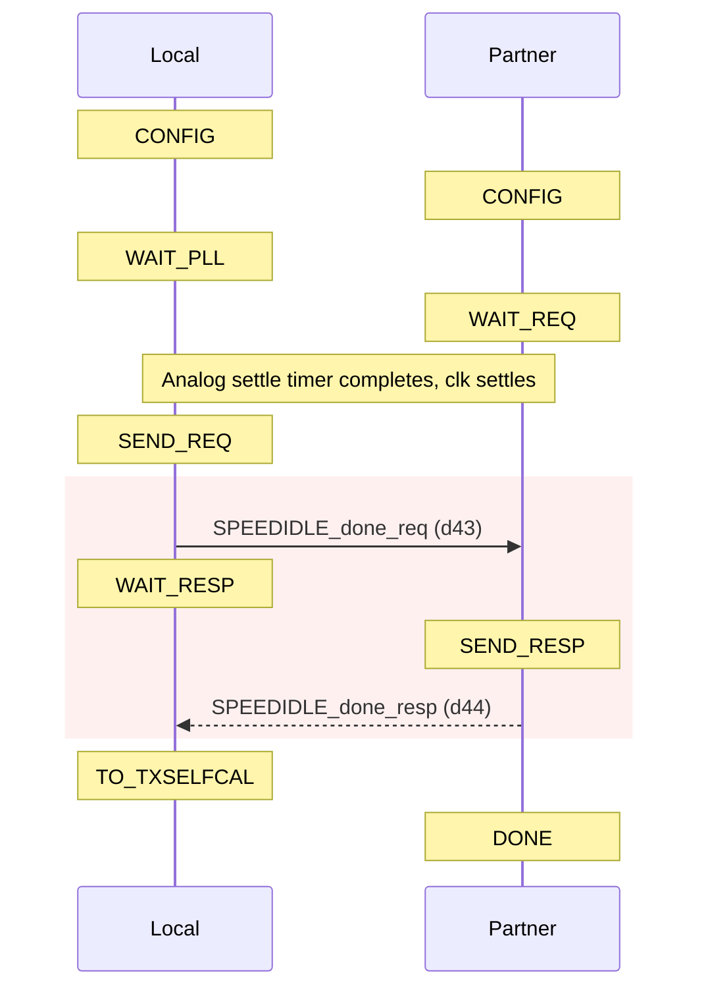
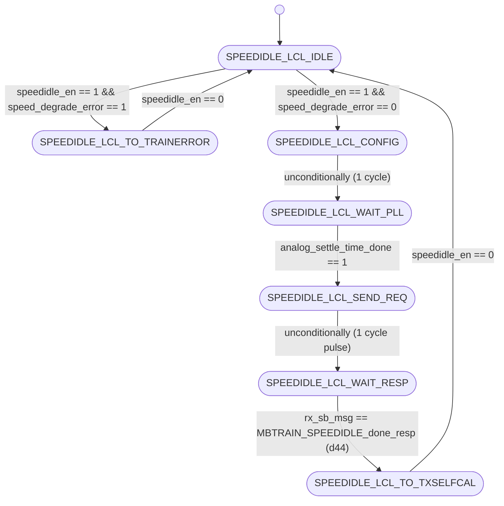
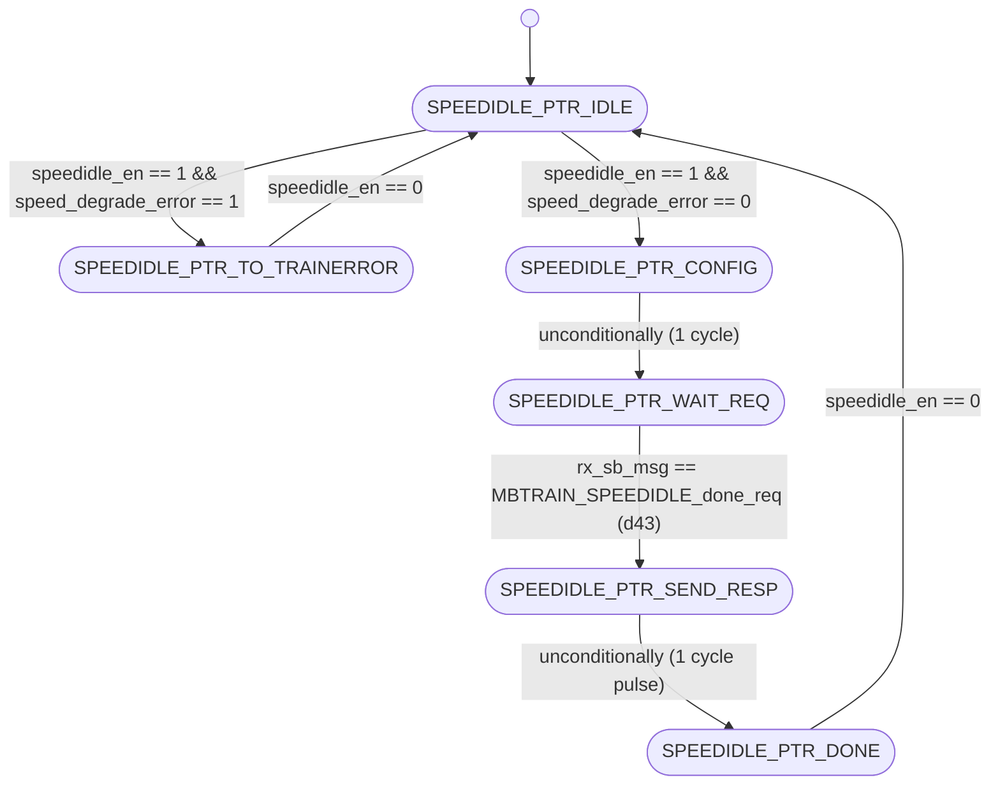

# UCIe PHY Layer: MBTRAIN.SPEEDIDLE Substate Design

This document details the architecture, finite state machines, interface ports, and sideband communication sequences for the third Main Base Training substate: **`SPEEDIDLE`** (Link Speed Negotiation and PLL Settling).

---

## Section 1 — Substate Overview

### Why does this substate exist?
Following the initial Vref calibrations of the control valid lane (`VALVREF`) and active mainband data lanes (`DATAVREF`) at the default base speed of 4 GT/s, the link must transition to its target operational frequency. The **`SPEEDIDLE`** substate handles this negotiation, PLL lock timing, and die synchronization. 

It is also re-entered during link retraining or when link speed degradation is required (e.g., if higher-speed stages fail to train, the link degrades to a lower speed step by step).

### Objectives
1. **Speed Configuration**: Compute and apply the new negotiated link speed based on historical entry states (first-time calibration vs. retrain degradation).
2. **PLL Settling**: Enable and wait for the analog settle timer to count down the required cycles for the internal Phase Locked Loop (PLL) to safely lock at the new frequency.
3. **Synchronized Speed Handshake**: Negotiate and acknowledge link readiness at the new speed across the die boundary via sideband messaging.

### Entry and Exit Conditions
* **Entry Condition**: Asserted `speedidle_en` from the top-level sequencer (`unit_MBTRAIN_ctrl.sv`) after `DATAVREF` completes, or upon speed-degrade requests from the `LINKSPEED` or retrain sequences.
* **Exit Condition**: Complete status flag `speedidle_done` asserted back to the sequencer, indicating both Local and Partner FSMs have completed speed selection, PLL lock, and sideband handshakes.

---

## Section 2 — Sideband Communication Sequence

The step-by-step sideband handshake protocol crosses the die boundary using the following sequence:



---

## Section 3 — FSM Architecture Overview

The substate utilizes a **decoupled initiator/responder FSM architecture**:
* **Local FSM (Initiator)**: Initiates speed changes, triggers the analog settle timer (`unit_analog_settle_timer.sv`) to wait for PLL stability, drives the `done_req` message, and monitors the sideband for the partner's completion response.
* **Partner FSM (Responder)**: Configures the target speed, waits for its local PLL lock, waits for the sideband request `done_req` from the partner, and replies with a `done_resp` to complete the negotiation.

### PLL Settle Timer Role
The Local FSM triggers the global timer `analog_settle_timer_en = 1` during the speed transition. Clocks are not considered stable, and sideband packets are not transmitted until the timer asserts `analog_settle_time_done = 1`.

---

## Section 4 — FSM Diagram

### Local FSM Diagram (Initiator)
The state transitions of `unit_SPEEDIDLE_local.sv` are documented below:



---

### Partner FSM Diagram (Responder)
The state transitions of `unit_SPEEDIDLE_partner.sv` are documented below:



---

## Section 5 — Local FSM State Table

| State ID (logic [2:0]) | State Name | Purpose / Active Actions | Transition Condition |
| :---: | :--- | :--- | :--- |
| **`3'd0`** | `SPEEDIDLE_LCL_IDLE` | Wait state. Clears outputs and awaits substate activation. | Advances to `SPEEDIDLE_LCL_TO_TRAINERROR` if speed degrade is impossible, else `SPEEDIDLE_LCL_CONFIG` when `speedidle_en` is asserted. |
| **`3'd1`** | `SPEEDIDLE_LCL_CONFIG` | Evaluates past states (`state_n_1`) and updates the `phy_negotiated_speed` register. | Unconditionally advances to `SPEEDIDLE_LCL_WAIT_PLL` on the next clock. |
| **`3'd2`** | `SPEEDIDLE_LCL_WAIT_PLL` | Asserts `analog_settle_timer_en` to trigger the analog PLL settle timer. | Advances to `SPEEDIDLE_LCL_SEND_REQ` once `analog_settle_time_done` is high. |
| **`3'd3`** | `SPEEDIDLE_LCL_SEND_REQ` | Transmits sideband done request message `MBTRAIN_SPEEDIDLE_done_req` (d43) to partner. | Unconditionally advances to `SPEEDIDLE_LCL_WAIT_RESP` on the next clock. |
| **`3'd4`** | `SPEEDIDLE_LCL_WAIT_RESP` | Polls receiver sideband FIFO for done response from partner. | Advances to `SPEEDIDLE_LCL_TO_TXSELFCAL` when `rx_sb_msg_valid && rx_sb_msg == MBTRAIN_SPEEDIDLE_done_resp` (d44). |
| **`3'd5`** | `SPEEDIDLE_LCL_TO_TXSELFCAL`| Normal terminal state. Asserts completion flag `speedidle_done`. | Holds state and `speedidle_done` until `speedidle_en` is deasserted. |
| **`3'd6`** | `SPEEDIDLE_LCL_TO_TRAINERROR`| Error terminal state. Asserts `speedidle_done` and `trainerror_req` due to invalid degrade paths. | Holds state until `speedidle_en` is deasserted. |

---

## Section 6 — Partner FSM State Table

| State ID (logic [2:0]) | State Name | Purpose / Active Actions | Transition Condition |
| :---: | :--- | :--- | :--- |
| **`3'd0`** | `SPEEDIDLE_PTR_IDLE` | Wait state. Awaits substate activation. | Advances to `SPEEDIDLE_PTR_TO_TRAINERROR` if speed degrade is impossible, else `SPEEDIDLE_PTR_CONFIG` when `speedidle_en` is asserted. |
| **`3'd1`** | `SPEEDIDLE_PTR_CONFIG` | Evaluates past states and updates internal negotiated speed registers. | Unconditionally advances to `SPEEDIDLE_PTR_WAIT_REQ` on the next clock. |
| **`3'd2`** | `SPEEDIDLE_PTR_WAIT_REQ` | Polls sideband receiver FIFO for done request message from partner. | Advances to `SPEEDIDLE_PTR_SEND_RESP` when `rx_sb_msg_valid && rx_sb_msg == MBTRAIN_SPEEDIDLE_done_req` (d43). |
| **`3'd3`** | `SPEEDIDLE_PTR_SEND_RESP` | Transmits sideband done response message `MBTRAIN_SPEEDIDLE_done_resp` (d44) to initiator. | Unconditionally advances to `SPEEDIDLE_PTR_DONE` on the next clock. |
| **`3'd4`** | `SPEEDIDLE_PTR_DONE` | Normal terminal state. Asserts completion flag `speedidle_done`. | Holds state and `speedidle_done` until `speedidle_en` is deasserted. |
| **`3'd5`** | `SPEEDIDLE_PTR_TO_TRAINERROR`| Error terminal state. Asserts `speedidle_done` and `trainerror_req`. | Holds state until `speedidle_en` is deasserted. |

---

## Section 7 — Local FSM Execution Flow

The Local FSM transitions through the following stages:
1. **Idle State (`SPEEDIDLE_LCL_IDLE`)**: Upon receiving the enable pulse `speedidle_en = 1`, the Local FSM checks if it is attempting a speed degradation step when already at the minimum base speed (`3'b000`, 4 GT/s). If so, it raises `speed_degrade_error` combinationally and enters `SPEEDIDLE_LCL_TO_TRAINERROR`. Otherwise, it transitions to `SPEEDIDLE_LCL_CONFIG`.
2. **Speed Calculation (`SPEEDIDLE_LCL_CONFIG` $\rightarrow$ `SPEEDIDLE_LCL_WAIT_PLL`)**: The Local FSM evaluates `state_n_1` (the state immediately preceding `MBTRAIN` entry):
   * **First-time entry** from `VALVREF/DATAVREF` (`state_n_1 == LOG_MBTRAIN_DATAVREF`): Selects the target maximum speed (`param_negotiated_max_speed`).
   * **Re-entry** from low power L1/L2 (`state_n_1 == LOG_L1/L2`): Retains the existing `phy_negotiated_speed`.
   * **Degradation** from linkspeed retrain (`state_n_1 == LOG_MBTRAIN_LINKSPEED/PHYRETRAIN`): Decrements the speed step: `internal_phy_negotiated_speed <= internal_phy_negotiated_speed - 3'b001`.
   On the next clock cycle, it transitions to `SPEEDIDLE_LCL_WAIT_PLL`.
3. **PLL Lock Period (`SPEEDIDLE_LCL_WAIT_PLL` $\rightarrow$ `SPEEDIDLE_LCL_SEND_REQ`)**: The FSM asserts `analog_settle_timer_en = 1` and waits. Once the timer asserts `analog_settle_time_done = 1`, meaning the PLL frequency synthesizer has stabilized, the FSM transitions to `SPEEDIDLE_LCL_SEND_REQ`.
4. **Done Handshake (`SPEEDIDLE_LCL_SEND_REQ` $\rightarrow$ `SPEEDIDLE_LCL_WAIT_RESP` $\rightarrow$ `SPEEDIDLE_LCL_TO_TXSELFCAL`)**: In `SPEEDIDLE_LCL_SEND_REQ`, the FSM transmits `MBTRAIN_SPEEDIDLE_done_req` (d43) via the sideband FIFO. It transitions to `SPEEDIDLE_LCL_WAIT_RESP` and waits for `MBTRAIN_SPEEDIDLE_done_resp` (d44). Once received, it enters `SPEEDIDLE_LCL_TO_TXSELFCAL`.
5. **Completion State (`SPEEDIDLE_LCL_TO_TXSELFCAL`)**: Asserts `speedidle_done = 1` to the top-level sequencer, holding it until `speedidle_en` is deasserted.

---

## Section 8 — Partner FSM Execution Flow

The Partner FSM operates in tandem with the Local FSM to configure its own speed and acknowledge training:
1. **Idle State (`SPEEDIDLE_PTR_IDLE`)**: Upon observing `speedidle_en = 1`, it performs the same degradation check. If an error is detected, it transitions to `SPEEDIDLE_PTR_TO_TRAINERROR`. Otherwise, it advances to `SPEEDIDLE_PTR_CONFIG`.
2. **Speed Calculation (`SPEEDIDLE_PTR_CONFIG` $\rightarrow$ `SPEEDIDLE_PTR_WAIT_REQ`)**: Resolves the target speed identically to the Local FSM and updates its internal speed register. It transitions to `SPEEDIDLE_PTR_WAIT_REQ` on the next clock.
3. **Wait for Done Request (`SPEEDIDLE_PTR_WAIT_REQ` $\rightarrow$ `SPEEDIDLE_PTR_SEND_RESP` $\rightarrow$ `SPEEDIDLE_PTR_DONE`)**: The Partner FSM waits for `rx_sb_msg == MBTRAIN_SPEEDIDLE_done_req` (d43). When the message arrives, it transitions to `SPEEDIDLE_PTR_SEND_RESP` and drives the sideband FIFO with `MBTRAIN_SPEEDIDLE_done_resp` (d44). On the next cycle, it advances to `SPEEDIDLE_PTR_DONE`.
4. **Completion State (`SPEEDIDLE_PTR_DONE`)**: Asserts `speedidle_done = 1`, holding it until `speedidle_en` is deasserted.

---

## Section 9 — Wrapper Architecture

The substate wrapper (**`wrapper_SPEEDIDLE.sv`**) integrates the Local and Partner modules:

### Instantiated Modules
1. **`u_SPEEDIDLE_local`**: Initiator FSM executing the analog settle wait, configuration, and handshake request.
2. **`u_SPEEDIDLE_partner`**: Responder FSM configuring partner speed and replying to handshake request.

### Handshake Completion Logic
The wrapper performs a logical AND of the completion flags and a logical OR of the error requests from both FSMs:
```systemverilog
assign speedidle_done = local_speedidle_done_wire & partner_speedidle_done_wire;
assign trainerror_req = local_trainerror_req_wire | partner_trainerror_req_wire;
```

### Sideband TX Arbitration
Because both FSMs must transmit messages over the same sideband interface, the wrapper arbitrates the TX lines, giving priority to the Local FSM:
```systemverilog
assign tx_sb_msg_valid = local_tx_sb_msg_valid | partner_tx_sb_msg_valid;
assign tx_sb_msg       = local_tx_sb_msg_valid ? local_tx_sb_msg       : partner_tx_sb_msg;
assign tx_msginfo      = local_tx_sb_msg_valid ? local_tx_msginfo      : partner_tx_msginfo;
assign tx_data_field   = local_tx_sb_msg_valid ? local_tx_data_field   : partner_tx_data_field;
```

### Static Mainband Lane Configurations
During `SPEEDIDLE`, the mainband data, valid, and track lanes must be held in Electrical Idle to prevent spurious noise as the PLL frequency settles. The clock lane, however, must be active (driving forwarded clock). The wrapper configuration is:
```systemverilog
assign mb_tx_clk_lane_sel  = 2'b01;  // Forwarded clock active
assign mb_tx_data_lane_sel = 2'b00;  // Electrical Idle / Low
assign mb_tx_val_lane_sel  = 2'b00;  // Electrical Idle / Low
assign mb_tx_trk_lane_sel  = 2'b00;  // Electrical Idle / Low
assign mb_rx_clk_lane_sel  = 1'b1 ;  // Enabled (Clock RX buffer active)
assign mb_rx_data_lane_sel = 1'b0 ;  // Disabled
assign mb_rx_val_lane_sel  = 1'b0 ;  // Disabled
assign mb_rx_trk_lane_sel  = 1'b0 ;  // Disabled
```

---

## Section 10 — Wrapper Interface Table

The table below lists all interface ports on the substate wrapper `wrapper_SPEEDIDLE.sv`:

| Port Signal Name | Direction | Bit Width | Functional Description / Encodings |
| :--- | :---: | :---: | :--- |
| `lclk` | Input | 1 | LTSM clock domain input (1 GHz or 2 GHz). |
| `rst_n` | Input | 1 | Asynchronous active-low global reset. |
| `soft_rst_n` | Input | 1 | Synchronous active-low soft reset (clears registers). |
| `speedidle_en` | Input | 1 | Sub-state enable signal from top controller (1 = Active, 0 = Disabled). |
| `speedidle_done` | Output | 1 | Sub-state complete handshake output to top controller (1 = Complete, 0 = In progress). |
| `trainerror_req` | Output | 1 | Training error request to top controller (1 = Error detected, 0 = Normal). |
| `analog_settle_timer_en` | Output | 1 | Command to trigger the analog PLL settle timer (1 = Start timer, 0 = Idle). |
| `analog_settle_time_done`| Input | 1 | Done input from the analog PLL settle timer (1 = Settled, 0 = Counting). |
| `state_n_1` | Input | 8 | Prior state history enum (`ltsm_state_n_pkg::state_n_e`) to evaluate target speed. |
| `param_negotiated_max_speed` | Input | 3 | Configuration input specifying target max speed. <br>Values: `3'b000` (4 GT/s), `3'b001` (8 GT/s), `3'b010` (12 GT/s), `3'b011` (16 GT/s), `3'b100` (24 GT/s), `3'b101` (32 GT/s), `3'b110` (48 GT/s), `3'b111` (64 GT/s). |
| `phy_negotiated_speed` | Output | 3 | Current negotiated target speed determined by configuration. <br>Values: same encoding as `param_negotiated_max_speed`. |
| `mb_tx_clk_lane_sel` | Output | 2 | Mainband Clock Transmitter multiplexer selector. <br>Values: `2'b00` = Low (0), `2'b01` = Active clock, `2'b10` = Hi-Z (Tri-state). |
| `mb_tx_data_lane_sel`| Output | 2 | Mainband Data Transmitter multiplexer selector. <br>Values: same encoding as `mb_tx_clk_lane_sel`. |
| `mb_tx_val_lane_sel` | Output | 2 | Mainband Valid Transmitter multiplexer selector. <br>Values: same encoding as `mb_tx_clk_lane_sel`. |
| `mb_tx_trk_lane_sel` | Output | 2 | Mainband Track Transmitter multiplexer selector. <br>Values: same encoding as `mb_tx_clk_lane_sel`. |
| `mb_rx_clk_lane_sel` | Output | 1 | Mainband Clock Receiver enable. <br>Values: `1'b1` = Receiver enabled, `1'b0` = Disabled. |
| `mb_rx_data_lane_sel`| Output | 1 | Mainband Data Receiver enable. <br>Values: same encoding as `mb_rx_clk_lane_sel`. |
| `mb_rx_val_lane_sel` | Output | 1 | Mainband Valid Receiver enable. <br>Values: same encoding as `mb_rx_clk_lane_sel`. |
| `mb_rx_trk_lane_sel` | Output | 1 | Mainband Track Receiver enable. <br>Values: same encoding as `mb_rx_clk_lane_sel`. |
| `tx_sb_msg_valid` | Output | 1 | Strobe line driven to Async SB FIFO to launch a sideband message (1 = Strobe valid, 0 = Idle). |
| `tx_sb_msg` | Output | 8 | Opcode of the sideband message to transmit. <br>Values: `d43` = `MBTRAIN_SPEEDIDLE_done_req` (if Local); `d44` = `MBTRAIN_SPEEDIDLE_done_resp` (if Partner). |
| `tx_msginfo` | Output | 16 | Message info payload field sent on sideband (fixed at `16'h0000`). |
| `tx_data_field` | Output | 64 | 64-bit payload data field sent on sideband (fixed at `64'h0000000000000000`). |
| `rx_sb_msg_valid` | Input | 1 | Incoming message valid pulse from SB RX FIFO (1 = Valid message, 0 = Idle). |
| `rx_sb_msg` | Input | 8 | Opcode of the incoming sideband message. <br>Values: same encoding as `tx_sb_msg`. |

---

## Section 11 — Internal Signal Summary

| Internal Signal Name | Direction | Bit Width | Functional Description |
| :--- | :---: | :---: | :--- |
| `local_speedidle_done_wire` | Internal | 1 | Indication wire showing the Local FSM has completed its PLL settle and sideband handshake. |
| `partner_speedidle_done_wire`| Internal | 1 | Indication wire showing the Partner FSM has completed its speed change and handshake. |
| `local_trainerror_req_wire` | Internal | 1 | Indication wire showing the Local FSM hit a speed degradation error. |
| `partner_trainerror_req_wire`| Internal | 1 | Indication wire showing the Partner FSM hit a speed degradation error. |
| `local_tx_sb_msg_valid` | Internal | 1 | SB TX valid strobe driven by `u_SPEEDIDLE_local`. |
| `local_tx_sb_msg` | Internal | 8 | Opcode driven by `u_SPEEDIDLE_local` (d43). |
| `partner_tx_sb_msg_valid`| Internal | 1 | SB TX valid strobe driven by `u_SPEEDIDLE_partner`. |
| `partner_tx_sb_msg` | Internal | 8 | Opcode driven by `u_SPEEDIDLE_partner` (d44). |

---

## Section 12 — D2C_PT Interaction

This substate does not participate in the D2C Point Test (D2C_PT) or sweep engine calibration. It only performs speed configuration and wait-PLL settling, which is a logic control phase, not a calibration sweep phase. Therefore, the Local FSM does not assert `local_sweep_en`, the Partner FSM does not assert `partner_sweep_en`, and the sweep engine interfaces (`swept_code`, `best_code`, `sweep_done`) are unused.

---

## Section 13 — Summary

The **`SPEEDIDLE`** substate design provides a synchronized, decoupled, and spec-compliant transition of link operational speeds. By utilizing the analog settle timer, the FSM guarantees clock stability before any data-level training is attempted. 

Furthermore, the design embeds safety paths: invalid speed change entry configurations trigger transition paths directly into the `TRAINERROR` state, protecting downstream circuits from operating on unstable clock signals.
