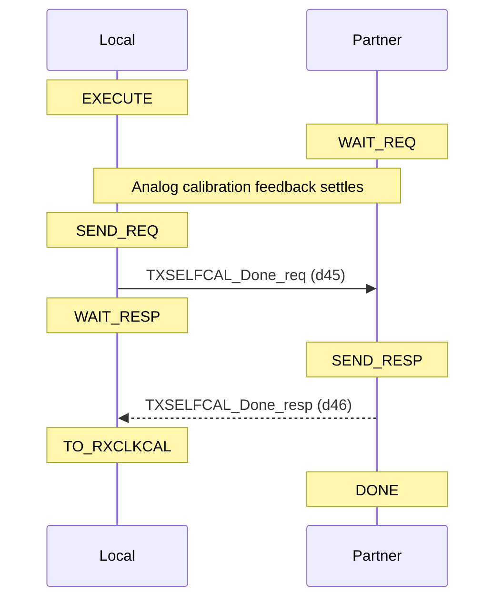
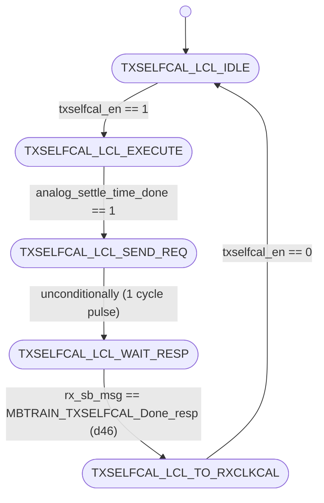
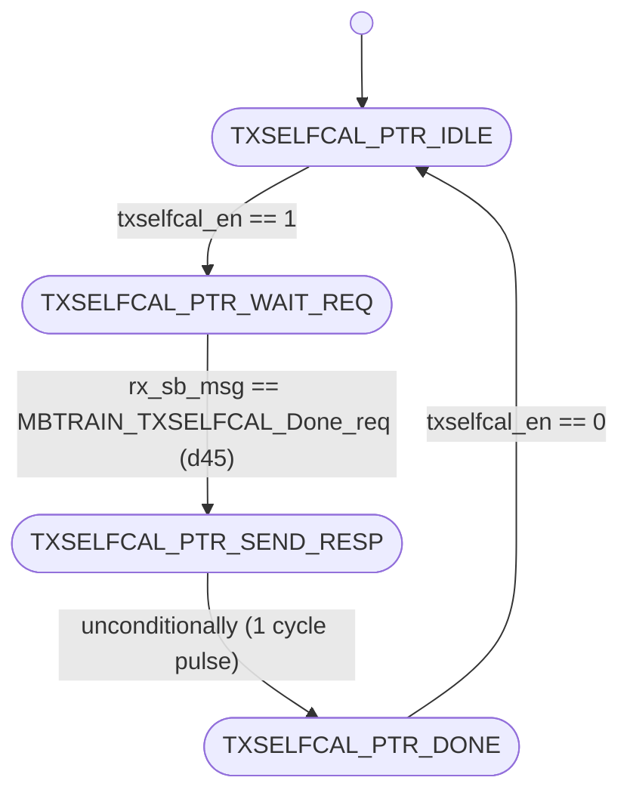

# UCIe PHY Layer: MBTRAIN.TXSELFCAL Substate Design

This document details the architecture, finite state machines, interface ports, and sideband communication sequences for the fourth Main Base Training substate: **`TXSELFCAL`** (Transmitter Self-Calibration).

---

## Section 1 — Substate Overview

### Why does this substate exist?
Following successful speed negotiation and PLL clock settling in `SPEEDIDLE`, the physical transmitters on both dies must perform implementation-specific self-calibration before driving mainband signals. The **`TXSELFCAL`** substate allows each die's transmitters to execute internal impedance matching, driver strength calibration, and duty-cycle adjustment.

### Objectives
1. **Transmitter Impedance Matching**: Calibrate transmitter driver impedance ($R_{\text{on}}$) to match the channel impedance.
2. **Duty-Cycle Distortion (DCD) Correction**: Perform duty-cycle adjustments on transmitter clock and data paths to maintain signal integrity at high speeds.
3. **Die Synchronization**: Ensure both transmitter interfaces complete internal calibration before downstream receiver training begins.

### Entry and Exit Conditions
* **Entry Condition**: Asserted `txselfcal_en` from the top-level sequencer (`unit_MBTRAIN_ctrl.sv`) after `SPEEDIDLE` completes.
* **Exit Condition**: Complete status flag `txselfcal_done` asserted back to the sequencer, indicating both Local and Partner FSMs have completed internal calibrations and exchanged sideband completion handshakes.

---

## Section 2 — Sideband Communication Sequence

The step-by-step sideband handshake protocol crosses the die boundary using the following sequence:



---

## Section 3 — FSM Architecture Overview

The substate utilizes a **decoupled initiator/responder FSM architecture**:
* **Local FSM (Initiator)**: Initiates transmitter calibration, asserts `phy_tx_selfcal_en = 1` to drive analog calibration engines, triggers the settle timer, transmits `Done_req` (d45) to the partner, and waits for `Done_resp` (d46).
* **Partner FSM (Responder)**: Awaits the `Done_req` (d45) message from the partner while executing its own local transmitter calibrations, then responds with `Done_resp` (d46).

### Analog Settle Timer Role
During calibration, the Local FSM enables the analog settle timer (`analog_settle_timer_en = 1`) to provide the necessary clock cycles for the analog calibration feedback loops to converge and stabilize. The FSM remains in the execution state until the timer asserts `analog_settle_time_done = 1`.

---

## Section 4 — FSM Diagram

### Local FSM Diagram (Initiator)
The state transitions of `unit_TXSELFCAL_local.sv` are documented below:



---

### Partner FSM Diagram (Responder)
The state transitions of `unit_TXSELFCAL_partner.sv` are documented below:



---

## Section 5 — Local FSM State Table

| State ID (logic [2:0]) | State Name | Purpose / Active Actions | Transition Condition |
| :---: | :--- | :--- | :--- |
| **`3'd0`** | `TXSELFCAL_LCL_IDLE` | Wait state. Awaits substate activation. | Advances to `TXSELFCAL_LCL_EXECUTE` when `txselfcal_en` is asserted. |
| **`3'd1`** | `TXSELFCAL_LCL_EXECUTE` | Asserts `phy_tx_selfcal_en = 1` and `analog_settle_timer_en = 1` to run TX self-calibration loops. | Advances to `TXSELFCAL_LCL_SEND_REQ` once `analog_settle_time_done` is high. |
| **`3'd2`** | `TXSELFCAL_LCL_SEND_REQ` | Drives `tx_sb_msg_valid = 1` with opcode `MBTRAIN_TXSELFCAL_Done_req` (d45) to notify partner. | Unconditionally advances to `TXSELFCAL_LCL_WAIT_RESP` on the next clock. |
| **`3'd3`** | `TXSELFCAL_LCL_WAIT_RESP` | Polls receiver sideband FIFO for done response from partner. | Advances to `TXSELFCAL_LCL_TO_RXCLKCAL` when `rx_sb_msg_valid && rx_sb_msg == MBTRAIN_TXSELFCAL_Done_resp` (d46). |
| **`3'd4`** | `TXSELFCAL_LCL_TO_RXCLKCAL`| Normal terminal state. Asserts completion flag `txselfcal_done`. | Holds state and `txselfcal_done` until `txselfcal_en` is deasserted. |

---

## Section 6 — Partner FSM State Table

| State ID (logic [1:0]) | State Name | Purpose / Active Actions | Transition Condition |
| :---: | :--- | :--- | :--- |
| **`2'd0`** | `TXSELFCAL_PTR_IDLE` | Wait state. Awaits substate activation. | Advances to `TXSELFCAL_PTR_WAIT_REQ` when `txselfcal_en` is asserted. |
| **`2'd1`** | `TXSELFCAL_PTR_WAIT_REQ` | Idle wait state. Awaits partner FSM done notification. | Advances to `TXSELFCAL_PTR_SEND_RESP` when `rx_sb_msg_valid && rx_sb_msg == MBTRAIN_TXSELFCAL_Done_req` (d45). |
| **`2'd2`** | `TXSELFCAL_PTR_SEND_RESP` | Drives `tx_sb_msg_valid = 1` with opcode `MBTRAIN_TXSELFCAL_Done_resp` (d46) to acknowledge completion. | Unconditionally advances to `TXSELFCAL_PTR_DONE` on the next clock. |
| **`2'd3`** | `TXSELFCAL_PTR_DONE` | Normal terminal state. Asserts completion flag `txselfcal_done`. | Holds state and `txselfcal_done` until `txselfcal_en` is deasserted. |

---

## Section 7 — Local FSM Execution Flow

The Local FSM transitions through the following stages:
1. **Idle State (`TXSELFCAL_LCL_IDLE`)**: Remains idle until the top controller asserts `txselfcal_en = 1`. Upon activation, it transitions to `TXSELFCAL_LCL_EXECUTE`.
2. **Calibration Phase (`TXSELFCAL_LCL_EXECUTE` $\rightarrow$ `TXSELFCAL_LCL_SEND_REQ`)**: The Local FSM drives `phy_tx_selfcal_en = 1` to kick off the analog transmitter calibration circuits, and drives `analog_settle_timer_en = 1` to start the settle timer. The FSM waits in this state until `analog_settle_time_done` is high, then advances to `TXSELFCAL_LCL_SEND_REQ`.
3. **Done Request (`TXSELFCAL_LCL_SEND_REQ` $\rightarrow$ `TXSELFCAL_LCL_WAIT_RESP`)**: The Local FSM transmits `MBTRAIN_TXSELFCAL_Done_req` (d45) via the sideband FIFO interface and advances to `TXSELFCAL_LCL_WAIT_RESP`.
4. **Wait for Partner Acknowledge (`TXSELFCAL_LCL_WAIT_RESP` $\rightarrow$ `TXSELFCAL_LCL_TO_RXCLKCAL`)**: The Local FSM polls `rx_sb_msg`. Once `MBTRAIN_TXSELFCAL_Done_resp` (d46) is received, it transitions to `TXSELFCAL_LCL_TO_RXCLKCAL`.
5. **Completion State (`TXSELFCAL_LCL_TO_RXCLKCAL`)**: Asserts `txselfcal_done = 1` to the top-level sequencer, holding it until `txselfcal_en` is deasserted.

---

## Section 8 — Partner FSM Execution Flow

The Partner FSM mirrors the Local FSM to respond to the calibration handshakes:
1. **Idle State (`TXSELFCAL_PTR_IDLE`)**: Activates when `txselfcal_en = 1` is observed, moving to `TXSELFCAL_PTR_WAIT_REQ`.
2. **Awaiting Local Request (`TXSELFCAL_PTR_WAIT_REQ` $\rightarrow$ `TXSELFCAL_PTR_SEND_RESP`)**: While the local side is executing calibrations and waiting for its timer, the Partner FSM polls `rx_sb_msg`. Once `MBTRAIN_TXSELFCAL_Done_req` (d45) is observed, the Partner FSM transitions to `TXSELFCAL_PTR_SEND_RESP`.
3. **Acknowledge Transmission (`TXSELFCAL_PTR_SEND_RESP` $\rightarrow$ `TXSELFCAL_PTR_DONE`)**: The Partner FSM transmits `MBTRAIN_TXSELFCAL_Done_resp` (d46) back to the initiator, then advances to `TXSELFCAL_PTR_DONE`.
4. **Completion State (`TXSELFCAL_PTR_DONE`)**: Asserts `txselfcal_done = 1` to the top-level sequencer, holding it until `txselfcal_en` is deasserted.

---

## Section 9 — Wrapper Architecture

The substate wrapper (**`wrapper_TXSELFCAL.sv`**) integrates the Local and Partner modules:

### Instantiated Modules
1. **`u_TXSELFCAL_local`**: Initiator FSM managing the calibration enables, settle wait, and done requests.
2. **`u_TXSELFCAL_partner`**: Responder FSM managing the handshake response back to the initiator.

### Handshake Completion Logic
The wrapper performs a logical AND of the completion flags from both modules to drive the top-level done output:
```systemverilog
assign txselfcal_done = local_txselfcal_done_wire & partner_txselfcal_done_wire;
```

### Sideband TX Arbitration
Because both FSMs must transmit messages over the same sideband interface, the wrapper arbitrates the TX lines, giving priority to the Local FSM:
```systemverilog
assign tx_sb_msg_valid = local_tx_sb_msg_valid | partner_tx_sb_msg_valid;
assign tx_sb_msg       = local_tx_sb_msg_valid ? local_tx_sb_msg       : partner_tx_sb_msg;
assign tx_msginfo      = local_tx_sb_msg_valid ? local_tx_msginfo      : partner_tx_msginfo;
assign tx_data_field   = local_tx_sb_msg_valid ? local_tx_data_field   : partner_tx_data_field;
```

### Static Mainband Lane Configurations
Per UCIe specification §4.5.3.4.4, during `TXSELFCAL` training, no signals must be driven across the physical interconnect. All transmitters are tri-stated, and all receivers are disabled to prevent coupling noise:
```systemverilog
assign mb_tx_clk_lane_sel  = 2'b10;  // Hi-Z / Tri-state
assign mb_tx_data_lane_sel = 2'b10;  // Hi-Z / Tri-state
assign mb_tx_val_lane_sel  = 2'b10;  // Hi-Z / Tri-state
assign mb_tx_trk_lane_sel  = 2'b10;  // Hi-Z / Tri-state
assign mb_rx_clk_lane_sel  = 1'b0 ;  // Disabled
assign mb_rx_data_lane_sel = 1'b0 ;  // Disabled
assign mb_rx_val_lane_sel  = 1'b0 ;  // Disabled
assign mb_rx_trk_lane_sel  = 1'b0 ;  // Disabled
```

---

## Section 10 — Wrapper Interface Table

The table below lists all interface ports on the substate wrapper `wrapper_TXSELFCAL.sv`:

| Port Signal Name | Direction | Bit Width | Functional Description / Encodings |
| :--- | :---: | :---: | :--- |
| `lclk` | Input | 1 | LTSM clock domain input (1 GHz or 2 GHz). |
| `rst_n` | Input | 1 | Asynchronous active-low global reset. |
| `soft_rst_n` | Input | 1 | Synchronous active-low soft reset (clears registers). |
| `txselfcal_en` | Input | 1 | Sub-state enable signal from top controller (1 = Active, 0 = Disabled). |
| `txselfcal_done` | Output | 1 | Sub-state complete handshake output to top controller (1 = Complete, 0 = In progress). |
| `analog_settle_timer_en` | Output | 1 | Command to trigger the analog PLL settle timer (1 = Start timer, 0 = Idle). |
| `analog_settle_time_done`| Input | 1 | Done input from the analog PLL settle timer (1 = Settled, 0 = Counting). |
| `phy_tx_selfcal_en` | Output | 1 | Command to trigger analog TX self-calibration engines (1 = Start calibration, 0 = Idle). |
| `mb_tx_clk_lane_sel` | Output | 2 | Mainband Clock Transmitter multiplexer selector. <br>Values: `2'b00` = Low (0), `2'b01` = Active clock, `2'b10` = Hi-Z (Tri-state). |
| `mb_tx_data_lane_sel`| Output | 2 | Mainband Data Transmitter multiplexer selector. <br>Values: same encoding as `mb_tx_clk_lane_sel`. |
| `mb_tx_val_lane_sel` | Output | 2 | Mainband Valid Transmitter multiplexer selector. <br>Values: same encoding as `mb_tx_clk_lane_sel`. |
| `mb_tx_trk_lane_sel` | Output | 2 | Mainband Track Transmitter multiplexer selector. <br>Values: same encoding as `mb_tx_clk_lane_sel`. |
| `mb_rx_clk_lane_sel` | Output | 1 | Mainband Clock Receiver enable. <br>Values: `1'b1` = Receiver enabled, `1'b0` = Disabled. |
| `mb_rx_data_lane_sel`| Output | 1 | Mainband Data Receiver enable. <br>Values: same encoding as `mb_rx_clk_lane_sel`. |
| `mb_rx_val_lane_sel` | Output | 1 | Mainband Valid Receiver enable. <br>Values: same encoding as `mb_rx_clk_lane_sel`. |
| `mb_rx_trk_lane_sel` | Output | 1 | Mainband Track Receiver enable. <br>Values: same encoding as `mb_rx_clk_lane_sel`. |
| `tx_sb_msg_valid` | Output | 1 | Strobe line driven to Async SB FIFO to launch a sideband message (1 = Strobe valid, 0 = Idle). |
| `tx_sb_msg` | Output | 8 | Opcode of the sideband message to transmit. <br>Values: `d45` = `MBTRAIN_TXSELFCAL_Done_req` (if Local); `d46` = `MBTRAIN_TXSELFCAL_Done_resp` (if Partner). |
| `tx_msginfo` | Output | 16 | Message info payload field sent on sideband (fixed at `16'h0000`). |
| `tx_data_field` | Output | 64 | 64-bit payload data field sent on sideband (fixed at `64'h0000000000000000`). |
| `rx_sb_msg_valid` | Input | 1 | Incoming message valid pulse from SB RX FIFO (1 = Valid message, 0 = Idle). |
| `rx_sb_msg` | Input | 8 | Opcode of the incoming sideband message. <br>Values: same encoding as `tx_sb_msg`. |

---

## Section 11 — Internal Signal Summary

| Internal Signal Name | Direction | Bit Width | Functional Description |
| :--- | :---: | :---: | :--- |
| `local_txselfcal_done_wire` | Internal | 1 | Indication wire showing the Local FSM has completed its calibration and sideband handshake. |
| `partner_txselfcal_done_wire`| Internal | 1 | Indication wire showing the Partner FSM has completed its handshake. |
| `local_tx_sb_msg_valid` | Internal | 1 | SB TX valid strobe driven by `u_TXSELFCAL_local`. |
| `local_tx_sb_msg` | Internal | 8 | Opcode driven by `u_TXSELFCAL_local` (d45). |
| `partner_tx_sb_msg_valid`| Internal | 1 | SB TX valid strobe driven by `u_TXSELFCAL_partner`. |
| `partner_tx_sb_msg` | Internal | 8 | Opcode driven by `u_TXSELFCAL_partner` (d46). |

---

## Section 12 — D2C_PT Interaction

This substate does not participate in the D2C Point Test (D2C_PT) or sweep engine calibration. It only performs local analog TX self-calibration (impedance calibration and duty-cycle adjustment), which is a logic control phase, not a calibration sweep phase. Therefore, the Local FSM does not assert `local_sweep_en`, the Partner FSM does not assert `partner_sweep_en`, and the sweep engine interfaces are unused.

---

## Section 13 — Summary

The **`TXSELFCAL`** substate design provides a synchronized and decoupled transition of transmitter calibrations. By isolating each transmitter's internal calibration feedback loops from downstream receivers during this period, the design prevents spurious noise propagation. The handshake exchange guarantees that both link dies finish calibration before moving forward to RX clock calibration stages.
