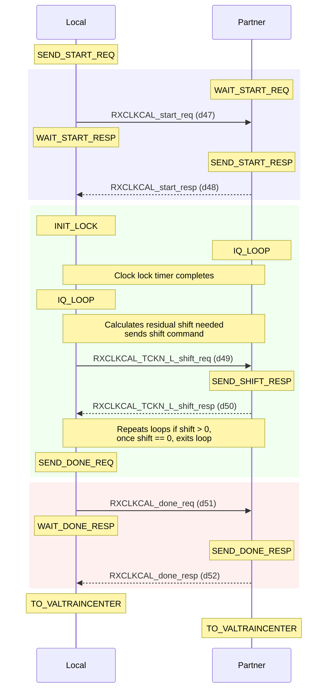
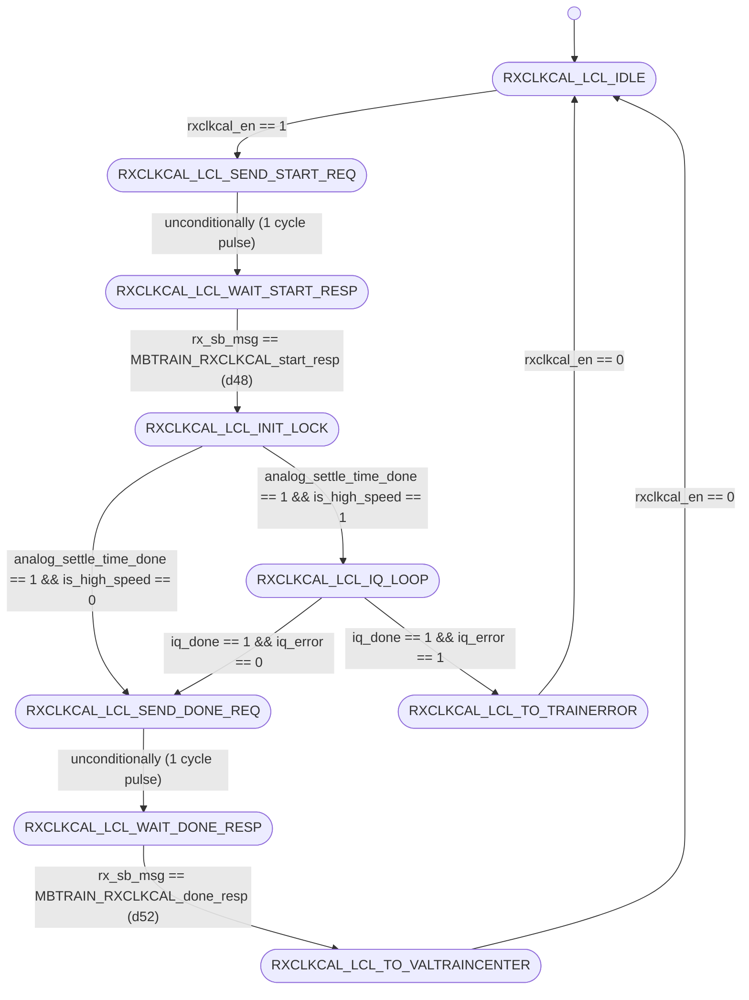
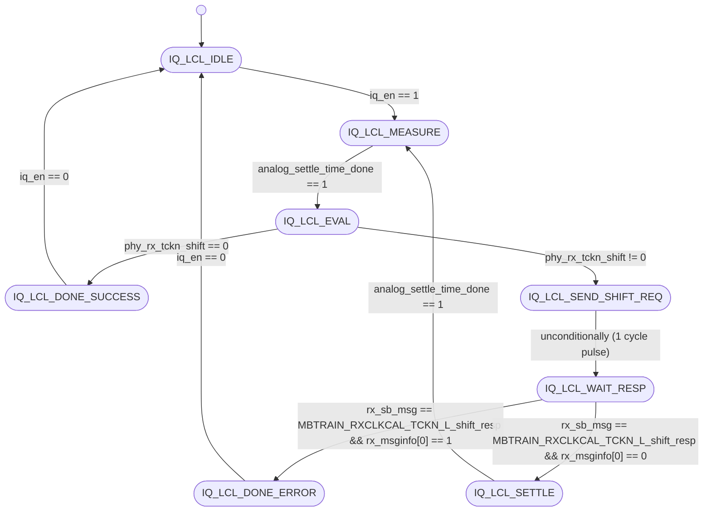
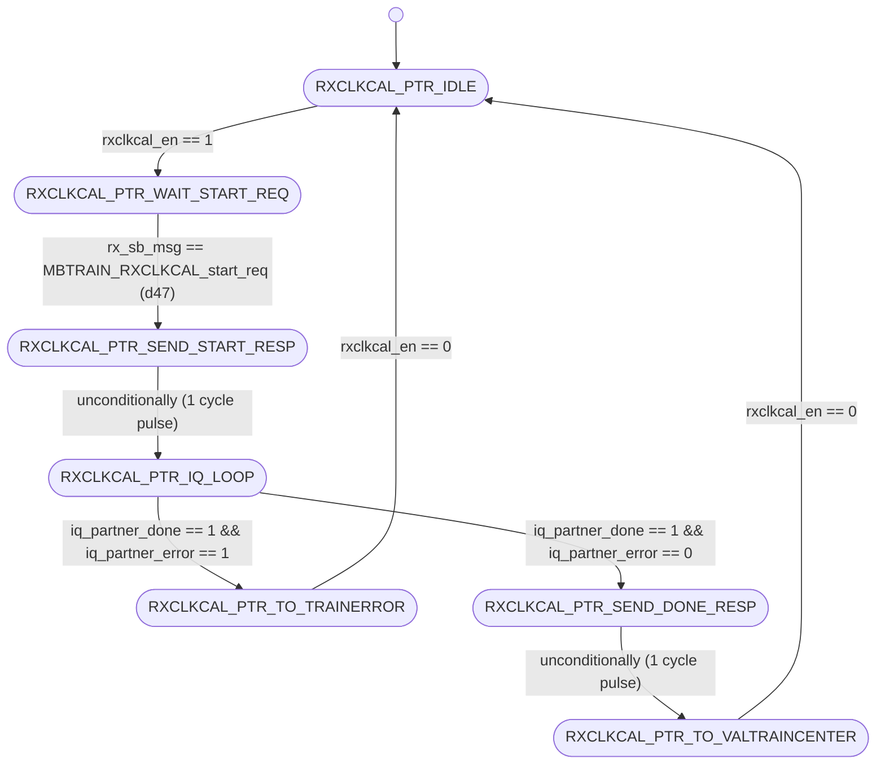
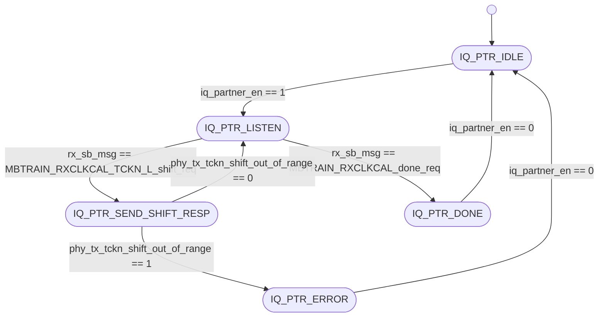

# UCIe PHY Layer: MBTRAIN.RXCLKCAL Substate Design

This document details the architecture, finite state machines, interface ports, and sideband communication sequences for the fifth Main Base Training substate: **`RXCLKCAL`** (Receiver Clock Calibration / IQ alignment).

---

## Section 1 — Substate Overview

### Why does this substate exist?
To ensure correct data sampling at high operational speeds, the clock forwarded from the transmitter must align precisely with the receiver's internal clock domains. The **`RXCLKCAL`** substate performs in-phase/quadrature (IQ) clock alignment on the receiver's forwarded clock lane. 

Additionally, the FSM tracks whether the transmitter's forwarded clock must be continuous or strobe-based. If operating at speeds greater than 32 GT/s, it runs an active calibration loop to measure residual clock phase error and command the partner's transmitter to shift its clock phase until alignment is achieved.

### Objectives
1. **Clock Lock Settle**: Enable receiver clock and track recovery buffers and wait for initial locking.
2. **IQ Phase Calibration**: For High Speed (operating speed > 32 GT/s), execute a closed-loop tracking sequence where the receiver phase detector measures residual offset, requests phase shift adjustments via sideband from the partner's transmitter, and converges to a centered clock alignment.
3. **Continuous/Strobe Configuration**: Manage transmitter clock and track forwarding modes during and after the calibration process.

### Entry and Exit Conditions
* **Entry Condition**: Asserted `rxclkcal_en` from the top-level sequencer (`unit_MBTRAIN_ctrl.sv`) after `TXSELFCAL` completes.
* **Exit Condition**: Complete status flag `rxclkcal_done` asserted back to the sequencer, indicating both Local and Partner FSMs have completed handshakes.

---

## Section 2 — Sideband Communication Sequence

The closed-loop sideband handshake sequence is detailed below:



---

## Section 3 — FSM Architecture Overview

The `RXCLKCAL` substate uses a highly specialized **decoupled initiator/responder FSM architecture**, where both the Local (Initiator) and Partner (Responder) modules contain dedicated internal sub-FSMs to handle the closed-loop IQ phase adjustments:

### Local (Initiator) Architecture
* **Main Local FSM (`unit_RXCLKCAL_local.sv`)**: Negotiates the start handshake, waits for initial clock locking, decides whether to execute the IQ phase calibration loop (based on `is_high_speed`), enables the nested FSM, and completes the done handshake.
* **IQ Local FSM (`unit_RXCLKCAL_IQ_local.sv`)**: Active when `is_high_speed = 1`. It monitors the receiver's physical phase detector (`phy_rx_tckn_shift`), checks if shift adjustments are needed, and drives the sideband shift requests (`TCKN_L_shift_req`) back to the transmitter.

### Partner (Responder) Architecture
* **Main Partner FSM (`unit_RXCLKCAL_partner.sv`)**: Responds to the start handshake, enables transmitter clock forwarding, controls transmitter lane multiplexers, and handles the done response.
* **IQ Partner FSM (`unit_RXCLKCAL_IQ_partner.sv`)**: Responds to sideband phase shift commands (`TCKN_L_shift_req`) by configuring the transmitter's physical clock phase delay circuits. It monitors out-of-range limits and responds with shift status acknowledgements.

---

## Section 4 — FSM Diagram

### Local FSM Diagrams

#### Main Local FSM Diagram (Initiator)


#### IQ Local FSM Diagram


---

### Partner FSM Diagrams

#### Main Partner FSM Diagram (Responder)


#### IQ Partner FSM Diagram


---

## Section 5 — Local FSM State Table

### Main Local FSM Table

| State ID (logic [3:0]) | State Name | Purpose / Active Actions | Transition Condition |
| :---: | :--- | :--- | :--- |
| **`4'h0`** | `RXCLKCAL_LCL_IDLE` | Wait state. Resets outputs. | Advances to `RXCLKCAL_LCL_SEND_START_REQ` when `rxclkcal_en` is asserted. |
| **`4'h1`** | `RXCLKCAL_LCL_SEND_START_REQ` | Drives `tx_sb_msg_valid = 1` with opcode `MBTRAIN_RXCLKCAL_start_req` (d47). | Unconditionally advances to `RXCLKCAL_LCL_WAIT_START_RESP` on next clock. |
| **`4'h2`** | `RXCLKCAL_LCL_WAIT_START_RESP`| Polls RX sideband FIFO for start acknowledgement from partner. | Advances to `RXCLKCAL_LCL_INIT_LOCK` when `rx_sb_msg_valid && rx_sb_msg == MBTRAIN_RXCLKCAL_start_resp` (d48). |
| **`4'h3`** | `RXCLKCAL_LCL_INIT_LOCK` | Activates RX buffers and timer (`analog_settle_timer_en = 1`) for initial clock lock cycles. | Transitions to `RXCLKCAL_LCL_IQ_LOOP` if `is_high_speed` is high, else bypasses loop to `RXCLKCAL_LCL_SEND_DONE_REQ`. |
| **`4'h4`** | `RXCLKCAL_LCL_IQ_LOOP` | Asserts `iq_en = 1` to enable the closed-loop phase tracking FSM. | Advances to `RXCLKCAL_LCL_TO_TRAINERROR` if `iq_error`, else advances to `RXCLKCAL_LCL_SEND_DONE_REQ` when `iq_done`. |
| **`4'h5`** | `RXCLKCAL_LCL_SEND_DONE_REQ` | Drives `tx_sb_msg_valid = 1` with opcode `MBTRAIN_RXCLKCAL_done_req` (d51). | Unconditionally advances to `RXCLKCAL_LCL_WAIT_DONE_RESP` on next clock. |
| **`4'h6`** | `RXCLKCAL_LCL_WAIT_DONE_RESP`| Polls RX sideband FIFO for done response from partner. | Advances to `RXCLKCAL_LCL_TO_VALTRAINCENTER` when `rx_sb_msg == MBTRAIN_RXCLKCAL_done_resp` (d52). |
| **`4'h7`** | `RXCLKCAL_LCL_TO_VALTRAINCENTER`| Terminal state. Asserts completion flag `rxclkcal_done`. | Holds state until `rxclkcal_en` is deasserted. |
| **`4'h8`** | `RXCLKCAL_LCL_TO_TRAINERROR`| Error terminal state. Asserts `trainerror_req` and `rxclkcal_done`. | Holds state until `rxclkcal_en` is deasserted. |

### IQ Local FSM Table

| State ID (logic [2:0]) | State Name | Purpose / Active Actions | Transition Condition |
| :---: | :--- | :--- | :--- |
| **`3'h0`** | `IQ_LCL_IDLE` | Wait state. Awaits activation. | Advances to `IQ_LCL_MEASURE` when `iq_en` is asserted. |
| **`3'h1`** | `IQ_LCL_MEASURE` | Enables phase detector (`phy_rx_phase_detector_en = 1`) and settle timer to gather samples. | Advances to `IQ_LCL_EVAL` when `analog_settle_time_done` is high. |
| **`3'h2`** | `IQ_LCL_EVAL` | Evaluates phase shift. | Advances to `IQ_LCL_DONE_SUCCESS` if residual shift `phy_rx_tckn_shift == 5'd0`, else `IQ_LCL_SEND_SHIFT_REQ`. |
| **`3'h3`** | `IQ_LCL_SEND_SHIFT_REQ` | Drives `tx_sb_msg_valid = 1` with opcode `MBTRAIN_RXCLKCAL_TCKN_L_shift_req` (d49). | Unconditionally advances to `IQ_LCL_WAIT_RESP` on next clock. |
| **`3'h4`** | `IQ_LCL_WAIT_RESP` | Polls receiver sideband FIFO for shift acknowledgement. | Transitions to `IQ_LCL_DONE_ERROR` if partner status fails (`rx_msginfo[0] == 1`), else to `IQ_LCL_SETTLE`. |
| **`3'h5`** | `IQ_LCL_SETTLE` | Asserts `analog_settle_timer_en = 1` to wait for shift to settle. | Transitions back to `IQ_LCL_MEASURE` when `analog_settle_time_done` is high. |
| **`3'h6`** | `IQ_LCL_DONE_SUCCESS` | Set success status. Asserts `iq_done = 1` and `iq_error = 0`. | Holds state until `iq_en` is deasserted. |
| **`3'h7`** | `IQ_LCL_DONE_ERROR` | Set error status. Asserts `iq_done = 1` and `iq_error = 1`. | Holds state until `iq_en` is deasserted. |

---

## Section 6 — Partner FSM State Table

### Main Partner FSM Table

| State ID (logic [2:0]) | State Name | Purpose / Active Actions | Transition Condition |
| :---: | :--- | :--- | :--- |
| **`3'h0`** | `RXCLKCAL_PTR_IDLE` | Wait state. Resets outputs. | Advances to `RXCLKCAL_PTR_WAIT_START_REQ` when `rxclkcal_en` is asserted. |
| **`3'h1`** | `RXCLKCAL_PTR_WAIT_START_REQ`| Polls receiver sideband FIFO for start command. | Advances to `RXCLKCAL_PTR_SEND_START_RESP` when `rx_sb_msg == MBTRAIN_RXCLKCAL_start_req` (d47). |
| **`3'h2`** | `RXCLKCAL_PTR_SEND_START_RESP`| Drives `tx_sb_msg_valid = 1` with opcode `MBTRAIN_RXCLKCAL_start_resp` (d48). | Unconditionally advances to `RXCLKCAL_PTR_IQ_LOOP` on next clock. |
| **`3'h3`** | `RXCLKCAL_PTR_IQ_LOOP` | Asserts `iq_partner_en = 1` to enable responder phase shift logic. | Transitions to `RXCLKCAL_PTR_TO_TRAINERROR` if `iq_partner_error`, else `RXCLKCAL_PTR_SEND_DONE_RESP` when `iq_partner_done`. |
| **`3'h4`** | `RXCLKCAL_PTR_SEND_DONE_RESP`| Drives `tx_sb_msg_valid = 1` with opcode `MBTRAIN_RXCLKCAL_done_resp` (d52). | Unconditionally transitions to `RXCLKCAL_PTR_TO_VALTRAINCENTER` on next clock. |
| **`3'h5`** | `RXCLKCAL_PTR_TO_VALTRAINCENTER`| Terminal state. Asserts completion flag `rxclkcal_done`. | Holds state until `rxclkcal_en` is deasserted. |
| **`3'h6`** | `RXCLKCAL_PTR_TO_TRAINERROR`| Error terminal state. Asserts `trainerror_req` and `rxclkcal_done`. | Holds state until `rxclkcal_en` is deasserted. |

### IQ Partner FSM Table

| State ID (logic [2:0]) | State Name | Purpose / Active Actions | Transition Condition |
| :---: | :--- | :--- | :--- |
| **`3'h0`** | `IQ_PTR_IDLE` | Wait state. Resets internal shift registers. | Advances to `IQ_PTR_LISTEN` when `iq_partner_en` is asserted. |
| **`3'h1`** | `IQ_PTR_LISTEN` | Latches incoming sideband shift parameters into holding registers. | Transitions to `IQ_PTR_SEND_SHIFT_RESP` if shift request arrives, or `IQ_PTR_DONE` if `done_req` (d51) arrives. |
| **`3'h2`** | `IQ_PTR_SEND_SHIFT_RESP` | Sends shift acknowledgement status `MBTRAIN_RXCLKCAL_TCKN_L_shift_resp` (d50) with status info. | Transitions to `IQ_PTR_ERROR` if shift physical limit exceeded, else returns to `IQ_PTR_LISTEN`. |
| **`3'h3`** | `IQ_PTR_DONE` | Normal terminal state. Asserts `iq_partner_done = 1`. | Holds state until `iq_partner_en` is deasserted. |
| **`3'h4`** | `IQ_PTR_ERROR` | Error terminal state. Asserts `iq_partner_done = 1` and `iq_partner_error = 1`. | Holds state until `iq_partner_en` is deasserted. |

---

## Section 7 — Local FSM Execution Flow

The Local FSM processes the clock training sequence through the following steps:
1. **Idle State (`RXCLKCAL_LCL_IDLE`)**: Upon observing `rxclkcal_en = 1`, the main FSM advances to `RXCLKCAL_LCL_SEND_START_REQ`.
2. **Start Notification (`RXCLKCAL_LCL_SEND_START_REQ` $\rightarrow$ `RXCLKCAL_LCL_WAIT_START_RESP`)**: Transmits opcode `MBTRAIN_RXCLKCAL_start_req` (d47) to the partner to request pattern generation. The FSM waits in `RXCLKCAL_LCL_WAIT_START_RESP` until `MBTRAIN_RXCLKCAL_start_resp` (d48) is received.
3. **Initial Lock Wait (`RXCLKCAL_LCL_INIT_LOCK`)**: Activates the receiver clock and track recovery physical buffers (`phy_rx_clock_lock_en = 1`, `phy_rx_track_lock_en = 1`). It asserts `analog_settle_timer_en = 1` and remains in this state until the settle timer finishes. If `is_high_speed == 1` (> 32 GT/s), it transitions to `RXCLKCAL_LCL_IQ_LOOP` to refine alignment; otherwise, it bypasses the refinement loop and transitions to `RXCLKCAL_LCL_SEND_DONE_REQ`.
4. **IQ Adjustment Loop (`RXCLKCAL_LCL_IQ_LOOP` -> `unit_RXCLKCAL_IQ_local.sv`)**:
   * **Measure state (`IQ_LCL_MEASURE`)**: Enables the physical phase detector and waits for settle time.
   * **Evaluation state (`IQ_LCL_EVAL`)**: Evaluates if the residual shift `phy_rx_tckn_shift == 5'd0`. If so, it enters `IQ_LCL_DONE_SUCCESS` (terminating the loop with success). If a residual shift is still needed, it transitions to `IQ_LCL_SEND_SHIFT_REQ`.
   * **Shift Request state (`IQ_LCL_SEND_SHIFT_REQ` $\rightarrow$ `IQ_LCL_WAIT_RESP`)**: Sends the shift parameters (residual step size and direction) packed inside `tx_msginfo[5:0]` over the sideband using opcode `MBTRAIN_RXCLKCAL_TCKN_L_shift_req` (d49) and waits for response.
   * **Wait Response (`IQ_LCL_WAIT_RESP` $\rightarrow$ `IQ_LCL_SETTLE`)**: If the partner acknowledges normal operation (`rx_msginfo[0] == 0`), the FSM spends settle cycles in `IQ_LCL_SETTLE` for the physical delays to apply, then loops back to `IQ_LCL_MEASURE` to re-evaluate. If the partner reports out-of-range (`rx_msginfo[0] == 1`), the FSM moves to `IQ_LCL_DONE_ERROR` (failing the calibration).
5. **Completion Handshake (`RXCLKCAL_LCL_SEND_DONE_REQ` $\rightarrow$ `RXCLKCAL_LCL_WAIT_DONE_RESP` $\rightarrow$ `RXCLKCAL_LCL_TO_VALTRAINCENTER` / `TRAINERROR`)**: Transmits `MBTRAIN_RXCLKCAL_done_req` (d51) and waits for response `MBTRAIN_RXCLKCAL_done_resp` (d52). Once acknowledged, it enters the terminal state `RXCLKCAL_LCL_TO_VALTRAINCENTER` and asserts `rxclkcal_done = 1`.

---

## Section 8 — Partner FSM Execution Flow

The Partner FSM processes clock pattern generation and phase shift applications as follows:
1. **Idle State (`RXCLKCAL_PTR_IDLE` $\rightarrow$ `RXCLKCAL_PTR_WAIT_START_REQ`)**: Activates when `rxclkcal_en = 1`, moving to `RXCLKCAL_PTR_WAIT_START_REQ` to wait for sideband messages.
2. **Start Handshake (`RXCLKCAL_PTR_WAIT_START_REQ` $\rightarrow$ `RXCLKCAL_PTR_SEND_START_RESP` $\rightarrow$ `RXCLKCAL_PTR_IQ_LOOP`)**: Waits for `MBTRAIN_RXCLKCAL_start_req` (d47). Once received, it replies with `MBTRAIN_RXCLKCAL_start_resp` (d48) and sets `tx_clk_active_r = 1`, causing the clock and track transmitters to start forwarding quarter-rate patterns (`mb_tx_pattern_setup = 3'b100`, `mb_tx_clk_pattern_sel = 2'd3`). The FSM then enters `RXCLKCAL_PTR_IQ_LOOP`.
3. **IQ Adjustment Loop (`RXCLKCAL_PTR_IQ_LOOP` -> `unit_RXCLKCAL_IQ_partner.sv`)**:
   * **Listen state (`IQ_PTR_LISTEN`)**: Listens to sideband messages. If a shift request `MBTRAIN_RXCLKCAL_TCKN_L_shift_req` (d49) is received, it extracts the shift value and direction from `rx_msginfo` and applies them to `phy_tx_tckn_shift` and `phy_tx_decrement_shift` (enabling `phy_tx_tckn_shift_en = 1`). It transitions to `IQ_PTR_SEND_SHIFT_RESP`.
   * **Acknowledge state (`IQ_PTR_SEND_SHIFT_RESP`)**: Drives response `MBTRAIN_RXCLKCAL_TCKN_L_shift_resp` (d50) with out-of-range status `phy_tx_tckn_shift_out_of_range`. If out of range, the FSM enters `IQ_PTR_ERROR`; otherwise, it returns to `IQ_PTR_LISTEN`.
   * **Loop Exit**: If the partner sends `MBTRAIN_RXCLKCAL_done_req` (d51), the FSM transitions to `IQ_PTR_DONE` (exiting with success).
4. **Done Handshake (`RXCLKCAL_PTR_SEND_DONE_RESP` $\rightarrow$ `RXCLKCAL_PTR_TO_VALTRAINCENTER`)**: Upon loop exit, the Partner FSM transmits `MBTRAIN_RXCLKCAL_done_resp` (d52). 
   * **Clock Posture Rule**: If operating speed is low (< 32 GT/s) and Strobe mode is active, the FSM deasserts `tx_clk_active_r = 0` to shut off clock forwarding; otherwise, it keeps forwarding. It advances to `RXCLKCAL_PTR_TO_VALTRAINCENTER` and asserts `rxclkcal_done = 1`.

---

## Section 9 — Wrapper Architecture

The substate wrapper (**`wrapper_RXCLKCAL.sv`**) integrates the main Local/Partner modules along with their internal IQ phase adjustment sub-modules:

### Instantiated Modules
1. **`u_RXCLKCAL_local`**: Initiator FSM managing lock enables, settle timing, and negotiation handshakes.
2. **`u_RXCLKCAL_IQ_local`**: Decoupled phase calculation loop executing closed-loop phase evaluation and sending shift requests.
3. **`u_RXCLKCAL_partner`**: Responder FSM managing start/done acknowledgements and clock forwarding parameters.
4. **`u_RXCLKCAL_IQ_partner`**: Decoupled phase correction loop receiver executing physical TCKN phase delays and limit checks.

### Handshake Completion Logic
The wrapper performs a logical AND of the completion flags and logical OR of the error requests from both primary FSMs:
```systemverilog
assign rxclkcal_done  = local_rxclkcal_done_wire & partner_rxclkcal_done_wire;
assign trainerror_req = local_trainerror_req_wire | partner_trainerror_req_wire;
```

### Sideband TX Arbitration
Four separate sub-modules must communicate over the single outgoing sideband interface. The wrapper arbitrates these TX lines, prioritizing the Local modules:
```systemverilog
assign tx_sb_msg_valid = local_tx_sb_msg_valid | iq_local_tx_sb_msg_valid |
                         partner_tx_sb_msg_valid | iq_partner_tx_sb_msg_valid;

assign tx_sb_msg       = local_tx_sb_msg_valid      ? local_tx_sb_msg      :
                         iq_local_tx_sb_msg_valid   ? iq_local_tx_sb_msg   :
                         partner_tx_sb_msg_valid    ? partner_tx_sb_msg    :
                         iq_partner_tx_sb_msg;

assign tx_msginfo      = local_tx_sb_msg_valid      ? local_tx_msginfo      :
                         iq_local_tx_sb_msg_valid   ? iq_local_tx_msginfo   :
                         partner_tx_msginfo;
                         iq_partner_tx_msginfo;

assign tx_data_field   = local_tx_sb_msg_valid      ? local_tx_data_field   :
                         iq_local_tx_sb_msg_valid   ? iq_local_tx_data_field :
                         partner_tx_msginfo;
                         iq_partner_tx_data_field;
```

### Static Mainband Lane Configurations
During `RXCLKCAL`, the mainband data and valid lanes are locked in Electrical Idle. The Clock and Track lanes, however, are controlled by the FSMs to drive specific clock pattern setups:
```systemverilog
assign mb_tx_data_lane_sel   = 2'b00;  // Electrical Idle
assign mb_tx_val_lane_sel    = 2'b00;  // Electrical Idle
assign mb_rx_data_lane_sel   = 1'b0 ;  // Disabled
assign mb_rx_val_lane_sel    = 1'b0 ;  // Disabled

assign mb_tx_pattern_setup   = 3'b100; // Clock pattern configuration
assign mb_tx_clk_pattern_sel = 2'd3;   // Clk Mode 2 (quarter rate clock)
```

---

## Section 10 — Wrapper Interface Table

The table below lists all interface ports on the substate wrapper `wrapper_RXCLKCAL.sv`:

| Port Signal Name | Direction | Bit Width | Functional Description / Encodings |
| :--- | :---: | :---: | :--- |
| `lclk` | Input | 1 | LTSM clock domain input (1 GHz or 2 GHz). |
| `rst_n` | Input | 1 | Asynchronous active-low global reset. |
| `soft_rst_n` | Input | 1 | Synchronous active-low soft reset (clears registers). |
| `is_high_speed` | Input | 1 | High speed status flag (1 = Speed > 32 GT/s, 0 = Low speed). |
| `is_continuous_clk_mode` | Input | 1 | Continuous clock flag (1 = Continuous mode, 0 = Strobe mode). |
| `rxclkcal_en` | Input | 1 | Sub-state enable signal from top controller (1 = Active, 0 = Disabled). |
| `rxclkcal_done` | Output | 1 | Sub-state complete handshake output to top controller (1 = Complete, 0 = In progress). |
| `trainerror_req` | Output | 1 | Training error request to top controller (1 = Error detected, 0 = Normal). |
| `analog_settle_timer_en` | Output | 1 | Command to trigger the analog PLL settle timer (1 = Start timer, 0 = Idle). |
| `analog_settle_time_done`| Input | 1 | Done input from the analog PLL settle timer (1 = Settled, 0 = Counting). |
| `phy_rx_clock_lock_en` | Output | 1 | Enable input to local receiver clock recovery buffer (1 = Locked/Enabled, 0 = Disabled). |
| `phy_rx_track_lock_en` | Output | 1 | Enable input to local receiver track recovery buffer (1 = Locked/Enabled, 0 = Disabled). |
| `phy_rx_phase_detector_en`| Output | 1 | Enable input to local phase detector engine (1 = Enabled, 0 = Disabled). |
| `phy_rx_tckn_shift` | Input | 5 | Measured residual shift value returned by the local phase detector. |
| `phy_rx_decrement_shift` | Input | 1 | Measured residual shift direction returned by the local phase detector. |
| `phy_tx_tckn_shift_en` | Output | 1 | Enable input to partner transmitter TCKN shift circuit (1 = Enabled, 0 = Disabled). |
| `phy_tx_tckn_shift` | Output | 5 | Phase shift value applied to the partner transmitter TCKN circuit. |
| `phy_tx_decrement_shift` | Output | 1 | Phase shift direction applied to the partner transmitter TCKN circuit. |
| `phy_tx_tckn_shift_out_of_range`| Input | 1 | Error flag from partner transmitter if shift request exceeds limit. |
| `mb_tx_clk_lane_sel` | Output | 2 | Mainband Clock Transmitter multiplexer selector. <br>Values: `2'b00` = Low (0), `2'b01` = Active clock, `2'b10` = Hi-Z (Tri-state). |
| `mb_tx_data_lane_sel`| Output | 2 | Mainband Data Transmitter multiplexer selector. <br>Values: same encoding as `mb_tx_clk_lane_sel`. |
| `mb_tx_val_lane_sel` | Output | 2 | Mainband Valid Transmitter multiplexer selector. <br>Values: same encoding as `mb_tx_clk_lane_sel`. |
| `mb_tx_trk_lane_sel` | Output | 2 | Mainband Track Transmitter multiplexer selector. <br>Values: same encoding as `mb_tx_clk_lane_sel`. |
| `mb_rx_clk_lane_sel` | Output | 1 | Mainband Clock Receiver enable. <br>Values: `1'b1` = Receiver enabled, `1'b0` = Disabled. |
| `mb_rx_data_lane_sel`| Output | 1 | Mainband Data Receiver enable. <br>Values: same encoding as `mb_rx_clk_lane_sel`. |
| `mb_rx_val_lane_sel` | Output | 1 | Mainband Valid Receiver enable. <br>Values: same encoding as `mb_rx_clk_lane_sel`. |
| `mb_rx_trk_lane_sel` | Output | 1 | Mainband Track Receiver enable. <br>Values: same encoding as `mb_rx_clk_lane_sel`. |
| `mb_tx_pattern_en` | Output | 1 | Transmitter pattern generation enable. <br>Values: `1'b1` = Pattern driving, `1'b0` = Idle. |
| `mb_tx_pattern_setup` | Output | 3 | Configuration value representing pattern type (fixed at `3'b100` = Clock Pattern). |
| `mb_tx_clk_pattern_sel` | Output | 2 | Configuration value representing clock rate (fixed at `2'd3` = Clk Mode 2 / Quarter-rate). |
| `tx_sb_msg_valid` | Output | 1 | Strobe line driven to Async SB FIFO to launch a sideband message (1 = Strobe valid, 0 = Idle). |
| `tx_sb_msg` | Output | 8 | Opcode of the sideband message to transmit. <br>Values: `d47` = `start_req`, `d49` = `TCKN_L_shift_req`, `d51` = `done_req` (if Local); `d48` = `start_resp`, `d50` = `TCKN_L_shift_resp`, `d52` = `done_resp` (if Partner). |
| `tx_msginfo` | Output | 16 | Message info payload field sent on sideband. |
| `tx_data_field` | Output | 64 | 64-bit payload data field sent on sideband (fixed at `64'h0000000000000000`). |
| `rx_sb_msg_valid` | Input | 1 | Incoming message valid pulse from SB RX FIFO (1 = Valid message, 0 = Idle). |
| `rx_sb_msg` | Input | 8 | Opcode of the incoming sideband message. <br>Values: same encoding as `tx_sb_msg`. |
| `rx_msginfo` | Input | 16 | Incoming message info payload field. |

---

## Section 11 — Internal Signal Summary

| Internal Signal Name | Direction | Bit Width | Functional Description |
| :--- | :---: | :---: | :--- |
| `local_rxclkcal_done_wire` | Internal | 1 | Complete flag from main Local FSM. |
| `partner_rxclkcal_done_wire`| Internal | 1 | Complete flag from main Partner FSM. |
| `local_trainerror_req_wire` | Internal | 1 | Trainerror flag from main Local FSM. |
| `partner_trainerror_req_wire`| Internal | 1 | Trainerror flag from main Partner FSM. |
| `iq_en` | Internal | 1 | Command wire to enable the nested Local IQ FSM. |
| `iq_done` | Internal | 1 | Done wire from the nested Local IQ FSM. |
| `iq_error` | Internal | 1 | Error wire from the nested Local IQ FSM. |
| `iq_partner_en` | Internal | 1 | Command wire to enable the nested Partner IQ FSM. |
| `iq_partner_done` | Internal | 1 | Done wire from the nested Partner IQ FSM. |
| `iq_partner_error` | Internal | 1 | Error wire from the nested Partner IQ FSM. |

---

## Section 12 — D2C_PT Interaction

This substate does not participate in the shared D2C Point Test (D2C_PT) or sweep engine calibration. It uses dedicated physical phase detector inputs (`phy_rx_tckn_shift` and `phy_rx_decrement_shift`) combinationally routed to its internal FSMs to align clock/track delay lines, bypassing the shared sweep engine.

---

## Section 13 — Summary

The **`RXCLKCAL`** substate design provides a robust closed-loop calibration framework for quarter-rate clock phase alignments. By separating the primary handshake FSMs from the fine-grained tracking FSMs, the design keeps state complexity low and verification straightforward. The loop limits and out-of-range checking mechanisms protect the physical interface, preventing the system from locking into uncalibrated or out-of-spec clock postures.
