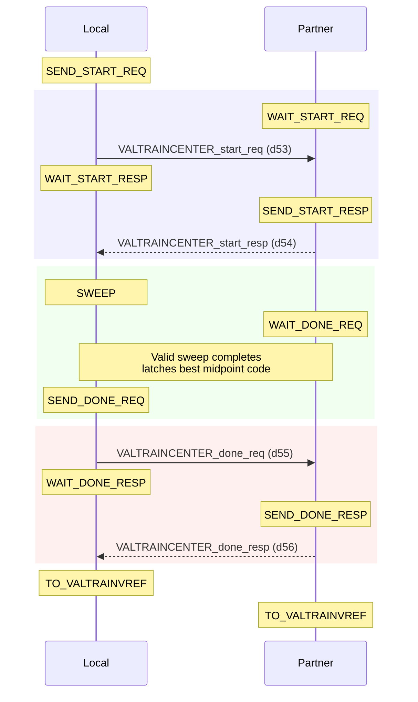
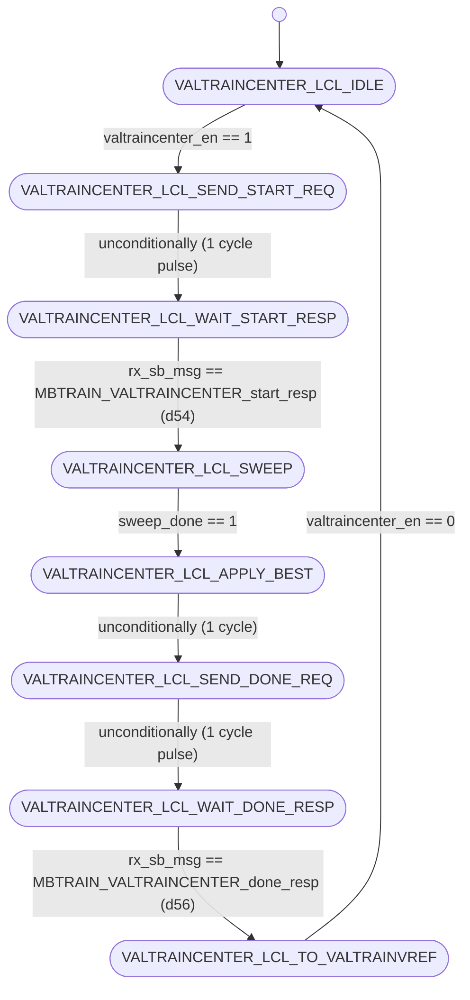
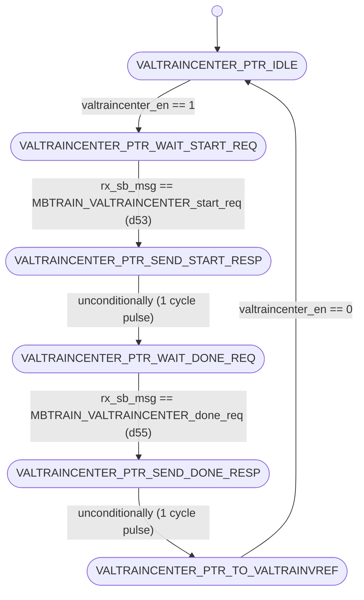

# UCIe PHY Layer: MBTRAIN.VALTRAINCENTER Substate Design

This document details the architecture, finite state machines, interface ports, and sideband communication sequences for the sixth Main Base Training substate: **`VALTRAINCENTER`** (Valid Lane Transmitter Center Phase Calibration).

---

## Section 1 — Substate Overview

### Why does this substate exist?
Once receiver clock calibration is complete in `RXCLKCAL`, the interface must establish reliable communication on the active control lane: the Valid (VAL) lane. The **`VALTRAINCENTER`** substate is responsible for training the transmitter phase interpolator (PI) delay settings for the Valid transmitter to center the transmitted data transitions relative to the receiver's sampling clock.

By performing a phase sweep from code 0 to 16, the receiver measures the eye margins, finds the midpoint, and configures the physical transmitter with the optimal phase control code (`phy_tx_val_pi_phase_ctrl`).

### Objectives
1. **Valid Phase Margining**: Sweep the transmitter PI phase control code for the Valid lane receiver buffer.
2. **Phase Centering**: Compute the optimal centered phase delay setting based on measured eye margins and store the calibrated value.
3. **Synchronized Execution**: Coordinate initiator and responder dies to drive valid calibration patterns (`VALTRAIN` patterns) and exchange status updates.

### Entry and Exit Conditions
* **Entry Condition**: Asserted `valtraincenter_en` from the top-level sequencer (`unit_MBTRAIN_ctrl.sv`) after `RXCLKCAL` completes.
* **Exit Condition**: Complete status flag `valtraincenter_done` asserted back to the sequencer, indicating both Local and Partner FSMs have completed sweeps and sideband handshakes.

---

## Section 2 — Sideband Communication Sequence

The step-by-step sideband handshake protocol crosses the die boundary using the following sequence:



---

## Section 3 — FSM Architecture Overview

The substate utilizes a **decoupled initiator/responder FSM architecture**:
* **Local FSM (Initiator)**: Initiates the start handshake, asserts `sweep_en = 1` to run sweeps, sweeps `phy_tx_val_pi_phase_ctrl` through codes 0-16, evaluates eye margins, registers the best midpoint setting, and sends done notifications.
* **Partner FSM (Responder)**: Waits for start handshakes, enables transmitter continuous patterns (`VALTRAIN` patterns) by asserting `partner_sweep_en = 1` while the partner die sweeps, and replies to the done requests.

### D2C Sweep Engine Integration
The Local FSM commands the shared sweep engine (`unit_D2C_sweep.sv`) during the `VALTRAINCENTER_LCL_SWEEP` state. During sweeps, the PI phase is driven combinationally from the engine's `swept_code`. Once `sweep_done` asserts, the optimal setting is latched and driven statically.

---

## Section 4 — FSM Diagram

### Local FSM Diagram (Initiator)
The state transitions of `unit_VALTRAINCENTER_local.sv` are documented below:



---

### Partner FSM Diagram (Responder)
The state transitions of `unit_VALTRAINCENTER_partner.sv` are documented below:



---

## Section 5 — Local FSM State Table

| State ID (logic [2:0]) | State Name | Purpose / Active Actions | Transition Condition |
| :---: | :--- | :--- | :--- |
| **`3'd0`** | `VALTRAINCENTER_LCL_IDLE` | Wait state. Resets best code registers and output signals. | Transitions to `VALTRAINCENTER_LCL_SEND_START_REQ` when `valtraincenter_en` is asserted. |
| **`3'd1`** | `VALTRAINCENTER_LCL_SEND_START_REQ` | Drives `tx_sb_msg_valid = 1` with opcode `MBTRAIN_VALTRAINCENTER_start_req` (d53) to partner. | Unconditionally advances to `VALTRAINCENTER_LCL_WAIT_START_RESP` on the next clock. |
| **`3'd2`** | `VALTRAINCENTER_LCL_WAIT_START_RESP`| Polls receiver sideband FIFO for start response from partner. | Advances to `VALTRAINCENTER_LCL_SWEEP` when `rx_sb_msg_valid && rx_sb_msg == MBTRAIN_VALTRAINCENTER_start_resp` (d54). |
| **`3'd3`** | `VALTRAINCENTER_LCL_SWEEP` | Asserts `local_sweep_en` to trigger the sweep engine and evaluate eye margins. | Advances to `VALTRAINCENTER_LCL_APPLY_BEST` once `sweep_done` is high. |
| **`3'd4`** | `VALTRAINCENTER_LCL_APPLY_BEST` | 1-cycle pipeline delay state allowing registered optimal values to stabilize. | Unconditionally advances to `VALTRAINCENTER_LCL_SEND_DONE_REQ` on the next clock. |
| **`3'd5`** | `VALTRAINCENTER_LCL_SEND_DONE_REQ` | Drives `tx_sb_msg_valid = 1` with opcode `MBTRAIN_VALTRAINCENTER_done_req` (d55) to partner. | Unconditionally advances to `VALTRAINCENTER_LCL_WAIT_DONE_RESP` on the next clock. |
| **`3'd6`** | `VALTRAINCENTER_LCL_WAIT_DONE_RESP`| Polls receiver sideband FIFO for done response from partner. | Advances to `VALTRAINCENTER_LCL_TO_VALTRAINVREF` when `rx_sb_msg_valid && rx_sb_msg == MBTRAIN_VALTRAINCENTER_done_resp` (d56). |
| **`3'd7`** | `VALTRAINCENTER_LCL_TO_VALTRAINVREF`| Normal terminal state. Asserts completion flag `valtraincenter_done`. | Holds state and `valtraincenter_done` until `valtraincenter_en` is deasserted. |

---

## Section 6 — Partner FSM State Table

| State ID (logic [2:0]) | State Name | Purpose / Active Actions | Transition Condition |
| :---: | :--- | :--- | :--- |
| **`3'd0`** | `VALTRAINCENTER_PTR_IDLE` | Wait state. Clears partner sweep enable. | Transitions to `VALTRAINCENTER_PTR_WAIT_START_REQ` when `valtraincenter_en` is asserted. |
| **`3'd1`** | `VALTRAINCENTER_PTR_WAIT_START_REQ`| Polls receiver sideband FIFO for start request from initiator. | Advances to `VALTRAINCENTER_PTR_SEND_START_RESP` when `rx_sb_msg_valid && rx_sb_msg == MBTRAIN_VALTRAINCENTER_start_req` (d53). |
| **`3'd2`** | `VALTRAINCENTER_PTR_SEND_START_RESP`| Drives `tx_sb_msg_valid = 1` with opcode `MBTRAIN_VALTRAINCENTER_start_resp` (d54). | Unconditionally advances to `VALTRAINCENTER_PTR_WAIT_DONE_REQ` on the next clock. |
| **`3'd3`** | `VALTRAINCENTER_PTR_WAIT_DONE_REQ` | Asserts `partner_sweep_en = 1` to drive active pattern. | Advances to `VALTRAINCENTER_PTR_SEND_DONE_RESP` when `rx_sb_msg_valid && rx_sb_msg == MBTRAIN_VALTRAINCENTER_done_req` (d55). |
| **`3'd4`** | `VALTRAINCENTER_PTR_SEND_DONE_RESP`| Drives `tx_sb_msg_valid = 1` with opcode `MBTRAIN_VALTRAINCENTER_done_resp` (d56). | Unconditionally advances to `VALTRAINCENTER_PTR_TO_VALTRAINVREF` on the next clock. |
| **`3'd5`** | `VALTRAINCENTER_PTR_TO_VALTRAINVREF`| Normal terminal state. Asserts completion flag `valtraincenter_done`. | Holds state and `valtraincenter_done` until `valtraincenter_en` is deasserted. |

---

## Section 7 — Local FSM Execution Flow

The Local FSM transitions through the following stages:
1. **Idle State (`VALTRAINCENTER_LCL_IDLE`)**: Upon receiving the enable pulse `valtraincenter_en = 1`, the Local FSM transitions to `VALTRAINCENTER_LCL_SEND_START_REQ`.
2. **Start Handshake (`VALTRAINCENTER_LCL_SEND_START_REQ` $\rightarrow$ `VALTRAINCENTER_LCL_WAIT_START_RESP`)**: Drives `tx_sb_msg_valid = 1` with opcode `MBTRAIN_VALTRAINCENTER_start_req` (d53) to partner, then waits in `VALTRAINCENTER_LCL_WAIT_START_RESP` for `MBTRAIN_VALTRAINCENTER_start_resp` (d54) to arrive.
3. **Margining Sweep (`VALTRAINCENTER_LCL_SWEEP`)**: After receiving the start response, the Local FSM asserts `local_sweep_en = 1`. During the sweep, the phase control output `phy_tx_val_pi_phase_ctrl` is driven combinationally from the engine's `swept_code`. The local receiver samples the incoming valid pattern and evaluates eye limits.
4. **Midpoint Capture (`VALTRAINCENTER_LCL_APPLY_BEST` $\rightarrow$ `VALTRAINCENTER_LCL_SEND_DONE_REQ` $\rightarrow$ `VALTRAINCENTER_LCL_WAIT_DONE_RESP`)**: Once `sweep_done` is high, the Local FSM captures the best phase midpoint setting into `best_code_r`. It transitions to `VALTRAINCENTER_LCL_APPLY_BEST` for 1 clock cycle to ensure output stability, then transmits `MBTRAIN_VALTRAINCENTER_done_req` (d55). It waits in `VALTRAINCENTER_LCL_WAIT_DONE_RESP` for `MBTRAIN_VALTRAINCENTER_done_resp` (d56).
5. **Completion State (`VALTRAINCENTER_LCL_TO_VALTRAINVREF`)**: Upon receiving the done response, the Local FSM enters `VALTRAINCENTER_LCL_TO_VALTRAINVREF` and asserts completion `valtraincenter_done = 1`.

---

## Section 8 — Partner FSM Execution Flow

The Partner FSM operates in tandem with the Local FSM to configure its transmitter patterns:
1. **Idle State (`VALTRAINCENTER_PTR_IDLE` $\rightarrow$ `VALTRAINCENTER_PTR_WAIT_START_REQ`)**: Activates when `valtraincenter_en = 1` is observed, transitioning to `VALTRAINCENTER_PTR_WAIT_START_REQ`.
2. **Start Handshake (`VALTRAINCENTER_PTR_WAIT_START_REQ` $\rightarrow$ `VALTRAINCENTER_PTR_SEND_START_RESP` $\rightarrow$ `VALTRAINCENTER_PTR_WAIT_DONE_REQ`)**: Awaits `MBTRAIN_VALTRAINCENTER_start_req` (d53). Once it arrives, the Partner FSM drives `MBTRAIN_VALTRAINCENTER_start_resp` (d54) and transitions to `VALTRAINCENTER_PTR_WAIT_DONE_REQ`.
3. **Continuous Pattern Generation (`VALTRAINCENTER_PTR_WAIT_DONE_REQ`)**: The Partner FSM asserts `partner_sweep_en = 1`, which overrides the valid line multiplexer to drive continuous `VALTRAIN` patterns while the initiator sweeps its receiver phase delay.
4. **End Handshake (`VALTRAINCENTER_PTR_WAIT_DONE_REQ` $\rightarrow$ `VALTRAINCENTER_PTR_SEND_DONE_RESP` $\rightarrow$ `VALTRAINCENTER_PTR_TO_VALTRAINVREF`)**: Remains in this state until `MBTRAIN_VALTRAINCENTER_done_req` (d55) is received. Upon receipt, it deasserts `partner_sweep_en`, transmits `MBTRAIN_VALTRAINCENTER_done_resp` (d56), and moves to `VALTRAINCENTER_PTR_TO_VALTRAINVREF`, asserting `valtraincenter_done = 1`.

---

## Section 9 — Wrapper Architecture

The substate wrapper (**`wrapper_VALTRAINCENTER.sv`**) integrates the Local and Partner FSM modules:

### Instantiated Modules
1. **`u_local`**: Initiator FSM executing the phase sweep, evaluating eyes, and capturing the best Valid PI phase settings.
2. **`u_partner`**: Responder FSM managing the partner handshakes and driving continuous test patterns.

### Handshake Completion Logic
The wrapper performs a logical AND of the completion flags from both modules:
```systemverilog
assign valtraincenter_done = local_valtraincenter_done_wire & partner_valtraincenter_done_wire;
```

### Sideband TX Arbitration
The wrapper arbitrates the sideband TX signals, prioritizing the Local FSM:
```systemverilog
assign tx_sb_msg_valid = local_tx_sb_msg_valid | partner_tx_sb_msg_valid;
assign tx_sb_msg       = local_tx_sb_msg_valid ? local_tx_sb_msg       : partner_tx_sb_msg;
assign tx_msginfo      = local_tx_sb_msg_valid ? local_tx_msginfo      : partner_tx_msginfo;
assign tx_data_field   = local_tx_sb_msg_valid ? local_tx_data_field   : partner_tx_data_field;
```

### Static Mainband Lane Configurations
Per UCIe specification §4.5.3.4.3, during `VALTRAINCENTER`, the clock transmitter is active based on speed parameters, the Valid transmitter is enabled to drive patterns, and data/track lines are locked to low:
```systemverilog
// CLK TX: active (01) unless <=32GT/s strobe mode is active (00)
assign mb_tx_clk_lane_sel  = (mb_tx_continuous_or_strobe_clk && phy_negotiated_speed <= 3'b101)
                              ? 2'b00 : 2'b01;
assign mb_tx_data_lane_sel = 2'b00;  // Electrical Idle / Low
assign mb_tx_val_lane_sel  = 2'b01;  // Active valid pattern (VALTRAIN)
assign mb_tx_trk_lane_sel  = 2'b00;  // Electrical Idle / Low
assign mb_rx_clk_lane_sel  = 1'b1 ;  // Enabled
assign mb_rx_data_lane_sel = 1'b1 ;  // Enabled
assign mb_rx_val_lane_sel  = 1'b1 ;  // Enabled
assign mb_rx_trk_lane_sel  = 1'b0 ;  // Disabled
```

---

## Section 10 — Wrapper Interface Table

The table below lists all interface ports on the substate wrapper `wrapper_VALTRAINCENTER.sv`:

| Port Signal Name | Direction | Bit Width | Functional Description / Encodings |
| :--- | :---: | :---: | :--- |
| `lclk` | Input | 1 | LTSM clock domain input (1 GHz or 2 GHz). |
| `rst_n` | Input | 1 | Asynchronous active-low global reset. |
| `soft_rst_n` | Input | 1 | Synchronous active-low soft reset (clears registers). |
| `valtraincenter_en` | Input | 1 | Sub-state enable signal from top controller (1 = Active, 0 = Disabled). |
| `valtraincenter_done` | Output | 1 | Sub-state complete handshake output to top controller (1 = Complete, 0 = In progress). |
| `phy_tx_val_pi_phase_ctrl` | Output | 5 | Calibrated transmitter phase interpolator (PI) control code driven to the physical Valid driver. <br>Values: 5-bit code value (`0` to `16`). |
| `partner_sweep_en` | Output | 1 | Command to partner die to keep the valid pattern active (1 = Active, 0 = Disabled). |
| `local_sweep_en` | Output | 1 | Command driven to the shared sweep engine to execute a Local sweep (1 = Sweep active, 0 = Idle). |
| `swept_code` | Input | 5 | Current reference voltage sweeping code driven by the sweep engine. <br>Values: 5-bit code value (`0` to `16`). |
| `best_code` | Input | 5 | Final optimized phase midpoint code received from the sweep engine. <br>Values: 5-bit code value (`0` to `16`). |
| `sweep_done` | Input | 1 | Complete status input from the shared sweep engine (1 = Completed, 0 = Sweeping). |
| `mb_tx_continuous_or_strobe_clk`| Input | 1 | Continuous clock config (1 = Continuous clock, 0 = Strobe clock). |
| `phy_negotiated_speed` | Input | 3 | Negotiated link speed step. <br>Values: `3'b000` (4 GT/s), `3'b001` (8 GT/s), `3'b010` (12 GT/s), `3'b011` (16 GT/s), `3'b100` (24 GT/s), `3'b101` (32 GT/s), `3'b110` (48 GT/s), `3'b111` (64 GT/s). |
| `mb_tx_clk_lane_sel` | Output | 2 | Mainband Clock Transmitter multiplexer selector. <br>Values: `2'b00` = Low (0), `2'b01` = Active clock, `2'b10` = Hi-Z (Tri-state). |
| `mb_tx_data_lane_sel`| Output | 2 | Mainband Data Transmitter multiplexer selector. <br>Values: same encoding as `mb_tx_clk_lane_sel`. |
| `mb_tx_val_lane_sel` | Output | 2 | Mainband Valid Transmitter multiplexer selector. <br>Values: same encoding as `mb_tx_clk_lane_sel`. |
| `mb_tx_trk_lane_sel` | Output | 2 | Mainband Track Transmitter multiplexer selector. <br>Values: same encoding as `mb_tx_clk_lane_sel`. |
| `mb_rx_clk_lane_sel` | Output | 1 | Mainband Clock Receiver enable. <br>Values: `1'b1` = Receiver enabled, `1'b0` = Disabled. |
| `mb_rx_data_lane_sel`| Output | 1 | Mainband Data Receiver enable. <br>Values: same encoding as `mb_rx_clk_lane_sel`. |
| `mb_rx_val_lane_sel` | Output | 1 | Mainband Valid Receiver enable. <br>Values: same encoding as `mb_rx_clk_lane_sel`. |
| `mb_rx_trk_lane_sel` | Output | 1 | Mainband Track Receiver enable. <br>Values: same encoding as `mb_rx_clk_lane_sel`. |
| `tx_sb_msg_valid` | Output | 1 | Strobe line driven to Async SB FIFO to launch a sideband message (1 = Strobe valid, 0 = Idle). |
| `tx_sb_msg` | Output | 8 | Opcode of the sideband message to transmit. <br>Values: `d53` = `MBTRAIN_VALTRAINCENTER_start_req`, `d55` = `MBTRAIN_VALTRAINCENTER_done_req` (if Local); `d54` = `MBTRAIN_VALTRAINCENTER_start_resp`, `d56` = `MBTRAIN_VALTRAINCENTER_done_resp` (if Partner). |
| `tx_msginfo` | Output | 16 | Message info payload field sent on sideband (fixed at `16'h0000`). |
| `tx_data_field` | Output | 64 | 64-bit payload data field sent on sideband (fixed at `64'h0000000000000000`). |
| `rx_sb_msg_valid` | Input | 1 | Incoming message valid pulse from SB RX FIFO (1 = Valid message, 0 = Idle). |
| `rx_sb_msg` | Input | 8 | Opcode of the incoming sideband message. <br>Values: same encoding as `tx_sb_msg`. |

---

## Section 11 — Internal Signal Summary

| Internal Signal Name | Direction | Bit Width | Functional Description |
| :--- | :---: | :---: | :--- |
| `local_valtraincenter_done_wire` | Internal | 1 | Complete flag from main Local FSM. |
| `partner_valtraincenter_done_wire`| Internal | 1 | Complete flag from main Partner FSM. |
| `local_tx_sb_msg_valid` | Internal | 1 | SB TX valid strobe driven by `u_local`. |
| `local_tx_sb_msg` | Internal | 8 | Opcode driven by `u_local` (d53 or d55). |
| `partner_tx_sb_msg_valid`| Internal | 1 | SB TX valid strobe driven by `u_partner`. |
| `partner_tx_sb_msg` | Internal | 8 | Opcode driven by `u_partner` (d54 or d56). |

---

## Section 12 — D2C_PT Interaction

The `VALTRAINCENTER` substate sweeps Valid transmitter phase delays using the **`TX_D2C_PT`** (Transmitter-Initiated Point Test) architecture:
* **Sweep Parameter**: Transmitter Phase Interpolator (PI) delay settings for the Valid driver.
* **Initiator**: Local die FSM (asserts `local_sweep_en` to control the sweep engine).
* **Receiver**: Partner die Valid receiver.
* **Test Direction**: The Local die sweeps the Valid transmitter PI phase code combinationally via `phy_tx_val_pi_phase_ctrl` while the Partner die receiver evaluates pattern transitions. Feedback is communicated over the sideband.
* **Aggregated Results**: At the end of the sweep, the optimal centering phase code is registered in `best_code_r` and statically driven.

---

## Section 13 — Summary

The **`VALTRAINCENTER`** substate design provides a robust, decoupled, and spec-compliant method for valid lane phase calibration. By sweeping the transmitter phase interpolator codes and evaluating eye limits at the receiver, it establishes a centered sampling window for valid control signals. The wrapper coordinates sideband message arbitration and multiplexes control lines, providing a single-port handshake block to the top-level sequencer.
