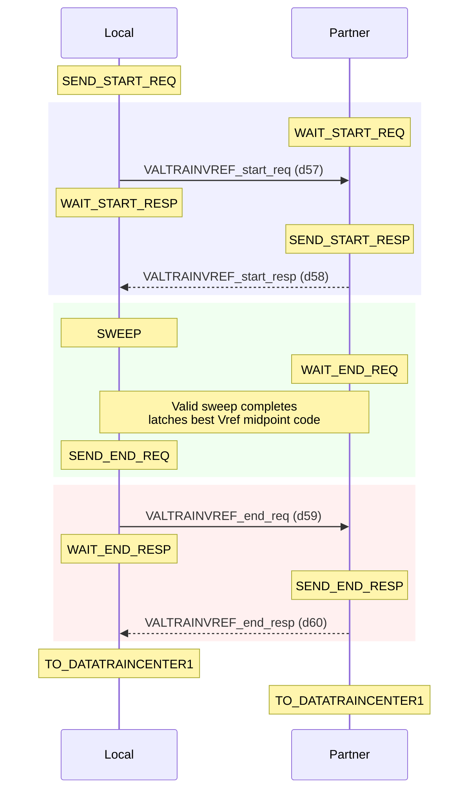
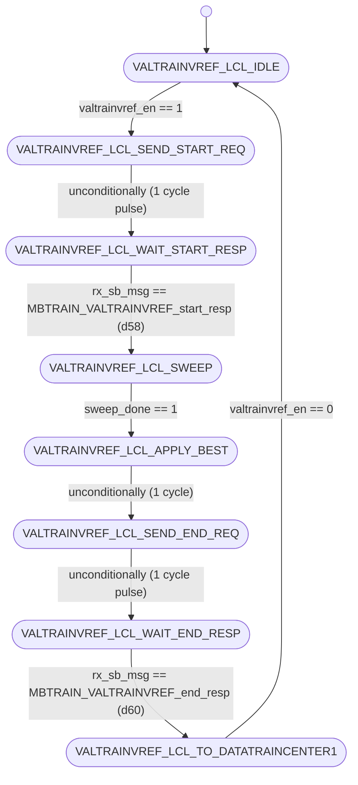
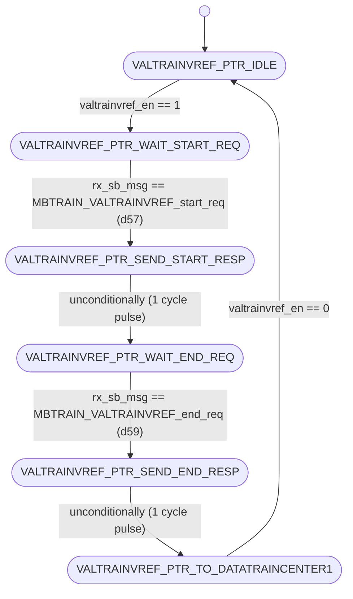

# UCIe PHY Layer: MBTRAIN.VALTRAINVREF Substate Design

This document details the architecture, finite state machines, interface ports, and sideband communication sequences for the seventh Main Base Training substate: **`VALTRAINVREF`** (Valid Lane Transmitter Vref Calibration).

---

## Section 1 — Substate Overview

### Why does this substate exist?
After training the optimal centering phase delay for the Valid transmitter in `VALTRAINCENTER`, the receiver must calibrate the optimal reference voltage ($V_{\text{ref}}$) for the Valid receiver buffer. The **`VALTRAINVREF`** substate sweeps receiver reference voltages from code 0 to 16, determines the eye margins for the Valid lane, computes the midpoint, and stores the calibrated Vref code (`phy_rx_valvref_ctrl`).

### Objectives
1. **Valid Vref Calibration**: Sweep the receiver reference voltage ($V_{\text{ref}}$) for the Valid lane at the negotiated target operational speed.
2. **Post-Centering Optimization**: Optimize the receiver Vref code while the transmitter phase delay is held steady at its center phase setting.
3. **Synchronized Sweep**: Coordinate the initiator and responder dies to drive patterns and record eye boundaries.

### Entry and Exit Conditions
* **Entry Condition**: Asserted `valtrainvref_en` from the top-level sequencer (`unit_MBTRAIN_ctrl.sv`) after `VALTRAINCENTER` completes.
* **Exit Condition**: Complete status flag `valtrainvref_done` asserted back to the sequencer, indicating both Local and Partner FSMs have completed sweeps and handshakes.

---

## Section 2 — Sideband Communication Sequence

The step-by-step sideband handshake protocol crosses the die boundary using the following sequence:



---

## Section 3 — FSM Architecture Overview

The substate utilizes a **decoupled initiator/responder FSM architecture**:
* **Local FSM (Initiator)**: Runs on the receiver die. It initiates the start handshake, asserts `sweep_en = 1` to control the sweep engine (`unit_D2C_sweep.sv`), sweeps `phy_rx_valvref_ctrl` through codes 0-16, evaluates eye margins, registers the best Vref midpoint setting, and sends end requests.
* **Partner FSM (Responder)**: Runs on the transmitter die. It responds to sideband handshakes, drives `partner_sweep_en = 1` to drive calibration patterns (`VALTRAIN` patterns) over the Valid lane, and responds to end requests.

### D2C Sweep Engine Integration
The Local FSM controls the shared sweep engine during the `VALTRAINVREF_LCL_SWEEP` state. During sweeps, the Vref control is driven combinationally from the engine's `swept_code`. Once `sweep_done` asserts, the optimal setting is latched and driven statically.

---

## Section 4 — FSM Diagram

### Local FSM Diagram (Initiator)
The state transitions of `unit_VALTRAINVREF_local.sv` are documented below:



---

### Partner FSM Diagram (Responder)
The state transitions of `unit_VALTRAINVREF_partner.sv` are documented below:



---

## Section 5 — Local FSM State Table

| State ID (logic [2:0]) | State Name | Purpose / Active Actions | Transition Condition |
| :---: | :--- | :--- | :--- |
| **`3'd0`** | `VALTRAINVREF_LCL_IDLE` | Wait state. Resets best code registers and output signals. | Transitions to `VALTRAINVREF_LCL_SEND_START_REQ` when `valtrainvref_en` is asserted. |
| **`3'd1`** | `VALTRAINVREF_LCL_SEND_START_REQ` | Drives `tx_sb_msg_valid = 1` with opcode `MBTRAIN_VALTRAINVREF_start_req` (d57) to partner. | Unconditionally advances to `VALTRAINVREF_LCL_WAIT_START_RESP` on the next clock. |
| **`3'd2`** | `VALTRAINVREF_LCL_WAIT_START_RESP`| Polls receiver sideband FIFO for start response from partner. | Advances to `VALTRAINVREF_LCL_SWEEP` when `rx_sb_msg_valid && rx_sb_msg == MBTRAIN_VALTRAINVREF_start_resp` (d58). |
| **`3'd3`** | `VALTRAINVREF_LCL_SWEEP` | Asserts `local_sweep_en` to trigger the sweep engine and evaluate eye margins. | Advances to `VALTRAINVREF_LCL_APPLY_BEST` once `sweep_done` is high. |
| **`3'd4`** | `VALTRAINVREF_LCL_APPLY_BEST` | 1-cycle pipeline delay state allowing registered optimal values to stabilize. | Unconditionally advances to `VALTRAINVREF_LCL_SEND_END_REQ` on the next clock. |
| **`3'd5`** | `VALTRAINVREF_LCL_SEND_END_REQ` | Drives `tx_sb_msg_valid = 1` with opcode `MBTRAIN_VALTRAINVREF_end_req` (d59) to partner. | Unconditionally advances to `VALTRAINVREF_LCL_WAIT_END_RESP` on the next clock. |
| **`3'd6`** | `VALTRAINVREF_LCL_WAIT_END_RESP` | Polls receiver sideband FIFO for end response from partner. | Advances to `VALTRAINVREF_LCL_TO_DATATRAINCENTER1` when `rx_sb_msg_valid && rx_sb_msg == MBTRAIN_VALTRAINVREF_end_resp` (d60). |
| **`3'd7`** | `VALTRAINVREF_LCL_TO_DATATRAINCENTER1`| Normal terminal state. Asserts completion flag `valtrainvref_done`. | Holds state and `valtrainvref_done` until `valtrainvref_en` is deasserted. |

---

## Section 6 — Partner FSM State Table

| State ID (logic [2:0]) | State Name | Purpose / Active Actions | Transition Condition |
| :---: | :--- | :--- | :--- |
| **`3'd0`** | `VALTRAINVREF_PTR_IDLE` | Wait state. Clears partner sweep enable. | Transitions to `VALTRAINVREF_PTR_WAIT_START_REQ` when `valtrainvref_en` is asserted. |
| **`3'd1`** | `VALTRAINVREF_PTR_WAIT_START_REQ`| Polls receiver sideband FIFO for start request from initiator. | Advances to `VALTRAINVREF_PTR_SEND_START_RESP` when `rx_sb_msg_valid && rx_sb_msg == MBTRAIN_VALTRAINVREF_start_req` (d57). |
| **`3'd2`** | `VALTRAINVREF_PTR_SEND_START_RESP`| Drives `tx_sb_msg_valid = 1` with opcode `MBTRAIN_VALTRAINVREF_start_resp` (d58). | Unconditionally advances to `VALTRAINVREF_PTR_WAIT_END_REQ` on the next clock. |
| **`3'd3`** | `VALTRAINVREF_PTR_WAIT_END_REQ` | Asserts `partner_sweep_en = 1` to drive active pattern. | Advances to `VALTRAINVREF_PTR_SEND_END_RESP` when `rx_sb_msg_valid && rx_sb_msg == MBTRAIN_VALTRAINVREF_end_req` (d59). |
| **`3'd4`** | `VALTRAINVREF_PTR_SEND_END_RESP` | Drives `tx_sb_msg_valid = 1` with opcode `MBTRAIN_VALTRAINVREF_end_resp` (d60). | Unconditionally advances to `VALTRAINVREF_PTR_TO_DATATRAINCENTER1` on the next clock. |
| **`3'd5`** | `VALTRAINVREF_PTR_TO_DATATRAINCENTER1`| Normal terminal state. Asserts completion flag `valtrainvref_done`. | Holds state and `valtrainvref_done` until `valtrainvref_en` is deasserted. |

---

## Section 7 — Local FSM Execution Flow

The Local FSM transitions through the following stages:
1. **Idle State (`VALTRAINVREF_LCL_IDLE`)**: Upon receiving the enable pulse `valtrainvref_en = 1`, the Local FSM transitions to `VALTRAINVREF_LCL_SEND_START_REQ`.
2. **Start Handshake (`VALTRAINVREF_LCL_SEND_START_REQ` $\rightarrow$ `VALTRAINVREF_LCL_WAIT_START_RESP`)**: Drives `tx_sb_msg_valid = 1` with opcode `MBTRAIN_VALTRAINVREF_start_req` (d57) to partner, then waits in `VALTRAINVREF_LCL_WAIT_START_RESP` for `MBTRAIN_VALTRAINVREF_start_resp` (d58) to arrive.
3. **Margining Sweep (`VALTRAINVREF_LCL_SWEEP`)**: After receiving the start response, the Local FSM asserts `local_sweep_en = 1`. During the sweep, the Vref control output `phy_rx_valvref_ctrl` is driven combinationally from the engine's `swept_code`. The local receiver samples the incoming Valid pattern and evaluates Vref limits.
4. **Midpoint Capture (`VALTRAINVREF_LCL_APPLY_BEST` $\rightarrow$ `VALTRAINVREF_LCL_SEND_END_REQ` $\rightarrow$ `VALTRAINVREF_LCL_WAIT_END_RESP`)**: Once `sweep_done` is high, the Local FSM captures the best phase midpoint setting into `best_code_r`. It transitions to `VALTRAINVREF_LCL_APPLY_BEST` for 1 clock cycle to ensure output stability, then transmits `MBTRAIN_VALTRAINVREF_end_req` (d59). It waits in `VALTRAINVREF_LCL_WAIT_END_RESP` for `MBTRAIN_VALTRAINVREF_end_resp` (d60).
5. **Completion State (`VALTRAINVREF_LCL_TO_DATATRAINCENTER1`)**: Upon receiving the end response, the Local FSM enters `VALTRAINVREF_LCL_TO_DATATRAINCENTER1` and asserts completion `valtrainvref_done = 1`.

---

## Section 8 — Partner FSM Execution Flow

The Partner FSM operates in tandem with the Local FSM to configure its transmitter patterns:
1. **Idle State (`VALTRAINVREF_PTR_IDLE` $\rightarrow$ `VALTRAINVREF_PTR_WAIT_START_REQ`)**: Activates when `valtrainvref_en = 1` is observed, transitioning to `VALTRAINVREF_PTR_WAIT_START_REQ`.
2. **Start Handshake (`VALTRAINVREF_PTR_WAIT_START_REQ` $\rightarrow$ `VALTRAINVREF_PTR_SEND_START_RESP` $\rightarrow$ `VALTRAINVREF_PTR_WAIT_END_REQ`)**: Awaits `MBTRAIN_VALTRAINVREF_start_req` (d57). Once it arrives, the Partner FSM drives `MBTRAIN_VALTRAINVREF_start_resp` (d58) and transitions to `VALTRAINVREF_PTR_WAIT_END_REQ`.
3. **Continuous Pattern Generation (`VALTRAINVREF_PTR_WAIT_END_REQ`)**: The Partner FSM asserts `partner_sweep_en = 1`, which overrides the valid line multiplexer to drive continuous `VALTRAIN` patterns while the initiator sweeps its receiver Vref delay.
4. **End Handshake (`VALTRAINVREF_PTR_WAIT_END_REQ` $\rightarrow$ `VALTRAINVREF_PTR_SEND_END_RESP` $\rightarrow$ `VALTRAINVREF_PTR_TO_DATATRAINCENTER1`)**: Remains in this state until `MBTRAIN_VALTRAINVREF_end_req` (d59) is received. Upon receipt, it deasserts `partner_sweep_en`, transmits `MBTRAIN_VALTRAINVREF_end_resp` (d60), and moves to `VALTRAINVREF_PTR_TO_DATATRAINCENTER1`, asserting `valtrainvref_done = 1`.

---

## Section 9 — Wrapper Architecture

The substate wrapper (**`wrapper_VALTRAINVREF.sv`**) integrates the Local and Partner FSM modules:

### Instantiated Modules
1. **`u_local`**: Initiator FSM executing the Vref sweep, evaluating eyes, and capturing the best Valid Vref settings.
2. **`u_partner`**: Responder FSM managing the partner handshakes and driving continuous test patterns.

### Handshake Completion Logic
The wrapper performs a logical AND of the completion flags from both modules:
```systemverilog
assign valtrainvref_done = local_valtrainvref_done_wire & partner_valtrainvref_done_wire;
```

### Sideband TX Arbitration
The wrapper arbitrates the sideband TX signals, prioritizing the Local FSM:
```systemverilog
assign tx_sb_msg_valid = local_tx_sb_msg_valid | partner_tx_sb_msg_valid;
assign tx_sb_msg       = local_tx_sb_msg_valid ? local_tx_sb_msg       : partner_tx_sb_msg;
assign tx_msginfo      = local_tx_sb_msg_valid ? local_tx_msginfo      : partner_tx_msginfo;
assign tx_data_field   = local_tx_sb_msg_valid ? local_tx_data_field   : partner_tx_data_field;
```

### Static Mainband Lane Configurations
Per UCIe specification §4.5.3.4.6, during `VALTRAINVREF`, the clock transmitter is active, the Valid transmitter is enabled to drive patterns, and data/track lines are locked to low:
```systemverilog
assign mb_tx_clk_lane_sel  = 2'b01;  // Forwarded clock active
assign mb_tx_data_lane_sel = 2'b00;  // Electrical Idle / Low
assign mb_tx_val_lane_sel  = 2'b01;  // Active valid pattern (VALTRAIN)
assign mb_tx_trk_lane_sel  = 2'b00;  // Electrical Idle / Low
assign mb_rx_clk_lane_sel  = 1'b1 ;  // Enabled
assign mb_rx_data_lane_sel = 1'b0 ;  // Disabled
assign mb_rx_val_lane_sel  = 1'b1 ;  // Enabled
assign mb_rx_trk_lane_sel  = 1'b0 ;  // Disabled
```

---

## Section 10 — Wrapper Interface Table

The table below lists all interface ports on the substate wrapper `wrapper_VALTRAINVREF.sv`:

| Port Signal Name | Direction | Bit Width | Functional Description / Encodings |
| :--- | :---: | :---: | :--- |
| `lclk` | Input | 1 | LTSM clock domain input (1 GHz or 2 GHz). |
| `rst_n` | Input | 1 | Asynchronous active-low global reset. |
| `soft_rst_n` | Input | 1 | Synchronous active-low soft reset (clears registers). |
| `valtrainvref_en` | Input | 1 | Sub-state enable signal from top controller (1 = Active, 0 = Disabled). |
| `valtrainvref_done` | Output | 1 | Sub-state complete handshake output to top controller (1 = Complete, 0 = In progress). |
| `phy_rx_valvref_ctrl` | Output | 5 | Calibrated receiver reference voltage ($V_{\text{ref}}$) control code driven to the physical Valid driver. <br>Values: 5-bit code value (`0` to `16`). |
| `partner_sweep_en` | Output | 1 | Command to partner die to keep the valid pattern active (1 = Active, 0 = Disabled). |
| `local_sweep_en` | Output | 1 | Command driven to the shared sweep engine to execute a Local sweep (1 = Sweep active, 0 = Idle). |
| `swept_code` | Input | 5 | Current reference voltage sweeping code driven by the sweep engine. <br>Values: 5-bit code value (`0` to `16`). |
| `best_code` | Input | 5 | Final optimized Vref midpoint code received from the sweep engine. <br>Values: 5-bit code value (`0` to `16`). |
| `sweep_done` | Input | 1 | Complete status input from the shared sweep engine (1 = Completed, 0 = Sweeping). |
| `mb_tx_clk_lane_sel` | Output | 2 | Mainband Clock Transmitter multiplexer selector. <br>Values: `2'b00` = Low (0), `2'b01` = Active clock, `2'b10` = Hi-Z (Tri-state). |
| `mb_tx_data_lane_sel`| Output | 2 | Mainband Data Transmitter multiplexer selector. <br>Values: same encoding as `mb_tx_clk_lane_sel`. |
| `mb_tx_val_lane_sel` | Output | 2 | Mainband Valid Transmitter multiplexer selector. <br>Values: same encoding as `mb_tx_clk_lane_sel`. |
| `mb_tx_trk_lane_sel` | Output | 2 | Mainband Track Transmitter multiplexer selector. <br>Values: same encoding as `mb_tx_clk_lane_sel`. |
| `mb_rx_clk_lane_sel` | Output | 1 | Mainband Clock Receiver enable. <br>Values: `1'b1` = Receiver enabled, `1'b0` = Disabled. |
| `mb_rx_data_lane_sel`| Output | 1 | Mainband Data Receiver enable. <br>Values: same encoding as `mb_rx_clk_lane_sel`. |
| `mb_rx_val_lane_sel` | Output | 1 | Mainband Valid Receiver enable. <br>Values: same encoding as `mb_rx_clk_lane_sel`. |
| `mb_rx_trk_lane_sel` | Output | 1 | Mainband Track Receiver enable. <br>Values: same encoding as `mb_rx_clk_lane_sel`. |
| `tx_sb_msg_valid` | Output | 1 | Strobe line driven to Async SB FIFO to launch a sideband message (1 = Strobe valid, 0 = Idle). |
| `tx_sb_msg` | Output | 8 | Opcode of the sideband message to transmit. <br>Values: `d57` = `MBTRAIN_VALTRAINVREF_start_req`, `d59` = `MBTRAIN_VALTRAINVREF_end_req` (if Local); `d58` = `MBTRAIN_VALTRAINVREF_start_resp`, `d60` = `MBTRAIN_VALTRAINVREF_end_resp` (if Partner). |
| `tx_msginfo` | Output | 16 | Message info payload field sent on sideband (fixed at `16'h0000`). |
| `tx_data_field` | Output | 64 | 64-bit payload data field sent on sideband (fixed at `64'h0000000000000000`). |
| `rx_sb_msg_valid` | Input | 1 | Incoming message valid pulse from SB RX FIFO (1 = Valid message, 0 = Idle). |
| `rx_sb_msg` | Input | 8 | Opcode of the incoming sideband message. <br>Values: same encoding as `tx_sb_msg`. |

---

## Section 11 — Internal Signal Summary

| Internal Signal Name | Direction | Bit Width | Functional Description |
| :--- | :---: | :---: | :--- |
| `local_valtrainvref_done_wire` | Internal | 1 | Complete flag from main Local FSM. |
| `partner_valtrainvref_done_wire`| Internal | 1 | Complete flag from main Partner FSM. |
| `local_tx_sb_msg_valid` | Internal | 1 | SB TX valid strobe driven by `u_local`. |
| `local_tx_sb_msg` | Internal | 8 | Opcode driven by `u_local` (d57 or d59). |
| `partner_tx_sb_msg_valid`| Internal | 1 | SB TX valid strobe driven by `u_partner`. |
| `partner_tx_sb_msg` | Internal | 8 | Opcode driven by `u_partner` (d58 or d60). |

---

## Section 12 — D2C_PT Interaction

The `VALTRAINVREF` substate sweeps Valid receiver reference voltage settings using the **`RX_D2C_PT`** (Receiver-Initiated Point Test) architecture:
* **Sweep Parameter**: Receiver reference voltage ($V_{\text{ref}}$) for the Valid receiver buffer.
* **Initiator**: Local die FSM (asserts `local_sweep_en` to control the sweep engine).
* **Receiver**: Local die Valid receiver.
* **Test Direction**: The Partner die transmits static continuous patterns (`VALTRAIN` patterns) over the Valid lane while the Local die receiver sweeps its Vref voltage step-by-step, evaluating eye window margins.
* **Aggregated Results**: At the end of the sweep, the optimal Vref centering code is registered in `best_code_r` and statically driven to `phy_rx_valvref_ctrl`.

---

## Section 13 — Summary

The **`VALTRAINVREF`** substate design provides a robust, decoupled, and spec-compliant method for valid lane Vref calibration. By sweeping the receiver Vref values and evaluating eye limits, it establishes a centered sampling window for valid control signals. The wrapper coordinates sideband message arbitration and multiplexes control lines, providing a single-port handshake block to the top-level sequencer.
