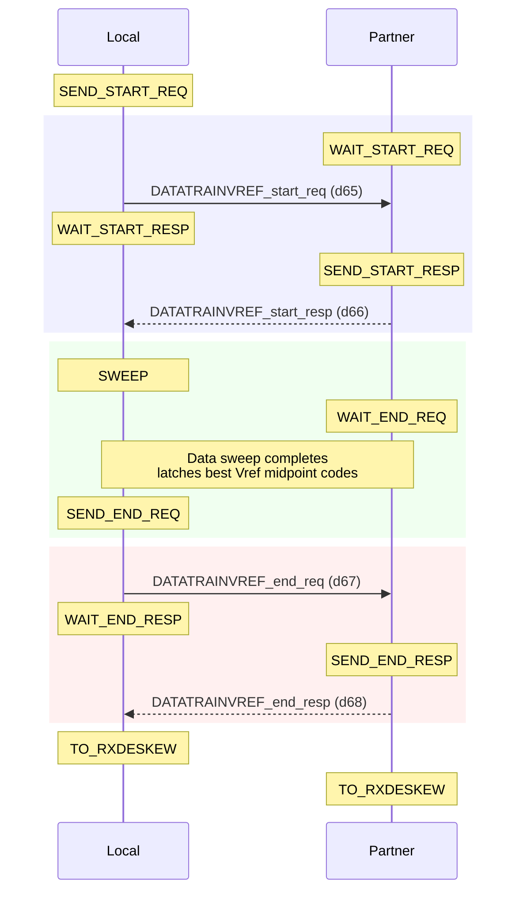
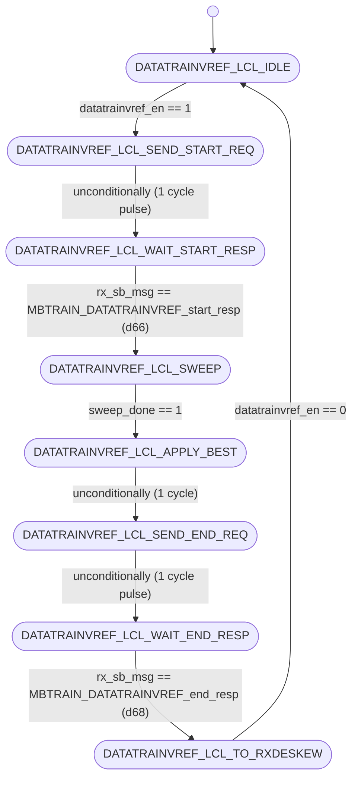
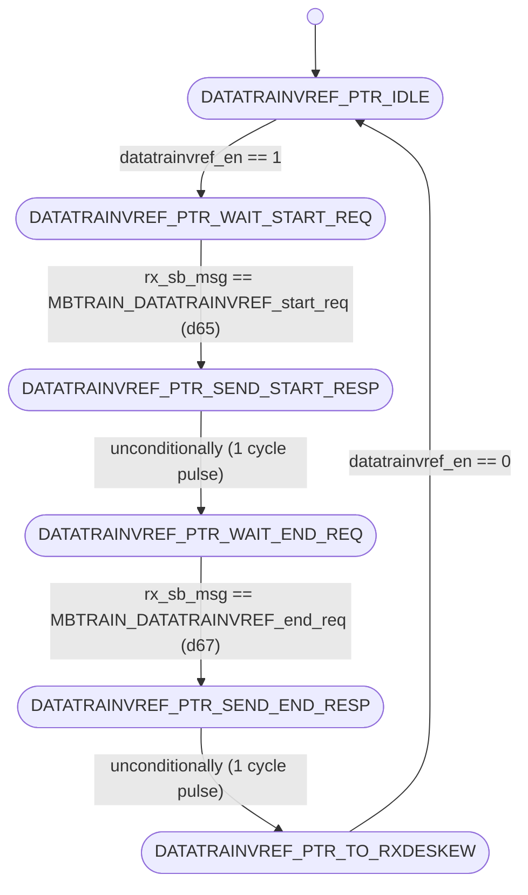

# UCIe PHY Layer: MBTRAIN.DATATRAINVREF Substate Design

This document details the architecture, finite state machines, interface ports, and sideband communication sequences for the ninth Main Base Training substate: **`DATATRAINVREF`** (Data Lane Receiver Vref Calibration).

---

## Section 1 — Substate Overview

### Why does this substate exist?
To establish a stable high-speed link on the 16 active data lanes, the receiver reference voltage ($V_{\text{ref}}$) for each data lane receiver buffer must be optimized at the target operational speed. The **`DATATRAINVREF`** substate is responsible for this task. 

Since physical routing and receiver differences vary from lane to lane, each of the 16 mainband data lanes must be calibrated independently at target speed. The receiver sweeps reference voltages from code 0 to 16, determines the operational eye margins (lower and upper fail limits) for each lane, computes the midpoint, and stores a unique calibrated Vref code for each lane (`phy_rx_datavref_ctrl`).

### Objectives
1. **Receiver Vref Calibration**: Sweep the receiver reference voltage ($V_{\text{ref}}$) for all 16 Data lanes at the negotiated target speed.
2. **Per-Lane Optimization**: Record the eye boundaries for each lane separately, compute the midpoint, and program each receiver buffer with its optimal Vref code.
3. **Synchronized Execution**: Coordinate initiator and responder dies to drive continuous patterns and evaluate margins.

### Entry and Exit Conditions
* **Entry Condition**: Asserted `datatrainvref_en` from the top-level sequencer (`unit_MBTRAIN_ctrl.sv`) after `DATATRAINCENTER1` completes.
* **Exit Condition**: Complete status flag `datatrainvref_done` asserted back to the sequencer, indicating both Local and Partner FSMs have completed handshakes.

---

## Section 2 — Sideband Communication Sequence

The step-by-step sideband handshake protocol crosses the die boundary using the following sequence:



---

## Section 3 — FSM Architecture Overview

The substate utilizes a **decoupled initiator/responder FSM architecture**:
* **Local FSM (Initiator)**: Runs on the receiver die. It asserts `local_sweep_en` to trigger the external sweep engine (`unit_D2C_sweep.sv`), runs Vref sweeps on all 16 data lanes simultaneously, gathers point test results, and captures the 16 best midpoint codes.
* **Partner FSM (Responder)**: Runs on the transmitter die. It responds to sideband handshakes and drives `partner_sweep_en` to keep the transmitters active, sending continuous calibration patterns on all mainband data lanes.

### Sideband Messaging Role
Handshakes across the die boundary are managed via the sideband FIFO. The Local FSM initiates by sending start and end request messages, and waits for the Partner FSM to return response acknowledgements before transitioning.

---

## Section 4 — FSM Diagram

### Local FSM Diagram (Initiator)
The state transitions of `unit_DATATRAINVREF_local.sv` are documented below:



---

### Partner FSM Diagram (Responder)
The state transitions of `unit_DATATRAINVREF_partner.sv` are documented below:



---

## Section 5 — Local FSM State Table

| State ID (logic [2:0]) | State Name | Purpose / Active Actions | Transition Condition |
| :---: | :--- | :--- | :--- |
| **`3'd0`** | `DATATRAINVREF_LCL_IDLE` | Wait state. Clears best code registers and output enables. | Transitions to `DATATRAINVREF_LCL_SEND_START_REQ` when `datatrainvref_en` is asserted. |
| **`3'd1`** | `DATATRAINVREF_LCL_SEND_START_REQ` | Asserts sideband TX message valid to request start of data lane calibration. | Unconditionally advances to `DATATRAINVREF_LCL_WAIT_START_RESP` on the next clock. |
| **`3'd2`** | `DATATRAINVREF_LCL_WAIT_START_RESP` | Polls receiver FIFO for start acknowledgement response from partner. | Advances to `DATATRAINVREF_LCL_SWEEP` when `rx_sb_msg_valid && rx_sb_msg == MBTRAIN_DATATRAINVREF_start_resp` (d66). |
| **`3'd3`** | `DATATRAINVREF_LCL_SWEEP` | Asserts `sweep_en` to control the external sweep engine and test Vref codes on all lanes. | Advances to `DATATRAINVREF_LCL_APPLY_BEST` when `sweep_done` is high. |
| **`3'd4`** | `DATATRAINVREF_LCL_APPLY_BEST` | 1-cycle pipeline delay state allowing registered optimal values to stabilize. | Unconditionally advances to `DATATRAINVREF_LCL_SEND_END_REQ` on the next clock. |
| **`3'd5`** | `DATATRAINVREF_LCL_SEND_END_REQ` | Asserts sideband TX message valid to notify partner that sweep is complete. | Unconditionally advances to `DATATRAINVREF_LCL_WAIT_END_RESP` on the next clock. |
| **`3'd6`** | `DATATRAINVREF_LCL_WAIT_END_RESP` | Polls receiver FIFO for end acknowledgement response from partner. | Advances to `DATATRAINVREF_LCL_TO_RXDESKEW` when `rx_sb_msg_valid && rx_sb_msg == MBTRAIN_DATATRAINVREF_end_resp` (d68). |
| **`3'd7`** | `DATATRAINVREF_LCL_TO_RXDESKEW` | Terminal state asserting completion flag `datatrainvref_done`. | Holds state and `datatrainvref_done` until `datatrainvref_en` deasserts (returns to `IDLE`). |

---

## Section 6 — Partner FSM State Table

| State ID (logic [2:0]) | State Name | Purpose / Active Actions | Transition Condition |
| :---: | :--- | :--- | :--- |
| **`3'd0`** | `DATATRAINVREF_PTR_IDLE` | Wait state. Clears sideband outputs and partner sweep enable. | Transitions to `DATATRAINVREF_PTR_WAIT_START_REQ` when `datatrainvref_en` is asserted. |
| **`3'd1`** | `DATATRAINVREF_PTR_WAIT_START_REQ` | Polls receiver FIFO for start request message from local initiator. | Advances to `DATATRAINVREF_PTR_SEND_START_RESP` when `rx_sb_msg_valid && rx_sb_msg == MBTRAIN_DATATRAINVREF_start_req` (d65). |
| **`3'd2`** | `DATATRAINVREF_PTR_SEND_START_RESP` | Asserts sideband TX message valid to acknowledge start request. | Unconditionally advances to `DATATRAINVREF_PTR_WAIT_END_REQ` on the next clock. |
| **`3'd3`** | `DATATRAINVREF_PTR_WAIT_END_REQ` | Drives `partner_sweep_en` high to sustain pattern transmission. | Advances to `DATATRAINVREF_PTR_SEND_END_RESP` when `rx_sb_msg_valid && rx_sb_msg == MBTRAIN_DATATRAINVREF_end_req` (d67). |
| **`3'd4`** | `DATATRAINVREF_PTR_SEND_END_RESP` | Asserts sideband TX message valid to acknowledge end request. | Unconditionally advances to `DATATRAINVREF_PTR_TO_RXDESKEW` on the next clock. |
| **`3'd5`** | `DATATRAINVREF_PTR_TO_RXDESKEW` | Terminal state asserting completion flag `datatrainvref_done`. | Holds state and `datatrainvref_done` until `datatrainvref_en` deasserts (returns to `IDLE`). |

---

## Section 7 — Local FSM Execution Flow

The Local FSM transitions through the following stages:
1. **Idle State (`DATATRAINVREF_LCL_IDLE`)**: Upon receiving the enable pulse `datatrainvref_en = 1`, the Local FSM transitions to `DATATRAINVREF_LCL_SEND_START_REQ`.
2. **Start Notification (`DATATRAINVREF_LCL_SEND_START_REQ` $\rightarrow$ `DATATRAINVREF_LCL_WAIT_START_RESP`)**: The Local FSM drives `tx_sb_msg_valid = 1` for exactly 1 cycle with opcode `MBTRAIN_DATATRAINVREF_start_req` (d65) to request that the partner responder drive the calibration pattern. The FSM then advances to `DATATRAINVREF_LCL_WAIT_START_RESP` and waits for `MBTRAIN_DATATRAINVREF_start_resp` (d66).
3. **Margining Sweep (`DATATRAINVREF_LCL_SWEEP`)**: After receiving the start response, the Local FSM enters `DATATRAINVREF_LCL_SWEEP` and asserts `sweep_en = 1`. The external sweep engine steps `swept_code` through the reference voltages, driving all 16 data lane receivers combinationally via `phy_rx_datavref_ctrl`. The Local receivers sample the incoming patterns and feed point test results back to the sweep engine.
4. **Capture & End Handshake (`DATATRAINVREF_LCL_APPLY_BEST` $\rightarrow$ `DATATRAINVREF_LCL_SEND_END_REQ` $\rightarrow$ `DATATRAINVREF_LCL_WAIT_END_RESP`)**: When the sweep engine asserts `sweep_done`, the Local FSM captures the 16 unique best codes into the `best_code_r` register file. It spends 1 cycle in `DATATRAINVREF_LCL_APPLY_BEST` for output stability, then transmits `MBTRAIN_DATATRAINVREF_end_req` (d67) to notify the partner that sweeping has finished. It waits for the partner's end response `MBTRAIN_DATATRAINVREF_end_resp` (d68).
5. **Completion State (`DATATRAINVREF_LCL_TO_RXDESKEW`)**: Upon receiving end acknowledgement, the Local FSM transitions to its terminal state and asserts `datatrainvref_done = 1` back to the top-level sequencer.

---

## Section 8 — Partner FSM Execution Flow

The Partner FSM mirrors the Local FSM to sustain the transmitter patterns:
1. **Idle State (`DATATRAINVREF_PTR_IDLE`)**: Upon observing `datatrainvref_en = 1`, the Partner FSM transitions to `DATATRAINVREF_PTR_WAIT_START_REQ` to wait for sideband commands.
2. **Start Handshake (`DATATRAINVREF_PTR_WAIT_START_REQ` $\rightarrow$ `DATATRAINVREF_PTR_SEND_START_RESP` $\rightarrow$ `DATATRAINVREF_PTR_WAIT_END_REQ`)**: The FSM polls `rx_sb_msg` for `MBTRAIN_DATATRAINVREF_start_req` (d65). Once it arrives, the Partner FSM transmits `MBTRAIN_DATATRAINVREF_start_resp` (d66) to notify the initiator that the transmitter patterns are ready, then transitions to `DATATRAINVREF_PTR_WAIT_END_REQ`.
3. **Pattern Transmission (`DATATRAINVREF_PTR_WAIT_END_REQ`)**: The Partner FSM asserts `partner_sweep_en = 1`. This overrides the physical mainband lane selectors, causing the partner's transmitters to drive a center-phase clock on the Clock lane, and continuous calibration patterns on all mainband Data transmitter lanes.
4. **End Handshake (`DATATRAINVREF_PTR_WAIT_END_REQ` $\rightarrow$ `DATATRAINVREF_PTR_SEND_END_RESP` $\rightarrow$ `DATATRAINVREF_PTR_TO_RXDESKEW`)**: The Partner FSM remains in this state until the Local FSM finishes sweeping and transmits `MBTRAIN_DATATRAINVREF_end_req` (d67). Upon receipt, the Partner deasserts `partner_sweep_en`, transmits `MBTRAIN_DATATRAINVREF_end_resp` (d68) back, and moves to the terminal state `DATATRAINVREF_PTR_TO_RXDESKEW` (asserting `datatrainvref_done = 1`).

---

## Section 9 — Wrapper Architecture

The substate wrapper (**`wrapper_DATATRAINVREF.sv`**) integrates the Local and Partner modules:

### Instantiated Modules
1. **`u_local`**: Initiator FSM executing sweeps, evaluating eyes, and capturing Vref control codes per lane at operational speed.
2. **`u_partner`**: Responder FSM managing partner handshakes and transmitter pattern configurations.

### Handshake Completion Logic
The wrapper performs a logical AND of the completion flags from both FSMs:
```systemverilog
assign datatrainvref_done = local_datatrainvref_done_wire & partner_datatrainvref_done_wire;
```

### Sideband TX Arbitration
The wrapper arbitrates the sideband TX signals, prioritizing the Local FSM:
```systemverilog
assign tx_sb_msg_valid = local_tx_sb_msg_valid | partner_tx_sb_msg_valid;
assign tx_sb_msg       = local_tx_sb_msg_valid ? local_tx_sb_msg       : partner_tx_sb_msg;
assign tx_msginfo      = local_tx_sb_msg_valid ? local_tx_msginfo      : partner_tx_msginfo;
assign tx_data_field   = local_tx_sb_msg_valid ? local_tx_data_field   : partner_tx_data_field;
```

### Static Mainband Lane Configurations
Per UCIe specification §4.5.3.4.9, during `DATATRAINVREF`, the clock transmitter is active, the Data and Valid transmitters are enabled to drive patterns, and track lines are locked to low:
```systemverilog
assign mb_tx_clk_lane_sel  = 2'b01;  // Forwarded clock active
assign mb_tx_data_lane_sel = 2'b00;  // Electrical Idle / Low
assign mb_tx_val_lane_sel  = 2'b00;  // Electrical Idle / Low
assign mb_tx_trk_lane_sel  = 2'b00;  // Electrical Idle / Low
assign mb_rx_clk_lane_sel  = 1'b1 ;  // Enabled
assign mb_rx_data_lane_sel = 1'b1 ;  // Enabled
assign mb_rx_val_lane_sel  = 1'b1 ;  // Enabled
assign mb_rx_trk_lane_sel  = 1'b0 ;  // Disabled
```

---

## Section 10 — Wrapper Interface Table

The table below lists all interface ports on the substate wrapper `wrapper_DATATRAINVREF.sv`:

| Port Signal Name | Direction | Bit Width | Functional Description / Encodings |
| :--- | :---: | :---: | :--- |
| `lclk` | Input | 1 | LTSM clock domain input (1 GHz or 2 GHz). |
| `rst_n` | Input | 1 | Asynchronous active-low global reset. |
| `soft_rst_n` | Input | 1 | Synchronous active-low soft reset (clears registers). |
| `datatrainvref_en` | Input | 1 | Sub-state enable signal from top controller (1 = Active, 0 = Disabled). |
| `datatrainvref_done` | Output | 1 | Sub-state complete handshake output to top controller (1 = Complete, 0 = In progress). |
| `phy_rx_datavref_ctrl` | Output | 5 (16 lanes) | Array of calibrated RX reference voltage control codes for the 16 Data lanes at operational speed. <br>Values: 16 elements of 5-bit codes (`0` to `16`). |
| `partner_sweep_en` | Output | 1 | Command to partner die to keep the data patterns active (1 = Active, 0 = Disabled). |
| `local_sweep_en` | Output | 1 | Command driven to the shared sweep engine to execute a Local sweep (1 = Sweep active, 0 = Idle). |
| `swept_code` | Input | 5 | Current reference voltage sweeping code driven by the sweep engine. <br>Values: 5-bit code value (`0` to `16`). |
| `best_code` | Input | 5 (16 lanes) | Array of final optimized Vref midpoint codes received from the sweep engine. <br>Values: 16 elements of 5-bit codes (`0` to `16`). |
| `sweep_done` | Input | 1 | Complete status input from the shared sweep engine (1 = Completed, 0 = Sweeping). |
| `mb_tx_clk_lane_sel` | Output | 2 | Mainband Clock Transmitter multiplexer selector. <br>Values: `2'b00` = Low (0), `2'b01` = Active clock, `2'b10` = Hi-Z (Tri-state). |
| `mb_tx_data_lane_sel`| Output | 2 | Mainband Data Transmitter multiplexer selector. <br>Values: same encoding as `mb_tx_clk_lane_sel`. |
| `mb_tx_val_lane_sel` | Output | 2 | Mainband Valid Transmitter multiplexer selector. <br>Values: same encoding as `mb_tx_clk_lane_sel`. |
| `mb_tx_trk_lane_sel` | Output | 2 | Mainband Track Transmitter multiplexer selector. <br>Values: same encoding as `mb_tx_clk_lane_sel`. |
| `mb_rx_clk_lane_sel` | Output | 1 | Mainband Clock Receiver enable. <br>Values: `1'b1` = Receiver enabled, `1'b0` = Disabled. |
| `mb_rx_data_lane_sel`| Output | 1 | Mainband Data Receiver enable. <br>Values: same encoding as `mb_rx_clk_lane_sel`. |
| `mb_rx_val_lane_sel` | Output | 1 | Mainband Valid Receiver enable. <br>Values: same encoding as `mb_rx_clk_lane_sel`. |
| `mb_rx_trk_lane_sel` | Output | 1 | Mainband Track Receiver enable. <br>Values: same encoding as `mb_rx_clk_lane_sel`. |
| `tx_sb_msg_valid` | Output | 1 | Strobe line driven to Async SB FIFO to launch a sideband message (1 = Strobe valid, 0 = Idle). |
| `tx_sb_msg` | Output | 8 | Opcode of the sideband message to transmit. <br>Values: `d65` = `MBTRAIN_DATATRAINVREF_start_req`, `d67` = `MBTRAIN_DATATRAINVREF_end_req` (if Local); `d66` = `MBTRAIN_DATATRAINVREF_start_resp`, `d68` = `MBTRAIN_DATATRAINVREF_end_resp` (if Partner). |
| `tx_msginfo` | Output | 16 | Message info payload field sent on sideband (fixed at `16'h0000`). |
| `tx_data_field` | Output | 64 | 64-bit payload data field sent on sideband (fixed at `64'h0000000000000000`). |
| `rx_sb_msg_valid` | Input | 1 | Incoming message valid pulse from SB RX FIFO (1 = Valid message, 0 = Idle). |
| `rx_sb_msg` | Input | 8 | Opcode of the incoming sideband message. <br>Values: same encoding as `tx_sb_msg`. |

---

## Section 11 — Internal Signal Summary

| Internal Signal Name | Direction | Bit Width | Functional Description |
| :--- | :---: | :---: | :--- |
| `local_datatrainvref_done_wire` | Internal | 1 | Complete flag from main Local FSM. |
| `partner_datatrainvref_done_wire`| Internal | 1 | Complete flag from main Partner FSM. |
| `local_tx_sb_msg_valid` | Internal | 1 | SB TX valid strobe driven by `u_local`. |
| `local_tx_sb_msg` | Internal | 8 | Opcode driven by `u_local` (d65 or d67). |
| `partner_tx_sb_msg_valid`| Internal | 1 | SB TX valid strobe driven by `u_partner`. |
| `partner_tx_sb_msg` | Internal | 8 | Opcode driven by `u_partner` (d66 or d68). |

---

## Section 12 — D2C_PT Interaction

The `DATATRAINVREF` substate sweeps Data receiver reference voltages using the **`RX_D2C_PT`** (Receiver-Initiated Point Test) architecture:
* **Sweep Parameter**: Receiver reference voltage ($V_{\text{ref}}$) for the 16 Data receiver buffers.
* **Initiator**: Local die FSM (asserts `local_sweep_en` to control the sweep engine).
* **Receiver**: Local die Data receivers (lanes 0-15).
* **Test Direction**: The Partner die transmits static continuous patterns (`LFSR` patterns with `Valid` framing) over the Data lanes while the Local die receiver sweeps its Vref voltage step-by-step, evaluating eye window margins for all 16 lanes.
* **Aggregated Results**: At the end of the sweep, the 16 optimal Vref centering codes are registered in `best_code_r` and statically driven to `phy_rx_datavref_ctrl`.

---

## Section 13 — Summary

The **`DATATRAINVREF`** substate design provides a robust, decoupled, and spec-compliant method for data lane Vref calibration at operational speeds. By sweeping the receiver Vref values and evaluating eye limits, it establishes acentered sampling window for all 16 data signals. The wrapper coordinates sideband message arbitration and multiplexes control lines, providing a single-port handshake block to the top-level sequencer.
