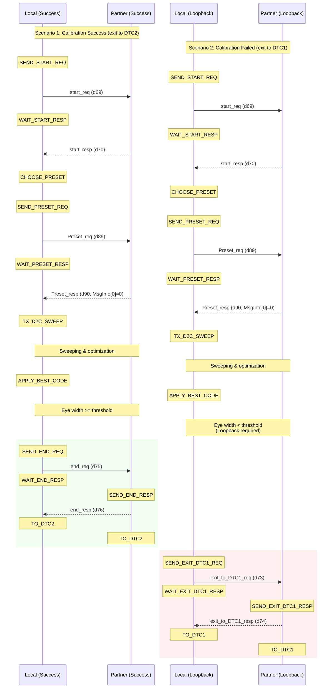
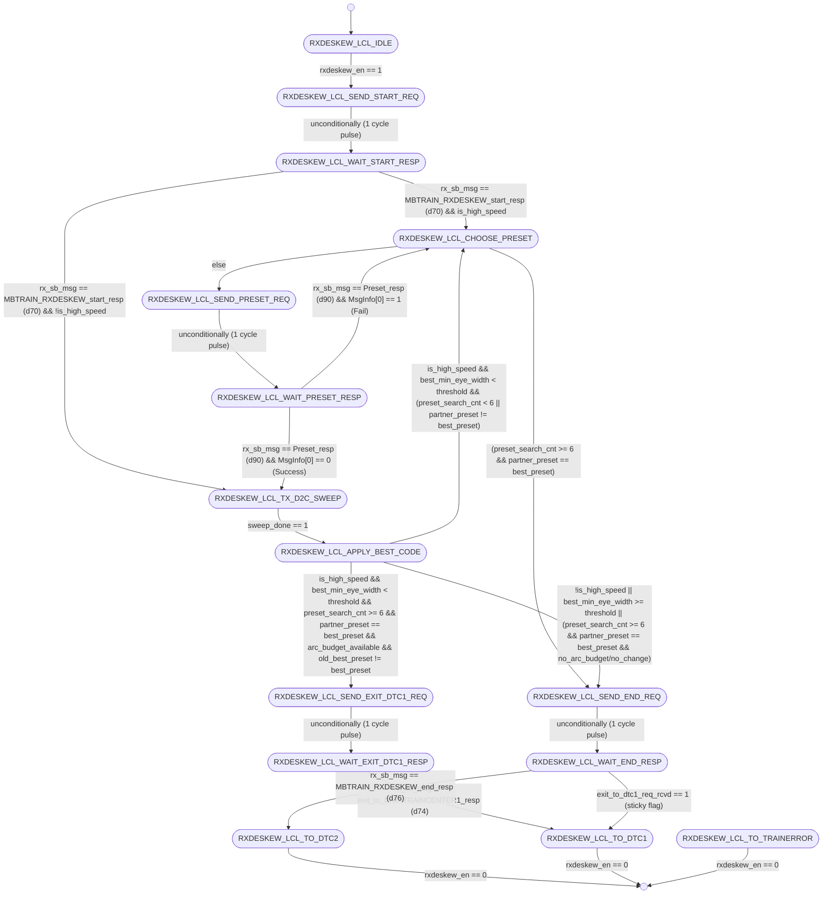
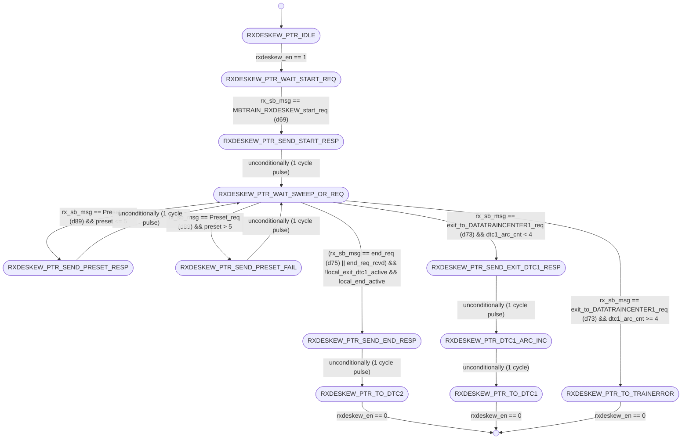

# UCIe PHY Layer: MBTRAIN.RXDESKEW Substate Design

This document details the architecture, finite state machines, interface ports, and sideband communication sequences for the tenth Main Base Training substate: **`RXDESKEW`** (Receiver Lane Deskew Calibration).

---

## Section 1 — Substate Overview

### Why does this substate exist?
At high operational speeds, differences in trace length, processing variations, and temperature across individual physical lanes introduce skew between data lanes. The **`RXDESKEW`** substate allows the receiver to optionally perform per-lane deskew adjustment on its receivers. By calibrating the relative delays on each of the 16 active data lanes, the system maximizes the timing margins and ensures the forwarded clock samples stable data windows.

### Objectives
1. **Per-Lane Deskew Calibration**: Enable the local receiver to execute Data-to-Clock eye-width sweeps and point tests, tuning individual lane delay lines (`phy_rx_deskew_ctrl`) to align data lane transitions.
2. **EQ Preset Negotiation (High-Speed Mode)**: For speeds exceeding 32 GT/s, request and evaluate up to 6 different transmitter equalizer preset settings (`0` to `5`) at the partner die to determine the optimal equalization posture before deskew calibration.
3. **DATATRAINCENTER1 Refinement Loops**: Maintain a restricted loopback path back to `DATATRAINCENTER1` (up to a maximum of 4 iterations) to allow transmitter-side adjustment for selected presets.
4. **Coordinated Exit to DATATRAINCENTER2**: Synchronize both die sides to terminate deskew training and transit cleanly to `DATATRAINCENTER2`.

### Entry and Exit Conditions
* **Entry Condition**: Enable signal `rxdeskew_en` asserted high from the top-level sequencer (`unit_MBTRAIN_ctrl.sv`) after completing `DATATRAINVREF`.
* **Exit Condition**: Complete status flag `rxdeskew_done` asserted back to the sequencer, prompting the FSMs to exit to `DATATRAINCENTER2`.

---

## Section 2 — Sideband Communication Sequence

The step-by-step sideband handshake protocol crosses the die boundary using the following sequence:



---

## Section 3 — FSM Architecture Overview

The substate uses a **decoupled initiator/responder FSM architecture**:
* **Local FSM (Initiator)**: Initiates the start handshake, selects and requests EQ presets (in high-speed mode), controls the shared sweep engine via `sweep_en` during its margining phase, updates the registered best codes `best_code_r` upon completion, and sends end requests.
* **Partner FSM (Responder)**: Waits for start requests, applies and verifies requested TX EQ presets on its physical transmitters (`phy_tx_eq_preset_ctrl`), holds mainband lanes in the required posture for sweeps, tracks the loopback arc counter, and responds to end requests.

### Decoupled Inter-die Handshaking
The Local FSM commands the execution flow by transmitting request sideband messages (e.g. `{start req}`, `{EQ Preset req}`, `{exit to DTC1 req}`, and `{end req}`). The Partner FSM mirrors these transitions, executing local setup before responding with the corresponding response messages.

### Unified Arc Counter
To enforce the spec-mandated limit of 4 loopback iterations back to `DATATRAINCENTER1` consistently, the Partner FSM hosts the canonical `dtc1_arc_cnt` register. This counter is shared with the Local FSM on the same die via the `partner_arc_cnt` port. The Local FSM reads this port combinationally to gate its exit decisions, preventing duplicate counting or synchronization skew.

---

## Section 4 — FSM Diagram

### Local FSM Diagram (Initiator)
The state transitions of `unit_RXDESKEW_local.sv` are documented below:



---

### Partner FSM Diagram (Responder)
The state transitions of `unit_RXDESKEW_partner.sv` are documented below:



---

## Section 5 — Local FSM State Table

| State ID (logic [3:0]) | State Name | Purpose / Active Actions | Transition Condition |
| :---: | :--- | :--- | :--- |
| **`4'd0`** | `RXDESKEW_LCL_IDLE` | Wait state. Clears per-session registers (`partner_preset`, `preset_search_cnt`, `best_min_eye_width`). | Transitions to `RXDESKEW_LCL_SEND_START_REQ` when `rxdeskew_en` is asserted. |
| **`4'd1`** | `RXDESKEW_LCL_SEND_START_REQ` | Drives sideband valid `tx_sb_msg_valid = 1` with opcode `MBTRAIN_RXDESKEW_start_req` (d69). | Unconditionally advances to `RXDESKEW_LCL_WAIT_START_RESP` on the next clock. |
| **`4'd2`** | `RXDESKEW_LCL_WAIT_START_RESP` | Polls for `MBTRAIN_RXDESKEW_start_resp` (d70) from the partner. | Advances to `RXDESKEW_LCL_CHOOSE_PRESET` if high-speed, else to `RXDESKEW_LCL_TX_D2C_SWEEP`. |
| **`4'd3`** | `RXDESKEW_LCL_CHOOSE_PRESET` | Selects next EQ preset. Case A: advance preset (first 6 slots). Case B: re-apply best-seen preset. | Transitions to `RXDESKEW_LCL_SEND_END_REQ` if EQ sweep and re-apply are exhausted. Otherwise, moves to `RXDESKEW_LCL_SEND_PRESET_REQ`. |
| **`4'd4`** | `RXDESKEW_LCL_SEND_PRESET_REQ` | Drives `tx_sb_msg_valid = 1` with EQ Preset opcode (d89), embedding target preset code in `tx_msginfo[2:0]`. | Unconditionally advances to `RXDESKEW_LCL_WAIT_PRESET_RESP` on the next clock. |
| **`4'd5`** | `RXDESKEW_LCL_WAIT_PRESET_RESP` | Polls for preset status response from partner. | Transitions to `RXDESKEW_LCL_TX_D2C_SWEEP` on Success (d90, MsgInfo[0]=0). Transitions to `RXDESKEW_LCL_CHOOSE_PRESET` on Fail (d90, MsgInfo[0]=1). |
| **`4'd6`** | `RXDESKEW_LCL_TX_D2C_SWEEP` | Asserts `sweep_en` combinationally, driving physical lanes with `swept_code` until sweep engine completes. | Advances to `RXDESKEW_LCL_APPLY_BEST_CODE` once `sweep_done` asserts. |
| **`4'd7`** | `RXDESKEW_LCL_APPLY_BEST_CODE` | Evaluates final `min_eye_width` against threshold. If eye is too narrow, tracks if search is exhausted. | Routes to `SEND_END_REQ` (if acceptable or search exhausted with no new options), `CHOOSE_PRESET` (to try next EQ or re-apply), or `SEND_EXIT_DTC1_REQ` (if loopback is warranted). |
| **`4'd8`** | `RXDESKEW_LCL_SEND_EXIT_DTC1_REQ` | Drives `tx_sb_msg_valid = 1` with opcode `MBTRAIN_RXDESKEW_exit_to_DATATRAINCENTER1_req` (d73). | Unconditionally advances to `RXDESKEW_LCL_WAIT_EXIT_DTC1_RESP` on the next clock. |
| **`4'd9`** | `RXDESKEW_LCL_WAIT_EXIT_DTC1_RESP` | Awaits loopback acknowledgment from partner. Captures `old_best_preset <= best_preset`. | Advances to `RXDESKEW_LCL_TO_DTC1` when `exit_to_DATATRAINCENTER1_resp` (d74) is received. |
| **`4'd10`** | `RXDESKEW_LCL_SEND_END_REQ` | Drives `tx_sb_msg_valid = 1` with opcode `MBTRAIN_RXDESKEW_end_req` (d75). | Unconditionally advances to `RXDESKEW_LCL_WAIT_END_RESP` on the next clock. |
| **`4'd11`** | `RXDESKEW_LCL_WAIT_END_RESP` | Polls for final end handshake response. | Transitions to `RXDESKEW_LCL_TO_DTC2` on `end_resp` (d76). Transitions to `RXDESKEW_LCL_TO_DTC1` if partner received cross-die loopback request (`exit_to_dtc1_req_rcvd = 1`). |
| **`4'd12`** | `RXDESKEW_LCL_TO_DTC2` | Terminal state for normal completion. Asserts `rxdeskew_done = 1`. | Holds state until sequencer deasserts `rxdeskew_en`. |
| **`4'd13`** | `RXDESKEW_LCL_TO_DTC1` | Terminal state for looping back. Asserts `datatraincenter1_req = 1`. | Holds state until sequencer deasserts `rxdeskew_en`. |
| **`4'd14`** | `RXDESKEW_LCL_TO_TRAINERROR` | Terminal error state. Asserts `trainerror_req = 1` and `rxdeskew_done = 1`. | Holds state until sequencer deasserts `rxdeskew_en`. |

---

## Section 6 — Partner FSM State Table

| State ID (logic [3:0]) | State Name | Purpose / Active Actions | Transition Condition |
| :---: | :--- | :--- | :--- |
| **`4'd0`** | `RXDESKEW_PTR_IDLE` | Wait state. Clears `dtc1_arc_cnt` and `end_req_rcvd`. | Transitions to `RXDESKEW_PTR_WAIT_START_REQ` when `rxdeskew_en` is asserted. |
| **`4'd1`** | `RXDESKEW_PTR_WAIT_START_REQ` | Polls for start request from local initiator. | Advances to `RXDESKEW_PTR_SEND_START_RESP` when `MBTRAIN_RXDESKEW_start_req` (d69) is received. |
| **`4'd2`** | `RXDESKEW_PTR_SEND_START_RESP` | Drives `tx_sb_msg_valid = 1` with opcode `MBTRAIN_RXDESKEW_start_resp` (d70). | Unconditionally advances to `RXDESKEW_PTR_WAIT_SWEEP_OR_REQ` on the next clock. |
| **`4'd3`** | `RXDESKEW_PTR_WAIT_SWEEP_OR_REQ` | Main wait loop. Holds partner sweep enable active. Monitors incoming requests. | * EQ Preset req (d89): goes to `SEND_PRESET_RESP` (valid EQ <= 5) or `SEND_PRESET_FAIL` (EQ > 5). <br>* exit to DTC1 req (d73): goes to `SEND_EXIT_DTC1_RESP` (cnt < 4) or `TO_TRAINERROR` (cnt >= 4). <br>* end req (d75): goes to `SEND_END_RESP` if local is ending, else discards (if local is arcing). |
| **`4'd4`** | `RXDESKEW_PTR_SEND_PRESET_RESP` | Drives `tx_sb_msg_valid = 1` with opcode d90 and `tx_msginfo = 16'h0000` (Success). Asserts `phy_tx_eq_preset_en = 1`. | Unconditionally returns to `RXDESKEW_PTR_WAIT_SWEEP_OR_REQ`. |
| **`4'd5`** | `RXDESKEW_PTR_SEND_PRESET_FAIL` | Drives `tx_sb_msg_valid = 1` with opcode d90 and `tx_msginfo = 16'h0001` (Fail). Preset is not applied. | Unconditionally returns to `RXDESKEW_PTR_WAIT_SWEEP_OR_REQ`. |
| **`4'd6`** | `RXDESKEW_PTR_SEND_EXIT_DTC1_RESP` | Drives `tx_sb_msg_valid = 1` with opcode `MBTRAIN_RXDESKEW_exit_to_DATATRAINCENTER1_resp` (d74). | Unconditionally advances to `RXDESKEW_PTR_DTC1_ARC_INC` on the next clock. |
| **`4'd7`** | `RXDESKEW_PTR_DTC1_ARC_INC` | 1-cycle counter update state. Increments `dtc1_arc_cnt` exactly once. | Unconditionally advances to `RXDESKEW_PTR_TO_DTC1`. |
| **`4'd8`** | `RXDESKEW_PTR_SEND_END_RESP` | Drives `tx_sb_msg_valid = 1` with opcode `MBTRAIN_RXDESKEW_end_resp` (d76). | Unconditionally advances to `RXDESKEW_PTR_TO_DTC2` on the next clock. |
| **`4'd9`** | `RXDESKEW_PTR_TO_DTC2` | Terminal state for normal completion. Asserts `rxdeskew_done = 1`. | Holds state until sequencer deasserts `rxdeskew_en`. |
| **`4'd10`** | `RXDESKEW_PTR_TO_DTC1` | Terminal state for looping back. Asserts `datatraincenter1_req = 1`. | Holds state until sequencer deasserts `rxdeskew_en`. |
| **`4'd11`** | `RXDESKEW_PTR_TO_TRAINERROR` | Terminal error state. Asserts `trainerror_req = 1`. | Holds state until sequencer deasserts `rxdeskew_en`. |

---

## Section 7 — Local FSM Execution Flow

The Local FSM steps through the training sequence sequentially:
1. **Reset and Start Handshake (`RXDESKEW_LCL_IDLE` $\rightarrow$ `SEND_START_REQ` $\rightarrow$ `WAIT_START_RESP`)**: Once `rxdeskew_en` is asserted, the Local FSM issues a 1-cycle start request (`d69`) and waits for the responder's handshake (`d70`). 
2. **EQ Preset Selection and Handshake (`RXDESKEW_LCL_CHOOSE_PRESET` $\rightarrow$ `SEND_PRESET_REQ` $\rightarrow$ `WAIT_PRESET_RESP`)**: In high-speed mode (>32 GT/s), the FSM searches for valid transmitter presets. It steps through presets 0-5. For each code, it issues a request (`d89`) and awaits acknowledgment. If the responder fails the preset, the Local FSM loops back to select the next untried preset.
3. **Data-to-Clock Sweeping (`RXDESKEW_LCL_TX_D2C_SWEEP`)**: If the partner acknowledges the preset (or if operating at standard speed), the Local FSM enables the sweep engine (`sweep_en = 1`). During this sweep, physical lane phase interpolators (`phy_rx_deskew_ctrl`) track the sweep engine's codes, margining the eye.
4. **Calibration Evaluation (`RXDESKEW_LCL_APPLY_BEST_CODE`)**: On `sweep_done = 1`, the Local FSM latches the best midpoints into `best_code_r` and compares the minimum eye width against the minimum desired sweep range.
   * *Eye wide enough*: Proceed to end negotiation (`RXDESKEW_LCL_SEND_END_REQ`).
   * *Eye too narrow, untried presets remain*: Loop back to `RXDESKEW_LCL_CHOOSE_PRESET`.
   * *Eye too narrow, all presets tried, best preset not last applied*: Loop back to re-apply the best-performing preset.
   * *Eye too narrow, all presets tried and re-applied, arc budget left*: Transition to loopback negotiation (`RXDESKEW_LCL_SEND_EXIT_DTC1_REQ`).
   * *Otherwise (no budget/no new best)*: Fall back to `RXDESKEW_LCL_SEND_END_REQ`.
5. **DTC1 Loopback Arc (`RXDESKEW_LCL_SEND_EXIT_DTC1_REQ` $\rightarrow$ `WAIT_EXIT_DTC1_RESP` $\rightarrow$ `TO_DTC1`)**: The FSM sends a DTC1 exit request (`d73`), receives the response (`d74`), registers `old_best_preset = best_preset`, and enters terminal `TO_DTC1`.
6. **Normal End Protocol (`RXDESKEW_LCL_SEND_END_REQ` $\rightarrow$ `WAIT_END_RESP` $\rightarrow$ `TO_DTC2`)**: The FSM sends an end request (`d75`) and enters `WAIT_END_RESP`. If the partner die initiates a loopback instead, the sticky flag `exit_to_dtc1_req_rcvd` forces an exit to `TO_DTC1`. Otherwise, the FSM receives the end response (`d76`) and enters `TO_DTC2`.

---

## Section 8 — Partner FSM Execution Flow

The Partner FSM implements the responder rules in lockstep:
1. **Start Protocol (`RXDESKEW_PTR_IDLE` $\rightarrow$ `WAIT_START_REQ` $\rightarrow$ `SEND_START_RESP` $\rightarrow$ `WAIT_SWEEP_OR_REQ`)**: Listens for the local initiator's start request, returns the start response, and enters the main request-response wait loop.
2. **Main Wait Loop (`RXDESKEW_PTR_WAIT_SWEEP_OR_REQ`)**: The FSM holds `partner_sweep_en = 1`, maintaining the appropriate receiver/transmitter mainband posture. It evaluates and acts on incoming SB messages:
   * **Preset Request (`d89`)**: Checks if the target preset is within the valid range ($\le 5$). If valid, it updates its physical TX registers (`phy_tx_eq_preset_ctrl = rx_msginfo[2:0]`, `phy_tx_eq_preset_en = 1`), transitions to `SEND_PRESET_RESP` to send Success (`MsgInfo[0]=0`), and returns to wait. If invalid, it transitions to `SEND_PRESET_FAIL` to return Fail (`MsgInfo[0]=1`).
   * **Exit to DTC1 Request (`d73`)**: Checks the loopback counter. If `dtc1_arc_cnt < 4`, it transitions to `SEND_EXIT_DTC1_RESP`. If the count has hit the limit ($\ge 4$), it exits directly to `TO_TRAINERROR`.
   * **End Request (`d75`)**: Monitors the local initiator's status. If the initiator is looping back (`local_exit_dtc1_active`), the partner discards the message. If the initiator is ending (`local_end_active`), the partner responds with an end response (`d76`) via `SEND_END_RESP` and enters `TO_DTC2`.
3. **Loopback Arc Counter Processing (`RXDESKEW_PTR_SEND_EXIT_DTC1_RESP` $\rightarrow$ `DTC1_ARC_INC` $\rightarrow$ `TO_DTC1`)**: After acknowledging the loopback request, the FSM transits to the 1-cycle `DTC1_ARC_INC` state, incrementing `dtc1_arc_cnt` once, then enters the terminal `TO_DTC1` state.

---

## Section 9 — Wrapper Architecture

The substate wrapper (**`wrapper_RXDESKEW.sv`**) integrates the initiator and responder FSMs:

### Instantiated Modules
1. **`u_RXDESKEW_local`**: Decoupled initiator module that controls the sweep engine interfaces, validates eye metrics, selects presets, and requests state exits.
2. **`u_RXDESKEW_partner`**: Decoupled responder module that processes incoming preset requests, manages physical transmitter presets, tracks the loopback arc counter, and responds to handshakes.

### Handshake Completion Logic
The wrapper performs a logical AND of the completion flags from both FSMs:
```systemverilog
assign rxdeskew_done = local_rxdeskew_done_wire & partner_rxdeskew_done_wire;
```

### Sideband TX Arbitration
The wrapper arbitrates the sideband TX signals, prioritizing the Local FSM:
```systemverilog
assign tx_sb_msg_valid = local_tx_sb_msg_valid | partner_tx_sb_msg_valid;
assign tx_sb_msg       = local_tx_sb_msg_valid ? local_tx_sb_msg       : partner_tx_sb_msg;
assign tx_msginfo      = local_tx_sb_msg_valid ? local_tx_msginfo      : partner_tx_msginfo;
assign tx_data_field   = local_tx_sb_msg_valid ? local_tx_data_field   : partner_tx_data_field;
```

### Static Mainband Lane Configurations
Per UCIe specification §4.5.3.4.10, during `RXDESKEW`, the clock receivers, data receivers, and valid receivers are enabled. Clock transmitters provide a forwarded clock in high-speed mode, and data and valid transmitters are held low:
```systemverilog
assign mb_rx_clk_lane_sel  = 1'b1;  // Enabled
assign mb_rx_data_lane_sel = 1'b1;  // Enabled
assign mb_rx_val_lane_sel  = 1'b1;  // Enabled
assign mb_rx_trk_lane_sel  = 1'b0;  // Disabled (held low)

// Clock TX is forwarded clock in high-speed mode (>32 GT/s) or continuous clock mode.
// In standard speed strobe mode, it is held low.
assign mb_tx_clk_lane_sel  = (is_high_speed || is_continuous_clk_mode) ? 2'b01 : 2'b00;
assign mb_tx_data_lane_sel = 2'b00;  // Held Low
assign mb_tx_val_lane_sel  = 2'b00;  // Held Low
assign mb_tx_trk_lane_sel  = 2'b00;  // Held Low
```

---

## Section 10 — Wrapper Interface Table

The table below lists all interface ports on the substate wrapper `wrapper_RXDESKEW.sv`:

| Port Signal Name | Direction | Bit Width | Functional Description / Encodings |
| :--- | :---: | :---: | :--- |
| `lclk` | Input | 1 | LTSM clock domain input (1 GHz or 2 GHz). |
| `rst_n` | Input | 1 | Asynchronous active-low global reset. |
| `soft_rst_n` | Input | 1 | Synchronous active-low soft reset (clears registers). |
| `is_high_speed` | Input | 1 | Operating speed indicator. <br>Values: `1'b1` = speed > 32 GT/s, `1'b0` = speed <= 32 GT/s. |
| `is_continuous_clk_mode` | Input | 1 | Clock mode configuration. <br>Values: `1'b1` = Continuous clock mode, `1'b0` = Strobe mode. |
| `rxdeskew_en` | Input | 1 | Sub-state enable signal from top controller (1 = Active, 0 = Disabled). |
| `rxdeskew_done` | Output | 1 | Sub-state complete handshake output to top controller (1 = Complete, 0 = In progress). |
| `datatraincenter1_req` | Output | 1 | Loopback request to `DATATRAINCENTER1` (1 = Loopback requested, 0 = Idle). |
| `trainerror_req` | Output | 1 | Fatal error indicator requesting TRAINERROR entry (1 = Error, 0 = Normal). |
| `phy_rx_deskew_ctrl` | Output | 5 (16 lanes) | Phase interpolator delay codes driven to the 16 Data receivers. <br>Values: 16 elements of 5-bit codes (`0` to `16`). |
| `partner_sweep_en` | Output | 1 | Command to partner die to enable its sweep transmitter posture (1 = Enabled, 0 = Disabled). |
| `phy_tx_eq_preset_ctrl` | Output | 3 | Equalizer preset control code driven to the transmitter PHY. <br>Values: `3'd0` to `3'd5`. |
| `phy_tx_eq_preset_en` | Output | 1 | Strobe to apply the preset code to the transmitter PHY (1 = Apply, 0 = Hold). |
| `local_sweep_en` | Output | 1 | Command driven to the shared sweep engine to execute a Local sweep (1 = Sweep active, 0 = Idle). |
| `swept_code` | Input | 5 | Current reference voltage sweeping code driven by the sweep engine. <br>Values: 5-bit code value (`0` to `16`). |
| `best_code` | Input | 5 (16 lanes) | Array of final optimized receiver deskew codes received from the sweep engine. <br>Values: 16 elements of 5-bit codes (`0` to `16`). |
| `min_eye_width` | Input | 5 | Narrowest eye width found across lanes. <br>Values: 5-bit code value (`0` to `16`). |
| `sweep_done` | Input | 1 | Complete status input from the shared sweep engine (1 = Completed, 0 = Sweeping). |
| `mb_tx_clk_lane_sel` | Output | 2 | Mainband Clock Transmitter multiplexer selector. <br>Values: `2'b00` = Low (0), `2'b01` = Active clock, `2'b10` = Hi-Z (Tri-state). |
| `mb_tx_data_lane_sel`| Output | 2 | Mainband Data Transmitter multiplexer selector. <br>Values: same encoding as `mb_tx_clk_lane_sel`. |
| `mb_tx_val_lane_sel` | Output | 2 | Mainband Valid Transmitter multiplexer selector. <br>Values: same encoding as `mb_tx_clk_lane_sel`. |
| `mb_tx_trk_lane_sel` | Output | 2 | Mainband Track Transmitter multiplexer selector. <br>Values: same encoding as `mb_tx_clk_lane_sel`. |
| `mb_rx_clk_lane_sel` | Output | 1 | Mainband Clock Receiver enable. <br>Values: `1'b1` = Receiver enabled, `1'b0` = Disabled. |
| `mb_rx_data_lane_sel`| Output | 1 | Mainband Data Receiver enable. <br>Values: same encoding as `mb_rx_clk_lane_sel`. |
| `mb_rx_val_lane_sel` | Output | 1 | Mainband Valid Receiver enable. <br>Values: same encoding as `mb_rx_clk_lane_sel`. |
| `mb_rx_trk_lane_sel` | Output | 1 | Mainband Track Receiver enable. <br>Values: same encoding as `mb_rx_clk_lane_sel`. |
| `tx_sb_msg_valid` | Output | 1 | Strobe line driven to Async SB FIFO to launch a sideband message (1 = Strobe valid, 0 = Idle). |
| `tx_sb_msg` | Output | 8 | Opcode of the sideband message to transmit. <br>Values: `d69` = `MBTRAIN_RXDESKEW_start_req`, `d73` = `MBTRAIN_RXDESKEW_exit_to_DATATRAINCENTER1_req`, `d75` = `MBTRAIN_RXDESKEW_end_req` (from Local); `d70` = `MBTRAIN_RXDESKEW_start_resp`, `d74` = `MBTRAIN_RXDESKEW_exit_to_DATATRAINCENTER1_resp`, `d76` = `MBTRAIN_RXDESKEW_end_resp`, `d90` = `Preset_resp` (from Partner). |
| `tx_msginfo` | Output | 16 | Message info payload field sent on sideband (contains target EQ preset ` MsgInfo[2:0]` if Preset request). |
| `tx_data_field` | Output | 64 | 64-bit payload data field sent on sideband (fixed at `64'h0000000000000000`). |
| `rx_sb_msg_valid` | Input | 1 | Incoming message valid pulse from SB RX FIFO (1 = Valid message, 0 = Idle). |
| `rx_sb_msg` | Input | 8 | Opcode of the incoming sideband message. <br>Values: same encoding as `tx_sb_msg`. |
| `rx_msginfo` | Input | 16 | Message info payload field of the incoming sideband message. |

---

## Section 11 — Internal Signal Summary

| Internal Signal Name | Direction | Bit Width | Functional Description |
| :--- | :---: | :---: | :--- |
| `local_exit_dtc1_active` | Internal | 1 | Indicates Local FSM has initiated a DTC1 loopback sequence. |
| `local_end_active` | Internal | 1 | Indicates Local FSM has initiated the end handshake. |
| `partner_arc_cnt_wire` | Internal | 3 | Unified loopback arc count wired from Partner to Local FSM. |
| `local_rxdeskew_done_wire` | Internal | 1 | Handshake completion output from `u_RXDESKEW_local`. |
| `partner_rxdeskew_done_wire`| Internal | 1 | Handshake completion output from `u_RXDESKEW_partner`. |
| `local_tx_sb_msg_valid` | Internal | 1 | Sideband TX valid strobe driven by Local FSM. |
| `local_tx_sb_msg` | Internal | 8 | Opcode driven by Local FSM (d69, d73, d75, or d89). |
| `partner_tx_sb_msg_valid`| Internal | 1 | Sideband TX valid strobe driven by Partner FSM. |
| `partner_tx_sb_msg` | Internal | 8 | Opcode driven by Partner FSM (d70, d74, d76, or d90). |

---

## Section 12 — D2C_PT Interaction

The `RXDESKEW` substate calibrates Data receiver delay lines using the **`RX_D2C_PT`** (Receiver-Initiated Point Test) architecture:
* **Sweep Parameter**: Phase delay interpolation settings for the 16 Data receiver delay lines (`phy_rx_deskew_ctrl`).
* **Initiator**: Local die FSM (commands the shared sweep engine via `local_sweep_en`).
* **Receiver**: Local die Data receivers (lanes 0-15).
* **Test Direction**: The Partner die transmits a continuous test pattern (4K UI of LFSR pattern with correct Valid framing) while the Local die receiver sweeps its phase delay interpolators combinationally via `phy_rx_deskew_ctrl` to find the eye edges.
* **Aggregated Results**: The best phase midpoints are registered per-lane in `best_code_r` and statically driven to `phy_rx_deskew_ctrl`. The narrowest lane eye width is compared combinationally with the minimum desired sweep range (`MIN_DESIRED_SWEEP_RANGE`) to evaluate preset success.

---

## Section 13 — Summary

The **`RXDESKEW`** substate design provides a spec-compliant, decoupled architecture for calibrating individual data lane phase delays at high speeds. By combining inter-die equalizer preset negotiation with local data receiver sweeps, it mitigates trace length and temperature mismatches on the 16 active data lanes. Sharing a unified loopback counter on the responder side ensures that both dies enforce the four-arc limit back to `DATATRAINCENTER1` consistently. The wrapper handles Sideband message routing and multiplexes Mainband controls, exposing a simplified, clean completion interface to the top controller.
