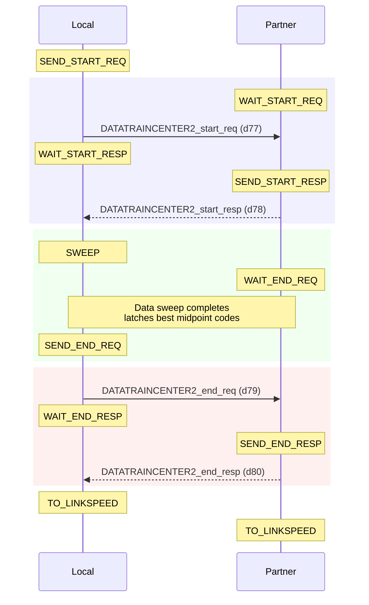
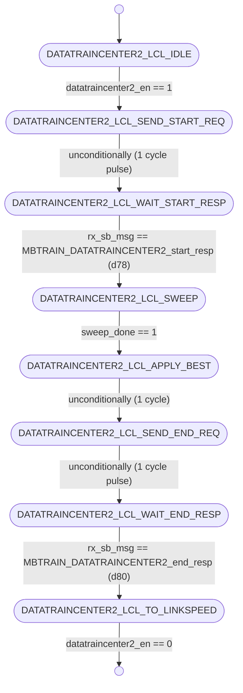
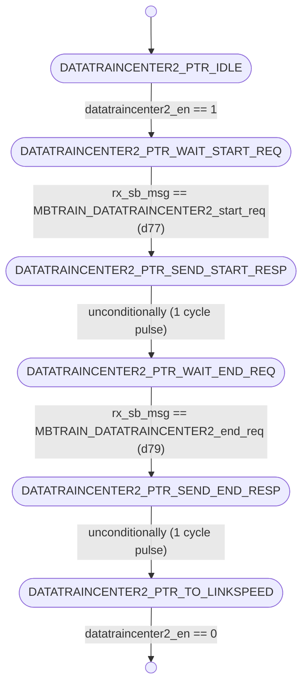

# UCIe PHY Layer: MBTRAIN.DATATRAINCENTER2 Substate Design

This document details the architecture, finite state machines, interface ports, and sideband communication sequences for the eleventh Main Base Training substate: **`DATATRAINCENTER2`** (Data Lane Transmitter Center Phase Calibration 2).

---

## Section 1 — Substate Overview

### Why does this substate exist?
If the receiver performs per-lane deskew adjustments during `RXDESKEW`, the timing alignment of the data signals relative to the forwarded clock shifts. To compensate for these changes, the **`DATATRAINCENTER2`** substate is executed to perform a second transmitter-side phase centering. This ensures that the clock samples the aggregated data eye at the optimal midpoint, maximizing the voltage and timing margins.

### Objectives
1. **Transmitter PI Center Calibration**: Perform a secondary transmitter-side Phase Interpolator (PI) sweep (codes 0-16) for all 16 data lanes to recalibrate the optimal eye center.
2. **Post-Deskew Clock Centering**: Calculate the final centering phase for each data transmitter lane using the results obtained during the sweep and update `phy_tx_data_pi_phase_ctrl` permanently.
3. **Initiator/Responder Sync**: Coordinate the initiator and responder dies to run continuous LFSR patterns with Valid framing.

### Entry and Exit Conditions
* **Entry Condition**: Enable signal `datatraincenter2_en` asserted high from the top sequencer (`unit_MBTRAIN_ctrl.sv`) after `RXDESKEW` completes.
* **Exit Condition**: Complete status flag `datatraincenter2_done` asserted back to the sequencer, indicating both FSMs have completed sweeps and handshakes, transitioning to `LINKSPEED`.

---

## Section 2 — Sideband Communication Sequence

The step-by-step sideband handshake protocol crosses the die boundary using the following sequence:



---

## Section 3 — FSM Architecture Overview

The substate utilizes a **decoupled initiator/responder FSM architecture**:
* **Local FSM (Initiator)**: Initiates the start handshake, controls the shared sweep engine via `sweep_en` during its margining phase, updates the registered best codes `best_code_r` upon completion, and sends end requests.
* **Partner FSM (Responder)**: Waits for start requests, enables continuous pattern generation (`LFSR` patterns with `Valid` framing) by asserting `partner_sweep_en = 1` while the partner die sweeps, and replies to end requests.

### Decoupled Inter-die Handshaking
The Local FSM commands the execution flow by transmitting request sideband messages (e.g. `{start req}` and `{end req}`). The Partner FSM mirrors these transitions, executing local setup before responding with the corresponding response messages.

---

## Section 4 — FSM Diagram

### Local FSM Diagram (Initiator)
The state transitions of `unit_DATATRAINCENTER2_local.sv` are documented below:



---

### Partner FSM Diagram (Responder)
The state transitions of `unit_DATATRAINCENTER2_partner.sv` are documented below:



---

## Section 5 — Local FSM State Table

| State ID (logic [2:0]) | State Name | Purpose / Active Actions | Transition Condition |
| :---: | :--- | :--- | :--- |
| **`3'd0`** | `DATATRAINCENTER2_LCL_IDLE` | Wait state. Resets best code registers and output signals. | Transitions to `DATATRAINCENTER2_LCL_SEND_START_REQ` when `datatraincenter2_en` is asserted. |
| **`3'd1`** | `DATATRAINCENTER2_LCL_SEND_START_REQ` | Drives `tx_sb_msg_valid = 1` with opcode `MBTRAIN_DATATRAINCENTER2_start_req` (d77) to partner. | Unconditionally advances to `DATATRAINCENTER2_LCL_WAIT_START_RESP` on the next clock. |
| **`3'd2`** | `DATATRAINCENTER2_LCL_WAIT_START_RESP`| Polls receiver sideband FIFO for start response from partner. | Advances to `DATATRAINCENTER2_LCL_SWEEP` when `rx_sb_msg_valid && rx_sb_msg == MBTRAIN_DATATRAINCENTER2_start_resp` (d78). |
| **`3'd3`** | `DATATRAINCENTER2_LCL_SWEEP` | Asserts `sweep_en` to trigger the sweep engine and evaluate eye margins. | Advances to `DATATRAINCENTER2_LCL_APPLY_BEST` once `sweep_done` is high. |
| **`3'd4`** | `DATATRAINCENTER2_LCL_APPLY_BEST` | 1-cycle pipeline delay state allowing registered optimal values to stabilize. | Unconditionally advances to `DATATRAINCENTER2_LCL_SEND_END_REQ` on the next clock. |
| **`3'd5`** | `DATATRAINCENTER2_LCL_SEND_END_REQ` | Drives `tx_sb_msg_valid = 1` with opcode `MBTRAIN_DATATRAINCENTER2_end_req` (d79) to partner. | Unconditionally advances to `DATATRAINCENTER2_LCL_WAIT_END_RESP` on the next clock. |
| **`3'd6`** | `DATATRAINCENTER2_LCL_WAIT_END_RESP` | Polls receiver sideband FIFO for end response from partner. | Advances to `DATATRAINCENTER2_LCL_TO_LINKSPEED` when `rx_sb_msg_valid && rx_sb_msg == MBTRAIN_DATATRAINCENTER2_end_resp` (d80). |
| **`3'd7`** | `DATATRAINCENTER2_LCL_TO_LINKSPEED` | Normal terminal state. Asserts completion flag `datatraincenter2_done`. | Holds state and `datatraincenter2_done` until `datatraincenter2_en` is deasserted. |

---

## Section 6 — Partner FSM State Table

| State ID (logic [2:0]) | State Name | Purpose / Active Actions | Transition Condition |
| :---: | :--- | :--- | :--- |
| **`3'd0`** | `DATATRAINCENTER2_PTR_IDLE` | Wait state. Clears partner sweep enable. | Transitions to `DATATRAINCENTER2_PTR_WAIT_START_REQ` when `datatraincenter2_en` is asserted. |
| **`3'd1`** | `DATATRAINCENTER2_PTR_WAIT_START_REQ`| Polls receiver sideband FIFO for start request from initiator. | Advances to `DATATRAINCENTER2_PTR_SEND_START_RESP` when `rx_sb_msg_valid && rx_sb_msg == MBTRAIN_DATATRAINCENTER2_start_req` (d77). |
| **`3'd2`** | `DATATRAINCENTER2_PTR_SEND_START_RESP`| Drives `tx_sb_msg_valid = 1` with opcode `MBTRAIN_DATATRAINCENTER2_start_resp` (d78). | Unconditionally advances to `DATATRAINCENTER2_PTR_WAIT_END_REQ` on the next clock. |
| **`3'd3`** | `DATATRAINCENTER2_PTR_WAIT_END_REQ` | Asserts `partner_sweep_en = 1` to drive active pattern. | Advances to `DATATRAINCENTER2_PTR_SEND_END_RESP` when `rx_sb_msg_valid && rx_sb_msg == MBTRAIN_DATATRAINCENTER2_end_req` (d79). |
| **`3'd4`** | `DATATRAINCENTER2_PTR_SEND_END_RESP` | Drives `tx_sb_msg_valid = 1` with opcode `MBTRAIN_DATATRAINCENTER2_end_resp` (d80). | Unconditionally advances to `DATATRAINCENTER2_PTR_TO_LINKSPEED` on the next clock. |
| **`3'd5`** | `DATATRAINCENTER2_PTR_TO_LINKSPEED` | Normal terminal state. Asserts completion flag `datatraincenter2_done`. | Holds state and `datatraincenter2_done` until `datatraincenter2_en` is deasserted. |

---

## Section 7 — Local FSM Execution Flow

The Local FSM transitions through the following stages:
1. **Idle State (`DATATRAINCENTER2_LCL_IDLE`)**: Upon receiving the enable pulse `datatraincenter2_en = 1`, the Local FSM transitions to `DATATRAINCENTER2_LCL_SEND_START_REQ`.
2. **Start Handshake (`DATATRAINCENTER2_LCL_SEND_START_REQ` $\rightarrow$ `DATATRAINCENTER2_LCL_WAIT_START_RESP`)**: Drives `tx_sb_msg_valid = 1` with opcode `MBTRAIN_DATATRAINCENTER2_start_req` (d77) to partner, then waits in `DATATRAINCENTER2_LCL_WAIT_START_RESP` for `MBTRAIN_DATATRAINCENTER2_start_resp` (d78) to arrive.
3. **Margining Sweep (`DATATRAINCENTER2_LCL_SWEEP`)**: After receiving the start response, the Local FSM asserts `sweep_en = 1`. During the sweep, the phase control output `phy_tx_data_pi_phase_ctrl` is driven combinationally from the engine's `swept_code` for all 16 lanes. The local receiver samples the incoming data pattern and evaluates eye limits.
4. **Midpoint Capture (`DATATRAINCENTER2_LCL_APPLY_BEST` $\rightarrow$ `DATATRAINCENTER2_LCL_SEND_END_REQ` $\rightarrow$ `DATATRAINCENTER2_LCL_WAIT_END_RESP`)**: Once `sweep_done` is high, the Local FSM captures the best phase midpoint settings into `best_code_r`. It transitions to `DATATRAINCENTER2_LCL_APPLY_BEST` for 1 clock cycle to ensure output stability, then transmits `MBTRAIN_DATATRAINCENTER2_end_req` (d79). It waits in `DATATRAINCENTER2_LCL_WAIT_END_RESP` for `MBTRAIN_DATATRAINCENTER2_end_resp` (d80).
5. **Completion State (`DATATRAINCENTER2_LCL_TO_LINKSPEED`)**: Upon receiving the end response, the Local FSM enters `DATATRAINCENTER2_LCL_TO_LINKSPEED` and asserts completion `datatraincenter2_done = 1`.

---

## Section 8 — Partner FSM Execution Flow

The Partner FSM operates in tandem with the Local FSM to configure its transmitter patterns:
1. **Idle State (`DATATRAINCENTER2_PTR_IDLE` $\rightarrow$ `DATATRAINCENTER2_PTR_WAIT_START_REQ`)**: Activates when `datatraincenter2_en = 1` is observed, transitioning to `DATATRAINCENTER2_PTR_WAIT_START_REQ`.
2. **Start Handshake (`DATATRAINCENTER2_PTR_WAIT_START_REQ` $\rightarrow$ `DATATRAINCENTER2_PTR_SEND_START_RESP` $\rightarrow$ `DATATRAINCENTER2_PTR_WAIT_END_REQ`)**: Awaits `MBTRAIN_DATATRAINCENTER2_start_req` (d77). Once it arrives, the Partner FSM drives `MBTRAIN_DATATRAINCENTER2_start_resp` (d78) and transitions to `DATATRAINCENTER2_PTR_WAIT_END_REQ`.
3. **Continuous Pattern Generation (`DATATRAINCENTER2_PTR_WAIT_END_REQ`)**: The Partner FSM asserts `partner_sweep_en = 1`, which overrides the data line multiplexer to drive continuous `LFSR` patterns with `Valid` framing while the initiator sweeps its receiver phase delay.
4. **End Handshake (`DATATRAINCENTER2_PTR_WAIT_END_REQ` $\rightarrow$ `DATATRAINCENTER2_PTR_SEND_END_RESP` $\rightarrow$ `DATATRAINCENTER2_PTR_TO_LINKSPEED`)**: Remains in this state until `MBTRAIN_DATATRAINCENTER2_end_req` (d79) is received. Upon receipt, it deasserts `partner_sweep_en`, transmits `MBTRAIN_DATATRAINCENTER2_end_resp` (d80), and moves to `DATATRAINCENTER2_PTR_TO_LINKSPEED`, asserting `datatraincenter2_done = 1`.

---

## Section 9 — Wrapper Architecture

The substate wrapper (**`wrapper_DATATRAINCENTER2.sv`**) integrates the Local and Partner FSM modules:

### Instantiated Modules
1. **`u_local`**: Initiator FSM executing the phase sweep, evaluating eyes, and capturing the best Data PI phase settings.
2. **`u_partner`**: Responder FSM managing the partner handshakes and driving continuous test patterns.

### Handshake Completion Logic
The wrapper performs a logical AND of the completion flags from both modules:
```systemverilog
assign datatraincenter2_done = local_datatraincenter2_done_wire & partner_datatraincenter2_done_wire;
```

### Sideband TX Arbitration
The wrapper arbitrates the sideband TX signals, prioritizing the Local FSM:
```systemverilog
assign tx_sb_msg_valid = local_tx_sb_msg_valid | partner_tx_sb_msg_valid;
assign tx_sb_msg       = local_tx_sb_msg_valid ? local_tx_sb_msg       : partner_tx_sb_msg;
assign tx_msginfo      = local_tx_sb_msg_valid ? local_tx_msginfo      : partner_tx_msginfo;
assign tx_data_field   = local_tx_sb_msg_valid ? local_tx_data_field   : partner_tx_data_field;
```

### Static Mainband Lane Configurations
Per UCIe specification §4.5.3.4.11, during `DATATRAINCENTER2`, the clock transmitter is active, the Data and Valid transmitters are enabled to drive patterns, and track lines are locked to low:
```systemverilog
assign mb_tx_clk_lane_sel  = 2'b01;  // Forwarded clock active
assign mb_tx_data_lane_sel = 2'b00;  // Electrical Idle / Low (drives D2C pattern)
assign mb_tx_val_lane_sel  = 2'b00;  // Electrical Idle / Low
assign mb_tx_trk_lane_sel  = 2'b00;  // Electrical Idle / Low
assign mb_rx_clk_lane_sel  = 1'b1 ;  // Enabled
assign mb_rx_data_lane_sel = 1'b1 ;  // Enabled
assign mb_rx_val_lane_sel  = 1'b1 ;  // Enabled
assign mb_rx_trk_lane_sel  = 1'b0 ;  // Disabled
```

---

## Section 10 — Wrapper Interface Table

The table below lists all interface ports on the substate wrapper `wrapper_DATATRAINCENTER2.sv`:

| Port Signal Name | Direction | Bit Width | Functional Description / Encodings |
| :--- | :---: | :---: | :--- |
| `lclk` | Input | 1 | LTSM clock domain input (1 GHz or 2 GHz). |
| `rst_n` | Input | 1 | Asynchronous active-low global reset. |
| `soft_rst_n` | Input | 1 | Synchronous active-low soft reset (clears registers). |
| `datatraincenter2_en` | Input | 1 | Sub-state enable signal from top controller (1 = Active, 0 = Disabled). |
| `datatraincenter2_done` | Output | 1 | Sub-state complete handshake output to top controller (1 = Complete, 0 = In progress). |
| `phy_tx_data_pi_phase_ctrl` | Output | 5 (16 lanes) | Calibrated transmitter phase interpolator (PI) control codes driven to the 16 Data drivers. <br>Values: 16 elements of 5-bit codes (`0` to `16`). |
| `partner_sweep_en` | Output | 1 | Command to partner die to keep the data patterns active (1 = Active, 0 = Disabled). |
| `local_sweep_en` | Output | 1 | Command driven to the shared sweep engine to execute a Local sweep (1 = Sweep active, 0 = Idle). |
| `swept_code` | Input | 5 | Current reference voltage sweeping code driven by the sweep engine. <br>Values: 5-bit code value (`0` to `16`). |
| `best_code` | Input | 5 (16 lanes) | Array of final optimized phase midpoint codes received from the sweep engine. <br>Values: 16 elements of 5-bit codes (`0` to `16`). |
| `sweep_done` | Input | 1 | Complete status input from the shared sweep engine (1 = Completed, 0 = Sweeping). |
| `mb_tx_clk_lane_sel` | Output | 2 | Mainband Clock Transmitter multiplexer selector. <br>Values: `2'b00` = Low (0), `2'b01` = Active clock, `2'b10` = Hi-Z (Tri-state). |
| `mb_tx_data_lane_sel`| Output | 2 | Mainband Data Transmitter multiplexer selector. <br>Values: same encoding as `mb_tx_clk_lane_sel`. |
| `mb_tx_val_lane_sel` | Output | 2 | Mainband Valid Transmitter multiplexer selector. <br>Values: same encoding as `mb_tx_clk_lane_sel`. |
| `mb_tx_trk_lane_sel` | Output | 2 | Mainband Track Transmitter multiplexer selector. <br>Values: same encoding as `mb_tx_clk_lane_sel`. |
| `mb_rx_clk_lane_sel` | Output | 1 | Mainband Clock Receiver enable. <br>Values: `1'b1` = Receiver enabled, `1'b0` = Disabled. |
| `mb_rx_data_lane_sel`| Output | 1 | Mainband Data Receiver enable. <br>Values: same encoding as `mb_rx_clk_lane_sel`. |
| `mb_rx_val_lane_sel` | Output | 1 | Mainband Valid Receiver enable. <br>Values: same encoding as `mb_rx_clk_lane_sel`. |
| `mb_rx_trk_lane_sel` | Output | 1 | Mainband Track Receiver enable. <br>Values: same encoding as `mb_rx_clk_lane_sel`. |
| `tx_sb_msg_valid` | Output | 1 | Strobe line driven to Async SB FIFO to launch a sideband message (1 = Strobe valid, 0 = Idle). |
| `tx_sb_msg` | Output | 8 | Opcode of the sideband message to transmit. <br>Values: `d77` = `MBTRAIN_DATATRAINCENTER2_start_req`, `d79` = `MBTRAIN_DATATRAINCENTER2_end_req` (if Local); `d78` = `MBTRAIN_DATATRAINCENTER2_start_resp`, `d80` = `MBTRAIN_DATATRAINCENTER2_end_resp` (if Partner). |
| `tx_msginfo` | Output | 16 | Message info payload field sent on sideband (fixed at `16'h0000`). |
| `tx_data_field` | Output | 64 | 64-bit payload data field sent on sideband (fixed at `64'h0000000000000000`). |
| `rx_sb_msg_valid` | Input | 1 | Incoming message valid pulse from SB RX FIFO (1 = Valid message, 0 = Idle). |
| `rx_sb_msg` | Input | 8 | Opcode of the incoming sideband message. <br>Values: same encoding as `tx_sb_msg`. |

---

## Section 11 — Internal Signal Summary

| Internal Signal Name | Direction | Bit Width | Functional Description |
| :--- | :---: | :---: | :--- |
| `local_datatraincenter2_done_wire` | Internal | 1 | Complete flag from main Local FSM. |
| `partner_datatraincenter2_done_wire`| Internal | 1 | Complete flag from main Partner FSM. |
| `local_tx_sb_msg_valid` | Internal | 1 | SB TX valid strobe driven by `u_local`. |
| `local_tx_sb_msg` | Internal | 8 | Opcode driven by `u_local` (d77 or d79). |
| `partner_tx_sb_msg_valid`| Internal | 1 | SB TX valid strobe driven by `u_partner`. |
| `partner_tx_sb_msg` | Internal | 8 | Opcode driven by `u_partner` (d78 or d80). |

---

## Section 12 — D2C_PT Interaction

The `DATATRAINCENTER2` substate sweeps Data transmitter phase delays using the **`TX_D2C_PT`** (Transmitter-Initiated Point Test) architecture:
* **Sweep Parameter**: Transmitter Phase Interpolator (PI) delay settings for the 16 Data drivers.
* **Initiator**: Local die FSM (asserts `local_sweep_en` to control the sweep engine).
* **Receiver**: Partner die Data receivers (lanes 0-15).
* **Test Direction**: The Local die sweeps the Data transmitter PI phase codes combinationally via `phy_tx_data_pi_phase_ctrl` while the Partner die receiver evaluates pattern transitions. Feedback is communicated over the sideband.
* **Aggregated Results**: At the end of the sweep, the optimal centering phase codes are registered in `best_code_r` and statically driven to `phy_tx_data_pi_phase_ctrl`.

---

## Section 13 — Summary

The **`DATATRAINCENTER2`** substate design provides a robust, decoupled, and spec-compliant method for post-deskew data lane phase calibration. By sweeping the transmitter phase interpolator codes and evaluating eye limits at the receiver, it re-establishes a centered sampling window for the 16 data signals. The wrapper coordinates sideband message arbitration and multiplexes control lines, providing a single-port handshake block to the top-level sequencer.
