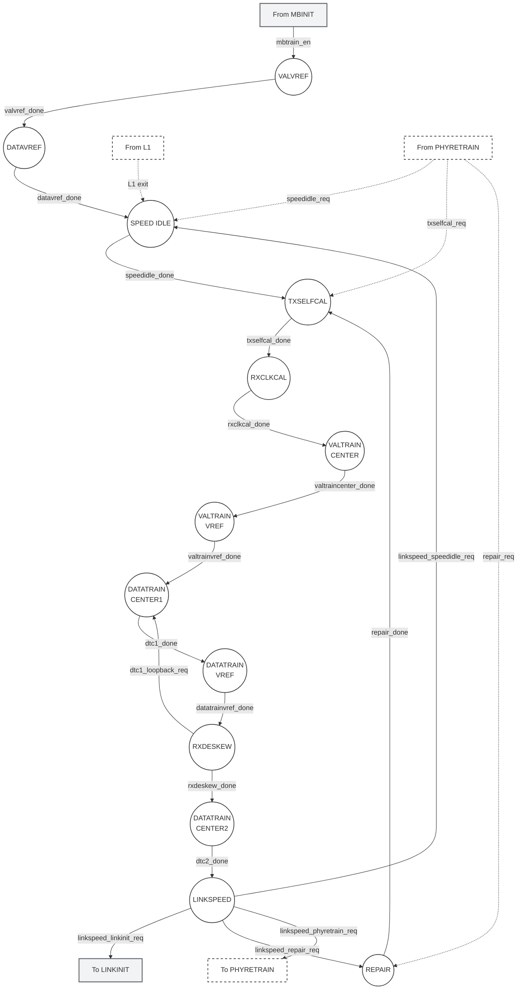

# UCIe PHY Layer: MBTRAIN Top-Level Sequencer & Wrapper Design

This document details the global training sequencer (**`unit_MBTRAIN_ctrl.sv`**) and the sub-system integration wrapper (**`wrapper_MBTRAIN.sv`**) for the Main Base Training (MBTRAIN) block of the Universal Chiplet Interconnect Express (UCIe) 3.0 Physical Layer. It serves as an accessible entry point for reviewers and engineers, detailing the training loops, interface ports, and cross-die handshake flows.

---

## Section 1 — MBTRAIN Overview

### What is MBTRAIN?
Main Base Training (**MBTRAIN**) is the central calibration sub-system inside the UCIe Physical Layer. Once the chiplets boot up and finalize the basic low-speed sideband initialization (**SBINIT**) and mainband configuration (**MBINIT**), the link must transition to its high-speed mission mode. Because of physical board trace variations, chip manufacturing skew, temperature shifts, and high clock frequencies, raw signals sent across standard mainband lanes will arrive misaligned.

MBTRAIN executes a 13-stage hardware sequencing loop that dynamically adjusts:
1. **Receiver Reference Voltages (Vref)**: Adjusting the voltage thresholds for optimal high/low logic detection (VALVREF, DATAVREF, VALTRAINVREF, DATATRAINVREF).
2. **Transmitter Phase Interpolators (PI)**: Aligning the transmitter clock edges (phase) to launch data in the exact center of the receiver's window (VALTRAINCENTER, DATATRAINCENTER1, DATATRAINCENTER2).
3. **Data Lanes Deskew**: Delaying individual lane receivers to compensate for physical path length variations (RXDESKEW).
4. **Equalization Presets**: Applying Tx presets at data rates above 32 GT/s to mitigate high-frequency channel losses (RXDESKEW).
5. **Phase-Locked Loop (PLL) Rates & Speed shifts**: Shifting speed modes safely (SPEEDIDLE, LINKSPEED).
6. **Redundant Lane Repair**: Disabling broken lanes and remapping signals to redundant paths (REPAIR).

### Why Does it Exist?
Without MBTRAIN, chiplets cannot communicate at high data rates (up to 64 GT/s per lane) because signal jitter and channel skew would cause massive bit errors. MBTRAIN establishes a clean, calibrated link, ensuring functional reliability.

---

## Section 2 — Complete MBTRAIN Sequence

The global training loop runs through 13 sequential substates as shown below. Under standard operating conditions, the loop is linear, with dynamic loopbacks occurring at RXDESKEW and downshifts/repair routing evaluated during the final LINKSPEED check.

```text
VALVREF (Rx Valid Vref)
  │
  ▼
DATAVREF (Rx Data Vref)
  │
  ▼
SPEEDIDLE (Negotiate Speed / Clock Lock)
  │
  ▼
TXSELFCAL (Tx Driver Calibration)
  │
  ▼
RXCLKCAL (Receiver Clock Phase Adjust)
  │
  ▼
VALTRAINCENTER (Tx Valid Clock Alignment)
  │
  ▼
VALTRAINVREF (Rx Valid Voltage Training)
  │
  ▼
DATATRAINCENTER1 (Tx Data Clock Alignment - Pass 1) <─────────────────────────┐
  │                                                                           │
  ▼                                                                           │
DATATRAINVREF (Rx Data Voltage Training)                                      │
  │                                                                           │
  ▼                                                                           │
RXDESKEW (Deskew Sweep & Equalization Loop) ───[Loopback: Fail Calibration]───┘
  │
  ├───[Normal Pass]
  │
  ▼
DATATRAINCENTER2 (Tx Data Clock Alignment - Pass 2)
  │
  ▼
LINKSPEED (Link Stability Verification)
  │
  ├───[Degraded Width] ──► REPAIR (Remap Lanes) ──► Loopback to TXSELFCAL
  │
  ├───[Unstable Speed] ──► Loopback to SPEEDIDLE (Downshift rate)
  │
  └───[Stable & Complete] ──► LINKINIT (Active State)
```

---

## Section 3 — MBTRAIN Controller Architecture

### Sequencer Coordination (`unit_MBTRAIN_ctrl.sv`)
The sequencer is a synchronous state machine implemented on the local die that orchestrates the enable signals of all 13 substates. It enforces a **decoupled handshake architecture**:
* Each substate wrapper integrates both the **Local FSM (Initiator)** and **Partner FSM (Responder)** on this die.
* The controller drives a single, active-high enable signal (`*_en`) for the active substate.
* The wrapper coordinates both local and partner modules, asserting a single combined `*_done` pulse back to the controller once both FSMs report complete.
* This decoupling prevents simulation stalls or lockups when local and partner dies execute complex internal calibration routines at different rates.

### Transitions & Entry Vector Handling
The controller tracks external entry request inputs to support warm restarts and error recovery:
1. **`mbtrain_txselfcal_req`**: Bypasses Vref/Speed negotiation and enters training directly at the transmitter calibration stage.
2. **`mbtrain_speedidle_req`**: Enters training directly at the Speed idle negotiation stage.
3. **`mbtrain_repair_req`**: Enters training directly at the lane repair stage.
4. **`trainerror_detected`**: If any substate reports a fatal error, the controller immediately asserts `ltsm_trainerror_req` and transitions to `MBTRAIN_DONE` to halt training safely.

---

## Section 4 — Global MBTRAIN Flow Diagram

The state transitions of `unit_MBTRAIN_ctrl.sv` are documented in the compact Mermaid flowchart below:



---

## Section 5 — Substate Summary Table

The table below lists all 13 training substates, their objectives, entry triggers, and successful exit routes:

| Substate ID | State Name | Training & Calibration Objective | Entry Condition | Exit Condition |
| :---: | :--- | :--- | :--- | :--- |
| **01** | `VALVREF` | Rx Valid Lane Vref calibration. Sets the initial voltage slice level for the Valid control channel. | `mbtrain_en` asserted (standard boot) | `valvref_done` asserted |
| **02** | `DATAVREF` | Rx Data Lanes Vref calibration. Sets the initial voltage slice level for all active data channels. | `valvref_done` asserted | `datavref_done` asserted |
| **03** | `SPEEDIDLE` | Link speed negotiation and PLL clock rate changes. Coordinates rate shifting across dies. | `datavref_done` OR `linkspeed_speedidle_req` | `speedidle_done` asserted |
| **04** | `TXSELFCAL` | Clock and data transmitter self-calibration (impedance/slew tuning). | `speedidle_done` OR `mbtrain_txselfcal_req` OR `repair_done` | `txselfcal_done` asserted |
| **05** | `RXCLKCAL` | In-phase/Quadrature (I/Q) clock lock correction and squelch tracking initialization. | `txselfcal_done` asserted | `rxclkcal_done` asserted |
| **06** | `VALTRAINCENTER` | Transmitter Phase Interpolator (PI) centering for the Valid lane (horizontal centering). | `rxclkcal_done` asserted | `valtraincenter_done` asserted |
| **07** | `VALTRAINVREF` | Receiver Vref training for the Valid lane (re-calibrates voltage threshold with optimized TX clock phase). | `valtraincenter_done` asserted | `valtrainvref_done` asserted |
| **08** | `DATATRAINCENTER1` | Transmitter PI training for Data lanes (Pass 1 - initial clock-to-data alignment). | `valtrainvref_done` OR `dtc1_loopback_req` | `dtc1_done` asserted |
| **09** | `DATATRAINVREF` | Receiver Vref training for Data lanes (re-calibrates voltage thresholds with optimized TX clock phases). | `dtc1_done` asserted | `datatrainvref_done` asserted |
| **10** | `RXDESKEW` | Data lanes deskew and Equalization (EQ) preset tuning loop. | `datatrainvref_done` asserted | `rxdeskew_done` OR `dtc1_loopback_req` |
| **11** | `DATATRAINCENTER2` | Transmitter PI training for Data lanes (Pass 2 - fine-tunes clock-to-data alignment post-deskew). | `rxdeskew_done` asserted | `dtc2_done` asserted |
| **12** | `LINKSPEED` | Link stability verification at the final operating rate under mission configurations. | `dtc2_done` asserted | `linkspeed_done` asserted |
| **13** | `REPAIR` | Disables failed lanes and remaps active signals to redundant repair paths. | `linkspeed_done` && `linkspeed_repair_req` | `repair_done` asserted |

---

## Section 6 — Substate Dependency Matrix

This matrix documents the transition routing decisions managed combinationaly by the sequencer:

| Current Substate | Next Substate | Condition / Done Trigger | Action Taken |
| :--- | :--- | :--- | :--- |
| **`MBTRAIN_IDLE`** | `VALVREF` | `mbtrain_en` && no re-entry flags | Start standard training sequence |
| **`MBTRAIN_IDLE`** | `TXSELFCAL` | `mbtrain_en` && `mbtrain_txselfcal_req` | Bypass to Tx Self-Calibration |
| **`MBTRAIN_IDLE`** | `SPEEDIDLE` | `mbtrain_en` && `mbtrain_speedidle_req` | Bypass to Speed Idle Negotiation |
| **`MBTRAIN_IDLE`** | `REPAIR` | `mbtrain_en` && `mbtrain_repair_req` | Bypass to Width Repair Routing |
| **`VALVREF`** | `DATAVREF` | `valvref_done` | Advance Vref training to Data lanes |
| **`DATAVREF`** | `SPEEDIDLE` | `datavref_done` | Start clock rate and PLL locking |
| **`SPEEDIDLE`** | `TXSELFCAL` | `speedidle_done` | Start transmitter calibration |
| **`TXSELFCAL`** | `RXCLKCAL` | `txselfcal_done` | Start receiver tracking/locking |
| **`RXCLKCAL`** | `VALTRAINCENTER`| `rxclkcal_done` | Start Valid lane phase centering |
| **`VALTRAINCENTER`**| `VALTRAINVREF` | `valtraincenter_done` | Start Valid lane Vref calibration |
| **`VALTRAINVREF`**| `DATATRAINCENTER1`| `valtrainvref_done` | Start Data lanes phase centering |
| **`DATATRAINCENTER1`**| `DATATRAINVREF`| `dtc1_done` | Start Data lanes Vref calibration |
| **`DATATRAINVREF`**| `RXDESKEW` | `datatrainvref_done` | Start Rx lane alignment sweeps |
| **`RXDESKEW`** | `DATATRAINCENTER1`| `dtc1_loopback_req` | Loop back to DTC1 to retry phase centering |
| **`RXDESKEW`** | `DATATRAINCENTER2`| `rxdeskew_done` | Advance to fine data training pass |
| **`DATATRAINCENTER2`**| `LINKSPEED` | `dtc2_done` | Initiate link stability checks |
| **`LINKSPEED`** | `MBTRAIN_DONE` | `linkspeed_done` && (`linkinit` or `phyretrain`) | Exit training (advance to Linkinit or Retrain) |
| **`LINKSPEED`** | `SPEEDIDLE` | `linkspeed_done` && `linkspeed_speedidle_req` | Link unstable: Downshift data speed |
| **`LINKSPEED`** | `REPAIR` | `linkspeed_done` && `linkspeed_repair_req` | Link failing width: Perform lane repair |
| **`REPAIR`** | `TXSELFCAL` | `repair_done` | Re-calibrate transmitter post-repair |

---

## Section 7 — Wrapper_MBTRAIN Interface Table

The table below lists all interface ports on the top-level integration block [wrapper_MBTRAIN.sv](file:///c:/Users/yousef/Documents/yousef/GP/workingDirectory/UCIe-3.0-PHY-layer/rtl/MainSM/LTSM/MBTRAIN/wrapper_MBTRAIN.sv):

| Port Signal Name                 | Direction |  Bit Width   | Functional Description                                                                                                                                                                                                                                                                                                                                                                          |
| :------------------------------- | :-------: | :----------: | :---------------------------------------------------------------------------------------------------------------------------------------------------------------------------------------------------------------------------------------------------------------------------------------------------------------------------------------------------------------------------------------------- |
| `lclk`                           |   Input   |      1       | LTSM clock domain input.                                                                                                                                                                                                                                                                                                                                                                        |
| `rst_n`                          |   Input   |      1       | Asynchronous active-low global reset.                                                                                                                                                                                                                                                                                                                                                           |
| `mbtrain_en`                     |   Input   |      1       | Top-level training enable signal from LTSM controller (1 = Enabled, 0 = Disabled).                                                                                                                                                                                                                                                                                                              |
| `mbtrain_done`                   |  Output   |      1       | Complete status pulse back to LTSM sequencer (1 = Done, 0 = In progress).                                                                                                                                                                                                                                                                                                                       |
| `current_mbtrain_substate`       |  Output   |      4       | 4-bit encoded enum representing the active substate (for log registers). <br>Values: `4'd0`=MBTRAIN_IDLE, `4'd1`=VALVREF, `4'd2`=DATAVREF, `4'd3`=SPEEDIDLE, `4'd4`=TXSELFCAL, `4'd5`=RXCLKCAL, `4'd6`=VALTRAINCENTER, `4'd7`=VALTRAINVREF, `4'd8`=DATATRAINCENTER1, `4'd9`=DATATRAINVREF, `4'd10`=RXDESKEW, `4'd11`=DATATRAINCENTER2, `4'd12`=LINKSPEED, `4'd13`=REPAIR, `4'd14`=MBTRAIN_DONE. |
| `ltsm_trainerror_req`            |  Output   |      1       | Emergency request to transition LTSM immediately to `TRAINERROR` (1 = Req active, 0 = Idle).                                                                                                                                                                                                                                                                                                    |
| `ltsm_linkinit_req`              |  Output   |      1       | Normal exit request to transition LTSM to `LINKINIT` (1 = Req active, 0 = Idle).                                                                                                                                                                                                                                                                                                                |
| `ltsm_phyretrain_req`            |  Output   |      1       | Retrain request to transition LTSM back to `PHYRETRAIN` (1 = Req active, 0 = Idle).                                                                                                                                                                                                                                                                                                             |
| `mbtrain_txselfcal_req`          |   Input   |      1       | Re-entry request flag targeting `TXSELFCAL` (1 = Req active, 0 = Idle).                                                                                                                                                                                                                                                                                                                         |
| `mbtrain_speedidle_req`          |   Input   |      1       | Re-entry request flag targeting `SPEEDIDLE` (1 = Req active, 0 = Idle).                                                                                                                                                                                                                                                                                                                         |
| `mbtrain_repair_req`             |   Input   |      1       | Re-entry request flag targeting `REPAIR` (1 = Req active, 0 = Idle).                                                                                                                                                                                                                                                                                                                            |
| `analog_settle_time_done`        |   Input   |      1       | Done input from the external analog settle timer (1 = Done/Expired, 0 = In progress).                                                                                                                                                                                                                                                                                                           |
| `analog_settle_timer_en`         |  Output   |      1       | Enable output to drive the external analog settle timer (1 = Enabled, 0 = Disabled).                                                                                                                                                                                                                                                                                                            |
| `state_n_0`                      |   Input   |      4       | Active state code of the Local die's LTSM (Die 0). <br>Values: `4'd0`=RESET, `4'd1`=SBINIT, `4'd2`=MBINIT, `4'd3`=MBTRAIN, `4'd4`=LINKINIT, `4'd5`=ACTIVE, `4'd6`=PHYRETRAIN, `4'd7`=TRAINERROR.                                                                                                                                                                                                |
| `state_n_1`                      |   Input   |      4       | Active state code of the Partner die's LTSM (Die 1). <br>Values: same encoding as `state_n_0`.                                                                                                                                                                                                                                                                                                  |
| `param_negotiated_max_speed`     |   Input   |      3       | Register file speed threshold parameter. <br>Values: `3'b000`=4G, `3'b001`=8G, `3'b010`=12G, `3'b011`=16G, `3'b100`=24G, `3'b101`=32G, `3'b110`=48G, `3'b111`=64G.                                                                                                                                                                                                                              |
| `is_continuous_clk_mode`         |   Input   |      1       | Register file flag setting clock mode (1 = Continuous mode, 0 = Strobe mode).                                                                                                                                                                                                                                                                                                                   |
| `rf_cap_SPMW`                    |   Input   |      1       | Width degradation capacity parameter (1 = Feasible, 0 = Disabled).                                                                                                                                                                                                                                                                                                                              |
| `rf_ctrl_target_link_width`      |   Input   |      4       | Configured target data width mask. <br>Values: `4'b0000`=reserved, `4'b0001`=x8 width, `4'b0010`=x16 width.                                                                                                                                                                                                                                                                                     |
| `param_UCIe_S_x8`                |   Input   |      1       | Flag indicating standard x8 lane count configuration (1 = x8, 0 = x16).                                                                                                                                                                                                                                                                                                                         |
| `PHY_IN_RETRAIN`                 |   Input   |      1       | Input status indicating that the PHY link is in retraining mode (1 = In retrain, 0 = Normal).                                                                                                                                                                                                                                                                                                   |
| `params_changed`                 |   Input   |      1       | Interrupt bit showing hardware config parameters have changed (1 = Changed, 0 = Stable).                                                                                                                                                                                                                                                                                                        |
| `PHY_IN_RETRAIN_rst`             |  Output   |      1       | Logic reset pulse to clear the retraining status flag (1 = Reset pulse, 0 = Idle).                                                                                                                                                                                                                                                                                                              |
| `busy_bit_rst`                   |  Output   |      1       | Reset signal to clear the status register busy bit on complete (1 = Reset, 0 = Idle).                                                                                                                                                                                                                                                                                                           |
| `mbinit_rx_data_lane_mask`       |   Input   |      3       | Initial RX data lane mask code evaluated in `MBINIT`. <br>Values: `3'd0`=x1, `3'd1`=x2, `3'd2`=x4, `3'd3`=x8, `3'd4`=x16.                                                                                                                                                                                                                                                                       |
| `mbinit_tx_data_lane_mask`       |   Input   |      3       | Initial TX data lane mask code evaluated in `MBINIT`. <br>Values: same encoding as `mbinit_rx_data_lane_mask`.                                                                                                                                                                                                                                                                                  |
| `mb_rx_data_lane_mask`           |  Output   |      3       | Final active RX data lane mask code driven to physical drivers. <br>Values: `3'd0`=x1, `3'd1`=x2, `3'd2`=x4, `3'd3`=x8, `3'd4`=x16.                                                                                                                                                                                                                                                             |
| `mb_tx_data_lane_mask`           |  Output   |      3       | Final active TX data lane mask code driven to physical drivers. <br>Values: same encoding as `mb_rx_data_lane_mask`.                                                                                                                                                                                                                                                                            |
| `local_sweep_en`                 |  Output   |      1       | Command driven to the shared sweep engine to execute a Local sweep (1 = Sweep active, 0 = Idle).                                                                                                                                                                                                                                                                                                |
| `partner_sweep_en`               |  Output   |      1       | Command driven to the shared sweep engine to execute a Partner sweep (1 = Sweep active, 0 = Idle).                                                                                                                                                                                                                                                                                              |
| `sweep_active_lanes`             |  Output   |      16      | 16-bit mask vector mapping active sweeping lanes (1 = Sweeping, 0 = Idle).                                                                                                                                                                                                                                                                                                                      |
| `sweep_done`                     |   Input   |      1       | Complete handshake input from the shared sweep engine (1 = Done, 0 = In sweep).                                                                                                                                                                                                                                                                                                                 |
| `sweep_swept_code`               |   Input   |      5       | Current sweeping value driven combinationaly by the sweep engine. <br>Values: 5-bit code `0` to `16`.                                                                                                                                                                                                                                                                                           |
| `sweep_best_code`                |   Input   | 5 (16 lanes) | Array of final optimized midpoint codes from the engine. <br>Values: 16 elements of 5-bit codes `0` to `16`.                                                                                                                                                                                                                                                                                    |
| `sweep_min_eye_width`            |   Input   |      5       | Cumulative minimum detected eye width parameter. <br>Values: 5-bit code `0` to `16`.                                                                                                                                                                                                                                                                                                            |
| `d2c_perlane_pass`               |   Input   |      16      | 16-bit lane pass vector (1 = Lane stable/pass, 0 = Lane error/unstable/fail).                                                                                                                                                                                                                                                                                                                   |
| `phy_negotiated_speed`           |  Output   |      3       | Speed output parameter routed to physical PLLs. <br>Values: `3'b000`=4G, `3'b001`=8G, `3'b010`=12G, `3'b011`=16G, `3'b100`=24G, `3'b101`=32G, `3'b110`=48G, `3'b111`=64G.                                                                                                                                                                                                                       |
| `phy_tx_selfcal_en`              |  Output   |      1       | Drive calibration enable routed to TX buffers (1 = Cal active, 0 = Idle).                                                                                                                                                                                                                                                                                                                       |
| `phy_rx_clock_lock_en`           |  Output   |      1       | Clock phase lock enable routed to RX buffers (1 = Enabled, 0 = Disabled).                                                                                                                                                                                                                                                                                                                       |
| `phy_rx_track_lock_en`           |  Output   |      1       | Continuous squelch tracking enable routed to RX buffers (1 = Enabled, 0 = Disabled).                                                                                                                                                                                                                                                                                                            |
| `phy_rx_phase_detector_en`       |  Output   |      1       | Phase detector enable output (1 = Enabled, 0 = Disabled).                                                                                                                                                                                                                                                                                                                                       |
| `phy_rx_tckn_shift`              |   Input   |      5       | Rx shift feedback from squelch monitor. <br>Values: 5-bit signed clock offsets.                                                                                                                                                                                                                                                                                                                 |
| `phy_rx_decrement_shift`         |   Input   |      1       | Squelch decrement request signal (1 = Decrement req, 0 = Idle).                                                                                                                                                                                                                                                                                                                                 |
| `phy_tx_tckn_shift_en`           |  Output   |      1       | Write-enable strobe to update Tx Clock shift codes (1 = Update, 0 = Idle).                                                                                                                                                                                                                                                                                                                      |
| `phy_tx_tckn_shift`              |  Output   |      5       | Tx clock phase adjustment offset driven to transmitter. <br>Values: 5-bit signed offsets.                                                                                                                                                                                                                                                                                                       |
| `phy_tx_decrement_shift`         |  Output   |      1       | Decrement code driven to transmitter (1 = Decrement, 0 = Idle).                                                                                                                                                                                                                                                                                                                                 |
| `phy_tx_tckn_shift_out_of_range` |   Input   |      1       | Transmitter phase limit boundary warning flag (1 = Out of range, 0 = Within limit).                                                                                                                                                                                                                                                                                                             |
| `phy_rx_val_vref_ctrl`           |  Output   |      5       | Calibrated RX Vref voltage control code for the Valid lane. <br>Values: 5-bit code `0` to `16`.                                                                                                                                                                                                                                                                                                 |
| `phy_rx_data_vref_ctrl`          |  Output   | 5 (16 lanes) | Array of calibrated RX Vref voltage codes for the 16 Data lanes. <br>Values: 16 elements of 5-bit codes `0` to `16`.                                                                                                                                                                                                                                                                            |
| `phy_tx_val_pi_phase_ctrl`       |  Output   |      5       | Calibrated TX PI clock phase control code for the Valid lane. <br>Values: 5-bit code `0` to `16`.                                                                                                                                                                                                                                                                                               |
| `phy_tx_data_pi_phase_ctrl`      |  Output   | 5 (16 lanes) | Array of calibrated TX PI clock phase codes for the 16 Data lanes. <br>Values: 16 elements of 5-bit codes `0` to `16`.                                                                                                                                                                                                                                                                          |
| `phy_rx_deskew_ctrl`             |  Output   | 5 (16 lanes) | Array of calibrated Rx deskew delay lines for the 16 Data lanes. <br>Values: 16 elements of 5-bit codes `0` to `16`.                                                                                                                                                                                                                                                                            |
| `phy_tx_eq_preset_ctrl`          |  Output   |      3       | Equalization preset command driven to transmitter. <br>Values: Preset index `3'b000` to `3'b101` (Preset 0 to 5).                                                                                                                                                                                                                                                                               |
| `phy_tx_eq_preset_en`            |  Output   |      1       | Preset strobe flag routed to transmitter (1 = Apply preset, 0 = Idle).                                                                                                                                                                                                                                                                                                                          |
| `substate_mb_tx_clk_lane_sel`    |  Output   |      2       | Multiplexed mainband TX Clock control code. <br>Values: `2'b00`=Low (0), `2'b01`=Pattern, `2'b10`=Hi-Z (Tri).                                                                                                                                                                                                                                                                                   |
| `substate_mb_tx_data_lane_sel`   |  Output   |      2       | Multiplexed mainband TX Data control code. <br>Values: same encoding as clock selector.                                                                                                                                                                                                                                                                                                         |
| `substate_mb_tx_val_lane_sel`    |  Output   |      2       | Multiplexed mainband TX Valid control code. <br>Values: same encoding as clock selector.                                                                                                                                                                                                                                                                                                        |
| `substate_mb_tx_trk_lane_sel`    |  Output   |      2       | Multiplexed mainband TX Tracking control code. <br>Values: same encoding as clock selector.                                                                                                                                                                                                                                                                                                     |
| `substate_mb_rx_clk_lane_sel`    |  Output   |      1       | Multiplexed mainband RX Clock enable (1 = Active/Enabled, 0 = Hi-Z/Disabled).                                                                                                                                                                                                                                                                                                                   |
| `substate_mb_rx_data_lane_sel`   |  Output   |      1       | Multiplexed mainband RX Data enable. <br>Values: same encoding as RX clock.                                                                                                                                                                                                                                                                                                                     |
| `substate_mb_rx_val_lane_sel`    |  Output   |      1       | Multiplexed mainband RX Valid enable. <br>Values: same encoding as RX clock.                                                                                                                                                                                                                                                                                                                    |
| `substate_mb_rx_trk_lane_sel`    |  Output   |      1       | Multiplexed mainband RX Tracking enable. <br>Values: same encoding as RX clock.                                                                                                                                                                                                                                                                                                                 |
| `rxclkcal_mb_tx_pattern_en`      |  Output   |      1       | Transmitter pattern drive enable from `RXCLKCAL` substate (1 = Enabled, 0 = Disabled).                                                                                                                                                                                                                                                                                                          |
| `rxclkcal_mb_tx_pattern_setup`   |  Output   |      3       | Transmitter pattern configuration parameters from `RXCLKCAL` substate. <br>Values: 3-bit pattern setup index code.                                                                                                                                                                                                                                                                              |
| `rxclkcal_mb_tx_clk_pattern_sel` |  Output   |      2       | Transmitter clock pattern select from `RXCLKCAL` substate. <br>Values: 2-bit clock pattern select code.                                                                                                                                                                                                                                                                                         |
| `substate_tx_sb_msg_valid`       |  Output   |      1       | Strobe line driven to Async SB FIFO to launch a sideband message (1 = Strobe valid, 0 = Idle).                                                                                                                                                                                                                                                                                                  |
| `substate_tx_sb_msg`             |  Output   |      8       | 8-bit MsgInfo identifier code sent on the sideband. <br>Values: 8-bit sideband message opcode.                                                                                                                                                                                                                                                                                                  |
| `substate_tx_msginfo`            |  Output   |      16      | 16-bit status parameters sent on the sideband.                                                                                                                                                                                                                                                                                                                                                  |
| `substate_tx_data_field`         |  Output   |      64      | 64-bit payload data field sent on the sideband.                                                                                                                                                                                                                                                                                                                                                 |
| `rx_sb_msg_valid`                |   Input   |      1       | Incoming SB message valid pulse from SB RX FIFO (1 = Msg valid, 0 = Idle).                                                                                                                                                                                                                                                                                                                      |
| `rx_sb_msg`                      |   Input   |      8       | Incoming SB MsgInfo code from SB RX FIFO. <br>Values: same encoding as TX.                                                                                                                                                                                                                                                                                                                      |
| `rx_msginfo`                     |   Input   |      16      | Incoming SB parameters from SB RX FIFO.                                                                                                                                                                                                                                                                                                                                                         |

---

## Section 8 — Training Data Flow

The global training system implements a distributed data flow between the controller, active substates, the shared sweep engine, and the physical transceivers:

### 1. Sequencer Orchestration
The controller `unit_MBTRAIN_ctrl.sv` manages the transition steps. It asserts the enable line of only **one** substate wrapper at a time. The active substate wrapper takes ownership of the mainband lane controls and sideband transmission lines. All other wrappers remain in their idle reset states.

### 2. Output Multiplexing
Inside `wrapper_MBTRAIN.sv`, the `SUBSTATE_OUTPUT_MUX` block continuously scans the enable flags. When it finds the active substate (e.g., `ss_en[i] == 1`), it routes that substate's lane selectors and sideband message signals to the top-level ports. This protects the physical lanes from conflicting control inputs.

### 3. Sweep Engine Interaction
To calibrate PHY parameters (such as Vref or PI codes), the active substate asserts `local_sweep_en` (if it initiates the sweep) or `partner_sweep_en` (if reacting to a partner sweep). 
* The shared `unit_D2C_sweep.sv` drives `sweep_swept_code`, causing the active substate to broadcast the shifting values to the PHY lane drivers.
* Point tests are evaluated at each step. In receiver-initiated sweeps (`RX_D2C_PT`), the local FSM monitors the incoming pattern and updates the sweep engine with lane results (`d2c_perlane_pass`).
* When the sweep completes, the engine asserts `sweep_done` and drives the optimized midpoint values onto `sweep_best_code`. The active substate immediately latches these optimal codes into internal registers.

### 4. Value Retention (`RETAINED_PHY_OUTPUTS`)
Once a substate completes its calibration and disables itself, its calibrated values would be lost when the multiplexer shifts to the next state. To prevent this, `wrapper_MBTRAIN.sv` implements value retention registers (e.g., `is_dtvref_entered`, `is_dtc1_entered`). These registers track which calibrations have completed, and combinational multiplexers route the saved values to the final `phy_*_ctrl` output ports when the corresponding substate is inactive.

### 5. Sideband Messaging Flow
All communications between the local chiplet and the remote chiplet cross the die boundary through asynchronous FIFOs. The FSM asserts `substate_tx_sb_msg_valid` for exactly **one clock cycle** to transmit a message. Successive messages are separated by at least **one idle clock cycle** to prevent FIFO corruption. The remote Partner FSM receives the request, sets up its local wrappers, and returns a response message to complete the handshake.
