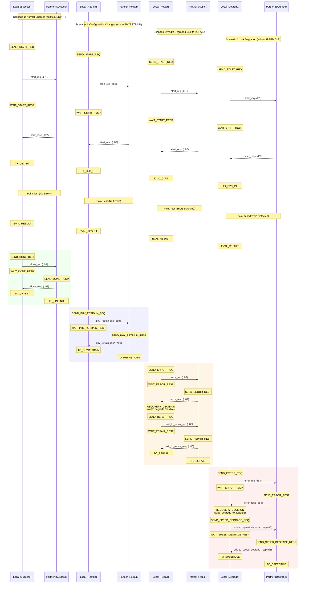
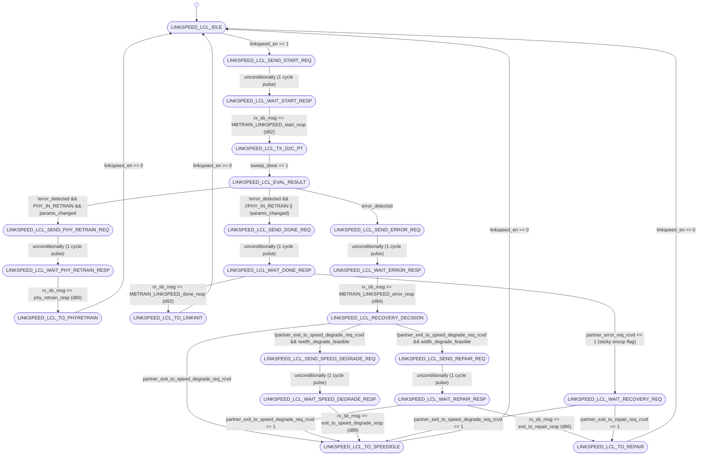
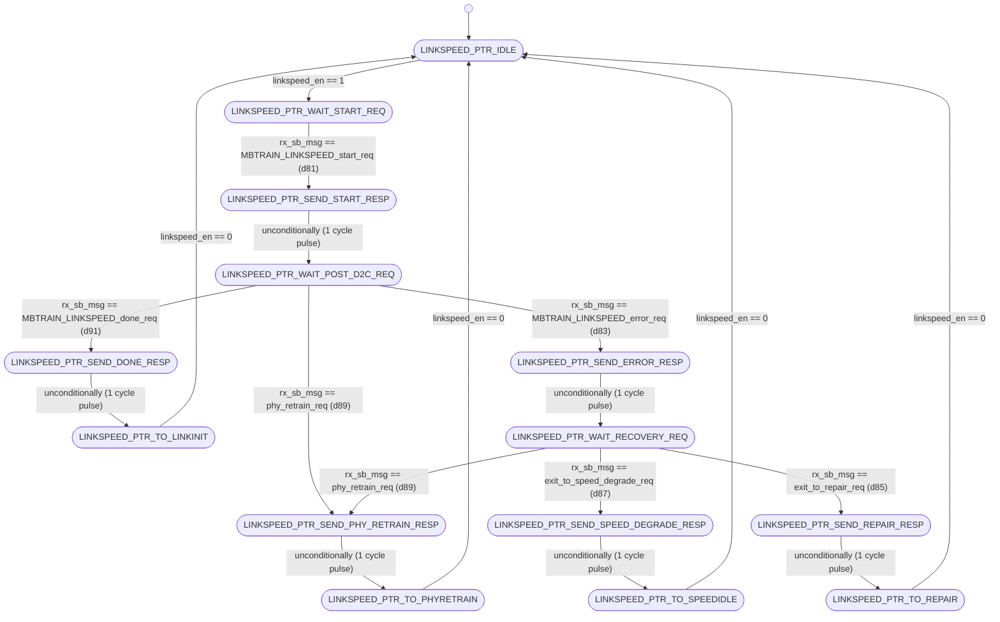

# UCIe PHY Layer: MBTRAIN.LINKSPEED Substate Design

This document details the architecture, finite state machines, interface ports, and sideband communication sequences for the twelfth Main Base Training substate: **`LINKSPEED`** (Link Stability and Speed Calibration).

---

## Section 1 — Substate Overview

### Why does this substate exist?
Once the data lane Phase Interpolators (PIs) and receiver deskew delay lines are calibrated, the physical layer must verify the stability and error-free operation of the link at the targeted operating data rate. The **`LINKSPEED`** substate performs a transmitter-initiated Point Test on all active lanes. If errors occur, the substate manages recovery options, including triggering a PHY retrain sequence, executing lane repair/re-routing, or degrading the operating speed.

### Objectives
1. **Link Stability Verification**: Run a D2C Point Test (`TX_D2C_PT`) at code=0 using a continuous LFSR pattern accompanied by Valid lane framing on all active mainband lanes.
2. **PHY Retrain Triggering**: Monitor changes in runtime configuration registers (`params_changed`) and request link retries if required (`phyretrain_req`).
3. **Lane Repair / Width Degradation Coordination**: Evaluate error profiles. If errors occur, check whether failing lanes can be repaired (Advanced packages) or if the link width can be degraded (Standard packages).
4. **Speed Degradation**: If repair or width degradation is not feasible, request speed degradation and loop back to `SPEEDIDLE` to train at the next lower speed.

### Entry and Exit Conditions
* **Entry Condition**: Enable signal `linkspeed_en` asserted high from the top-level sequencer (`unit_MBTRAIN_ctrl.sv`) after `DATATRAINCENTER2` completes.
* **Exit Condition**: Complete status flag `linkspeed_done` asserted back to the sequencer, prompting the FSMs to exit to `LINKINIT`, `REPAIR`, `SPEEDIDLE`, or `PHYRETRAIN`.

---

## Section 2 — Sideband Communication Sequence

The step-by-step sideband handshake protocol crosses the die boundary using the following sequence:



---

## Section 3 — FSM Architecture Overview

The substate utilizes a **decoupled initiator/responder FSM architecture**:
* **Local FSM (Initiator)**: Initiates the start handshake, enables the point test sweep, evaluates the per-lane pass/fail results, determines recovery steps on failure (repair/degrade/retrain), and sends status requests.
* **Partner FSM (Responder)**: Waits for start handshakes, enables responder point test mode (`partner_sweep_en = 1`), transitions to receiver electrical idle upon error detection, and returns the appropriate recovery/done responses.

### Decoupled Inter-die Handshaking
The Local FSM operates as the requester, transmitting sideband messages to the partner's Responder FSM. The Partner FSM on the local die responds to the remote initiator's requests. This prevents cross-die deadlocks, even during simultaneous retrain request collisions.

---

## Section 4 — FSM Diagram

### Local FSM Diagram (Initiator)
The state transitions of `unit_LINKSPEED_local.sv` are documented below:



---

### Partner FSM Diagram (Responder)
The state transitions of `unit_LINKSPEED_partner.sv` are documented below:



---

## Section 5 — Local FSM State Table

| State ID (logic [4:0]) | State Name | Purpose / Active Actions | Transition Condition |
| :---: | :--- | :--- | :--- |
| **`5'd0`** | `LINKSPEED_LCL_IDLE` | Wait state. Resets FSM registers (`req_speed_degrade_r`, `in_electrical_idle_r`, `linkspeed_success_lanes`). | Transitions to `LINKSPEED_LCL_SEND_START_REQ` when `linkspeed_en` is asserted. |
| **`5'd1`** | `LINKSPEED_LCL_SEND_START_REQ` | Drives `tx_sb_msg_valid = 1` with opcode `MBTRAIN_LINKSPEED_start_req` (d81) to partner. | Unconditionally advances to `LINKSPEED_LCL_WAIT_START_RESP` on the next clock. |
| **`5'd2`** | `LINKSPEED_LCL_WAIT_START_RESP` | Polls receiver sideband FIFO for start response from partner. | Advances to `LINKSPEED_LCL_TX_D2C_PT` when `rx_sb_msg_valid && rx_sb_msg == MBTRAIN_LINKSPEED_start_resp` (d82). |
| **`5'd3`** | `LINKSPEED_LCL_TX_D2C_PT` | Asserts `sweep_en` to trigger the sweep engine Point Test (code=0). | Advances to `LINKSPEED_LCL_EVAL_RESULT` once `sweep_done` is high. |
| **`5'd4`** | `LINKSPEED_LCL_EVAL_RESULT` | 1-cycle decision state. Latch results and evaluates lanes pass/fail profiles. | * Error: `SEND_ERROR_REQ`. <br>* Retrain: `SEND_PHY_RETRAIN_REQ`. <br>* Done: `SEND_DONE_REQ`. |
| **`5'd5`** | `LINKSPEED_LCL_SEND_PHY_RETRAIN_REQ` | Drives `tx_sb_msg_valid = 1` with opcode `exit_to_phy_retrain_req` (d89). | Unconditionally advances to `LINKSPEED_LCL_WAIT_PHY_RETRAIN_RESP` on the next clock. |
| **`5'd6`** | `LINKSPEED_LCL_WAIT_PHY_RETRAIN_RESP`| Awaits retrain response from remote partner. | Advances to `LINKSPEED_LCL_TO_PHYRETRAIN` when `exit_to_phy_retrain_resp` (d90) is received. |
| **`5'd7`** | `LINKSPEED_LCL_SEND_DONE_REQ` | Drives `tx_sb_msg_valid = 1` with opcode `MBTRAIN_LINKSPEED_done_req` (d91). | Unconditionally advances to `LINKSPEED_LCL_WAIT_DONE_RESP` on the next clock. |
| **`5'd8`** | `LINKSPEED_LCL_WAIT_DONE_RESP` | Polls for done response from partner. Snoops remote errors. | * Done: `TO_LINKINIT` on `done_resp` (d92). <br>* Remote error: `WAIT_RECOVERY_REQ` on `partner_error_req_rcvd`. |
| **`5'd9`** | `LINKSPEED_LCL_SEND_ERROR_REQ` | Drives `tx_sb_msg_valid = 1` with opcode `MBTRAIN_LINKSPEED_error_req` (d83). TX $\rightarrow$ Elec-Idle. | Unconditionally advances to `LINKSPEED_LCL_WAIT_ERROR_RESP` on the next clock. |
| **`5'd10`**| `LINKSPEED_LCL_WAIT_ERROR_RESP`| Polls for error handshake response from partner. | Advances to `LINKSPEED_LCL_RECOVERY_DECISION` when `error_resp` (d84) is received. |
| **`5'd11`**| `LINKSPEED_LCL_RECOVERY_DECISION` | 1-cycle recovery choice. Clears `PHY_IN_RETRAIN` (asserts `PHY_IN_RETRAIN_rst = 1`). | * Partner degrade: `TO_SPEEDIDLE`. <br>* Local degrade: `SEND_SPEED_DEGRADE_REQ`. <br>* Local repair: `SEND_REPAIR_REQ`. |
| **`5'd12`**| `LINKSPEED_LCL_SEND_REPAIR_REQ` | Drives `tx_sb_msg_valid = 1` with opcode `MBTRAIN_LINKSPEED_exit_to_repair_req` (d85). | Unconditionally advances to `LINKSPEED_LCL_WAIT_REPAIR_RESP` on the next clock. |
| **`5'd13`**| `LINKSPEED_LCL_WAIT_REPAIR_RESP` | Polls for repair response. Snoops partner speed degrade requests. | * Repair: `TO_REPAIR` on `exit_to_repair_resp` (d86). <br>* Partner degrade: `TO_SPEEDIDLE`. |
| **`5'd14`**| `LINKSPEED_LCL_SEND_SPEED_DEGRADE_REQ`| Drives `tx_sb_msg_valid = 1` with opcode `MBTRAIN_LINKSPEED_exit_to_speed_degrade_req` (d87). | Unconditionally advances to `LINKSPEED_LCL_WAIT_SPEED_DEGRADE_RESP` on the next clock. |
| **`5'd15`**| `LINKSPEED_LCL_WAIT_SPEED_DEGRADE_RESP`| Polls for speed degrade response. | Advances to `LINKSPEED_LCL_TO_SPEEDIDLE` when `exit_to_speed_degrade_resp` (d88) is received. |
| **`5'd16`**| `LINKSPEED_LCL_WAIT_RECOVERY_REQ`| Wait state. Local had no errors but remote partner did. Awaits partner request. | Transitions to `TO_SPEEDIDLE` or `TO_REPAIR` depending on snooped partner requests. |
| **`5'd17`**| `LINKSPEED_LCL_TO_LINKINIT` | Normal terminal success state. Asserts `linkinit_req = 1`. | Holds state until `linkspeed_en` is deasserted. |
| **`5'd18`**| `LINKSPEED_LCL_TO_REPAIR` | Terminal repair state. Asserts `repair_req = 1`. | Holds state until `linkspeed_en` is deasserted. |
| **`5'd19`**| `LINKSPEED_LCL_TO_SPEEDIDLE` | Terminal speed degrade state. Asserts `speedidle_req = 1`. | Holds state until `linkspeed_en` is deasserted. |
| **`5'd20`**| `LINKSPEED_LCL_TO_PHYRETRAIN` | Terminal retrain state. Asserts `phyretrain_req = 1`. | Holds state until `linkspeed_en` is deasserted. |

---

## Section 6 — Partner FSM State Table

| State ID (logic [3:0]) | State Name | Purpose / Active Actions | Transition Condition |
| :---: | :--- | :--- | :--- |
| **`4'd0`** | `LINKSPEED_PTR_IDLE` | Wait state. Resets partner-side FSM registers and `error_req_rcvd` flag. | Transitions to `LINKSPEED_PTR_WAIT_START_REQ` when `linkspeed_en` is asserted. |
| **`4'd1`** | `LINKSPEED_PTR_WAIT_START_REQ` | Polls for start request from remote local initiator. | Advances to `LINKSPEED_PTR_SEND_START_RESP` when `MBTRAIN_LINKSPEED_start_req` (d81) is received. |
| **`4'd2`** | `LINKSPEED_PTR_SEND_START_RESP` | Drives `tx_sb_msg_valid = 1` with opcode `MBTRAIN_LINKSPEED_start_resp` (d82). | Unconditionally advances to `LINKSPEED_PTR_WAIT_POST_D2C_REQ` on the next clock. |
| **`4'd3`** | `LINKSPEED_PTR_WAIT_POST_D2C_REQ` | Asserts `partner_sweep_en = 1` to drive patterns. Monitors incoming requests. | * Done: `SEND_DONE_RESP` on `done_req` (d91). <br>* Error: `SEND_ERROR_RESP` on `error_req` (d83). <br>* Retrain: `SEND_PHY_RETRAIN_RESP` on `phy_retrain_req` (d89). |
| **`4'd4`** | `LINKSPEED_PTR_SEND_DONE_RESP` | Drives `tx_sb_msg_valid = 1` with opcode `MBTRAIN_LINKSPEED_done_resp` (d92). | Unconditionally advances to `LINKSPEED_PTR_TO_LINKINIT` on the next clock. |
| **`4'd5`** | `LINKSPEED_PTR_SEND_ERROR_RESP` | Drives `tx_sb_msg_valid = 1` with opcode `MBTRAIN_LINKSPEED_error_resp` (d84). | Unconditionally advances to `LINKSPEED_PTR_WAIT_RECOVERY_REQ` on the next clock. |
| **`4'd6`** | `LINKSPEED_PTR_WAIT_RECOVERY_REQ`| Awaits partner recovery choice. Disables RX receivers (`rx_elec_idle = 1`). | * Retrain: `SEND_PHY_RETRAIN_RESP` on `phy_retrain_req` (d89). <br>* Degrade: `SEND_SPEED_DEGRADE_RESP` on `speed_degrade_req` (d87). <br>* Repair: `SEND_REPAIR_RESP` on `repair_req` (d85). |
| **`4'd7`** | `LINKSPEED_PTR_SEND_REPAIR_RESP` | Drives `tx_sb_msg_valid = 1` with opcode `MBTRAIN_LINKSPEED_exit_to_repair_resp` (d86). | Unconditionally advances to `LINKSPEED_PTR_TO_REPAIR` on the next clock. |
| **`4'd8`** | `LINKSPEED_PTR_SEND_SPEED_DEGRADE_RESP`| Drives `tx_sb_msg_valid = 1` with opcode `MBTRAIN_LINKSPEED_exit_to_speed_degrade_resp` (d88). | Unconditionally advances to `LINKSPEED_PTR_TO_SPEEDIDLE` on the next clock. |
| **`4'd9`** | `LINKSPEED_PTR_SEND_PHY_RETRAIN_RESP` | Drives `tx_sb_msg_valid = 1` with opcode `exit_to_phy_retrain_resp` (d90). | Unconditionally advances to `LINKSPEED_PTR_TO_PHYRETRAIN` on the next clock. |
| **`4'd10`**| `LINKSPEED_PTR_TO_LINKINIT` | Normal terminal success state. Asserts `linkinit_req = 1`. | Holds state until `linkspeed_en` is deasserted. |
| **`4'd11`**| `LINKSPEED_PTR_TO_REPAIR` | Terminal repair state. Asserts `repair_req = 1`. | Holds state until `linkspeed_en` is deasserted. |
| **`4'd12`**| `LINKSPEED_PTR_TO_SPEEDIDLE` | Terminal speed degrade state. Asserts `speedidle_req = 1`. | Holds state until `linkspeed_en` is deasserted. |
| **`4'd13`**| `LINKSPEED_PTR_TO_PHYRETRAIN` | Terminal retrain state. Asserts `phyretrain_req = 1`. | Holds state until `linkspeed_en` is deasserted. |

---

## Section 7 — Local FSM Execution Flow

The Local FSM sequences speed stability testing and recovery decisions:
1. **Point Test Triggering (`LINKSPEED_LCL_IDLE` $\rightarrow$ `SEND_START_REQ` $\rightarrow$ `WAIT_START_RESP` $\rightarrow$ `TX_D2C_PT`)**: Initiates the start handshake (`d81` / `d82`), then asserts `sweep_en = 1` to perform the 4K UI point test at clock phase delay code 0.
2. **Result Assessment (`LINKSPEED_LCL_EVAL_RESULT`)**: Samples D2C pass/fail flags per lane.
   * **Errors Observed**: Moves to the recovery flow (`LINKSPEED_LCL_SEND_ERROR_REQ`).
   * **No Errors & Retrain Config Changed**: Initiates retrain exit (`LINKSPEED_LCL_SEND_PHY_RETRAIN_REQ`).
   * **No Errors & Normal Success**: Moves to done sequence (`LINKSPEED_LCL_SEND_DONE_REQ`).
3. **Success / Done Path (`LINKSPEED_LCL_SEND_DONE_REQ` $\rightarrow$ `WAIT_DONE_RESP` $\rightarrow$ `TO_LINKINIT`)**: Sends done request (`d91`). If the partner reports errors during wait (`partner_error_req_rcvd`), it aborts done and transits to `WAIT_RECOVERY_REQ`. Otherwise, it receives done response (`d92`) and transitions to terminal `TO_LINKINIT`.
4. **Error Path & Recovery Choice (`LINKSPEED_LCL_SEND_ERROR_REQ` $\rightarrow$ `WAIT_ERROR_RESP` $\rightarrow$ `RECOVERY_DECISION`)**: Enters TX electrical idle, sends error request (`d83`), and waits for response (`d84`). In the 1-cycle `RECOVERY_DECISION` state, it clears `PHY_IN_RETRAIN` (sends a 1-cycle `PHY_IN_RETRAIN_rst` pulse) and evaluates repair vs. speed degradation.
   * **Width Degrade Feasible**: Requests lane repair (`LINKSPEED_LCL_SEND_REPAIR_REQ`).
   * **Width Degrade Not Feasible**: Requests speed degrade (`LINKSPEED_LCL_SEND_SPEED_DEGRADE_REQ`).
   * **Partner Degrade Snoop Active**: Transitions to `TO_SPEEDIDLE` directly.
5. **Repair Handshake (`LINKSPEED_LCL_SEND_REPAIR_REQ` $\rightarrow$ `WAIT_REPAIR_RESP` $\rightarrow$ `TO_REPAIR`)**: Sends request (`d85`). If the partner responds with speed degrade, it aborts and goes to `TO_SPEEDIDLE`. If the partner accepts, it receives response (`d86`) and enters terminal `TO_REPAIR`.
6. **Speed Degrade Handshake (`LINKSPEED_LCL_SEND_SPEED_DEGRADE_REQ` $\rightarrow$ `WAIT_SPEED_DEGRADE_RESP` $\rightarrow$ `TO_SPEEDIDLE`)**: Sends request (`d87`), receives response (`d88`), and enters terminal `TO_SPEEDIDLE`.

---

## Section 8 — Partner FSM Execution Flow

The Partner FSM implements responder actions for stability tests and error recovery:
1. **Start Protocol (`LINKSPEED_PTR_IDLE` $\rightarrow$ `WAIT_START_REQ` $\rightarrow$ `SEND_START_RESP`)**: Receives start request (`d81`) and responds (`d82`).
2. **Main Wait Loop (`LINKSPEED_PTR_WAIT_POST_D2C_REQ`)**: Asserts `partner_sweep_en = 1`, which overrides the local multiplexers to drive continuous LFSR test patterns with Valid framing. It monitors incoming messages:
   * **Done Request (`d91`)**: Acknowledges success. Transits to `SEND_DONE_RESP` $\rightarrow$ `TO_LINKINIT`.
   * **Error Request (`d83`)**: Acknowledges error detection. Transits to `SEND_ERROR_RESP` $\rightarrow$ `WAIT_RECOVERY_REQ`.
   * **Phy Retrain Request (`d89`)**: Acknowledges retrain. Transits to `SEND_PHY_RETRAIN_RESP` $\rightarrow$ `TO_PHYRETRAIN`.
3. **Error Recovery Loop (`LINKSPEED_PTR_WAIT_RECOVERY_REQ`)**: Disables the local receivers (`rx_elec_idle = 1`). Awaits recovery requests from the remote local initiator:
   * **Exit to Repair Request (`d85`)**: Returns `exit_to_repair_resp` (`d86`) via `SEND_REPAIR_RESP` and enters `TO_REPAIR`.
   * **Exit to Speed Degrade Request (`d87`)**: Returns `exit_to_speed_degrade_resp` (`d88`) via `SEND_SPEED_DEGRADE_RESP` and enters `TO_SPEEDIDLE`.
   * **Exit to Phy Retrain Request (`d89`)**: Returns retrain response (`d90`) via `SEND_PHY_RETRAIN_RESP` and enters `TO_PHYRETRAIN`.

---

## Section 9 — Wrapper Architecture

The substate wrapper (**`wrapper_LINKSPEED.sv`**) integrates the local and partner FSM modules:

### Instantiated Modules
1. **`u_LINKSPEED_local`**: Initiator FSM executing D2C point test, parsing errors, choosing speed degrade vs. lane repair, and requesting state exits.
2. **`u_LINKSPEED_partner`**: Responder FSM driving test patterns, entering receiver electrical idle on error, and replying to handshakes.

### Handshake Completion Logic
The wrapper performs a logical AND of both sub-state completion outputs:
```systemverilog
assign linkspeed_done = local_linkspeed_done_w & partner_linkspeed_done_w;
```

### Exit Route Requests
To ensure clean exits, the wrapper aggregates FSM exits:
```systemverilog
assign linkspeed_linkinit_req   = local_linkinit_req   & partner_linkinit_req;
assign linkspeed_speedidle_req  = local_speedidle_req  & partner_speedidle_req;
assign linkspeed_repair_req     = local_repair_req     & partner_repair_req;
assign linkspeed_phyretrain_req = local_phyretrain_req & partner_phyretrain_req;
```

### Sideband TX Arbitration
The wrapper arbitrates the shared sideband TX bus, prioritizing the Local FSM:
```systemverilog
assign tx_sb_msg_valid = local_tx_sb_msg_valid | partner_tx_sb_msg_valid;
assign tx_sb_msg       = local_tx_sb_msg_valid ? local_tx_sb_msg       : partner_tx_sb_msg;
assign tx_msginfo      = local_tx_sb_msg_valid ? local_tx_msginfo      : partner_tx_msginfo;
assign tx_data_field   = local_tx_sb_msg_valid ? local_tx_data_field   : partner_tx_data_field;
```

### Mainband Muxing and Control
Per specification §4.5.3.4.12, the wrapper dynamically configures mainband lanes based on FSM state flags:
```systemverilog
always_comb begin
    // Local FSM on error path: drive all TX drivers to Electrical Idle (2'b11)
    if (lcl_tx_elec_idle) begin
        mb_tx_trk_lane_sel  = 2'b11; // Track TX Low
        mb_tx_clk_lane_sel  = 2'b11;
        mb_tx_data_lane_sel = 2'b11;
        mb_tx_val_lane_sel  = 2'b11;
    end
    else begin
        mb_tx_trk_lane_sel  = 2'b00; // Track TX Low
        mb_tx_data_lane_sel = 2'b00; // Held Low by default (Active during sweep)
        mb_tx_val_lane_sel  = 2'b00; // Held Low by default
        mb_tx_clk_lane_sel  = (is_high_speed || is_continuous_clk_mode) ? 2'b01 : 2'b00;
    end

    // Partner FSM on error path: disable all receivers
    if (ptr_rx_elec_idle) begin
        mb_rx_trk_lane_sel  = 1'b0;
        mb_rx_clk_lane_sel  = 1'b0;
        mb_rx_data_lane_sel = 1'b0;
        mb_rx_val_lane_sel  = 1'b0;
    end
    else begin
        mb_rx_trk_lane_sel  = 1'b0;
        mb_rx_clk_lane_sel  = 1'b1;
        mb_rx_data_lane_sel = 1'b1;
        mb_rx_val_lane_sel  = 1'b1;
    end
end
```

---

## Section 10 — Wrapper Interface Table

The table below lists all interface ports on the substate wrapper `wrapper_LINKSPEED.sv`:

| Port Signal Name | Direction | Bit Width | Functional Description / Encodings |
| :--- | :---: | :---: | :--- |
| `lclk` | Input | 1 | LTSM clock domain input (1 GHz or 2 GHz). |
| `rst_n` | Input | 1 | Asynchronous active-low global reset. |
| `soft_rst_n` | Input | 1 | Synchronous active-low soft reset (clears registers). |
| `is_high_speed` | Input | 1 | Operating speed indicator. <br>Values: `1'b1` = speed > 32 GT/s, `1'b0` = speed <= 32 GT/s. |
| `is_continuous_clk_mode` | Input | 1 | Clock mode configuration. <br>Values: `1'b1` = Continuous clock mode, `1'b0` = Strobe mode. |
| `linkspeed_en` | Input | 1 | Sub-state enable signal from top controller (1 = Active, 0 = Disabled). |
| `linkspeed_done` | Output | 1 | Sub-state complete handshake output to top controller (1 = Complete, 0 = In progress). |
| `linkspeed_linkinit_req` | Output | 1 | Request exit to `LINKINIT` (1 = Exit requested, 0 = Idle). |
| `linkspeed_speedidle_req`| Output | 1 | Request exit to `SPEEDIDLE` (1 = Exit requested, 0 = Idle). |
| `linkspeed_repair_req` | Output | 1 | Request exit to `REPAIR` (1 = Exit requested, 0 = Idle). |
| `linkspeed_phyretrain_req`| Output | 1 | Request exit to `PHYRETRAIN` (1 = Exit requested, 0 = Idle). |
| `active_rx_lanes` | Input | 16 | Mask of active RX data lanes enabled on this die. |
| `width_degrade_feasible`| Input | 1 | Flag indicating a degraded link width pattern is feasible (1 = Feasible, 0 = Speed degrade required). |
| `PHY_IN_RETRAIN` | Input | 1 | Status indicating LTSM entered via PHY retrain path (1 = Active, 0 = Normal). |
| `params_changed` | Input | 1 | Status indicating register changed since previous retrain (1 = Changed, 0 = Unchanged). |
| `PHY_IN_RETRAIN_rst` | Output | 1 | 1-cycle active-high pulse instructing top LTSM to clear `PHY_IN_RETRAIN` flag. |
| `busy_bit_rst` | Output | 1 | 1-cycle active-high pulse instructing top LTSM to clear test busy bit. |
| `local_sweep_en` | Output | 1 | Command to shared sweep engine to execute local Point Test (1 = Sweep active, 0 = Idle). |
| `partner_sweep_en` | Output | 1 | Status indicating partner FSM is driving sweep patterns (1 = Active, 0 = Disabled). |
| `d2c_perlane_pass` | Input | 16 | Per-lane Point Test pass/fail results mask from sweep engine. |
| `local_sweep_done` | Input | 1 | Complete status from the shared sweep engine (1 = Completed, 0 = Sweeping). |
| `linkspeed_success_lanes`| Output | 16 | Evaluated per-lane pass mask sent to `REPAIR` sub-state. |
| `mb_tx_clk_lane_sel` | Output | 2 | Mainband Clock Transmitter multiplexer selector. <br>Values: `2'b00` = Low (0), `2'b01` = Active clock, `2'b11` = Electrical Idle. |
| `mb_tx_data_lane_sel`| Output | 2 | Mainband Data Transmitter multiplexer selector. <br>Values: same encoding as `mb_tx_clk_lane_sel`. |
| `mb_tx_val_lane_sel` | Output | 2 | Mainband Valid Transmitter multiplexer selector. <br>Values: same encoding as `mb_tx_clk_lane_sel`. |
| `mb_tx_trk_lane_sel` | Output | 2 | Mainband Track Transmitter multiplexer selector. <br>Values: same encoding as `mb_tx_clk_lane_sel`. |
| `mb_rx_clk_lane_sel` | Output | 1 | Mainband Clock Receiver enable. <br>Values: `1'b1` = Receiver enabled, `1'b0` = Disabled. |
| `mb_rx_data_lane_sel`| Output | 1 | Mainband Data Receiver enable. <br>Values: same encoding as `mb_rx_clk_lane_sel`. |
| `mb_rx_val_lane_sel` | Output | 1 | Mainband Valid Receiver enable. <br>Values: same encoding as `mb_rx_clk_lane_sel`. |
| `mb_rx_trk_lane_sel` | Output | 1 | Mainband Track Receiver enable. <br>Values: same encoding as `mb_rx_clk_lane_sel`. |
| `tx_sb_msg_valid` | Output | 1 | Strobe line driven to Async SB FIFO to launch a sideband message (1 = Strobe valid, 0 = Idle). |
| `tx_sb_msg` | Output | 8 | Opcode of the sideband message to transmit. <br>Values: `d81` = `MBTRAIN_LINKSPEED_start_req`, `d83` = `MBTRAIN_LINKSPEED_error_req`, `d85` = `MBTRAIN_LINKSPEED_exit_to_repair_req`, `d87` = `MBTRAIN_LINKSPEED_exit_to_speed_degrade_req`, `d89` = `phy_retrain_req` (from Local); `d82` = `MBTRAIN_LINKSPEED_start_resp`, `d84` = `MBTRAIN_LINKSPEED_error_resp`, `d86` = `MBTRAIN_LINKSPEED_exit_to_repair_resp`, `d88` = `MBTRAIN_LINKSPEED_exit_to_speed_degrade_resp`, `d90` = `phy_retrain_resp` (from Partner). |
| `tx_msginfo` | Output | 16 | Message info payload field sent on sideband (fixed at `16'h0000`). |
| `tx_data_field` | Output | 64 | 64-bit payload data field sent on sideband (fixed at `64'h0000000000000000`). |
| `rx_sb_msg_valid` | Input | 1 | Incoming message valid pulse from SB RX FIFO (1 = Valid message, 0 = Idle). |
| `rx_sb_msg` | Input | 8 | Opcode of the incoming sideband message. <br>Values: same encoding as `tx_sb_msg`. |

---

## Section 11 — Internal Signal Summary

| Internal Signal Name | Direction | Bit Width | Functional Description |
| :--- | :---: | :---: | :--- |
| `local_linkinit_req` | Internal | 1 | Exit to LINKINIT requested by `u_local`. |
| `partner_linkinit_req`| Internal | 1 | Exit to LINKINIT requested by `u_partner`. |
| `local_speedidle_req` | Internal | 1 | Exit to SPEEDIDLE requested by `u_local`. |
| `partner_speedidle_req`| Internal | 1 | Exit to SPEEDIDLE requested by `u_partner`. |
| `local_repair_req` | Internal | 1 | Exit to REPAIR requested by `u_local`. |
| `partner_repair_req` | Internal | 1 | Exit to REPAIR requested by `u_partner`. |
| `local_phyretrain_req`| Internal | 1 | Exit to PHYRETRAIN requested by `u_local`. |
| `partner_phyretrain_req`| Internal | 1 | Exit to PHYRETRAIN requested by `u_partner`. |
| `local_tx_sb_msg_valid` | Internal | 1 | SB TX valid pulse from `u_local`. |
| `local_tx_sb_msg` | Internal | 8 | Opcode driven by `u_local` (d81, d83, d85, d87, or d89). |
| `partner_tx_sb_msg_valid`| Internal | 1 | SB TX valid pulse from `u_partner`. |
| `partner_tx_sb_msg` | Internal | 8 | Opcode driven by `u_partner` (d82, d84, d86, d88, or d90). |
| `lcl_tx_elec_idle` | Internal | 1 | Flag indicating Local TX is entering electrical idle. |
| `ptr_rx_elec_idle` | Internal | 1 | Flag indicating Partner RX is entering electrical idle. |

---

## Section 12 — D2C_PT Interaction

The `LINKSPEED` substate verifies link integrity using the **`TX_D2C_PT`** (Transmitter-Initiated Point Test) architecture:
* **Sweep Parameter**: None (Point Test evaluated statically at clock delay code=0).
* **Initiator**: Local die FSM (asserts `local_sweep_en` to trigger the sweep engine Point Test).
* **Receiver**: Partner die Data receivers (lanes 0-15).
* **Test Direction**: The Local die sweeps the Data lines with an LFSR pattern, and the Partner die receiver verifies transitions at code=0, calculating error profiles.
* **Results Processing**: If the Partner die receiver encounters any errors (total error count exceeds threshold), it enters electrical idle and sends an error request. Results are mapped per-lane in `linkspeed_success_lanes` to feed the subsequent `REPAIR` sub-state.

---

## Section 13 — Summary

The **`LINKSPEED`** substate design provides a robust, decoupled, and spec-compliant method for validating link stability at the operating speed. By executing a transmitter-initiated Point Test and evaluating individual lane errors, the block isolates physical failures and coordinates recovery paths. The FSMs arbitrate Sideband transactions and manage Mainband overrides, directing the link to a normal success exit (`LINKINIT`), an equalizer preset retraining phase (`PHYRETRAIN`), a degraded width re-routing phase (`REPAIR`), or a speed fallback phase (`SPEEDIDLE`).
