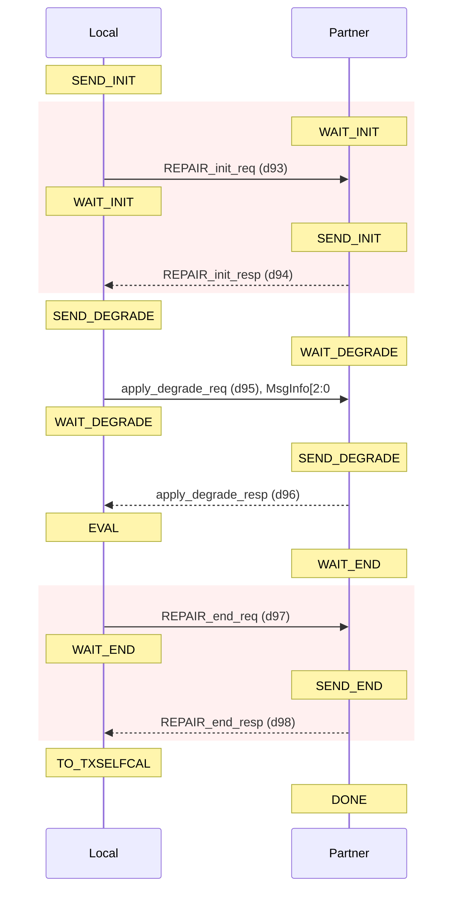
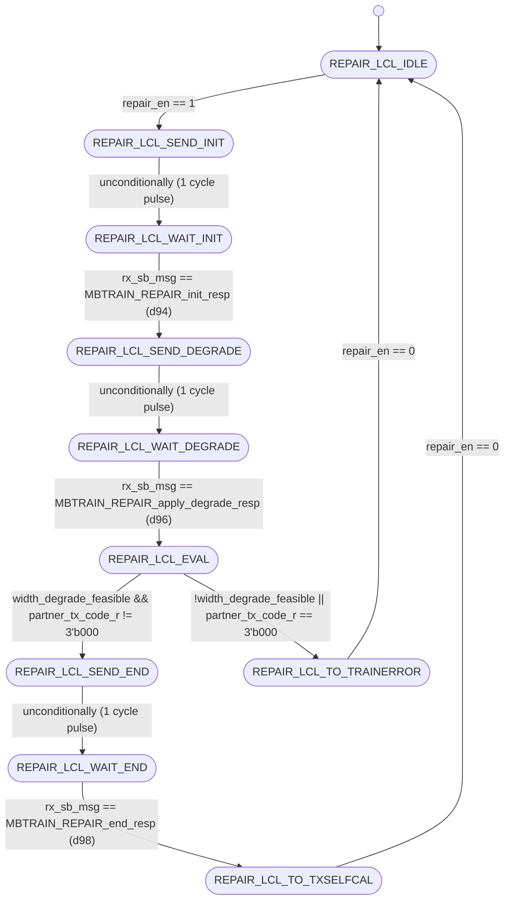
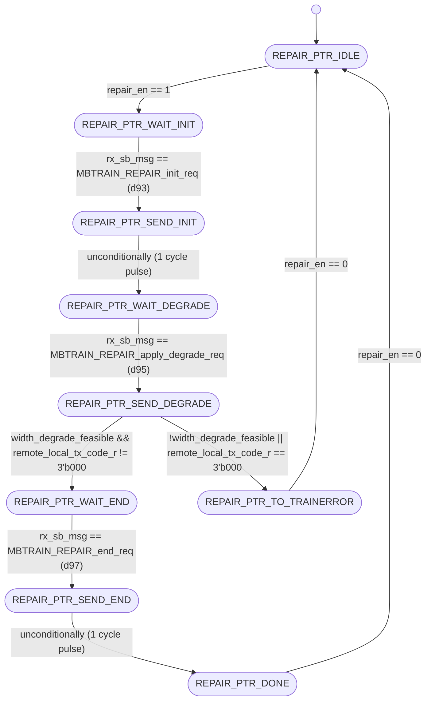

# UCIe PHY Layer: MBTRAIN.REPAIR Substate Design

This document details the architecture, finite state machines, interface ports, and sideband communication sequences for the thirteenth Main Base Training substate: **`REPAIR`** (Link Repair and Width Degradation).

---

## Section 1 — Substate Overview

### Why does this substate exist?
Physical damage, trace defects, or calibration failures on specific data lanes can prevent the link from functioning reliably at full width. The **`REPAIR`** substate resolves these failures by dynamically reconfiguring the operational width of the link. For Advanced package implementations, redundant lanes are re-routed to bypass failing lines. For Standard packages, the system degrades the link width (e.g., from x16 to x8, or from x8 to x4) using only the functional halves or quarters.

### Objectives
1. **Apply Lane Reconfiguration**: Route functional signals around defective lines by programming either redundant repair paths or degraded lane subsets.
2. **Width Degrade Negotiation**: Exchange physical lane status flags between the Local and Partner FSMs over the sideband to resolve a mutually compatible degraded lane map.
3. **LSM Mask Enforcement**: Drive the final negotiated lane masks statically to the physical receivers and transmitters.
4. **Coordinated Exit to TXSELFCAL**: Transition both initiator and responder dies to `TXSELFCAL` to recalibrate the link at the newly resolved width.

### Entry and Exit Conditions
* **Entry Condition**: Enable signal `repair_en` asserted high from the top sequencer (`unit_MBTRAIN_ctrl.sv`) after receiving a loopback request from `LINKSPEED` due to lane failure.
* **Exit Condition**: Complete status flag `repair_done` asserted back to the sequencer, prompting the FSMs to exit to `TXSELFCAL` or `TRAINERROR`.

---

## Section 2 — Sideband Communication Sequence

The step-by-step sideband handshake protocol crosses the die boundary using the following sequence:



---

## Section 3 — FSM Architecture Overview

The substate utilizes a **decoupled initiator/responder FSM architecture**:
* **Local FSM (Initiator)**: Initiates the start handshake, selects and transmits the local transmitter's degraded lane code (`degraded_tx_lane_map_code`), evaluates feasibility, and sends end requests.
* **Partner FSM (Responder)**: Waits for start requests, captures the remote local's TX code, compares it with the local die's configuration, applies the final transmitter and receiver lane masks (`mb_tx_data_lane_mask` and `mb_rx_data_lane_mask`), and responds to handshakes.

### Decoupled Inter-die Handshaking
The Local FSM acts as the requester, transmitting sideband messages to the partner's Responder FSM. The Partner FSM on the local die responds to the remote initiator's requests. This decoupled path allows both dies to independently resolve their lane profiles.

---

## Section 4 — FSM Diagram

### Local FSM Diagram (Initiator)
The state transitions of `unit_REPAIR_local.sv` are documented below:



---

### Partner FSM Diagram (Responder)
The state transitions of `unit_REPAIR_partner.sv` are documented below:



---

## Section 5 — Local FSM State Table

| State ID (logic [3:0]) | State Name | Purpose / Active Actions | Transition Condition |
| :---: | :--- | :--- | :--- |
| **`4'd0`** | `REPAIR_LCL_IDLE` | Wait state. Clears local variables. | Transitions to `REPAIR_LCL_SEND_INIT` when `repair_en` is asserted. |
| **`4'd1`** | `REPAIR_LCL_SEND_INIT` | Drives `tx_sb_msg_valid = 1` with opcode `MBTRAIN_REPAIR_init_req` (d93) to partner. | Unconditionally advances to `REPAIR_LCL_WAIT_INIT` on the next clock. |
| **`4'd2`** | `REPAIR_LCL_WAIT_INIT` | Polls receiver sideband FIFO for init response from partner. | Advances to `REPAIR_LCL_SEND_DEGRADE` when `rx_sb_msg_valid && rx_sb_msg == MBTRAIN_REPAIR_init_resp` (d94). |
| **`4'd3`** | `REPAIR_LCL_SEND_DEGRADE` | Drives `tx_sb_msg_valid = 1` with opcode `MBTRAIN_REPAIR_apply_degrade_req` (d95), embedding `degraded_tx_lane_map_code` in `tx_msginfo[2:0]`. | Unconditionally advances to `REPAIR_LCL_WAIT_DEGRADE` on the next clock. |
| **`4'd4`** | `REPAIR_LCL_WAIT_DEGRADE` | Polls receiver sideband FIFO for degrade response from partner. | Advances to `REPAIR_LCL_EVAL` when `rx_sb_msg_valid && rx_sb_msg == MBTRAIN_REPAIR_apply_degrade_resp` (d96). |
| **`4'd5`** | `REPAIR_LCL_EVAL` | 1-cycle evaluation state. Checks if our TX width degrade code or partner's code is valid. | * Success: `REPAIR_LCL_SEND_END` (if feasible and partner code != `3'b000`). <br>* Error: `REPAIR_LCL_TO_TRAINERROR` (if unfeasible or partner code == `3'b000`). |
| **`4'd6`** | `REPAIR_LCL_SEND_END` | Drives `tx_sb_msg_valid = 1` with opcode `MBTRAIN_REPAIR_end_req` (d97) to partner. | Unconditionally advances to `REPAIR_LCL_WAIT_END` on the next clock. |
| **`4'd7`** | `REPAIR_LCL_WAIT_END` | Polls receiver sideband FIFO for end response from partner. | Advances to `REPAIR_LCL_TO_TXSELFCAL` when `rx_sb_msg_valid && rx_sb_msg == MBTRAIN_REPAIR_end_resp` (d98). |
| **`4'd8`** | `REPAIR_LCL_TO_TXSELFCAL` | Normal terminal success state. Asserts completion flag `repair_done = 1`. | Holds state and `repair_done` until `repair_en` is deasserted. |
| **`4'd9`** | `REPAIR_LCL_TO_TRAINERROR` | Terminal error state. Asserts `trainerror_req = 1` and `repair_done = 1`. | Holds state until `repair_en` is deasserted. |

---

## Section 6 — Partner FSM State Table

| State ID (logic [3:0]) | State Name | Purpose / Active Actions | Transition Condition |
| :---: | :--- | :--- | :--- |
| **`4'd0`** | `REPAIR_PTR_IDLE` | Wait state. Clears masks and captured codes. | Transitions to `REPAIR_PTR_WAIT_INIT` when `repair_en` is asserted. |
| **`4'd1`** | `REPAIR_PTR_WAIT_INIT` | Polls receiver sideband FIFO for init request from initiator. | Advances to `REPAIR_PTR_SEND_INIT` when `rx_sb_msg_valid && rx_sb_msg == MBTRAIN_REPAIR_init_req` (d93). |
| **`4'd2`** | `REPAIR_PTR_SEND_INIT` | Drives `tx_sb_msg_valid = 1` with opcode `MBTRAIN_REPAIR_init_resp` (d94). | Unconditionally advances to `REPAIR_PTR_WAIT_DEGRADE` on the next clock. |
| **`4'd3`** | `REPAIR_PTR_WAIT_DEGRADE` | Polls receiver sideband FIFO for degrade request. Captures remote TX code in `remote_local_tx_code_r`. | Advances to `REPAIR_PTR_SEND_DEGRADE` when `rx_sb_msg_valid && rx_sb_msg == MBTRAIN_REPAIR_apply_degrade_req` (d95). |
| **`4'd4`** | `REPAIR_PTR_SEND_DEGRADE` | Drives `tx_sb_msg_valid = 1` with opcode `MBTRAIN_REPAIR_apply_degrade_resp` (d96). Evaluates final lane masks. | * Success: `REPAIR_PTR_WAIT_END` (if feasible and remote code != `3'b000`). <br>* Error: `REPAIR_PTR_TO_TRAINERROR` (if unfeasible or remote code == `3'b000`). |
| **`4'd5`** | `REPAIR_PTR_WAIT_END` | Polls receiver sideband FIFO for end request from partner. | Advances to `REPAIR_PTR_SEND_END` when `rx_sb_msg_valid && rx_sb_msg == MBTRAIN_REPAIR_end_req` (d97). |
| **`4'd6`** | `REPAIR_PTR_SEND_END` | Drives `tx_sb_msg_valid = 1` with opcode `MBTRAIN_REPAIR_end_resp` (d98). | Unconditionally advances to `REPAIR_PTR_DONE` on the next clock. |
| **`4'd7`** | `REPAIR_PTR_DONE` | Normal terminal success state. Asserts completion flag `repair_done = 1`. | Holds state and `repair_done` until `repair_en` is deasserted. |
| **`4'd8`** | `REPAIR_PTR_TO_TRAINERROR` | Terminal error state. Asserts `trainerror_req = 1`. | Holds state until `repair_en` is deasserted. |

---

## Section 7 — Local FSM Execution Flow

The Local FSM transitions through the following stages:
1. **Enable and Start Handshake (`REPAIR_LCL_IDLE` $\rightarrow$ `SEND_INIT` $\rightarrow$ `WAIT_INIT`)**: Upon receiving the enable pulse `repair_en = 1`, the Local FSM issues an init request (`d93`) and waits for the partner's handshake response (`d94`).
2. **Width Degrade Request (`REPAIR_LCL_SEND_DEGRADE` $\rightarrow$ `WAIT_DEGRADE`)**: The FSM sends a degrade request (`d95`) containing its local best degraded TX code (`degraded_tx_lane_map_code`) in `tx_msginfo[2:0]`. It then awaits the partner's response (`d96`).
3. **Resolution Evaluation (`REPAIR_LCL_EVAL`)**: The FSM executes a 1-cycle verification check:
   * *Feasible*: If the local width degrade is feasible and the partner's captured TX code is not `3'b000` (fail), it proceeds to the done sequence (`REPAIR_LCL_SEND_END`).
   * *Unfeasible*: If either side resolved "Degrade not possible," it exits to terminal `REPAIR_LCL_TO_TRAINERROR`.
4. **End Handshake (`REPAIR_LCL_SEND_END` $\rightarrow$ `WAIT_END` $\rightarrow$ `TO_TXSELFCAL`)**: Sends an end request (`d97`), receives the response (`d98`), and enters terminal `TO_TXSELFCAL` to report completion.

---

## Section 8 — Partner FSM Execution Flow

The Partner FSM sequences the lane mask application rules:
1. **Start Protocol (`REPAIR_PTR_IDLE` $\rightarrow$ `WAIT_INIT` $\rightarrow$ `SEND_INIT` $\rightarrow$ `WAIT_DEGRADE`)**: Receives the initiator's start request, replies, and waits for the degrade request.
2. **Lane Mask Resolution (`REPAIR_PTR_WAIT_DEGRADE` $\rightarrow$ `SEND_DEGRADE`)**: Receives the initiator's degrade request, captures `remote_local_tx_code_r = rx_msginfo[2:0]`, and returns `apply_degrade_resp` (`d96`). It evaluates and sets the final TX/RX masks based on the module type rules:
   * **Case A: Remote die is fully functional (remote == full width)**:
     Set TX and RX masks = `degraded_tx_lane_map_code` (our own code).
   * **Case B: We are fully functional (our code == full width)**:
     Set TX and RX masks = `remote_local_tx_code_r` (remote code).
   * **Case C: Both sides have specific degrades (neither is full width)**:
     Set TX mask = `degraded_tx_lane_map_code` (our TX code), RX mask = `remote_local_tx_code_r` (remote code).
3. **End Handshake (`REPAIR_PTR_WAIT_END` $\rightarrow$ `SEND_END` $\rightarrow$ `DONE` or `TRAINERROR`)**: If the resolved masks are valid, it awaits the initiator's end request (`d97`), returns the response (`d98`), and enters terminal `REPAIR_PTR_DONE`. If either code was invalid (`3'b000`), it transitions to `REPAIR_PTR_TO_TRAINERROR`.

---

## Section 9 — Wrapper Architecture

The substate wrapper (**`wrapper_REPAIR.sv`**) integrates the Local and Partner FSMs, as well as the combinational width evaluation decoder:

```text
       ┌────────────────────────────────────────────────────────┐
       │                     wrapper_REPAIR                     │
       │                                                        │
       │   ┌─────────────────────────┐                          │
       │   │ u_negotiated_lanes      │                          │
       │   │                         │                          │
       │   │  degraded_lane_map_code─┼────────────┐             │
       │   │  degrade_feasible───────┼─────────┐  │             │
       │   │  is_x16_module──────────┼───────┐ │  │             │
       │   └─────────────────────────┘       │ │  │             │
       │                                     ▼ ▼  ▼             │
       │   ┌─────────────────────────┐     ┌───────────┐        │
       │   │ u_local                 │     │ u_partner │        │
       │   │ (SB Handshake & Error)  │     │ (Masks)   │        │
       │   └────────────┬────────────┘     └─────┬─────┘        │
       │                │                        │              │
       │                ▼                        ▼              │
       │            SB TX valid              SB TX valid        │
       │                └────────────┬───────────┘              │
       │                             ▼                          │
       │                     SB TX Arbitration                  │
       └────────────────────────────────────────────────────────┘
```

### Instantiated Sub-components
1. **`u_negotiated_lanes` (Internal Utility)**: A combinational decoder that translates the 3-bit lane masks into 16-bit active-lane maps, parses the physical TX success mask from the preceding `LINKSPEED` point test, and evaluates width degradation feasibility.
2. **`u_REPAIR_local`**: Initiator FSM executing the Sideband handshake and checking for global failure overrides.
3. **`u_REPAIR_partner`**: Responder FSM managing the final lane mask registers (`mb_tx_data_lane_mask` and `mb_rx_data_lane_mask`) based on resolved inter-die parameters.

### Handshake Completion Logic
The wrapper performs a logical AND of the completion flags from both FSMs:
```systemverilog
assign repair_done = local_repair_done_w & partner_repair_done_w;
assign trainerror_req = local_trainerror_req_w | partner_trainerror_req_w;
```

### Sideband TX Arbitration
The wrapper arbitrates the shared sideband TX signals:
```systemverilog
assign tx_sb_msg_valid = local_tx_sb_msg_valid | partner_tx_sb_msg_valid;
assign tx_sb_msg       = local_tx_sb_msg_valid ? local_tx_sb_msg       : partner_tx_sb_msg;
assign tx_msginfo      = local_tx_sb_msg_valid ? local_tx_msginfo      : partner_tx_msginfo;
assign tx_data_field   = local_tx_sb_msg_valid ? local_tx_data_field   : partner_tx_data_field;
```

### Static Mainband Lane Configurations
Per specification §4.5.3.4.13, during `REPAIR`, clock transmitters are held low, and track, data, and valid transmitters and receivers are held low:
```systemverilog
assign mb_tx_clk_lane_sel  = 2'b01;  // Held Low
assign mb_tx_data_lane_sel = 2'b00;  // Held Low
assign mb_tx_val_lane_sel  = 2'b00;  // Held Low
assign mb_tx_trk_lane_sel  = 2'b00;  // Held Low
assign mb_rx_clk_lane_sel  = 1'b1 ;  // Enabled
assign mb_rx_data_lane_sel = 1'b0 ;  // Disabled
assign mb_rx_val_lane_sel  = 1'b0 ;  // Disabled
assign mb_rx_trk_lane_sel  = 1'b0 ;  // Disabled
```

---

## Section 10 — Wrapper Interface Table

The table below lists all interface ports on the substate wrapper `wrapper_REPAIR.sv`:

| Port Signal Name | Direction | Bit Width | Functional Description / Encodings |
| :--- | :---: | :---: | :--- |
| `lclk` | Input | 1 | LTSM clock domain input (1 GHz or 2 GHz). |
| `rst_n` | Input | 1 | Asynchronous active-low global reset. |
| `soft_rst_n` | Input | 1 | Synchronous active-low soft reset (clears registers). |
| `repair_en` | Input | 1 | Sub-state enable signal from top controller (1 = Active, 0 = Disabled). |
| `repair_done` | Output | 1 | Sub-state complete handshake output to top controller (1 = Complete, 0 = In progress). |
| `trainerror_req` | Output | 1 | Fatal error indicator requesting TRAINERROR entry (1 = Error, 0 = Normal). |
| `success_tx_lanes` | Input | 16 | Bitmask of physical TX lanes that passed the preceding `LINKSPEED` point test. |
| `rf_cap_SPMW` | Input | 1 | Standard Package Module Width capability configuration bit. |
| `rf_ctrl_target_link_width`| Input | 4 | Target link width configuration from register control. |
| `param_UCIe_S_x8` | Input | 1 | Forced x8 mode configuration parameter. |
| `mb_tx_data_lane_mask`| Output | 3 | Resolved 3-bit TX lane mask encoding driven back to the PHY multiplexers. |
| `mb_rx_data_lane_mask`| Output | 3 | Resolved 3-bit RX lane mask encoding driven back to the PHY multiplexers. |
| `active_rx_lanes` | Output | 16 | 16-bit one-hot mask representing active RX data lanes after decoding. |
| `degrade_feasible` | Output | 1 | Flag indicating a degraded lane configuration is possible (1 = Feasible, 0 = Speed degrade required). |
| `mbinit_rx_data_lane_mask`| Input | 3 | Initial RX lane mask loaded during RESET/MBINIT phases. |
| `mbinit_tx_data_lane_mask`| Input | 3 | Initial TX lane mask loaded during RESET/MBINIT phases. |
| `state_n_0` | Input | 8 | Current LTSM state log index (`ltsm_state_n_pkg::state_n_e` enum). |
| `mb_tx_clk_lane_sel` | Output | 2 | Mainband Clock Transmitter multiplexer selector. <br>Values: `2'b00` = Low (0), `2'b01` = Active clock, `2'b11` = Electrical Idle. |
| `mb_tx_data_lane_sel`| Output | 2 | Mainband Data Transmitter multiplexer selector. <br>Values: same encoding as `mb_tx_clk_lane_sel`. |
| `mb_tx_val_lane_sel` | Output | 2 | Mainband Valid Transmitter multiplexer selector. <br>Values: same encoding as `mb_tx_clk_lane_sel`. |
| `mb_tx_trk_lane_sel` | Output | 2 | Mainband Track Transmitter multiplexer selector. <br>Values: same encoding as `mb_tx_clk_lane_sel`. |
| `mb_rx_clk_lane_sel` | Output | 1 | Mainband Clock Receiver enable. <br>Values: `1'b1` = Receiver enabled, `1'b0` = Disabled. |
| `mb_rx_data_lane_sel`| Output | 1 | Mainband Data Receiver enable. <br>Values: same encoding as `mb_rx_clk_lane_sel`. |
| `mb_rx_val_lane_sel` | Output | 1 | Mainband Valid Receiver enable. <br>Values: same encoding as `mb_rx_clk_lane_sel`. |
| `mb_rx_trk_lane_sel` | Output | 1 | Mainband Track Receiver enable. <br>Values: same encoding as `mb_rx_clk_lane_sel`. |
| `tx_sb_msg_valid` | Output | 1 | Strobe line driven to Async SB FIFO to launch a sideband message (1 = Strobe valid, 0 = Idle). |
| `tx_sb_msg` | Output | 8 | Opcode of the sideband message to transmit. <br>Values: `d93` = `MBTRAIN_REPAIR_init_req`, `d95` = `MBTRAIN_REPAIR_apply_degrade_req`, `d97` = `MBTRAIN_REPAIR_end_req` (from Local); `d94` = `MBTRAIN_REPAIR_init_resp`, `d96` = `MBTRAIN_REPAIR_apply_degrade_resp`, `d98` = `MBTRAIN_REPAIR_end_resp` (from Partner). |
| `tx_msginfo` | Output | 16 | Message info payload field sent on sideband (contains target degraded lane map code `MsgInfo[2:0]` if degrade request). |
| `tx_data_field` | Output | 64 | 64-bit payload data field sent on sideband (fixed at `64'h0000000000000000`). |
| `rx_sb_msg_valid` | Input | 1 | Incoming message valid pulse from SB RX FIFO (1 = Valid message, 0 = Idle). |
| `rx_sb_msg` | Input | 8 | Opcode of the incoming sideband message. <br>Values: same encoding as `tx_sb_msg`. |
| `rx_msginfo` | Input | 16 | Message info payload field of the incoming sideband message. |

---

## Section 11 — Internal Signal Summary

| Internal Signal Name | Direction | Bit Width | Functional Description |
| :--- | :---: | :---: | :--- |
| `local_repair_done_w` | Internal | 1 | Handshake completion output from `u_REPAIR_local`. |
| `partner_repair_done_w` | Internal | 1 | Handshake completion output from `u_REPAIR_partner`. |
| `local_trainerror_req_w`| Internal | 1 | Failure override output from `u_REPAIR_local`. |
| `partner_trainerror_req_w`| Internal | 1 | Failure override output from `u_REPAIR_partner`. |
| `local_tx_sb_msg_valid` | Internal | 1 | Sideband TX valid strobe driven by Local FSM. |
| `local_tx_sb_msg` | Internal | 8 | Opcode driven by Local FSM (d93, d95, or d97). |
| `partner_tx_sb_msg_valid`| Internal | 1 | Sideband TX valid strobe driven by Partner FSM. |
| `partner_tx_sb_msg` | Internal | 8 | Opcode driven by Partner FSM (d94, d96, or d98). |
| `degraded_lane_map_code`| Internal | 3 | Resolved 3-bit width degrade map code from `u_negotiated_lanes`. |
| `is_x16_module` | Internal | 1 | Configuration indicator for x16 full width. |

---

## Section 12 — D2C_PT Interaction

The `REPAIR` sub-state does not perform active sweeps or point tests:
* **Sweep Parameter**: None (static reconfiguration only).
* **Initiator**: Local die FSM.
* **Receiver**: Partner die.
* **Test Direction**: Not Applicable.
* **Aggregated Results**: This substate reconfigures the link width statically by updating the 3-bit lane masks (`mb_tx_data_lane_mask` and `mb_rx_data_lane_mask`) based on evaluation results calculated during the preceding `LINKSPEED` point test (`success_tx_lanes`).

---

## Section 13 — Summary

The **`REPAIR`** substate design provides a robust, decoupled method for applying lane repair and width degradation on Standard packages. By executing dual init, degrade, and end handshakes, it coordinates inter-die parameters to align active lane masks on both physical transceivers. The wrapper abstracts the complexity of the combinational decoder (`unit_negotiated_lanes`) and arbitrates Sideband traffic, presenting a clean completion and error interface to the top controller.
