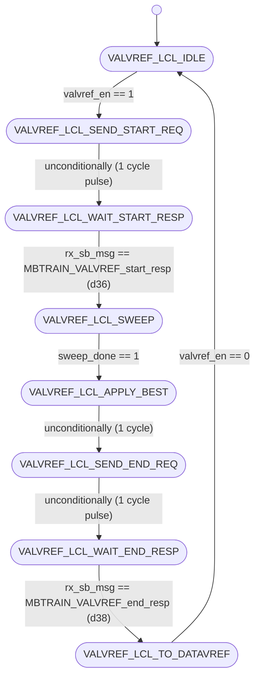
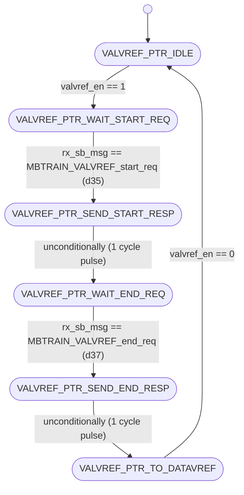

# VALVREF FSM Diagrams

## Local FSM

```mermaid
flowchart TD
VALVREF_LCL_IDLE(["VALVREF_LCL_IDLE"])
VALVREF_LCL_SEND_START_REQ(["VALVREF_LCL_SEND_START_REQ"])
VALVREF_LCL_WAIT_START_RESP(["VALVREF_LCL_WAIT_START_RESP"])
VALVREF_LCL_SWEEP(["VALVREF_LCL_SWEEP"])
VALVREF_LCL_APPLY_BEST(["VALVREF_LCL_APPLY_BEST"])
VALVREF_LCL_SEND_END_REQ(["VALVREF_LCL_SEND_END_REQ"])
VALVREF_LCL_WAIT_END_RESP(["VALVREF_LCL_WAIT_END_RESP"])
VALVREF_LCL_TO_DATAVREF(["VALVREF_LCL_TO_DATAVREF"])
START1((" "))

START1 --> VALVREF_LCL_IDLE
VALVREF_LCL_IDLE -->|"valvref_en == 1"| VALVREF_LCL_SEND_START_REQ
VALVREF_LCL_SEND_START_REQ -->|"unconditionally (1 cycle pulse)"| VALVREF_LCL_WAIT_START_RESP
VALVREF_LCL_WAIT_START_RESP -->|"rx_sb_msg == MBTRAIN_VALVREF_start_resp (d36)"| VALVREF_LCL_SWEEP
VALVREF_LCL_SWEEP -->|"sweep_done == 1"| VALVREF_LCL_APPLY_BEST
VALVREF_LCL_APPLY_BEST -->|"unconditionally (1 cycle)"| VALVREF_LCL_SEND_END_REQ
VALVREF_LCL_SEND_END_REQ -->|"unconditionally (1 cycle pulse)"| VALVREF_LCL_WAIT_END_RESP
VALVREF_LCL_WAIT_END_RESP -->|"rx_sb_msg == MBTRAIN_VALVREF_end_resp (d38)"| VALVREF_LCL_TO_DATAVREF
VALVREF_LCL_TO_DATAVREF -->|"valvref_en == 0"| VALVREF_LCL_IDLE
```

## Partner FSM

```mermaid
flowchart TD
VALVREF_PTR_IDLE(["VALVREF_PTR_IDLE"])
VALVREF_PTR_WAIT_START_REQ(["VALVREF_PTR_WAIT_START_REQ"])
VALVREF_PTR_SEND_START_RESP(["VALVREF_PTR_SEND_START_RESP"])
VALVREF_PTR_WAIT_END_REQ(["VALVREF_PTR_WAIT_END_REQ"])
VALVREF_PTR_SEND_END_RESP(["VALVREF_PTR_SEND_END_RESP"])
VALVREF_PTR_TO_DATAVREF(["VALVREF_PTR_TO_DATAVREF"])
START2((" "))

START2 --> VALVREF_PTR_IDLE
VALVREF_PTR_IDLE -->|"valvref_en == 1"| VALVREF_PTR_WAIT_START_REQ
VALVREF_PTR_WAIT_START_REQ -->|"rx_sb_msg == MBTRAIN_VALVREF_start_req (d35)"| VALVREF_PTR_SEND_START_RESP
VALVREF_PTR_SEND_START_RESP -->|"unconditionally (1 cycle pulse)"| VALVREF_PTR_WAIT_END_REQ
VALVREF_PTR_WAIT_END_REQ -->|"rx_sb_msg == MBTRAIN_VALVREF_end_req (d37)"| VALVREF_PTR_SEND_END_RESP
VALVREF_PTR_SEND_END_RESP -->|"unconditionally (1 cycle pulse)"| VALVREF_PTR_TO_DATAVREF
VALVREF_PTR_TO_DATAVREF -->|"valvref_en == 0"| VALVREF_PTR_IDLE
```

