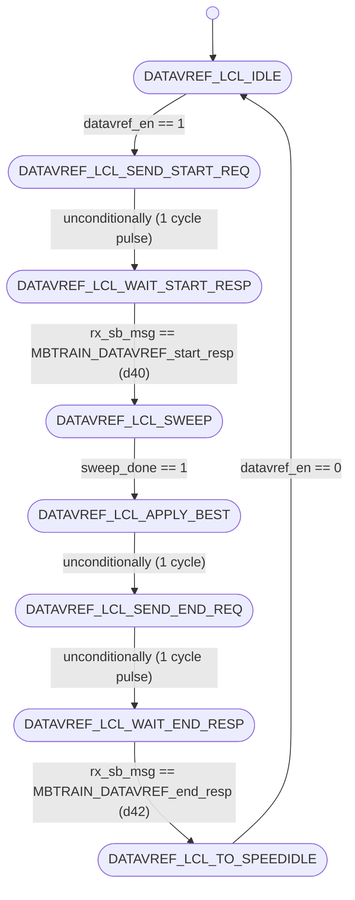
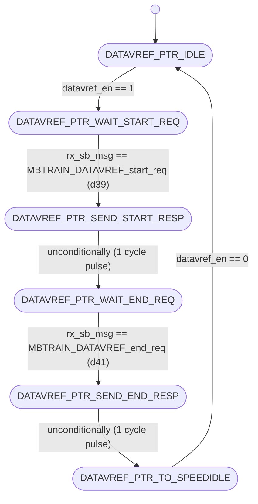

# DATAVREF FSM Diagrams

## Local FSM

```mermaid
flowchart TD
DATAVREF_LCL_IDLE(["DATAVREF_LCL_IDLE"])
DATAVREF_LCL_SEND_START_REQ(["DATAVREF_LCL_SEND_START_REQ"])
DATAVREF_LCL_WAIT_START_RESP(["DATAVREF_LCL_WAIT_START_RESP"])
DATAVREF_LCL_SWEEP(["DATAVREF_LCL_SWEEP"])
DATAVREF_LCL_APPLY_BEST(["DATAVREF_LCL_APPLY_BEST"])
DATAVREF_LCL_SEND_END_REQ(["DATAVREF_LCL_SEND_END_REQ"])
DATAVREF_LCL_WAIT_END_RESP(["DATAVREF_LCL_WAIT_END_RESP"])
DATAVREF_LCL_TO_SPEEDIDLE(["DATAVREF_LCL_TO_SPEEDIDLE"])
START1((" "))

START1 --> DATAVREF_LCL_IDLE
DATAVREF_LCL_IDLE -->|"datavref_en == 1"| DATAVREF_LCL_SEND_START_REQ
DATAVREF_LCL_SEND_START_REQ -->|"unconditionally (1 cycle pulse)"| DATAVREF_LCL_WAIT_START_RESP
DATAVREF_LCL_WAIT_START_RESP -->|"rx_sb_msg == MBTRAIN_DATAVREF_start_resp (d40)"| DATAVREF_LCL_SWEEP
DATAVREF_LCL_SWEEP -->|"sweep_done == 1"| DATAVREF_LCL_APPLY_BEST
DATAVREF_LCL_APPLY_BEST -->|"unconditionally (1 cycle)"| DATAVREF_LCL_SEND_END_REQ
DATAVREF_LCL_SEND_END_REQ -->|"unconditionally (1 cycle pulse)"| DATAVREF_LCL_WAIT_END_RESP
DATAVREF_LCL_WAIT_END_RESP -->|"rx_sb_msg == MBTRAIN_DATAVREF_end_resp (d42)"| DATAVREF_LCL_TO_SPEEDIDLE
DATAVREF_LCL_TO_SPEEDIDLE -->|"datavref_en == 0"| DATAVREF_LCL_IDLE
```

## Partner FSM

```mermaid
flowchart TD
DATAVREF_PTR_IDLE(["DATAVREF_PTR_IDLE"])
DATAVREF_PTR_WAIT_START_REQ(["DATAVREF_PTR_WAIT_START_REQ"])
DATAVREF_PTR_SEND_START_RESP(["DATAVREF_PTR_SEND_START_RESP"])
DATAVREF_PTR_WAIT_END_REQ(["DATAVREF_PTR_WAIT_END_REQ"])
DATAVREF_PTR_SEND_END_RESP(["DATAVREF_PTR_SEND_END_RESP"])
DATAVREF_PTR_TO_SPEEDIDLE(["DATAVREF_PTR_TO_SPEEDIDLE"])
START2((" "))

START2 --> DATAVREF_PTR_IDLE
DATAVREF_PTR_IDLE -->|"datavref_en == 1"| DATAVREF_PTR_WAIT_START_REQ
DATAVREF_PTR_WAIT_START_REQ -->|"rx_sb_msg == MBTRAIN_DATAVREF_start_req (d39)"| DATAVREF_PTR_SEND_START_RESP
DATAVREF_PTR_SEND_START_RESP -->|"unconditionally (1 cycle pulse)"| DATAVREF_PTR_WAIT_END_REQ
DATAVREF_PTR_WAIT_END_REQ -->|"rx_sb_msg == MBTRAIN_DATAVREF_end_req (d41)"| DATAVREF_PTR_SEND_END_RESP
DATAVREF_PTR_SEND_END_RESP -->|"unconditionally (1 cycle pulse)"| DATAVREF_PTR_TO_SPEEDIDLE
DATAVREF_PTR_TO_SPEEDIDLE -->|"datavref_en == 0"| DATAVREF_PTR_IDLE
```

