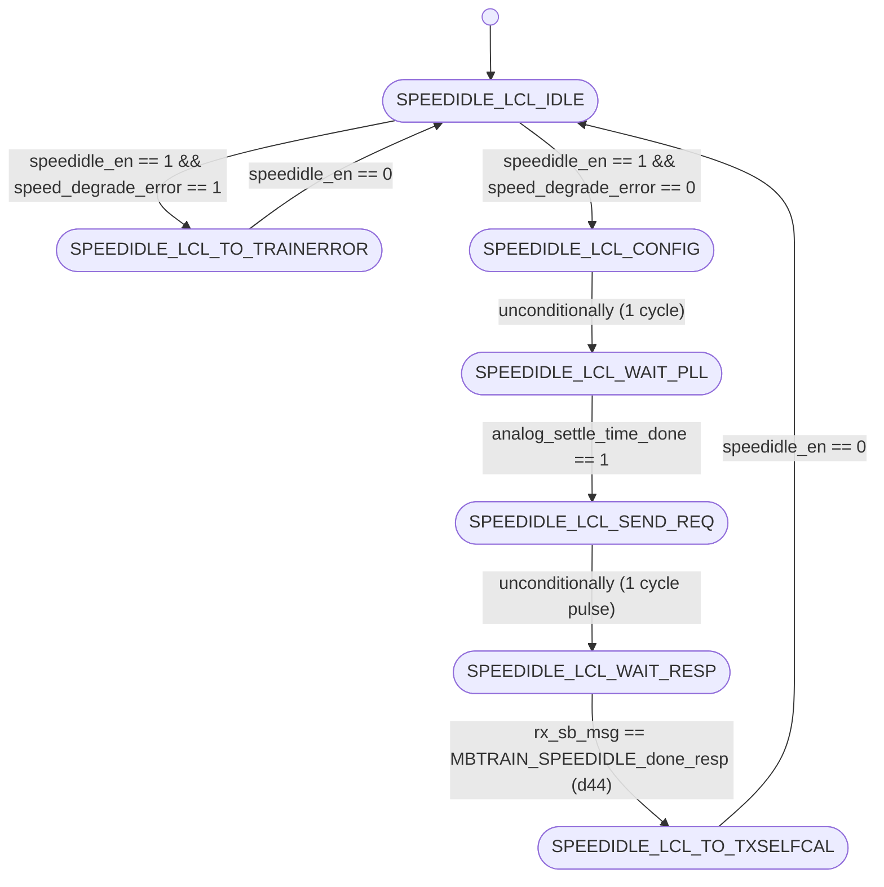
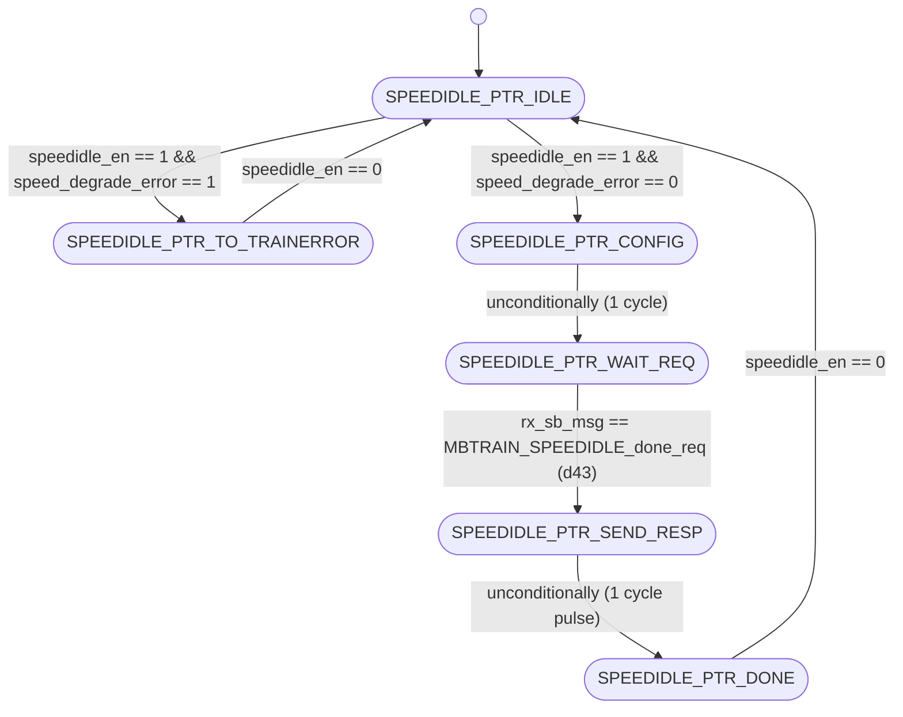

# SPEEDIDLE FSM Diagrams

## Local FSM

```mermaid
flowchart TD
SPEEDIDLE_LCL_IDLE(["SPEEDIDLE_LCL_IDLE"])
SPEEDIDLE_LCL_TO_TRAINERROR(["SPEEDIDLE_LCL_TO_TRAINERROR"])
SPEEDIDLE_LCL_CONFIG(["SPEEDIDLE_LCL_CONFIG"])
SPEEDIDLE_LCL_WAIT_PLL(["SPEEDIDLE_LCL_WAIT_PLL"])
SPEEDIDLE_LCL_SEND_REQ(["SPEEDIDLE_LCL_SEND_REQ"])
SPEEDIDLE_LCL_WAIT_RESP(["SPEEDIDLE_LCL_WAIT_RESP"])
SPEEDIDLE_LCL_TO_TXSELFCAL(["SPEEDIDLE_LCL_TO_TXSELFCAL"])
START1((" "))

START1 --> SPEEDIDLE_LCL_IDLE
SPEEDIDLE_LCL_IDLE -->|"speedidle_en == 1 && speed_degrade_error == 1"| SPEEDIDLE_LCL_TO_TRAINERROR
SPEEDIDLE_LCL_IDLE -->|"speedidle_en == 1 && speed_degrade_error == 0"| SPEEDIDLE_LCL_CONFIG
SPEEDIDLE_LCL_CONFIG -->|"unconditionally (1 cycle)"| SPEEDIDLE_LCL_WAIT_PLL
SPEEDIDLE_LCL_WAIT_PLL -->|"analog_settle_time_done == 1"| SPEEDIDLE_LCL_SEND_REQ
SPEEDIDLE_LCL_SEND_REQ -->|"unconditionally (1 cycle pulse)"| SPEEDIDLE_LCL_WAIT_RESP
SPEEDIDLE_LCL_WAIT_RESP -->|"rx_sb_msg == MBTRAIN_SPEEDIDLE_done_resp (d44)"| SPEEDIDLE_LCL_TO_TXSELFCAL
SPEEDIDLE_LCL_TO_TXSELFCAL -->|"speedidle_en == 0"| SPEEDIDLE_LCL_IDLE
SPEEDIDLE_LCL_TO_TRAINERROR -->|"speedidle_en == 0"| SPEEDIDLE_LCL_IDLE
```

## Partner FSM

```mermaid
flowchart TD
SPEEDIDLE_PTR_IDLE(["SPEEDIDLE_PTR_IDLE"])
SPEEDIDLE_PTR_TO_TRAINERROR(["SPEEDIDLE_PTR_TO_TRAINERROR"])
SPEEDIDLE_PTR_CONFIG(["SPEEDIDLE_PTR_CONFIG"])
SPEEDIDLE_PTR_WAIT_REQ(["SPEEDIDLE_PTR_WAIT_REQ"])
SPEEDIDLE_PTR_SEND_RESP(["SPEEDIDLE_PTR_SEND_RESP"])
SPEEDIDLE_PTR_DONE(["SPEEDIDLE_PTR_DONE"])
START2((" "))

START2 --> SPEEDIDLE_PTR_IDLE
SPEEDIDLE_PTR_IDLE -->|"speedidle_en == 1 && speed_degrade_error == 1"| SPEEDIDLE_PTR_TO_TRAINERROR
SPEEDIDLE_PTR_IDLE -->|"speedidle_en == 1 && speed_degrade_error == 0"| SPEEDIDLE_PTR_CONFIG
SPEEDIDLE_PTR_CONFIG -->|"unconditionally (1 cycle)"| SPEEDIDLE_PTR_WAIT_REQ
SPEEDIDLE_PTR_WAIT_REQ -->|"rx_sb_msg == MBTRAIN_SPEEDIDLE_done_req (d43)"| SPEEDIDLE_PTR_SEND_RESP
SPEEDIDLE_PTR_SEND_RESP -->|"unconditionally (1 cycle pulse)"| SPEEDIDLE_PTR_DONE
SPEEDIDLE_PTR_DONE -->|"speedidle_en == 0"| SPEEDIDLE_PTR_IDLE
SPEEDIDLE_PTR_TO_TRAINERROR -->|"speedidle_en == 0"| SPEEDIDLE_PTR_IDLE
```

