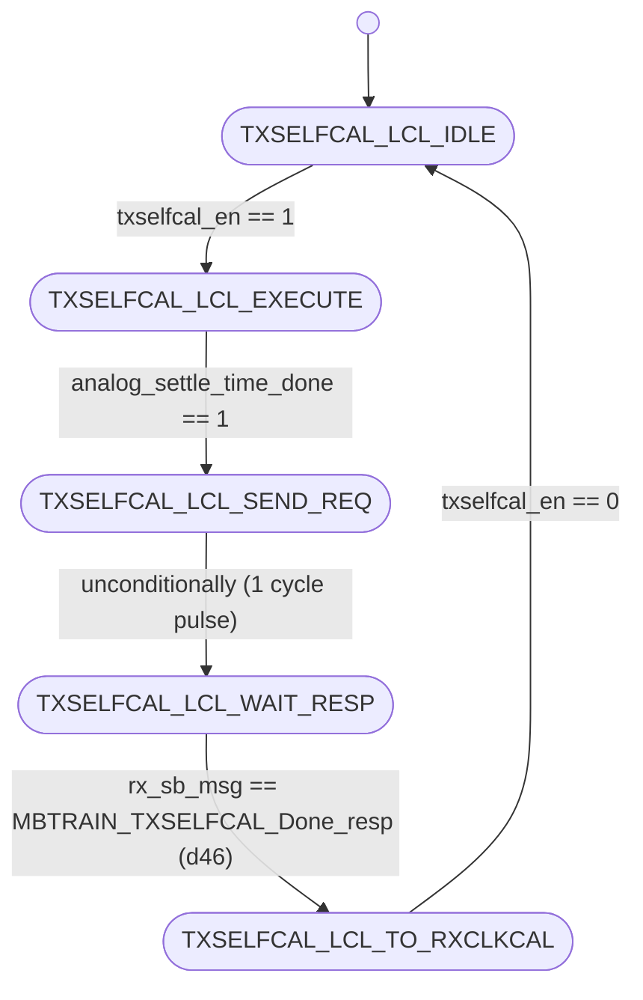
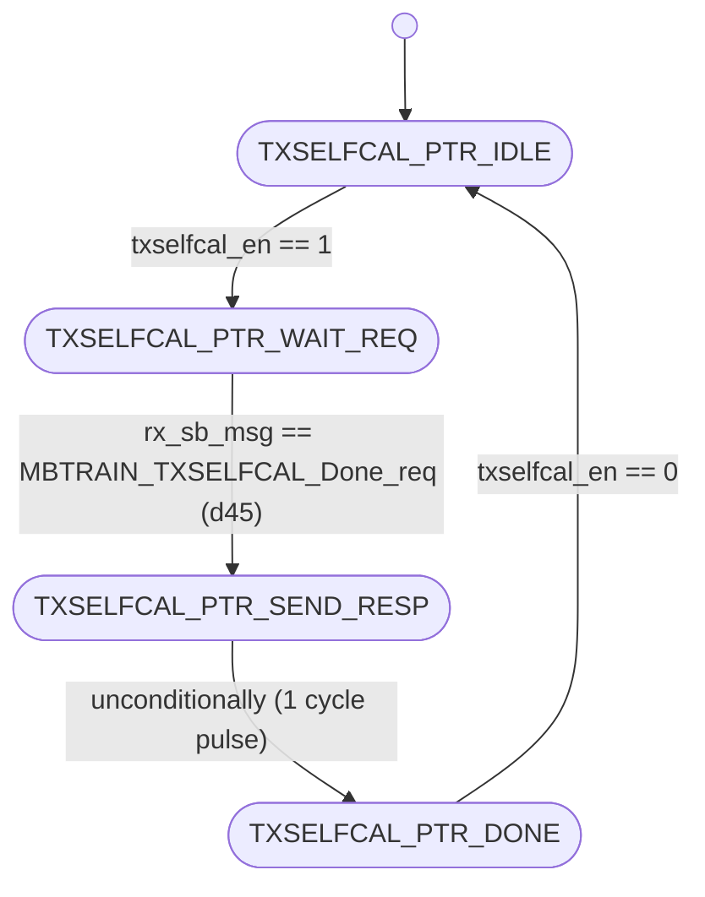

# TXSELFCAL FSM Diagrams

## Local FSM

```mermaid
flowchart TD
TXSELFCAL_LCL_IDLE(["TXSELFCAL_LCL_IDLE"])
TXSELFCAL_LCL_EXECUTE(["TXSELFCAL_LCL_EXECUTE"])
TXSELFCAL_LCL_SEND_REQ(["TXSELFCAL_LCL_SEND_REQ"])
TXSELFCAL_LCL_WAIT_RESP(["TXSELFCAL_LCL_WAIT_RESP"])
TXSELFCAL_LCL_TO_RXCLKCAL(["TXSELFCAL_LCL_TO_RXCLKCAL"])
START1((" "))

START1 --> TXSELFCAL_LCL_IDLE
TXSELFCAL_LCL_IDLE -->|"txselfcal_en == 1"| TXSELFCAL_LCL_EXECUTE
TXSELFCAL_LCL_EXECUTE -->|"analog_settle_time_done == 1"| TXSELFCAL_LCL_SEND_REQ
TXSELFCAL_LCL_SEND_REQ -->|"unconditionally (1 cycle pulse)"| TXSELFCAL_LCL_WAIT_RESP
TXSELFCAL_LCL_WAIT_RESP -->|"rx_sb_msg == MBTRAIN_TXSELFCAL_Done_resp (d46)"| TXSELFCAL_LCL_TO_RXCLKCAL
TXSELFCAL_LCL_TO_RXCLKCAL -->|"txselfcal_en == 0"| TXSELFCAL_LCL_IDLE
```

## Partner FSM

```mermaid
flowchart TD
TXSELFCAL_PTR_IDLE(["TXSELFCAL_PTR_IDLE"])
TXSELFCAL_PTR_WAIT_REQ(["TXSELFCAL_PTR_WAIT_REQ"])
TXSELFCAL_PTR_SEND_RESP(["TXSELFCAL_PTR_SEND_RESP"])
TXSELFCAL_PTR_DONE(["TXSELFCAL_PTR_DONE"])
START2((" "))

START2 --> TXSELFCAL_PTR_IDLE
TXSELFCAL_PTR_IDLE -->|"txselfcal_en == 1"| TXSELFCAL_PTR_WAIT_REQ
TXSELFCAL_PTR_WAIT_REQ -->|"rx_sb_msg == MBTRAIN_TXSELFCAL_Done_req (d45)"| TXSELFCAL_PTR_SEND_RESP
TXSELFCAL_PTR_SEND_RESP -->|"unconditionally (1 cycle pulse)"| TXSELFCAL_PTR_DONE
TXSELFCAL_PTR_DONE -->|"txselfcal_en == 0"| TXSELFCAL_PTR_IDLE
```

