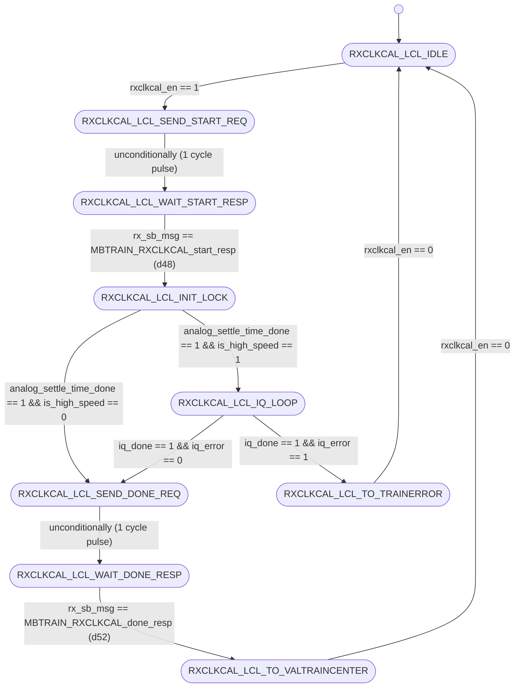
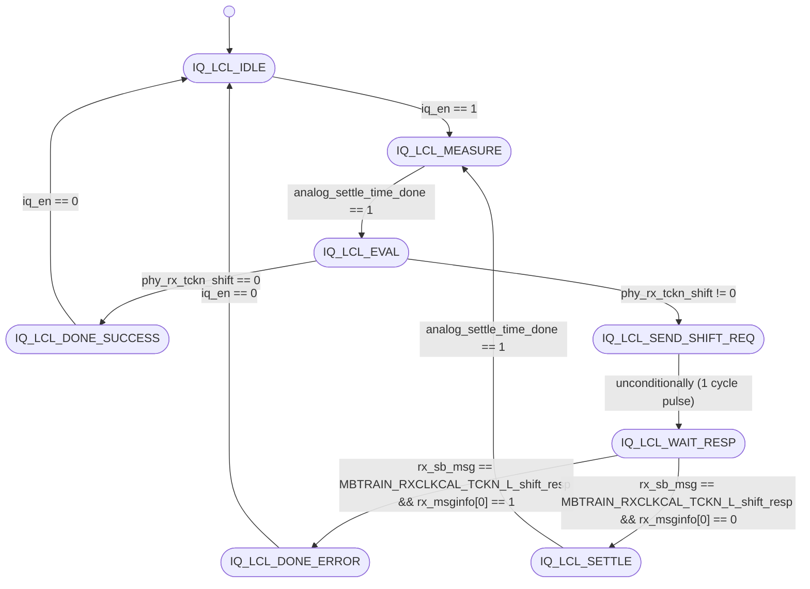
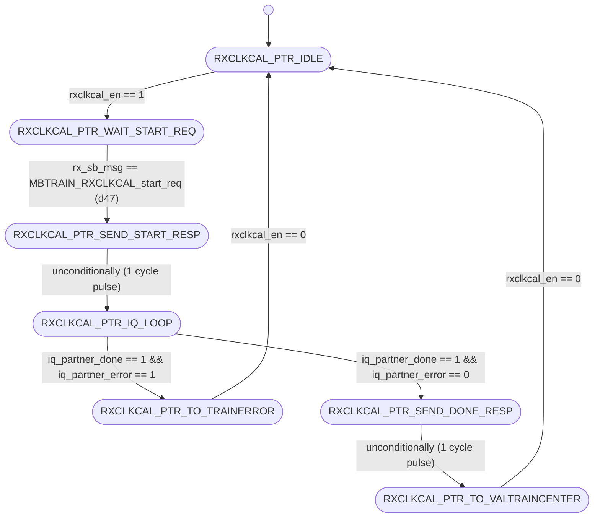
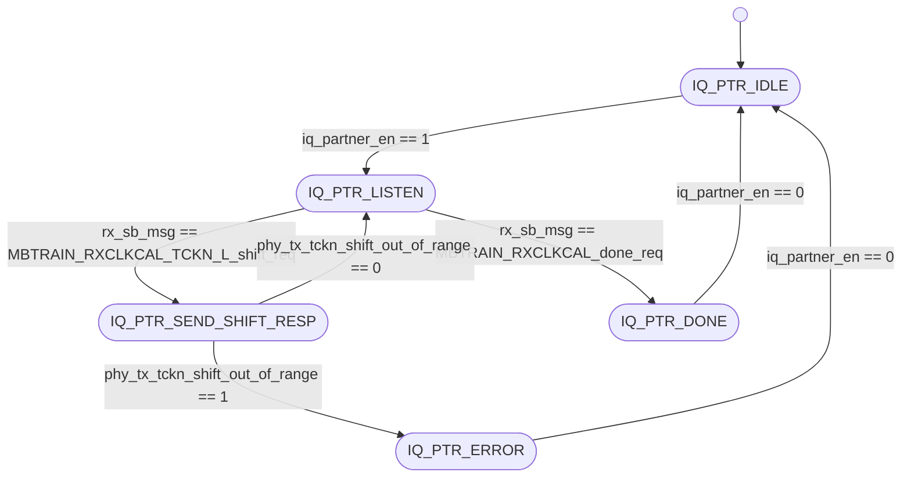

# RXCLKCAL FSM Diagrams

## Local FSM

```mermaid
flowchart TD
RXCLKCAL_LCL_IDLE(["RXCLKCAL_LCL_IDLE"])
RXCLKCAL_LCL_SEND_START_REQ(["RXCLKCAL_LCL_SEND_START_REQ"])
RXCLKCAL_LCL_WAIT_START_RESP(["RXCLKCAL_LCL_WAIT_START_RESP"])
RXCLKCAL_LCL_INIT_LOCK(["RXCLKCAL_LCL_INIT_LOCK"])
RXCLKCAL_LCL_IQ_LOOP(["RXCLKCAL_LCL_IQ_LOOP"])
RXCLKCAL_LCL_SEND_DONE_REQ(["RXCLKCAL_LCL_SEND_DONE_REQ"])
RXCLKCAL_LCL_TO_TRAINERROR(["RXCLKCAL_LCL_TO_TRAINERROR"])
RXCLKCAL_LCL_WAIT_DONE_RESP(["RXCLKCAL_LCL_WAIT_DONE_RESP"])
RXCLKCAL_LCL_TO_VALTRAINCENTER(["RXCLKCAL_LCL_TO_VALTRAINCENTER"])
START1((" "))

START1 --> RXCLKCAL_LCL_IDLE
RXCLKCAL_LCL_IDLE -->|"rxclkcal_en == 1"| RXCLKCAL_LCL_SEND_START_REQ
RXCLKCAL_LCL_SEND_START_REQ -->|"unconditionally (1 cycle pulse)"| RXCLKCAL_LCL_WAIT_START_RESP
RXCLKCAL_LCL_WAIT_START_RESP -->|"rx_sb_msg == MBTRAIN_RXCLKCAL_start_resp (d48)"| RXCLKCAL_LCL_INIT_LOCK
RXCLKCAL_LCL_INIT_LOCK -->|"analog_settle_time_done == 1 && is_high_speed == 1"| RXCLKCAL_LCL_IQ_LOOP
RXCLKCAL_LCL_INIT_LOCK -->|"analog_settle_time_done == 1 && is_high_speed == 0"| RXCLKCAL_LCL_SEND_DONE_REQ
RXCLKCAL_LCL_IQ_LOOP -->|"iq_done == 1 && iq_error == 1"| RXCLKCAL_LCL_TO_TRAINERROR
RXCLKCAL_LCL_IQ_LOOP -->|"iq_done == 1 && iq_error == 0"| RXCLKCAL_LCL_SEND_DONE_REQ
RXCLKCAL_LCL_SEND_DONE_REQ -->|"unconditionally (1 cycle pulse)"| RXCLKCAL_LCL_WAIT_DONE_RESP
RXCLKCAL_LCL_WAIT_DONE_RESP -->|"rx_sb_msg == MBTRAIN_RXCLKCAL_done_resp (d52)"| RXCLKCAL_LCL_TO_VALTRAINCENTER
RXCLKCAL_LCL_TO_VALTRAINCENTER -->|"rxclkcal_en == 0"| RXCLKCAL_LCL_IDLE
RXCLKCAL_LCL_TO_TRAINERROR -->|"rxclkcal_en == 0"| RXCLKCAL_LCL_IDLE
```

## IQ Local FSM

```mermaid
flowchart TD
IQ_LCL_IDLE(["IQ_LCL_IDLE"])
IQ_LCL_MEASURE(["IQ_LCL_MEASURE"])
IQ_LCL_EVAL(["IQ_LCL_EVAL"])
IQ_LCL_DONE_SUCCESS(["IQ_LCL_DONE_SUCCESS"])
IQ_LCL_SEND_SHIFT_REQ(["IQ_LCL_SEND_SHIFT_REQ"])
IQ_LCL_WAIT_RESP(["IQ_LCL_WAIT_RESP"])
IQ_LCL_DONE_ERROR(["IQ_LCL_DONE_ERROR"])
IQ_LCL_SETTLE(["IQ_LCL_SETTLE"])
START2((" "))

START2 --> IQ_LCL_IDLE
IQ_LCL_IDLE -->|"iq_en == 1"| IQ_LCL_MEASURE
IQ_LCL_MEASURE -->|"analog_settle_time_done == 1"| IQ_LCL_EVAL
IQ_LCL_EVAL -->|"phy_rx_tckn_shift == 0"| IQ_LCL_DONE_SUCCESS
IQ_LCL_EVAL -->|"phy_rx_tckn_shift != 0"| IQ_LCL_SEND_SHIFT_REQ
IQ_LCL_SEND_SHIFT_REQ -->|"unconditionally (1 cycle pulse)"| IQ_LCL_WAIT_RESP
IQ_LCL_WAIT_RESP -->|"rx_sb_msg == MBTRAIN_RXCLKCAL_TCKN_L_shift_resp && rx_msginfo[0] == 1"| IQ_LCL_DONE_ERROR
IQ_LCL_WAIT_RESP -->|"rx_sb_msg == MBTRAIN_RXCLKCAL_TCKN_L_shift_resp && rx_msginfo[0] == 0"| IQ_LCL_SETTLE
IQ_LCL_SETTLE -->|"analog_settle_time_done == 1"| IQ_LCL_MEASURE
IQ_LCL_DONE_SUCCESS -->|"iq_en == 0"| IQ_LCL_IDLE
IQ_LCL_DONE_ERROR -->|"iq_en == 0"| IQ_LCL_IDLE
```

## Partner FSM

```mermaid
flowchart TD
RXCLKCAL_PTR_IDLE(["RXCLKCAL_PTR_IDLE"])
RXCLKCAL_PTR_WAIT_START_REQ(["RXCLKCAL_PTR_WAIT_START_REQ"])
RXCLKCAL_PTR_SEND_START_RESP(["RXCLKCAL_PTR_SEND_START_RESP"])
RXCLKCAL_PTR_IQ_LOOP(["RXCLKCAL_PTR_IQ_LOOP"])
RXCLKCAL_PTR_TO_TRAINERROR(["RXCLKCAL_PTR_TO_TRAINERROR"])
RXCLKCAL_PTR_SEND_DONE_RESP(["RXCLKCAL_PTR_SEND_DONE_RESP"])
RXCLKCAL_PTR_TO_VALTRAINCENTER(["RXCLKCAL_PTR_TO_VALTRAINCENTER"])
START3((" "))

START3 --> RXCLKCAL_PTR_IDLE
RXCLKCAL_PTR_IDLE -->|"rxclkcal_en == 1"| RXCLKCAL_PTR_WAIT_START_REQ
RXCLKCAL_PTR_WAIT_START_REQ -->|"rx_sb_msg == MBTRAIN_RXCLKCAL_start_req (d47)"| RXCLKCAL_PTR_SEND_START_RESP
RXCLKCAL_PTR_SEND_START_RESP -->|"unconditionally (1 cycle pulse)"| RXCLKCAL_PTR_IQ_LOOP
RXCLKCAL_PTR_IQ_LOOP -->|"iq_partner_done == 1 && iq_partner_error == 1"| RXCLKCAL_PTR_TO_TRAINERROR
RXCLKCAL_PTR_IQ_LOOP -->|"iq_partner_done == 1 && iq_partner_error == 0"| RXCLKCAL_PTR_SEND_DONE_RESP
RXCLKCAL_PTR_SEND_DONE_RESP -->|"unconditionally (1 cycle pulse)"| RXCLKCAL_PTR_TO_VALTRAINCENTER
RXCLKCAL_PTR_TO_VALTRAINCENTER -->|"rxclkcal_en == 0"| RXCLKCAL_PTR_IDLE
RXCLKCAL_PTR_TO_TRAINERROR -->|"rxclkcal_en == 0"| RXCLKCAL_PTR_IDLE
```

## IQ Partner FSM

```mermaid
flowchart TD
IQ_PTR_IDLE(["IQ_PTR_IDLE"])
IQ_PTR_LISTEN(["IQ_PTR_LISTEN"])
IQ_PTR_SEND_SHIFT_RESP(["IQ_PTR_SEND_SHIFT_RESP"])
IQ_PTR_DONE(["IQ_PTR_DONE"])
IQ_PTR_ERROR(["IQ_PTR_ERROR"])
START4((" "))

START4 --> IQ_PTR_IDLE
IQ_PTR_IDLE -->|"iq_partner_en == 1"| IQ_PTR_LISTEN
IQ_PTR_LISTEN -->|"rx_sb_msg == MBTRAIN_RXCLKCAL_TCKN_L_shift_req"| IQ_PTR_SEND_SHIFT_RESP
IQ_PTR_LISTEN -->|"rx_sb_msg == MBTRAIN_RXCLKCAL_done_req"| IQ_PTR_DONE
IQ_PTR_SEND_SHIFT_RESP -->|"phy_tx_tckn_shift_out_of_range == 1"| IQ_PTR_ERROR
IQ_PTR_SEND_SHIFT_RESP -->|"phy_tx_tckn_shift_out_of_range == 0"| IQ_PTR_LISTEN
IQ_PTR_DONE -->|"iq_partner_en == 0"| IQ_PTR_IDLE
IQ_PTR_ERROR -->|"iq_partner_en == 0"| IQ_PTR_IDLE
```

