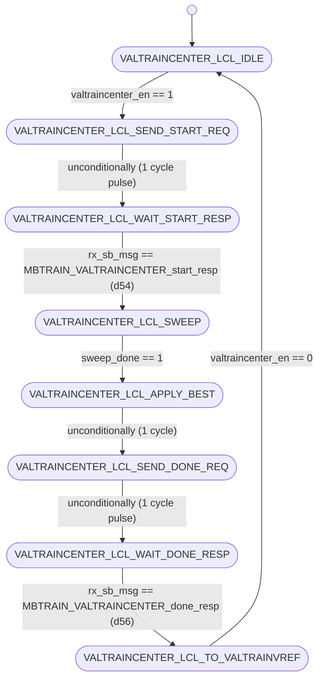
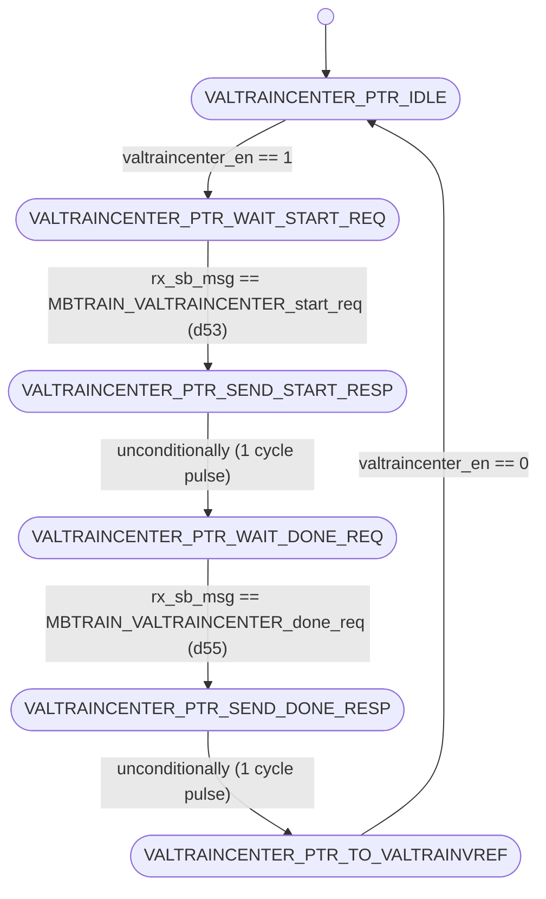

# VALTRAINCENTER FSM Diagrams

## Local FSM

```mermaid
flowchart TD
VALTRAINCENTER_LCL_IDLE(["VALTRAINCENTER_LCL_IDLE"])
VALTRAINCENTER_LCL_SEND_START_REQ(["VALTRAINCENTER_LCL_SEND_START_REQ"])
VALTRAINCENTER_LCL_WAIT_START_RESP(["VALTRAINCENTER_LCL_WAIT_START_RESP"])
VALTRAINCENTER_LCL_SWEEP(["VALTRAINCENTER_LCL_SWEEP"])
VALTRAINCENTER_LCL_APPLY_BEST(["VALTRAINCENTER_LCL_APPLY_BEST"])
VALTRAINCENTER_LCL_SEND_DONE_REQ(["VALTRAINCENTER_LCL_SEND_DONE_REQ"])
VALTRAINCENTER_LCL_WAIT_DONE_RESP(["VALTRAINCENTER_LCL_WAIT_DONE_RESP"])
VALTRAINCENTER_LCL_TO_VALTRAINVREF(["VALTRAINCENTER_LCL_TO_VALTRAINVREF"])
START1((" "))

START1 --> VALTRAINCENTER_LCL_IDLE
VALTRAINCENTER_LCL_IDLE -->|"valtraincenter_en == 1"| VALTRAINCENTER_LCL_SEND_START_REQ
VALTRAINCENTER_LCL_SEND_START_REQ -->|"unconditionally (1 cycle pulse)"| VALTRAINCENTER_LCL_WAIT_START_RESP
VALTRAINCENTER_LCL_WAIT_START_RESP -->|"rx_sb_msg == MBTRAIN_VALTRAINCENTER_start_resp (d54)"| VALTRAINCENTER_LCL_SWEEP
VALTRAINCENTER_LCL_SWEEP -->|"sweep_done == 1"| VALTRAINCENTER_LCL_APPLY_BEST
VALTRAINCENTER_LCL_APPLY_BEST -->|"unconditionally (1 cycle)"| VALTRAINCENTER_LCL_SEND_DONE_REQ
VALTRAINCENTER_LCL_SEND_DONE_REQ -->|"unconditionally (1 cycle pulse)"| VALTRAINCENTER_LCL_WAIT_DONE_RESP
VALTRAINCENTER_LCL_WAIT_DONE_RESP -->|"rx_sb_msg == MBTRAIN_VALTRAINCENTER_done_resp (d56)"| VALTRAINCENTER_LCL_TO_VALTRAINVREF
VALTRAINCENTER_LCL_TO_VALTRAINVREF -->|"valtraincenter_en == 0"| VALTRAINCENTER_LCL_IDLE
```

## Partner FSM

```mermaid
flowchart TD
VALTRAINCENTER_PTR_IDLE(["VALTRAINCENTER_PTR_IDLE"])
VALTRAINCENTER_PTR_WAIT_START_REQ(["VALTRAINCENTER_PTR_WAIT_START_REQ"])
VALTRAINCENTER_PTR_SEND_START_RESP(["VALTRAINCENTER_PTR_SEND_START_RESP"])
VALTRAINCENTER_PTR_WAIT_DONE_REQ(["VALTRAINCENTER_PTR_WAIT_DONE_REQ"])
VALTRAINCENTER_PTR_SEND_DONE_RESP(["VALTRAINCENTER_PTR_SEND_DONE_RESP"])
VALTRAINCENTER_PTR_TO_VALTRAINVREF(["VALTRAINCENTER_PTR_TO_VALTRAINVREF"])
START2((" "))

START2 --> VALTRAINCENTER_PTR_IDLE
VALTRAINCENTER_PTR_IDLE -->|"valtraincenter_en == 1"| VALTRAINCENTER_PTR_WAIT_START_REQ
VALTRAINCENTER_PTR_WAIT_START_REQ -->|"rx_sb_msg == MBTRAIN_VALTRAINCENTER_start_req (d53)"| VALTRAINCENTER_PTR_SEND_START_RESP
VALTRAINCENTER_PTR_SEND_START_RESP -->|"unconditionally (1 cycle pulse)"| VALTRAINCENTER_PTR_WAIT_DONE_REQ
VALTRAINCENTER_PTR_WAIT_DONE_REQ -->|"rx_sb_msg == MBTRAIN_VALTRAINCENTER_done_req (d55)"| VALTRAINCENTER_PTR_SEND_DONE_RESP
VALTRAINCENTER_PTR_SEND_DONE_RESP -->|"unconditionally (1 cycle pulse)"| VALTRAINCENTER_PTR_TO_VALTRAINVREF
VALTRAINCENTER_PTR_TO_VALTRAINVREF -->|"valtraincenter_en == 0"| VALTRAINCENTER_PTR_IDLE
```

