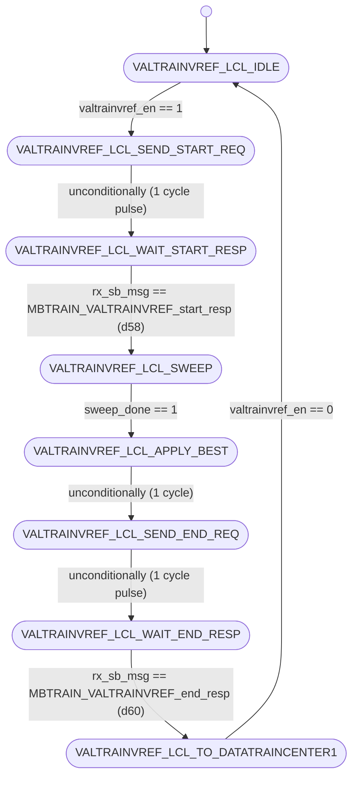
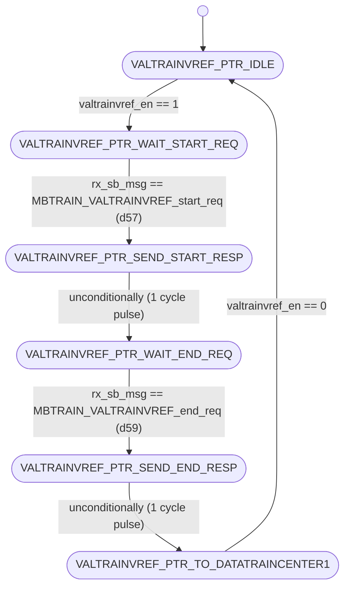

# VALTRAINVREF FSM Diagrams

## Local FSM

```mermaid
flowchart TD
VALTRAINVREF_LCL_IDLE(["VALTRAINVREF_LCL_IDLE"])
VALTRAINVREF_LCL_SEND_START_REQ(["VALTRAINVREF_LCL_SEND_START_REQ"])
VALTRAINVREF_LCL_WAIT_START_RESP(["VALTRAINVREF_LCL_WAIT_START_RESP"])
VALTRAINVREF_LCL_SWEEP(["VALTRAINVREF_LCL_SWEEP"])
VALTRAINVREF_LCL_APPLY_BEST(["VALTRAINVREF_LCL_APPLY_BEST"])
VALTRAINVREF_LCL_SEND_END_REQ(["VALTRAINVREF_LCL_SEND_END_REQ"])
VALTRAINVREF_LCL_WAIT_END_RESP(["VALTRAINVREF_LCL_WAIT_END_RESP"])
VALTRAINVREF_LCL_TO_DATATRAINCENTER1(["VALTRAINVREF_LCL_TO_DATATRAINCENTER1"])
START1((" "))

START1 --> VALTRAINVREF_LCL_IDLE
VALTRAINVREF_LCL_IDLE -->|"valtrainvref_en == 1"| VALTRAINVREF_LCL_SEND_START_REQ
VALTRAINVREF_LCL_SEND_START_REQ -->|"unconditionally (1 cycle pulse)"| VALTRAINVREF_LCL_WAIT_START_RESP
VALTRAINVREF_LCL_WAIT_START_RESP -->|"rx_sb_msg == MBTRAIN_VALTRAINVREF_start_resp (d58)"| VALTRAINVREF_LCL_SWEEP
VALTRAINVREF_LCL_SWEEP -->|"sweep_done == 1"| VALTRAINVREF_LCL_APPLY_BEST
VALTRAINVREF_LCL_APPLY_BEST -->|"unconditionally (1 cycle)"| VALTRAINVREF_LCL_SEND_END_REQ
VALTRAINVREF_LCL_SEND_END_REQ -->|"unconditionally (1 cycle pulse)"| VALTRAINVREF_LCL_WAIT_END_RESP
VALTRAINVREF_LCL_WAIT_END_RESP -->|"rx_sb_msg == MBTRAIN_VALTRAINVREF_end_resp (d60)"| VALTRAINVREF_LCL_TO_DATATRAINCENTER1
VALTRAINVREF_LCL_TO_DATATRAINCENTER1 -->|"valtrainvref_en == 0"| VALTRAINVREF_LCL_IDLE
```

## Partner FSM

```mermaid
flowchart TD
VALTRAINVREF_PTR_IDLE(["VALTRAINVREF_PTR_IDLE"])
VALTRAINVREF_PTR_WAIT_START_REQ(["VALTRAINVREF_PTR_WAIT_START_REQ"])
VALTRAINVREF_PTR_SEND_START_RESP(["VALTRAINVREF_PTR_SEND_START_RESP"])
VALTRAINVREF_PTR_WAIT_END_REQ(["VALTRAINVREF_PTR_WAIT_END_REQ"])
VALTRAINVREF_PTR_SEND_END_RESP(["VALTRAINVREF_PTR_SEND_END_RESP"])
VALTRAINVREF_PTR_TO_DATATRAINCENTER1(["VALTRAINVREF_PTR_TO_DATATRAINCENTER1"])
START2((" "))

START2 --> VALTRAINVREF_PTR_IDLE
VALTRAINVREF_PTR_IDLE -->|"valtrainvref_en == 1"| VALTRAINVREF_PTR_WAIT_START_REQ
VALTRAINVREF_PTR_WAIT_START_REQ -->|"rx_sb_msg == MBTRAIN_VALTRAINVREF_start_req (d57)"| VALTRAINVREF_PTR_SEND_START_RESP
VALTRAINVREF_PTR_SEND_START_RESP -->|"unconditionally (1 cycle pulse)"| VALTRAINVREF_PTR_WAIT_END_REQ
VALTRAINVREF_PTR_WAIT_END_REQ -->|"rx_sb_msg == MBTRAIN_VALTRAINVREF_end_req (d59)"| VALTRAINVREF_PTR_SEND_END_RESP
VALTRAINVREF_PTR_SEND_END_RESP -->|"unconditionally (1 cycle pulse)"| VALTRAINVREF_PTR_TO_DATATRAINCENTER1
VALTRAINVREF_PTR_TO_DATATRAINCENTER1 -->|"valtrainvref_en == 0"| VALTRAINVREF_PTR_IDLE
```

