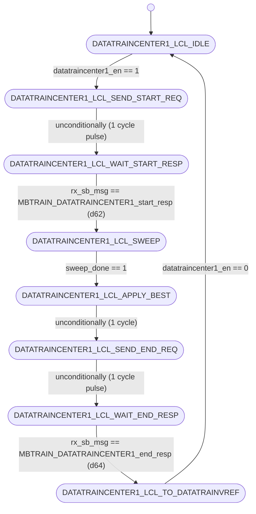
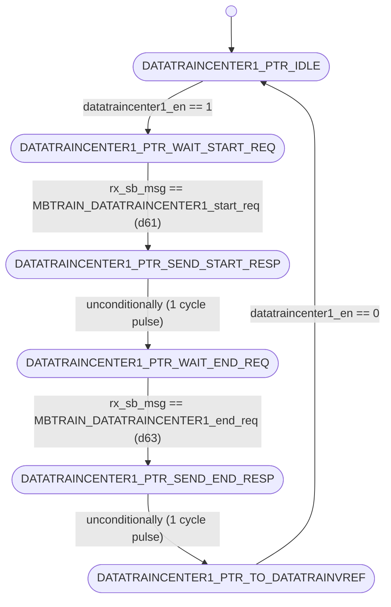

# DATATRAINCENTER1 FSM Diagrams

## Local FSM

```mermaid
flowchart TD
DATATRAINCENTER1_LCL_IDLE(["DATATRAINCENTER1_LCL_IDLE"])
DATATRAINCENTER1_LCL_SEND_START_REQ(["DATATRAINCENTER1_LCL_SEND_START_REQ"])
DATATRAINCENTER1_LCL_WAIT_START_RESP(["DATATRAINCENTER1_LCL_WAIT_START_RESP"])
DATATRAINCENTER1_LCL_SWEEP(["DATATRAINCENTER1_LCL_SWEEP"])
DATATRAINCENTER1_LCL_APPLY_BEST(["DATATRAINCENTER1_LCL_APPLY_BEST"])
DATATRAINCENTER1_LCL_SEND_END_REQ(["DATATRAINCENTER1_LCL_SEND_END_REQ"])
DATATRAINCENTER1_LCL_WAIT_END_RESP(["DATATRAINCENTER1_LCL_WAIT_END_RESP"])
DATATRAINCENTER1_LCL_TO_DATATRAINVREF(["DATATRAINCENTER1_LCL_TO_DATATRAINVREF"])
START1((" "))

START1 --> DATATRAINCENTER1_LCL_IDLE
DATATRAINCENTER1_LCL_IDLE -->|"datatraincenter1_en == 1"| DATATRAINCENTER1_LCL_SEND_START_REQ
DATATRAINCENTER1_LCL_SEND_START_REQ -->|"unconditionally (1 cycle pulse)"| DATATRAINCENTER1_LCL_WAIT_START_RESP
DATATRAINCENTER1_LCL_WAIT_START_RESP -->|"rx_sb_msg == MBTRAIN_DATATRAINCENTER1_start_resp (d62)"| DATATRAINCENTER1_LCL_SWEEP
DATATRAINCENTER1_LCL_SWEEP -->|"sweep_done == 1"| DATATRAINCENTER1_LCL_APPLY_BEST
DATATRAINCENTER1_LCL_APPLY_BEST -->|"unconditionally (1 cycle)"| DATATRAINCENTER1_LCL_SEND_END_REQ
DATATRAINCENTER1_LCL_SEND_END_REQ -->|"unconditionally (1 cycle pulse)"| DATATRAINCENTER1_LCL_WAIT_END_RESP
DATATRAINCENTER1_LCL_WAIT_END_RESP -->|"rx_sb_msg == MBTRAIN_DATATRAINCENTER1_end_resp (d64)"| DATATRAINCENTER1_LCL_TO_DATATRAINVREF
DATATRAINCENTER1_LCL_TO_DATATRAINVREF -->|"datatraincenter1_en == 0"| DATATRAINCENTER1_LCL_IDLE
```

## Partner FSM

```mermaid
flowchart TD
DATATRAINCENTER1_PTR_IDLE(["DATATRAINCENTER1_PTR_IDLE"])
DATATRAINCENTER1_PTR_WAIT_START_REQ(["DATATRAINCENTER1_PTR_WAIT_START_REQ"])
DATATRAINCENTER1_PTR_SEND_START_RESP(["DATATRAINCENTER1_PTR_SEND_START_RESP"])
DATATRAINCENTER1_PTR_WAIT_END_REQ(["DATATRAINCENTER1_PTR_WAIT_END_REQ"])
DATATRAINCENTER1_PTR_SEND_END_RESP(["DATATRAINCENTER1_PTR_SEND_END_RESP"])
DATATRAINCENTER1_PTR_TO_DATATRAINVREF(["DATATRAINCENTER1_PTR_TO_DATATRAINVREF"])
START2((" "))

START2 --> DATATRAINCENTER1_PTR_IDLE
DATATRAINCENTER1_PTR_IDLE -->|"datatraincenter1_en == 1"| DATATRAINCENTER1_PTR_WAIT_START_REQ
DATATRAINCENTER1_PTR_WAIT_START_REQ -->|"rx_sb_msg == MBTRAIN_DATATRAINCENTER1_start_req (d61)"| DATATRAINCENTER1_PTR_SEND_START_RESP
DATATRAINCENTER1_PTR_SEND_START_RESP -->|"unconditionally (1 cycle pulse)"| DATATRAINCENTER1_PTR_WAIT_END_REQ
DATATRAINCENTER1_PTR_WAIT_END_REQ -->|"rx_sb_msg == MBTRAIN_DATATRAINCENTER1_end_req (d63)"| DATATRAINCENTER1_PTR_SEND_END_RESP
DATATRAINCENTER1_PTR_SEND_END_RESP -->|"unconditionally (1 cycle pulse)"| DATATRAINCENTER1_PTR_TO_DATATRAINVREF
DATATRAINCENTER1_PTR_TO_DATATRAINVREF -->|"datatraincenter1_en == 0"| DATATRAINCENTER1_PTR_IDLE
```

