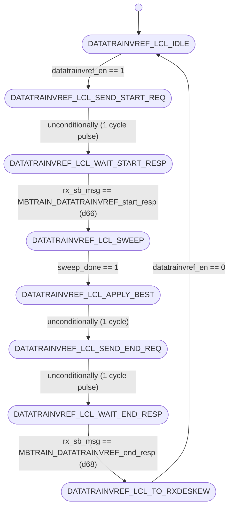
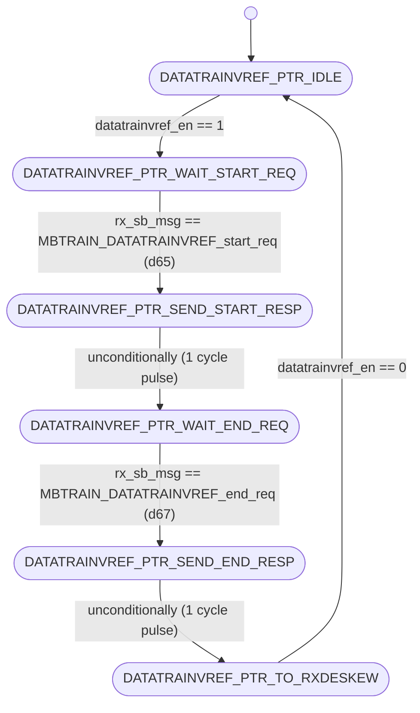

# DATATRAINVREF FSM Diagrams

## Local FSM

```mermaid
flowchart TD
DATATRAINVREF_LCL_IDLE(["DATATRAINVREF_LCL_IDLE"])
DATATRAINVREF_LCL_SEND_START_REQ(["DATATRAINVREF_LCL_SEND_START_REQ"])
DATATRAINVREF_LCL_WAIT_START_RESP(["DATATRAINVREF_LCL_WAIT_START_RESP"])
DATATRAINVREF_LCL_SWEEP(["DATATRAINVREF_LCL_SWEEP"])
DATATRAINVREF_LCL_APPLY_BEST(["DATATRAINVREF_LCL_APPLY_BEST"])
DATATRAINVREF_LCL_SEND_END_REQ(["DATATRAINVREF_LCL_SEND_END_REQ"])
DATATRAINVREF_LCL_WAIT_END_RESP(["DATATRAINVREF_LCL_WAIT_END_RESP"])
DATATRAINVREF_LCL_TO_RXDESKEW(["DATATRAINVREF_LCL_TO_RXDESKEW"])
START1((" "))

START1 --> DATATRAINVREF_LCL_IDLE
DATATRAINVREF_LCL_IDLE -->|"datatrainvref_en == 1"| DATATRAINVREF_LCL_SEND_START_REQ
DATATRAINVREF_LCL_SEND_START_REQ -->|"unconditionally (1 cycle pulse)"| DATATRAINVREF_LCL_WAIT_START_RESP
DATATRAINVREF_LCL_WAIT_START_RESP -->|"rx_sb_msg == MBTRAIN_DATATRAINVREF_start_resp (d66)"| DATATRAINVREF_LCL_SWEEP
DATATRAINVREF_LCL_SWEEP -->|"sweep_done == 1"| DATATRAINVREF_LCL_APPLY_BEST
DATATRAINVREF_LCL_APPLY_BEST -->|"unconditionally (1 cycle)"| DATATRAINVREF_LCL_SEND_END_REQ
DATATRAINVREF_LCL_SEND_END_REQ -->|"unconditionally (1 cycle pulse)"| DATATRAINVREF_LCL_WAIT_END_RESP
DATATRAINVREF_LCL_WAIT_END_RESP -->|"rx_sb_msg == MBTRAIN_DATATRAINVREF_end_resp (d68)"| DATATRAINVREF_LCL_TO_RXDESKEW
DATATRAINVREF_LCL_TO_RXDESKEW -->|"datatrainvref_en == 0"| DATATRAINVREF_LCL_IDLE
```

## Partner FSM

```mermaid
flowchart TD
DATATRAINVREF_PTR_IDLE(["DATATRAINVREF_PTR_IDLE"])
DATATRAINVREF_PTR_WAIT_START_REQ(["DATATRAINVREF_PTR_WAIT_START_REQ"])
DATATRAINVREF_PTR_SEND_START_RESP(["DATATRAINVREF_PTR_SEND_START_RESP"])
DATATRAINVREF_PTR_WAIT_END_REQ(["DATATRAINVREF_PTR_WAIT_END_REQ"])
DATATRAINVREF_PTR_SEND_END_RESP(["DATATRAINVREF_PTR_SEND_END_RESP"])
DATATRAINVREF_PTR_TO_RXDESKEW(["DATATRAINVREF_PTR_TO_RXDESKEW"])
START2((" "))

START2 --> DATATRAINVREF_PTR_IDLE
DATATRAINVREF_PTR_IDLE -->|"datatrainvref_en == 1"| DATATRAINVREF_PTR_WAIT_START_REQ
DATATRAINVREF_PTR_WAIT_START_REQ -->|"rx_sb_msg == MBTRAIN_DATATRAINVREF_start_req (d65)"| DATATRAINVREF_PTR_SEND_START_RESP
DATATRAINVREF_PTR_SEND_START_RESP -->|"unconditionally (1 cycle pulse)"| DATATRAINVREF_PTR_WAIT_END_REQ
DATATRAINVREF_PTR_WAIT_END_REQ -->|"rx_sb_msg == MBTRAIN_DATATRAINVREF_end_req (d67)"| DATATRAINVREF_PTR_SEND_END_RESP
DATATRAINVREF_PTR_SEND_END_RESP -->|"unconditionally (1 cycle pulse)"| DATATRAINVREF_PTR_TO_RXDESKEW
DATATRAINVREF_PTR_TO_RXDESKEW -->|"datatrainvref_en == 0"| DATATRAINVREF_PTR_IDLE
```

