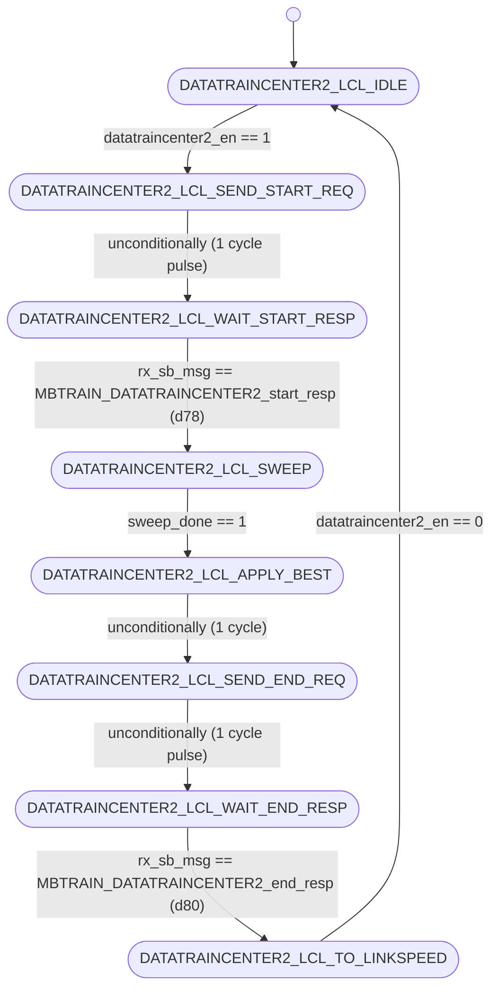
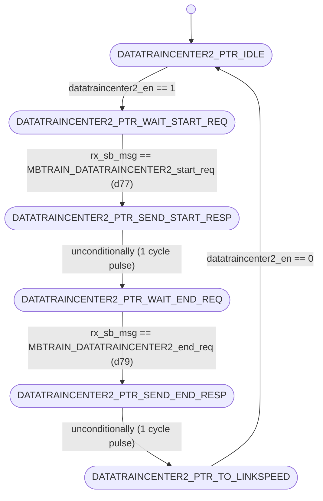

# DATATRAINCENTER2 FSM Diagrams

## Local FSM

```mermaid
flowchart TD
DATATRAINCENTER2_LCL_IDLE(["DATATRAINCENTER2_LCL_IDLE"])
DATATRAINCENTER2_LCL_SEND_START_REQ(["DATATRAINCENTER2_LCL_SEND_START_REQ"])
DATATRAINCENTER2_LCL_WAIT_START_RESP(["DATATRAINCENTER2_LCL_WAIT_START_RESP"])
DATATRAINCENTER2_LCL_SWEEP(["DATATRAINCENTER2_LCL_SWEEP"])
DATATRAINCENTER2_LCL_APPLY_BEST(["DATATRAINCENTER2_LCL_APPLY_BEST"])
DATATRAINCENTER2_LCL_SEND_END_REQ(["DATATRAINCENTER2_LCL_SEND_END_REQ"])
DATATRAINCENTER2_LCL_WAIT_END_RESP(["DATATRAINCENTER2_LCL_WAIT_END_RESP"])
DATATRAINCENTER2_LCL_TO_LINKSPEED(["DATATRAINCENTER2_LCL_TO_LINKSPEED"])
START1((" "))

START1 --> DATATRAINCENTER2_LCL_IDLE
DATATRAINCENTER2_LCL_IDLE -->|"datatraincenter2_en == 1"| DATATRAINCENTER2_LCL_SEND_START_REQ
DATATRAINCENTER2_LCL_SEND_START_REQ -->|"unconditionally (1 cycle pulse)"| DATATRAINCENTER2_LCL_WAIT_START_RESP
DATATRAINCENTER2_LCL_WAIT_START_RESP -->|"rx_sb_msg == MBTRAIN_DATATRAINCENTER2_start_resp (d78)"| DATATRAINCENTER2_LCL_SWEEP
DATATRAINCENTER2_LCL_SWEEP -->|"sweep_done == 1"| DATATRAINCENTER2_LCL_APPLY_BEST
DATATRAINCENTER2_LCL_APPLY_BEST -->|"unconditionally (1 cycle)"| DATATRAINCENTER2_LCL_SEND_END_REQ
DATATRAINCENTER2_LCL_SEND_END_REQ -->|"unconditionally (1 cycle pulse)"| DATATRAINCENTER2_LCL_WAIT_END_RESP
DATATRAINCENTER2_LCL_WAIT_END_RESP -->|"rx_sb_msg == MBTRAIN_DATATRAINCENTER2_end_resp (d80)"| DATATRAINCENTER2_LCL_TO_LINKSPEED
DATATRAINCENTER2_LCL_TO_LINKSPEED -->|"datatraincenter2_en == 0"| DATATRAINCENTER2_LCL_IDLE
```

## Partner FSM

```mermaid
flowchart TD
DATATRAINCENTER2_PTR_IDLE(["DATATRAINCENTER2_PTR_IDLE"])
DATATRAINCENTER2_PTR_WAIT_START_REQ(["DATATRAINCENTER2_PTR_WAIT_START_REQ"])
DATATRAINCENTER2_PTR_SEND_START_RESP(["DATATRAINCENTER2_PTR_SEND_START_RESP"])
DATATRAINCENTER2_PTR_WAIT_END_REQ(["DATATRAINCENTER2_PTR_WAIT_END_REQ"])
DATATRAINCENTER2_PTR_SEND_END_RESP(["DATATRAINCENTER2_PTR_SEND_END_RESP"])
DATATRAINCENTER2_PTR_TO_LINKSPEED(["DATATRAINCENTER2_PTR_TO_LINKSPEED"])
START2((" "))

START2 --> DATATRAINCENTER2_PTR_IDLE
DATATRAINCENTER2_PTR_IDLE -->|"datatraincenter2_en == 1"| DATATRAINCENTER2_PTR_WAIT_START_REQ
DATATRAINCENTER2_PTR_WAIT_START_REQ -->|"rx_sb_msg == MBTRAIN_DATATRAINCENTER2_start_req (d77)"| DATATRAINCENTER2_PTR_SEND_START_RESP
DATATRAINCENTER2_PTR_SEND_START_RESP -->|"unconditionally (1 cycle pulse)"| DATATRAINCENTER2_PTR_WAIT_END_REQ
DATATRAINCENTER2_PTR_WAIT_END_REQ -->|"rx_sb_msg == MBTRAIN_DATATRAINCENTER2_end_req (d79)"| DATATRAINCENTER2_PTR_SEND_END_RESP
DATATRAINCENTER2_PTR_SEND_END_RESP -->|"unconditionally (1 cycle pulse)"| DATATRAINCENTER2_PTR_TO_LINKSPEED
DATATRAINCENTER2_PTR_TO_LINKSPEED -->|"datatraincenter2_en == 0"| DATATRAINCENTER2_PTR_IDLE
```

