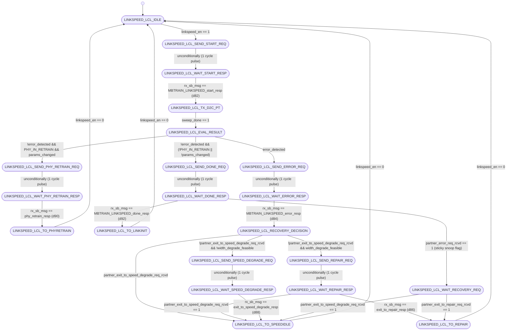
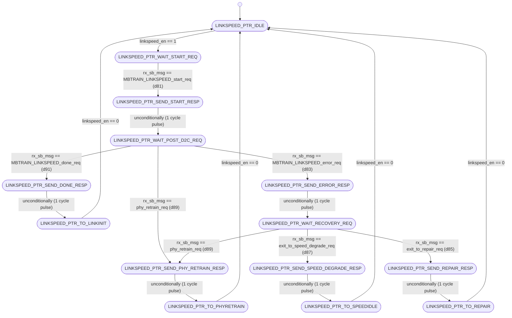

# LINKSPEED FSM Diagrams

## Local FSM

```mermaid
flowchart TD
LINKSPEED_LCL_IDLE(["LINKSPEED_LCL_IDLE"])
LINKSPEED_LCL_SEND_START_REQ(["LINKSPEED_LCL_SEND_START_REQ"])
LINKSPEED_LCL_WAIT_START_RESP(["LINKSPEED_LCL_WAIT_START_RESP"])
LINKSPEED_LCL_TX_D2C_PT(["LINKSPEED_LCL_TX_D2C_PT"])
LINKSPEED_LCL_EVAL_RESULT(["LINKSPEED_LCL_EVAL_RESULT"])
LINKSPEED_LCL_SEND_ERROR_REQ(["LINKSPEED_LCL_SEND_ERROR_REQ"])
LINKSPEED_LCL_SEND_PHY_RETRAIN_REQ(["LINKSPEED_LCL_SEND_PHY_RETRAIN_REQ"])
LINKSPEED_LCL_SEND_DONE_REQ(["LINKSPEED_LCL_SEND_DONE_REQ"])
LINKSPEED_LCL_WAIT_PHY_RETRAIN_RESP(["LINKSPEED_LCL_WAIT_PHY_RETRAIN_RESP"])
LINKSPEED_LCL_TO_PHYRETRAIN(["LINKSPEED_LCL_TO_PHYRETRAIN"])
LINKSPEED_LCL_WAIT_DONE_RESP(["LINKSPEED_LCL_WAIT_DONE_RESP"])
LINKSPEED_LCL_TO_LINKINIT(["LINKSPEED_LCL_TO_LINKINIT"])
LINKSPEED_LCL_WAIT_RECOVERY_REQ(["LINKSPEED_LCL_WAIT_RECOVERY_REQ"])
LINKSPEED_LCL_WAIT_ERROR_RESP(["LINKSPEED_LCL_WAIT_ERROR_RESP"])
LINKSPEED_LCL_RECOVERY_DECISION(["LINKSPEED_LCL_RECOVERY_DECISION"])
LINKSPEED_LCL_TO_SPEEDIDLE(["LINKSPEED_LCL_TO_SPEEDIDLE"])
LINKSPEED_LCL_SEND_SPEED_DEGRADE_REQ(["LINKSPEED_LCL_SEND_SPEED_DEGRADE_REQ"])
LINKSPEED_LCL_SEND_REPAIR_REQ(["LINKSPEED_LCL_SEND_REPAIR_REQ"])
LINKSPEED_LCL_WAIT_REPAIR_RESP(["LINKSPEED_LCL_WAIT_REPAIR_RESP"])
LINKSPEED_LCL_TO_REPAIR(["LINKSPEED_LCL_TO_REPAIR"])
LINKSPEED_LCL_WAIT_SPEED_DEGRADE_RESP(["LINKSPEED_LCL_WAIT_SPEED_DEGRADE_RESP"])
START1((" "))

START1 --> LINKSPEED_LCL_IDLE
LINKSPEED_LCL_IDLE -->|"linkspeed_en == 1"| LINKSPEED_LCL_SEND_START_REQ
LINKSPEED_LCL_SEND_START_REQ -->|"unconditionally (1 cycle pulse)"| LINKSPEED_LCL_WAIT_START_RESP
LINKSPEED_LCL_WAIT_START_RESP -->|"rx_sb_msg == MBTRAIN_LINKSPEED_start_resp (d82)"| LINKSPEED_LCL_TX_D2C_PT
LINKSPEED_LCL_TX_D2C_PT -->|"sweep_done == 1"| LINKSPEED_LCL_EVAL_RESULT
LINKSPEED_LCL_EVAL_RESULT -->|"error_detected"| LINKSPEED_LCL_SEND_ERROR_REQ
LINKSPEED_LCL_EVAL_RESULT -->|"!error_detected && PHY_IN_RETRAIN && params_changed"| LINKSPEED_LCL_SEND_PHY_RETRAIN_REQ
LINKSPEED_LCL_EVAL_RESULT -->|"!error_detected && (!PHY_IN_RETRAIN || !params_changed)"| LINKSPEED_LCL_SEND_DONE_REQ
LINKSPEED_LCL_SEND_PHY_RETRAIN_REQ -->|"unconditionally (1 cycle pulse)"| LINKSPEED_LCL_WAIT_PHY_RETRAIN_RESP
LINKSPEED_LCL_WAIT_PHY_RETRAIN_RESP -->|"rx_sb_msg == phy_retrain_resp (d90)"| LINKSPEED_LCL_TO_PHYRETRAIN
LINKSPEED_LCL_SEND_DONE_REQ -->|"unconditionally (1 cycle pulse)"| LINKSPEED_LCL_WAIT_DONE_RESP
LINKSPEED_LCL_WAIT_DONE_RESP -->|"rx_sb_msg == MBTRAIN_LINKSPEED_done_resp (d92)"| LINKSPEED_LCL_TO_LINKINIT
LINKSPEED_LCL_WAIT_DONE_RESP -->|"partner_error_req_rcvd == 1 (sticky snoop flag)"| LINKSPEED_LCL_WAIT_RECOVERY_REQ
LINKSPEED_LCL_SEND_ERROR_REQ -->|"unconditionally (1 cycle pulse)"| LINKSPEED_LCL_WAIT_ERROR_RESP
LINKSPEED_LCL_WAIT_ERROR_RESP -->|"rx_sb_msg == MBTRAIN_LINKSPEED_error_resp (d84)"| LINKSPEED_LCL_RECOVERY_DECISION
LINKSPEED_LCL_RECOVERY_DECISION -->|"partner_exit_to_speed_degrade_req_rcvd"| LINKSPEED_LCL_TO_SPEEDIDLE
LINKSPEED_LCL_RECOVERY_DECISION -->|"!partner_exit_to_speed_degrade_req_rcvd && !width_degrade_feasible"| LINKSPEED_LCL_SEND_SPEED_DEGRADE_REQ
LINKSPEED_LCL_RECOVERY_DECISION -->|"!partner_exit_to_speed_degrade_req_rcvd && width_degrade_feasible"| LINKSPEED_LCL_SEND_REPAIR_REQ
LINKSPEED_LCL_SEND_REPAIR_REQ -->|"unconditionally (1 cycle pulse)"| LINKSPEED_LCL_WAIT_REPAIR_RESP
LINKSPEED_LCL_WAIT_REPAIR_RESP -->|"rx_sb_msg == exit_to_repair_resp (d86)"| LINKSPEED_LCL_TO_REPAIR
LINKSPEED_LCL_WAIT_REPAIR_RESP -->|"partner_exit_to_speed_degrade_req_rcvd == 1"| LINKSPEED_LCL_TO_SPEEDIDLE
LINKSPEED_LCL_SEND_SPEED_DEGRADE_REQ -->|"unconditionally (1 cycle pulse)"| LINKSPEED_LCL_WAIT_SPEED_DEGRADE_RESP
LINKSPEED_LCL_WAIT_SPEED_DEGRADE_RESP -->|"rx_sb_msg == exit_to_speed_degrade_resp (d88)"| LINKSPEED_LCL_TO_SPEEDIDLE
LINKSPEED_LCL_WAIT_RECOVERY_REQ -->|"partner_exit_to_speed_degrade_req_rcvd == 1"| LINKSPEED_LCL_TO_SPEEDIDLE
LINKSPEED_LCL_WAIT_RECOVERY_REQ -->|"partner_exit_to_repair_req_rcvd == 1"| LINKSPEED_LCL_TO_REPAIR
LINKSPEED_LCL_TO_LINKINIT -->|"linkspeed_en == 0"| LINKSPEED_LCL_IDLE
LINKSPEED_LCL_TO_REPAIR -->|"linkspeed_en == 0"| LINKSPEED_LCL_IDLE
LINKSPEED_LCL_TO_SPEEDIDLE -->|"linkspeed_en == 0"| LINKSPEED_LCL_IDLE
LINKSPEED_LCL_TO_PHYRETRAIN -->|"linkspeed_en == 0"| LINKSPEED_LCL_IDLE
```

## Partner FSM

```mermaid
flowchart TD
LINKSPEED_PTR_IDLE(["LINKSPEED_PTR_IDLE"])
LINKSPEED_PTR_WAIT_START_REQ(["LINKSPEED_PTR_WAIT_START_REQ"])
LINKSPEED_PTR_SEND_START_RESP(["LINKSPEED_PTR_SEND_START_RESP"])
LINKSPEED_PTR_WAIT_POST_D2C_REQ(["LINKSPEED_PTR_WAIT_POST_D2C_REQ"])
LINKSPEED_PTR_SEND_PHY_RETRAIN_RESP(["LINKSPEED_PTR_SEND_PHY_RETRAIN_RESP"])
LINKSPEED_PTR_SEND_ERROR_RESP(["LINKSPEED_PTR_SEND_ERROR_RESP"])
LINKSPEED_PTR_SEND_DONE_RESP(["LINKSPEED_PTR_SEND_DONE_RESP"])
LINKSPEED_PTR_TO_LINKINIT(["LINKSPEED_PTR_TO_LINKINIT"])
LINKSPEED_PTR_WAIT_RECOVERY_REQ(["LINKSPEED_PTR_WAIT_RECOVERY_REQ"])
LINKSPEED_PTR_SEND_SPEED_DEGRADE_RESP(["LINKSPEED_PTR_SEND_SPEED_DEGRADE_RESP"])
LINKSPEED_PTR_SEND_REPAIR_RESP(["LINKSPEED_PTR_SEND_REPAIR_RESP"])
LINKSPEED_PTR_TO_REPAIR(["LINKSPEED_PTR_TO_REPAIR"])
LINKSPEED_PTR_TO_SPEEDIDLE(["LINKSPEED_PTR_TO_SPEEDIDLE"])
LINKSPEED_PTR_TO_PHYRETRAIN(["LINKSPEED_PTR_TO_PHYRETRAIN"])
START2((" "))

START2 --> LINKSPEED_PTR_IDLE
LINKSPEED_PTR_IDLE -->|"linkspeed_en == 1"| LINKSPEED_PTR_WAIT_START_REQ
LINKSPEED_PTR_WAIT_START_REQ -->|"rx_sb_msg == MBTRAIN_LINKSPEED_start_req (d81)"| LINKSPEED_PTR_SEND_START_RESP
LINKSPEED_PTR_SEND_START_RESP -->|"unconditionally (1 cycle pulse)"| LINKSPEED_PTR_WAIT_POST_D2C_REQ
LINKSPEED_PTR_WAIT_POST_D2C_REQ -->|"rx_sb_msg == phy_retrain_req (d89)"| LINKSPEED_PTR_SEND_PHY_RETRAIN_RESP
LINKSPEED_PTR_WAIT_POST_D2C_REQ -->|"rx_sb_msg == MBTRAIN_LINKSPEED_error_req (d83)"| LINKSPEED_PTR_SEND_ERROR_RESP
LINKSPEED_PTR_WAIT_POST_D2C_REQ -->|"rx_sb_msg == MBTRAIN_LINKSPEED_done_req (d91)"| LINKSPEED_PTR_SEND_DONE_RESP
LINKSPEED_PTR_SEND_DONE_RESP -->|"unconditionally (1 cycle pulse)"| LINKSPEED_PTR_TO_LINKINIT
LINKSPEED_PTR_SEND_ERROR_RESP -->|"unconditionally (1 cycle pulse)"| LINKSPEED_PTR_WAIT_RECOVERY_REQ
LINKSPEED_PTR_WAIT_RECOVERY_REQ -->|"rx_sb_msg == phy_retrain_req (d89)"| LINKSPEED_PTR_SEND_PHY_RETRAIN_RESP
LINKSPEED_PTR_WAIT_RECOVERY_REQ -->|"rx_sb_msg == exit_to_speed_degrade_req (d87)"| LINKSPEED_PTR_SEND_SPEED_DEGRADE_RESP
LINKSPEED_PTR_WAIT_RECOVERY_REQ -->|"rx_sb_msg == exit_to_repair_req (d85)"| LINKSPEED_PTR_SEND_REPAIR_RESP
LINKSPEED_PTR_SEND_REPAIR_RESP -->|"unconditionally (1 cycle pulse)"| LINKSPEED_PTR_TO_REPAIR
LINKSPEED_PTR_SEND_SPEED_DEGRADE_RESP -->|"unconditionally (1 cycle pulse)"| LINKSPEED_PTR_TO_SPEEDIDLE
LINKSPEED_PTR_SEND_PHY_RETRAIN_RESP -->|"unconditionally (1 cycle pulse)"| LINKSPEED_PTR_TO_PHYRETRAIN
LINKSPEED_PTR_TO_LINKINIT -->|"linkspeed_en == 0"| LINKSPEED_PTR_IDLE
LINKSPEED_PTR_TO_REPAIR -->|"linkspeed_en == 0"| LINKSPEED_PTR_IDLE
LINKSPEED_PTR_TO_SPEEDIDLE -->|"linkspeed_en == 0"| LINKSPEED_PTR_IDLE
LINKSPEED_PTR_TO_PHYRETRAIN -->|"linkspeed_en == 0"| LINKSPEED_PTR_IDLE
```

