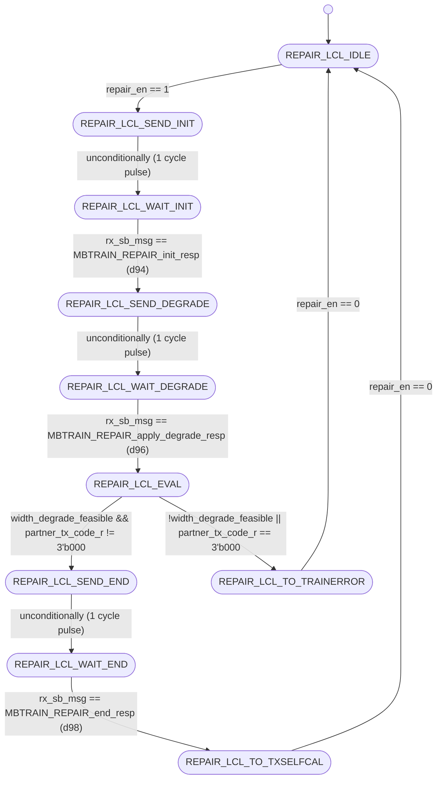
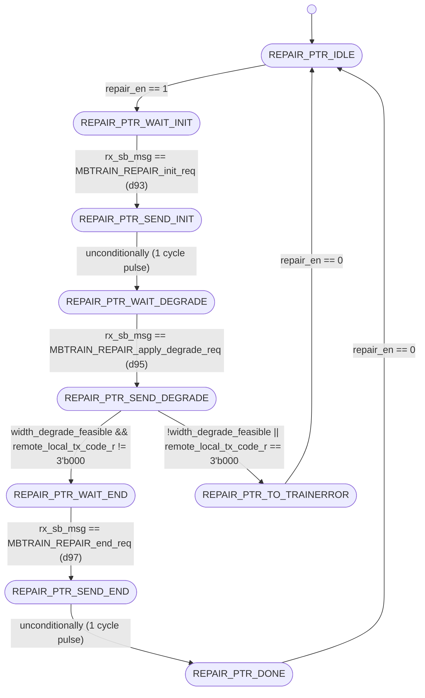

# REPAIR FSM Diagrams

## Local FSM

```mermaid
flowchart TD
REPAIR_LCL_IDLE(["REPAIR_LCL_IDLE"])
REPAIR_LCL_SEND_INIT(["REPAIR_LCL_SEND_INIT"])
REPAIR_LCL_WAIT_INIT(["REPAIR_LCL_WAIT_INIT"])
REPAIR_LCL_SEND_DEGRADE(["REPAIR_LCL_SEND_DEGRADE"])
REPAIR_LCL_WAIT_DEGRADE(["REPAIR_LCL_WAIT_DEGRADE"])
REPAIR_LCL_EVAL(["REPAIR_LCL_EVAL"])
REPAIR_LCL_SEND_END(["REPAIR_LCL_SEND_END"])
REPAIR_LCL_TO_TRAINERROR(["REPAIR_LCL_TO_TRAINERROR"])
REPAIR_LCL_WAIT_END(["REPAIR_LCL_WAIT_END"])
REPAIR_LCL_TO_TXSELFCAL(["REPAIR_LCL_TO_TXSELFCAL"])
START1((" "))

START1 --> REPAIR_LCL_IDLE
REPAIR_LCL_IDLE -->|"repair_en == 1"| REPAIR_LCL_SEND_INIT
REPAIR_LCL_SEND_INIT -->|"unconditionally (1 cycle pulse)"| REPAIR_LCL_WAIT_INIT
REPAIR_LCL_WAIT_INIT -->|"rx_sb_msg == MBTRAIN_REPAIR_init_resp (d94)"| REPAIR_LCL_SEND_DEGRADE
REPAIR_LCL_SEND_DEGRADE -->|"unconditionally (1 cycle pulse)"| REPAIR_LCL_WAIT_DEGRADE
REPAIR_LCL_WAIT_DEGRADE -->|"rx_sb_msg == MBTRAIN_REPAIR_apply_degrade_resp (d96)"| REPAIR_LCL_EVAL
REPAIR_LCL_EVAL -->|"width_degrade_feasible && partner_tx_code_r != 3'b000"| REPAIR_LCL_SEND_END
REPAIR_LCL_EVAL -->|"!width_degrade_feasible || partner_tx_code_r == 3'b000"| REPAIR_LCL_TO_TRAINERROR
REPAIR_LCL_SEND_END -->|"unconditionally (1 cycle pulse)"| REPAIR_LCL_WAIT_END
REPAIR_LCL_WAIT_END -->|"rx_sb_msg == MBTRAIN_REPAIR_end_resp (d98)"| REPAIR_LCL_TO_TXSELFCAL
REPAIR_LCL_TO_TXSELFCAL -->|"repair_en == 0"| REPAIR_LCL_IDLE
REPAIR_LCL_TO_TRAINERROR -->|"repair_en == 0"| REPAIR_LCL_IDLE
```

## Partner FSM

```mermaid
flowchart TD
REPAIR_PTR_IDLE(["REPAIR_PTR_IDLE"])
REPAIR_PTR_WAIT_INIT(["REPAIR_PTR_WAIT_INIT"])
REPAIR_PTR_SEND_INIT(["REPAIR_PTR_SEND_INIT"])
REPAIR_PTR_WAIT_DEGRADE(["REPAIR_PTR_WAIT_DEGRADE"])
REPAIR_PTR_SEND_DEGRADE(["REPAIR_PTR_SEND_DEGRADE"])
REPAIR_PTR_WAIT_END(["REPAIR_PTR_WAIT_END"])
REPAIR_PTR_TO_TRAINERROR(["REPAIR_PTR_TO_TRAINERROR"])
REPAIR_PTR_SEND_END(["REPAIR_PTR_SEND_END"])
REPAIR_PTR_DONE(["REPAIR_PTR_DONE"])
START2((" "))

START2 --> REPAIR_PTR_IDLE
REPAIR_PTR_IDLE -->|"repair_en == 1"| REPAIR_PTR_WAIT_INIT
REPAIR_PTR_WAIT_INIT -->|"rx_sb_msg == MBTRAIN_REPAIR_init_req (d93)"| REPAIR_PTR_SEND_INIT
REPAIR_PTR_SEND_INIT -->|"unconditionally (1 cycle pulse)"| REPAIR_PTR_WAIT_DEGRADE
REPAIR_PTR_WAIT_DEGRADE -->|"rx_sb_msg == MBTRAIN_REPAIR_apply_degrade_req (d95)"| REPAIR_PTR_SEND_DEGRADE
REPAIR_PTR_SEND_DEGRADE -->|"width_degrade_feasible && remote_local_tx_code_r != 3'b000"| REPAIR_PTR_WAIT_END
REPAIR_PTR_SEND_DEGRADE -->|"!width_degrade_feasible || remote_local_tx_code_r == 3'b000"| REPAIR_PTR_TO_TRAINERROR
REPAIR_PTR_WAIT_END -->|"rx_sb_msg == MBTRAIN_REPAIR_end_req (d97)"| REPAIR_PTR_SEND_END
REPAIR_PTR_SEND_END -->|"unconditionally (1 cycle pulse)"| REPAIR_PTR_DONE
REPAIR_PTR_DONE -->|"repair_en == 0"| REPAIR_PTR_IDLE
REPAIR_PTR_TO_TRAINERROR -->|"repair_en == 0"| REPAIR_PTR_IDLE
```

