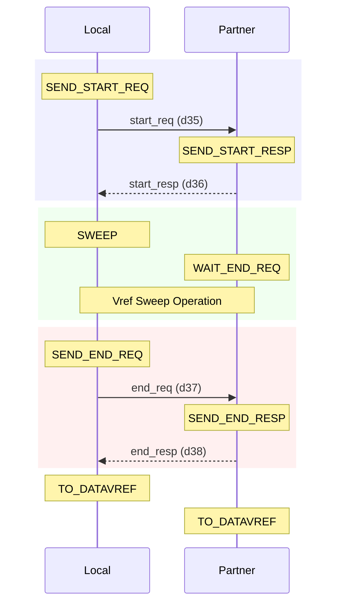

# Code 2:

```mermaid
sequenceDiagram

    participant Local
    participant Partner

    rect rgb(240,240,255)
        Note over Local: SEND_START_REQ
        Local->>Partner: start_req (d35)

        Note over Partner: SEND_START_RESP
        Partner-->>Local: start_resp (d36)
    end

    rect rgb(240,255,240)
        Note over Local: SWEEP
        Note over Partner: WAIT_END_REQ

        Note over Local,Partner: Vref Sweep Operation
    end

    rect rgb(255,240,240)
        Note over Local: SEND_END_REQ
        Local->>Partner: end_req (d37)

        Note over Partner: SEND_END_RESP
        Partner-->>Local: end_resp (d38)
    end

    Note over Local: TO_DATAVREF
    Note over Partner: TO_DATAVREF#  
```