# MBTRAIN and D2C_PT Architecture Overview

This document serves as the primary technical reference and architectural guide for the Main Base Training (**MBTRAIN**) and Data-to-Clock Point Training (**D2C_PT**) sub-system in the `UCIe-3.0-PHY-layer` project. It documents the state-machine sequencing, decoupled initiator/responder FSM methodology, sideband communication rules, the integration of the shared sweep engine, and the mainband lane control signals.

---

## 1. LTSM Sequence and MBTRAIN Sub-states

The UCIe standard defines a comprehensive **Link Training and Squelch-related Main Training (LTSM)** sequence for PHY-layer initialization. 
This sequence includes **MBTRAIN** for initial link training and **D2C_PT** for fine-tuning the data-to-clock alignment.

LTSM consists of the following group of states:
1. **RESET**
2. **SBINIT**
3. **MBINIT**
4. **MBTRAIN** (Sequences 13 sub-states sweeping Vref, PI, and Deskew values)
   1.  `MBTRAIN.VALVREF` — Rx Valid Lane Vref calibration.
   2.  `MBTRAIN.DATAVREF` — Rx Data Lanes Vref calibration.
   3.  `MBTRAIN.SPEEDIDLE` — Link speed negotiation and PLL clock rate changes.
   4.  `MBTRAIN.TXSELFCAL` — Clock and data transmitter self-calibration.
   5.  `MBTRAIN.RXCLKCAL` — In-phase/Quadrature (I/Q) clock lock correction.
   6.  `MBTRAIN.VALTRAINCENTER` — Transmitter Phase Interpolator (PI) centering for the Valid lane.
   7.  `MBTRAIN.VALTRAINVREF` — Receiver Vref training for the Valid lane.
   8.  `MBTRAIN.DATATRAINCENTER1` — Transmitter PI training for Data lanes (Pass 1).
   9.  `MBTRAIN.DATATRAINVREF` — Receiver Vref training for Data lanes.
   10. `MBTRAIN.RXDESKEW` — Data lanes deskew and Equalization (EQ) preset tuning loop.
   11. `MBTRAIN.DATATRAINCENTER2` — Transmitter PI training for Data lanes (Pass 2).
   12. `MBTRAIN.LINKSPEED` — Link stability verification at the final operating rate.
       - *Link Stable*: Advance to `LINKINIT`.
       - *Needs Width Degrade*: Transition to `REPAIR` for link width degradation.
       - *Needs Speed Degrade*: Transition to `SPEEDIDLE` to downshift to the next lower data rate.
       - *External Retrain (PHYRETRAIN)*: Transition to `PHYRETRAIN` to renegotiate parameters.
   13. `MBTRAIN.REPAIR` — Implementation of width degradation.
5. **LINKINIT**
6. **ACTIVE**
7. **PHYRETRAIN**
8. **TRAINERROR**

---

## 2. Decoupled FSM Architecture (Local/Partner)

To prevent simulation stalls and deadlock issues caused by monolithic FSM designs (where both dies are assumed to be in the exact same state at all times), every training sub-state is split into two completely decoupled FSM modules on each die:

* **Local (`unit_<SUBSTATE>_local.sv`)**: Actively initiates handshakes, executes sweeps (Vref, PI, or Deskew), evaluates calibration criteria, and expects response messages.
* **Partner (`unit_<SUBSTATE>_partner.sv`)**: Reacts to request messages sent by the remote die's Local FSM. It configures the local receiver/transmitter settings appropriately and returns response messages.

### Strict Cross-Die Sideband (SB) Communication
All SB communication is strictly cross-die. There is **zero direct SB messaging between Local and Partner modules inside the same die**. Every SB message must cross the die boundary through the Async FIFO.

#### Flow Illustration:
```text
┌──────────────────────── Our UCIe Die (Die 0) ────────────────────────┐
│                                                                      │
│      ┌────────────────────┐              ┌────────────────────┐      │
│      │   <SUBSTATE>_local │              │ <SUBSTATE>_partner │      │
│      │  (Local FSM)       │              │  (Partner FSM)     │      │
│      │                    │              │                    │      │
│      │  Sends REQ msgs    │              │  Waits for REQ     │      │
│      │  to PARTNER die    │              │  from PARTNER die  │      │
│      │                    │              │                    │      │
│      │  Waits for RESP    │              │  Sends RESP back   │      │
│      │  from PARTNER die  │              │  to PARTNER die    │      │
│      └──────────┬─────────┘              └───────────┬────────┘      │
│               ▲ │ sends REQ to                     ▲ │ sends RESP    │
│  RESP arrives │ │ partner FSM          REQ arrives │ │ to local FSM  │
│  at Die 0     │ │ (to Die 1)           at Die 0    │ │ (to Die 1)    │
│               │ ▼                                  │ ▼               │
├═══════════════╪═╪══════════════════════════════════╪═╪═══════════════╡
│      SB Channel (Async FIFO)            SB Channel (Async FIFO)      │
├═══════════════╪═╪══════════════════════════════════╪═╪═══════════════╡
│               ▲ │                                  ▲ │               │
│  sends RESP   │ │ REQ arrives         sends REQ to │ │ RESP arrives  │
│  to local FSM │ │ at Die 1            partner FSM  │ │ at Die 1      │
│  (to Die 0)   │ ▼                     (to Die 0)   │ ▼               │
│      ┌────────┴───────────┐              ┌─────────┴──────────┐      │
│      │ <SUBSTATE>_partner │              │  <SUBSTATE>_local  │      │
│      │   (Partner FSM)    │              │    (Local FSM)     │      │
│      │                    │              │                    │      │
│      │  Waits for REQ     │              │  Sends REQ msgs    │      │
│      │  from OUR die      │              │  to OUR die        │      │
│      │                    │              │                    │      │
│      │  Sends RESP back   │              │  Waits for RESP    │      │
│      │  to OUR die        │              │  from OUR die      │      │
│      └────────────────────┘              └────────────────────┘      │
│                                                                      │
└───────────────────── Partner UCIe Die (Die 1) ───────────────────────┘

Communication paths:
  Our Local    ──REQ (cross-die)──►  Partner Partner  ──RESP (cross-die)──►  Our Local
  Partner Local ──REQ (cross-die)──►  Our Partner      ──RESP (cross-die)──►  Partner Local
```

---

## 3. Top-Level Sequencer (`unit_MBTRAIN_ctrl.sv`)

The monolithic sequencer on this die controls the transition from one substate to the next.
* When MBTRAIN is active, it enables **both** the Local and Partner sub-modules simultaneously (`local_<substate>_en = 1` and `partner_<substate>_en = 1`).
* Based on the spec rules (e.g. *"when the module has sent and received the Done response, it must exit to..."*), it waits for **both** the Local and Partner sub-modules on this die to assert their done flags (`local_<substate>_done && partner_<substate>_done`) before executing the transition to the next substate.

---

## 4. D2C Point Test Mapping: TX_D2C_PT vs RX_D2C_PT

Calibration substates rely on point-testing the clock-to-data alignment. This is achieved via two distinct test engines:
* **`TX_D2C_PT` (Transmitter-Initiated Point Test)**: The local transmitter drives the test pattern and updates clock/phase parameters, then requests logged error results from the remote partner receiver.
* **`RX_D2C_PT` (Receiver-Initiated Point Test)**: The local receiver initiates the test, resets comparison blocks, samples patterns generated by the partner transmitter, and processes internal comparison results.

### Sub-states Utilizing D2C Point Tests

| MBTRAIN Sub-state | D2C Test Category | Sweep Parameter | Active Lanes | Sideband Handshake & Test Flow |
| :--- | :--- | :--- | :--- | :--- |
| **`VALVREF`** | Receiver-initiated (`RX_D2C_PT`) | RX Vref (Valid Lane) | Valid Lane | 1. Local sends `{VALVREF start req}`, Partner replies `{VALVREF start resp}`.<br>2. Local sweeps RX Vref on Valid Lane using `unit_D2C_sweep` and RX Point Test.<br>3. Local sends `{VALVREF end req}`, Partner replies `{VALVREF end resp}`. |
| **`DATAVREF`** | Receiver-initiated (`RX_D2C_PT`) | RX Vref (Data Lanes) | Active Data Lanes | 1. Local sends `{DATAVREF start req}`, Partner replies `{DATAVREF start resp}`.<br>2. Local sweeps RX Vref on Data Lanes using `unit_D2C_sweep`. Transmits pattern from Partner.<br>3. Local sends `{DATAVREF end req}`, Partner replies `{DATAVREF end resp}`. |
| **`VALTRAINCENTER`** | Transmitter-initiated (`TX_D2C_PT`) | TX PI Code (Valid Lane) | Valid Lane | 1. Local sends `{VALTRAINCENTER start req}`, Partner replies `{VALTRAINCENTER start resp}`.<br>2. Local sweeps TX PI phase on Valid Lane using `unit_D2C_sweep`. Local transmits pattern, Partner receives.<br>3. Local sends `{VALTRAINCENTER done req}`, Partner replies `{VALTRAINCENTER done resp}`. |
| **`VALTRAINVREF`** | Receiver-initiated (`RX_D2C_PT`) | RX Vref (Valid Lane) | Valid Lane | 1. Local sends `{VALTRAINVREF start req}`, Partner replies `{VALTRAINVREF start resp}`.<br>2. Local sweeps RX Vref on Valid Lane.<br>3. Local sends `{VALTRAINVREF end req}`, Partner replies `{VALTRAINVREF end resp}`. |
| **`DATATRAINCENTER1`** | Transmitter-initiated (`TX_D2C_PT`) | TX PI Code (Data Lanes - Pass 1) | Active Data Lanes | 1. Local sends `{DATATRAINCENTER1 start req}`, Partner replies `{DATATRAINCENTER1 start resp}`.<br>2. Local sweeps TX PI phase on Data Lanes.<br>3. Local sends `{DATATRAINCENTER1 end req}`, Partner replies `{DATATRAINCENTER1 end resp}`. |
| **`DATATRAINVREF`** | Receiver-initiated (`RX_D2C_PT`) | RX Vref (Data Lanes) | Active Data Lanes | 1. Local sends `{DATATRAINVREF start req}`, Partner replies `{DATATRAINVREF start resp}`.<br>2. Local sweeps RX Vref on Data Lanes.<br>3. Local sends `{DATATRAINVREF end req}`, Partner replies `{DATATRAINVREF end resp}`. |
| **`RXDESKEW`** | Receiver-initiated (`RX_D2C_PT`) | RX Deskew Delay Code | Active Data Lanes | 1. Local sends `{RXDESKEW start req}`, Partner replies `{RXDESKEW start resp}`.<br>2. Local sweeps RX Deskew delay on Data Lanes.<br>3. Local sends `{RXDESKEW end req}`, Partner replies `{RXDESKEW end resp}`. |
| **`DATATRAINCENTER2`** | Transmitter-initiated (`TX_D2C_PT`) | TX PI Code (Data Lanes - Pass 2) | Active Data Lanes | 1. Local sends `{DATATRAINCENTER2 start req}`, Partner replies `{DATATRAINCENTER2 start resp}`.<br>2. Local sweeps TX PI phase on Data Lanes.<br>3. Local sends `{DATATRAINCENTER2 end req}`, Partner replies `{DATATRAINCENTER2 end resp}`. |
| **`LINKSPEED`** | Transmitter-initiated (`TX_D2C_PT`) | None (Single Point Stability Test) | Active Data Lanes + Valid | 1. Local sends `{LINKSPEED start req}`, Partner replies `{LINKSPEED start resp}`.<br>2. Local runs a single-point D2C Point Test at optimized settings to check Link stability.<br>3. Local sends `{LINKSPEED done req}`, Partner replies `{LINKSPEED done resp}`. |

---

## 5. Mainband Lane Selection and Control Routing (`*_lane_sel`)

The `*_lane_sel` signals determine whether a physical lane is driven Low, driven with the active training pattern, or Tri-stated (on TX), and whether it is Enabled or Disabled (on RX).
These signals are:
- `mb_tx_clk_lane_sel`, `mb_tx_data_lane_sel`, `mb_tx_val_lane_sel`, `mb_tx_trk_lane_sel` (2-bit control: `00` = Low, `01` = Active, `1x` = Tri-stated)
- `mb_rx_clk_lane_sel`, `mb_rx_data_lane_sel`, `mb_rx_val_lane_sel`, `mb_rx_trk_lane_sel` (1-bit control: `0` = Disabled, `1` = Enabled)

In a decoupled architecture, both Die 0 (our side) and Die 1 (partner side) run their own FSMs. On each die, the FSM is split into a **Local FSM (Initiator)** and a **Partner FSM (Responder)**.
At any time during a substate, one die is the initiator (Local is active) and one die is the responder (Partner is active). The active test type determines which FSM on Die 0 leads (drives/controls) the physical lane controls:

1. **For Transmitter-initiated Point Tests (`TX_D2C_PT` - e.g., PI Centering, Link Stability)**:
   - The **Local FSM (Initiator)** on the local die is the Transmitter of the test patterns. It **leads the TX lanes**.
     - `mb_tx_*_lane_sel` is controlled by the Local FSM (setting them to `2'b01` (Active pattern) for active lanes, `2'b00` (Low) for others).
   - The **Partner FSM (Responder)** on the remote die is the Receiver. The remote die's Partner FSM **leads the RX lanes** on that side.
   - On the local die, if the Partner FSM is responding to the remote die's Local TX test:
     - Our local Partner FSM is the Receiver. It **leads the RX lanes** on Die 0 (`mb_rx_*_lane_sel = 1`).
     - Our local Partner FSM keeps Die 0's TX lanes inactive.

2. **For Receiver-initiated Point Tests (`RX_D2C_PT` - e.g., Vref, Deskew Calibration)**:
   - The **Local FSM (Initiator)** on the local die is the Receiver of the test patterns. It **leads the RX lanes** on our die.
     - `mb_rx_*_lane_sel` is controlled by the Local FSM (setting them to `1` (Enabled) for the lanes being calibrated).
   - The **Partner FSM (Responder)** on the remote die is the Transmitter. The remote die's Partner FSM **leads the TX lanes** on that side.
   - On the local die, if the Partner FSM is responding to the remote die's Local RX test:
     - Our local Partner FSM is the Transmitter. It **leads the TX lanes** on Die 0 (`mb_tx_*_lane_sel = 2'b01` to transmit patterns to the remote receiver).
     - Our local Partner FSM keeps Die 0's RX lanes at default settings.

### Summary Matrix of Lane Control Leadership:

| Active Test Scenario | Our Local FSM Status | Our Partner FSM Status | TX Lane Selector (`mb_tx_*_lane_sel`) Led By | RX Lane Selector (`mb_rx_*_lane_sel`) Led By |
| :--- | :--- | :--- | :--- | :--- |
| **Case A: Local TX Test** (We initiate `TX_D2C_PT`) | Active | Idle | **Local FSM** (Drives training pattern) | **Local FSM** (Zero defaults/idle) |
| **Case B: Partner TX Test** (Partner initiates `TX_D2C_PT`) | Idle | Active | **Partner FSM** (Zero defaults/idle) | **Partner FSM** (Enables comparison) |
| **Case C: Local RX Test** (We initiate `RX_D2C_PT`) | Active | Idle | **Local FSM** (Zero defaults/idle) | **Local FSM** (Enables calibration RX) |
| **Case D: Partner RX Test** (Partner initiates `RX_D2C_PT`) | Idle | Active | **Partner FSM** (Drives training pattern) | **Partner FSM** (Zero defaults/idle) |
| **Case AB: Parallel TX Tests** (Both dies initiate `TX_D2C_PT`) | Active | Active | **Local FSM** (Drives pattern to partner) | **Partner FSM** (Receives pattern from partner) |
| **Case CD: Parallel RX Tests** (Both dies initiate `RX_D2C_PT`) | Active | Active | **Partner FSM** (Drives pattern to partner) | **Local FSM** (Receives pattern from partner) |

---

## 6. Interface Signals and Modports

All sub-state modules interact with the main LTSM logic and Register File through the modports defined in the SystemVerilog interface `internal_ltsm_if.sv`. 

* **LTSM Interface Control Modports**: Each sub-state has a specific modport providing enable/done signals, timers, clocks, resets, and physical configuration registers.
  * `valvref_mp`, `datavref_mp`, `speedidle_mp`, `txselfcal_mp`, `rxclkcal_mp`, `valtraincenter_mp`, `valtrainvref_mp`, `datatraincenter1_mp` (instantiated as `dtc1_if`), `datatrainvref_mp` (instantiated as `dtvref_if`), `rxdeskew_mp`, `datatraincenter2_mp` (instantiated as `dtc2_if`), `linkspeed_mp` (instantiated as `ls_if`), and `repair_mp` (instantiated as `rp_if`).
* **D2C Point Test Modport (`substate2d2c_mp`)**: Sub-states control and monitor D2C point testing by connecting to the shared D2C wrapper via `substate2d2c_mp`.
  * **Outputs driven by active substate FSM**: `local_tx_pt_en`, `partner_tx_pt_en`, `local_rx_pt_en`, `partner_rx_pt_en`, `d2c_clk_sampling`, `d2c_pattern_setup`, `d2c_data_pattern_sel`, `d2c_val_pattern_sel`, `d2c_pattern_mode`, `d2c_burst_count`, `d2c_idle_count`, `d2c_iter_count`, `d2c_compare_setup`.
  * **Inputs read by active substate FSM**: `local_test_d2c_done`, `partner_test_d2c_done`, `d2c_perlane_pass`, `d2c_aggr_pass`, `d2c_val_pass`.

---

## 7. D2C Point Test Sweep Architecture (`unit_D2C_sweep.sv`)

To calibrate signals (Vref, PI, or Deskew), multiple substates must sweep values across a code range and run D2C point tests.

### Shared External Sweep Engine
Rather than duplicate complex sweeping logic, `unit_D2C_sweep.sv` is instantiated **once** in the top-level wrapper (`wrapper_MBTRAIN.sv`). Substates do not contain their own sweep engine; they interact with the shared `unit_D2C_sweep` externally.

### Sub-states Utilizing the Sweep Engine
* `unit_VALVREF_local` (RX D2C PT, sweeps Vref codes for Valid)
* `unit_DATAVREF_local` (RX D2C PT, sweeps Vref codes for Data)
* `unit_VALTRAINCENTER_local` (TX D2C PT, sweeps PI codes for Valid)
* `unit_VALTRAINVREF_local` (RX D2C PT, sweeps Vref codes for Valid)
* `unit_DATATRAINCENTER1_local` (TX D2C PT, sweeps PI codes for Data)
* `unit_DATATRAINVREF_local` (RX D2C PT, sweeps Vref codes for Data)
* `unit_RXDESKEW_local` (RX D2C PT, sweeps Deskew/PI codes)
* `unit_DATATRAINCENTER2_local` (TX D2C PT, sweeps PI codes for Data)
* `unit_LINKSPEED_local` (TX D2C PT, runs a single-point stability test, range = 1)

### Substate ↔ Sweep Engine Interface Contract
Each local sub-state module uses these ports to interact with `unit_D2C_sweep`:
```systemverilog
output logic        sweep_en,        // High while substate is sweeping
input  logic [N:0]  swept_code,      // Current sweeping code sent to PHY lanes
input  logic [N:0]  best_code[0:15], // Optimal midpoint calculated by the engine
input  logic [N:0]  min_eye_width,   // Narrowest eye-margin detected across lanes
input  logic        sweep_done       // Sweep completed successfully
```

### PHY Code Drive and Latching Rules
During a sweep, lanes must dynamically apply the sweeping code. Afterwards, they must latch the calculated optimal code:

```systemverilog
// Combinational Drive MUX
assign phy_ctrl_code[lane] = (current_state == SWEEP_STATE) ? 
                              swept_code :            // Broadcast sweeping code
                              best_code_r[lane];      // Latched optimal code

// Latching on Done (best_code from D2C_sweep is combinational)
always_ff @(posedge lclk or negedge rst_n) begin
    if (!rst_n) begin
        for (int i=0; i<16; i++) best_code_r[i] <= '0;
    end else if (!is_ltsm_out_of_reset) begin
        for (int i=0; i<16; i++) best_code_r[i] <= '0;
    end else if (current_state == SWEEP_STATE && sweep_done) begin
        for (int i=0; i<16; i++) best_code_r[i] <= best_code[i]; // Latch on exact cycle
    end
end
```

---

## 8. Usage of `unit_negotiated_lanes.sv`

`unit_negotiated_lanes.sv` is a shared combination utility that translates 3-bit lane width codes to 16-bit active-lane mask vectors and contains width degradation checks.
* **Separation of Concerns**: To keep FSM modules isolated from physical packaging logic, `unit_negotiated_lanes` is **only** instantiated in the top-level wrapper `wrapper_MBTRAIN.sv` (or testbench attachments).
* Substates like `LINKSPEED` and `REPAIR` receive status signals (e.g. `width_degrade_feasible`) as wrapper inputs and output their request maps (`local_tx_lane_map_code`) back to the top-level wrapper ports.

---

## 9. Sideband Message Transmission Rules

1. **Pulse Duration**: Assert `tx_sb_msg_valid = 1` for exactly **one clock cycle (1 lclk)**, then return to `0`. The asynchronous FIFO handles synchronization to `sb_clk`.
2. **Consecutive Separation**: When sending back-to-back SB messages, they must be separated by at least **one idle clock cycle** to ensure they are interpreted as separate messages.
3. **Format Guidelines**: Every local/partner module should include an organized sideband table in its header comments mapping MsgInfo and Data fields. Example:
   ```systemverilog
   // ====================================================================================================
   // Sideband Messages Used in RXCLKCAL (Local):
   // +------------------------------------------+-----------+-------------------------------------------+
   // | Message Name                             | Direction | MsgInfo & Data Field Details              |
   // +------------------------------------------+-----------+-------------------------------------------+
   // | {Start Rx Clk Calibration req}           | Out (TX)  | MsgInfo: 16'b0, Data: 64'h0               |
   // | {Start Rx Clk Calibration resp}          | In  (RX)  | MsgInfo: 16'b0, Data: 64'h0               |
   // | {End Rx Clk Calibration req}             | Out (TX)  | MsgInfo: 16'b0, Data: 64'h0               |
   // | {End Rx Clk Calibration resp}            | In  (RX)  | MsgInfo: 16'b0, Data: 64'h0               |
   // +------------------------------------------+-----------+-------------------------------------------+
   ```

---

## 10. Signal Polarity Convention: `*_pass` vs `*_err`

The new decoupled modules use an **active-high pass** polarity to match the UCIe 3.0 specification directly without needing NOT gates.
* Old design: `*_err` (1 = Error/Fail, 0 = Pass)
* New design: `*_pass` (1 = Pass, 0 = Error/Fail)

### Signal Mapping Table:
| Concept | Old Polarity (`*_err`) | New Polarity (`*_pass`) | Meaning (when High) |
|---|---|---|---|
| Per-lane comparison | `mb_rx_perlane_err[15:0]` | `d2c_perlane_pass[15:0]` | Lane passed the point test |
| Cumulative results | `mb_rx_aggr_err` | `d2c_aggr_pass` (1-bit) | All active lanes passed |
| Valid lane result | `mb_rx_val_err` | `d2c_val_pass` | Valid lane passed the point test |

---

## 11. Directory and File Map

The following map highlights the finalized structure of the new design files, listfiles, waves, and testbenches:

```text
UCIe-3.0-PHY-layer/
├── rtl/
│   └── MainSM/
│       └── LTSM/
│           ├── D2C_PT/
│           │   ├── RX_D2C_PT/
│           │   │   ├── unit_RX_D2C_PT_local.sv           # ✅ RTL Re-implemented & Verified.
│           │   │   └── unit_RX_D2C_PT_partner.sv         # ✅ RTL Re-implemented & Verified.
│           │   ├── TX_D2C_PT/
│           │   │   ├── unit_TX_D2C_PT_local.sv           # ✅ RTL Re-implemented & Verified.
│           │   │   └── unit_TX_D2C_PT_partner.sv         # ✅ RTL Re-implemented & Verified.
│           │   ├── wrapper_D2C_PT/
│           │   │   ├── wrapper_D2C_PT_local.sv           # ✅ RTL Re-implemented & Verified.
│           │   │   ├── wrapper_D2C_PT_partner.sv         # ✅ RTL Re-implemented & Verified.
│           │   │   └── wrapper_D2C_PT.sv                 # ✅ RTL Re-implemented & Verified (parallel MB TX/RX MUX).
│           │   ├── unit_D2C_sweep.sv                     # ✅ RTL Re-implemented & Verified.
│           │   └── wrapper_D2C_sweep.sv                  # ✅ RTL Re-implemented & Verified.
│           └── MBTRAIN/
│               ├── RXDESKEW/
│               │   ├── unit_RXDESKEW_local.sv            # ✅ RTL Re-implemented & Verified.
│               │   ├── unit_RXDESKEW_partner.sv          # ✅ RTL Re-implemented & Verified.
│               │   └── wrapper_RXDESKEW.sv               # ✅ RTL Re-implemented & Verified.
│               ├── DATATRAINCENTER1/
│               │   ├── unit_DATATRAINCENTER1_local.sv    # ✅ RTL Re-implemented & Verified.
│               │   ├── unit_DATATRAINCENTER1_partner.sv  # ✅ RTL Re-implemented & Verified.
│               │   └── wrapper_DATATRAINCENTER1.sv       # ✅ RTL Re-implemented & Verified.
│               ├── DATATRAINCENTER2/
│               │   ├── unit_DATATRAINCENTER2_local.sv    # ✅ RTL Re-implemented & Verified.
│               │   ├── unit_DATATRAINCENTER2_partner.sv  # ✅ RTL Re-implemented & Verified.
│               │   └── wrapper_DATATRAINCENTER2.sv       # ✅ RTL Re-implemented & Verified.
│               ├── DATATRAINVREF/
│               │   ├── unit_DATATRAINVREF_local.sv       # ✅ RTL Re-implemented & Verified.
│               │   ├── unit_DATATRAINVREF_partner.sv     # ✅ RTL Re-implemented & Verified.
│               │   └── wrapper_DATATRAINVREF.sv          # ✅ RTL Re-implemented & Verified.
│               ├── DATAVREF/
│               │   ├── unit_DATAVREF_local.sv            # ✅ RTL Re-implemented & Verified.
│               │   ├── unit_DATAVREF_partner.sv          # ✅ RTL Re-implemented & Verified.
│               │   └── wrapper_DATAVREF.sv               # ✅ RTL Re-implemented & Verified.
│               ├── LINKSPEED/    
│               │   ├── unit_LINKSPEED_local.sv           # ✅ RTL Re-implemented & Verified.
│               │   ├── unit_LINKSPEED_partner.sv         # ✅ RTL Re-implemented & Verified.
│               │   └── wrapper_LINKSPEED.sv              # ✅ RTL Re-implemented & Verified.
│               ├── REPAIR/
│               │   ├── unit_REPAIR_local.sv              # ✅ RTL Re-implemented & Verified.
│               │   ├── unit_REPAIR_partner.sv            # ✅ RTL Re-implemented & Verified.
│               │   ├── unit_negotiated_lanes.sv          # ✅ Completed: determine active 16 data lanes in the link for Tx/Rx.
│               │   └── wrapper_REPAIR.sv                 # ✅ RTL Re-implemented & Verified.
│               ├── RXCLKCAL/
│               │   ├── unit_RXCLKCAL_local.sv            # ✅ RTL Re-implemented & Verified.
│               │   ├── unit_RXCLKCAL_partner.sv          # ✅ RTL Re-implemented & Verified.
│               │   ├── unit_RXCLKCAL_IQ_local.sv         # ✅ RTL Re-implemented & Verified.
│               │   ├── unit_RXCLKCAL_IQ_partner.sv       # ✅ RTL Re-implemented & Verified.
│               │   └── wrapper_RXCLKCAL.sv               # ✅ RTL Re-implemented & Verified.
│               ├── SPEEDIDLE/
│               │   ├── unit_SPEEDIDLE_local.sv           # ✅ RTL Re-implemented & Verified.
│               │   ├── unit_SPEEDIDLE_partner.sv         # ✅ RTL Re-implemented & Verified.
│               │   └── wrapper_SPEEDIDLE.sv              # ✅ RTL Re-implemented & Verified.
│               ├── TXSELFCAL/
│               │   ├── unit_TXSELFCAL_local.sv           # ✅ RTL Re-implemented & Verified.
│               │   ├── unit_TXSELFCAL_partner.sv         # ✅ RTL Re-implemented & Verified.
│               │   └── wrapper_TXSELFCAL.sv              # ✅ RTL Re-implemented & Verified.
│               ├── VALTRAINCENTER/
│               │   ├── unit_VALTRAINCENTER_local.sv      # ✅ RTL Re-implemented & Verified.
│               │   ├── unit_VALTRAINCENTER_partner.sv    # ✅ RTL Re-implemented & Verified.
│               │   └── wrapper_VALTRAINCENTER.sv         # ✅ RTL Re-implemented & Verified.
│               ├── VALTRAINVREF/
│               │   ├── unit_VALTRAINVREF_local.sv        # ✅ RTL Re-implemented & Verified.
│               │   ├── unit_VALTRAINVREF_partner.sv      # ✅ RTL Re-implemented & Verified.
│               │   └── wrapper_VALTRAINVREF.sv           # ✅ RTL Re-implemented & Verified.
│               ├── VALVREF/
│               │   ├── unit_VALVREF_local.sv             # ✅ RTL Re-implemented & Verified.
│               │   ├── unit_VALVREF_partner.sv           # ✅ RTL Re-implemented & Verified.
│               │   └── wrapper_VALVREF.sv                # ✅ RTL Re-implemented & Verified.
│               ├── unit_MBTRAIN_ctrl.sv              
│               └── wrapper_MBTRAIN.sv
├── sim/
│   ├── listfiles/
│   │   ├── unit_MBTRAIN_ctrl.f                           # ✅ Completed.
│   │   ├── unit_RX_D2C_PT.f                              # ✅ Completed.
│   │   ├── unit_TX_D2C_PT.f                              # ✅ Completed.
│   │   ├── wrapper_D2C_PT.f                              # ✅ Completed.
│   │   ├── wrapper_D2C_PT_top.f                          # ✅ New: listfile for wrapper_D2C_PT_top_tb simulation.
│   │   ├── wrapper_DATATRAINCENTER1.f                    # ✅ New: listfile for wrapper_DATATRAINCENTER1_tb simulation.
│   │   ├── wrapper_DATATRAINCENTER2.f                    # ✅ New: listfile for wrapper_DATATRAINCENTER2_tb simulation.
│   │   ├── wrapper_DATATRAINVREF.f                       # ✅ New: listfile for wrapper_DATATRAINVREF_tb simulation.
│   │   ├── wrapper_DATAVREF.f                            # ✅ New: listfile for wrapper_DATAVREF_tb simulation.
│   │   ├── wrapper_LINKSPEED.f                           # ✅ New: listfile for wrapper_LINKSPEED_tb simulation.
│   │   ├── wrapper_MBTRAIN_class_based.f                 # ✅ New: listfile for wrapper_MBTRAIN_class_based_tb simulation.
│   │   ├── wrapper_REPAIR.f                              # ✅ New: listfile for wrapper_REPAIR_tb simulation.
│   │   ├── wrapper_RXCLKCAL.f                            # ✅ New: listfile for wrapper_RXCLKCAL_tb simulation.
│   │   ├── wrapper_RXDESKEW.f                            # ✅ New: listfile for wrapper_RXDESKEW_tb simulation.
│   │   ├── wrapper_SPEEDIDLE.f                           # ✅ New: listfile for wrapper_SPEEDIDLE_tb simulation.
│   │   ├── wrapper_TXSELFCAL.f                           # ✅ New: listfile for wrapper_TXSELFCAL_tb simulation.
│   │   ├── wrapper_VALTRAINCENTER.f                      # ✅ New: listfile for wrapper_VALTRAINCENTER_tb simulation.
│   │   ├── wrapper_VALTRAINVREF.f                        # ✅ New: listfile for wrapper_VALTRAINVREF_tb simulation.
│   │   ├── wrapper_VALVREF.f                             # ✅ New: listfile for wrapper_VALVREF_tb simulation.
│   │   └── wrapper_MBTRAIN.f
│   └── waves/
│       ├── unit_DATATRAINCENTER1_tb.do
│       ├── unit_DATATRAINCENTER2_tb.do
│       ├── unit_DATATRAINVREF_tb.do
│       ├── unit_DATAVREF_tb.do
│       ├── unit_LINKSPEED_tb.do
│       ├── unit_MBTRAIN_ctrl_tb.do
│       ├── unit_REPAIR_tb.do
│       ├── unit_RXCLKCAL_tb.do
│       ├── unit_RXDESKEW_tb.do
│       ├── unit_RX_D2C_PT_tb.do
│       ├── unit_SPEEDIDLE_tb.do
│       ├── unit_TXSELFCAL_tb.do
│       ├── unit_TX_D2C_PT_tb.do
│       ├── unit_VALTRAINCENTER_tb.do
│       ├── unit_VALTRAINVREF_tb.do
│       ├── unit_VALVREF_tb.do
│       ├── wrapper_D2C_PT_tb.do
│       └── wrapper_MBTRAIN_tb.do
└── tb/
    ├── unit/
    │   └── MainSM/
    │       └── LTSM/
    │           ├── D2C_PT/
    │           │   ├── unit_RX_D2C_PT_tb.sv              # ✅ Completed.
    │           │   └── unit_TX_D2C_PT_tb.sv              # ✅ Completed.
    │           └── MBTRAIN/
    │               └── unit_MBTRAIN_ctrl_tb.sv           # ✅ Completed.
    └── wrapper/
        └── MainSM/
            └── LTSM/
                ├── D2C_PT/
                │   ├── wrapper_D2C_PT_tb.sv              # ✅ Completed.
                │   └── wrapper_D2C_PT_top_tb.sv          # ✅ Verified: top-level TB covering all 6 test types + 100 randomized iterations.
                └── MBTRAIN/
                    ├── common/
                    │   ├── ltsm_tb_attachments.sv        # ✅ Completed: TB attachments.
                    │   └── ltsm_tb_if.sv                 # ✅ Completed: TB interface.
                    ├── wrapper_MBTRAIN_class_based_tb/   # Class-based (OOP-style) MBTRAIN testbench suite.
                    │   ├── mbtrain_cb_config.sv
                    │   ├── mbtrain_cb_coverage.sv
                    │   ├── mbtrain_cb_d2c_model.sv
                    │   ├── mbtrain_cb_driver.sv
                    │   ├── mbtrain_cb_env.sv
                    │   ├── mbtrain_cb_if.sv
                    │   ├── mbtrain_cb_monitor.sv
                    │   ├── mbtrain_cb_pkg.sv
                    │   ├── mbtrain_cb_sb_agent.sv
                    │   ├── mbtrain_cb_scoreboard.sv
                    │   ├── mbtrain_cb_tb_top.sv
                    │   ├── mbtrain_cb_testlib.sv
                    │   ├── mbtrain_cb_transaction.sv
                    │   ├── mbtrain_cb_types_pkg.sv
                    │   └── wrapper_MBTRAIN_class_based_tb.sv
                    ├── wrapper_DATATRAINCENTER1_tb.sv # ✅ Completed & Verified.
                    ├── wrapper_DATATRAINCENTER2_tb.sv # ✅ Completed & Verified.
                    ├── wrapper_DATATRAINVREF_tb.sv    # ✅ Completed & Verified.
                    ├── wrapper_DATAVREF_tb.sv         # ✅ Completed & Verified.
                    ├── wrapper_LINKSPEED_tb.sv        # ✅ Completed.
                    ├── wrapper_REPAIR_tb.sv           # ✅ Completed & Verified.
                    ├── wrapper_RXCLKCAL_tb.sv         # ✅ Completed & Verified.
                    ├── wrapper_RXDESKEW_tb.sv         # ✅ Completed & Verified.
                    ├── wrapper_SPEEDIDLE_tb.sv        # ✅ Completed & Verified.
                    ├── wrapper_TXSELFCAL_tb.sv        # ✅ Completed & Verified.
                    ├── wrapper_VALTRAINCENTER_tb.sv   # ✅ Completed & Verified.
                    ├── wrapper_VALTRAINVREF_tb.sv     # ✅ Completed & Verified.
                    ├── wrapper_VALVREF_tb.sv          # ✅ Completed & Verified.
                    └── wrapper_MBTRAIN_tb.sv          # ✅ It works but need more scenarios.
```

---

## 12. Verification and Running Testbenches

Every sub-state and component has a dedicated testbench. You can run each testbench individually using the PowerShell script on Windows, or the `Makefile` on Linux.

### Windows (PowerShell):

| Sub-system / FSM | Listfile Config | Top Testbench Module | Execution Command |
| :--- | :--- | :--- | :--- |
| **MBTRAIN Controller**         | `unit_MBTRAIN_ctrl`        | `unit_MBTRAIN_ctrl_tb`        | `.\run_sim.ps1 -CONFIG unit_MBTRAIN_ctrl -TOP unit_MBTRAIN_ctrl_tb -MODE run`               |
| **RX D2C Point Test**          | `unit_RX_D2C_PT`           | `unit_RX_D2C_PT_tb`           | `.\run_sim.ps1 -CONFIG unit_RX_D2C_PT -TOP unit_RX_D2C_PT_tb -MODE run`                     |
| **TX D2C Point Test**          | `unit_TX_D2C_PT`           | `unit_TX_D2C_PT_tb`           | `.\run_sim.ps1 -CONFIG unit_TX_D2C_PT -TOP unit_TX_D2C_PT_tb -MODE run`                     |
| **D2C Point Test Sub-wrapper** | `wrapper_D2C_PT`           | `wrapper_D2C_PT_tb`           | `.\run_sim.ps1 -CONFIG wrapper_D2C_PT -TOP wrapper_D2C_PT_tb -MODE run`                     |
| **D2C Point Test Top Wrapper** | `wrapper_D2C_PT_top`       | `wrapper_D2C_PT_top_tb`       | `.\run_sim.ps1 -CONFIG wrapper_D2C_PT_top -TOP wrapper_D2C_PT_top_tb -MODE run`             |
| **VALVREF Substate**           | `wrapper_VALVREF`          | `wrapper_VALVREF_tb`          | `.\run_sim.ps1 -CONFIG wrapper_VALVREF -TOP wrapper_VALVREF_tb -MODE run`                   |
| **DATAVREF Substate**          | `wrapper_DATAVREF`         | `wrapper_DATAVREF_tb`         | `.\run_sim.ps1 -CONFIG wrapper_DATAVREF -TOP wrapper_DATAVREF_tb -MODE run`                 |
| **SPEEDIDLE Substate**         | `wrapper_SPEEDIDLE`        | `wrapper_SPEEDIDLE_tb`        | `.\run_sim.ps1 -CONFIG wrapper_SPEEDIDLE -TOP wrapper_SPEEDIDLE_tb -MODE run`               |
| **TXSELFCAL Substate**         | `wrapper_TXSELFCAL`        | `wrapper_TXSELFCAL_tb`        | `.\run_sim.ps1 -CONFIG wrapper_TXSELFCAL -TOP wrapper_TXSELFCAL_tb -MODE run`               |
| **RXCLKCAL Substate**          | `wrapper_RXCLKCAL`         | `wrapper_RXCLKCAL_tb`         | `.\run_sim.ps1 -CONFIG wrapper_RXCLKCAL -TOP wrapper_RXCLKCAL_tb -MODE run`                 |
| **VALTRAINCENTER Substate**    | `wrapper_VALTRAINCENTER`   | `wrapper_VALTRAINCENTER_tb`   | `.\run_sim.ps1 -CONFIG wrapper_VALTRAINCENTER -TOP wrapper_VALTRAINCENTER_tb -MODE run`     |
| **VALTRAINVREF Substate**      | `wrapper_VALTRAINVREF`     | `wrapper_VALTRAINVREF_tb`     | `.\run_sim.ps1 -CONFIG wrapper_VALTRAINVREF -TOP wrapper_VALTRAINVREF_tb -MODE run`         |
| **DATATRAINCENTER1 Substate**  | `wrapper_DATATRAINCENTER1` | `wrapper_DATATRAINCENTER1_tb` | `.\run_sim.ps1 -CONFIG wrapper_DATATRAINCENTER1 -TOP wrapper_DATATRAINCENTER1_tb -MODE run` |
| **DATATRAINVREF Substate**     | `wrapper_DATATRAINVREF`    | `wrapper_DATATRAINVREF_tb`    | `.\run_sim.ps1 -CONFIG wrapper_DATATRAINVREF -TOP wrapper_DATATRAINVREF_tb -MODE run`       |
| **RXDESKEW Substate**          | `wrapper_RXDESKEW`         | `wrapper_RXDESKEW_tb`         | `.\run_sim.ps1 -CONFIG wrapper_RXDESKEW -TOP wrapper_RXDESKEW_tb -MODE run`                 |
| **DATATRAINCENTER2 Substate**  | `wrapper_DATATRAINCENTER2` | `wrapper_DATATRAINCENTER2_tb` | `.\run_sim.ps1 -CONFIG wrapper_DATATRAINCENTER2 -TOP wrapper_DATATRAINCENTER2_tb -MODE run` |
| **LINKSPEED Substate**         | `wrapper_LINKSPEED`        | `wrapper_LINKSPEED_tb`        | `.\run_sim.ps1 -CONFIG wrapper_LINKSPEED -TOP wrapper_LINKSPEED_tb -MODE run`               |
| **REPAIR Substate**            | `wrapper_REPAIR`           | `wrapper_REPAIR_tb`           | `.\run_sim.ps1 -CONFIG wrapper_REPAIR -TOP wrapper_REPAIR_tb -MODE run`                     |

### Linux Terminal (Make):

| Sub-system / FSM | Listfile Config | Top Testbench Module | Execution Command |
| :--- | :--- | :--- | :--- |
| **MBTRAIN Controller**         | `unit_MBTRAIN_ctrl`        | `unit_MBTRAIN_ctrl_tb`        | `make run CONFIG=unit_MBTRAIN_ctrl TOP=unit_MBTRAIN_ctrl_tb`               |
| **RX D2C Point Test**          | `unit_RX_D2C_PT`           | `unit_RX_D2C_PT_tb`           | `make run CONFIG=unit_RX_D2C_PT TOP=unit_RX_D2C_PT_tb`                     |
| **TX D2C Point Test**          | `unit_TX_D2C_PT`           | `unit_TX_D2C_PT_tb`           | `make run CONFIG=unit_TX_D2C_PT TOP=unit_TX_D2C_PT_tb`                     |
| **D2C Point Test Sub-wrapper** | `wrapper_D2C_PT`           | `wrapper_D2C_PT_tb`           | `make run CONFIG=wrapper_D2C_PT TOP=wrapper_D2C_PT_tb`                     |
| **D2C Point Test Top Wrapper** | `wrapper_D2C_PT_top`       | `wrapper_D2C_PT_top_tb`       | `make run CONFIG=wrapper_D2C_PT_top TOP=wrapper_D2C_PT_top_tb`             |
| **VALVREF Substate**           | `wrapper_VALVREF`          | `wrapper_VALVREF_tb`          | `make run CONFIG=wrapper_VALVREF TOP=wrapper_VALVREF_tb`                   |
| **DATAVREF Substate**          | `wrapper_DATAVREF`         | `wrapper_DATAVREF_tb`         | `make run CONFIG=wrapper_DATAVREF TOP=wrapper_DATAVREF_tb`                 |
| **SPEEDIDLE Substate**         | `wrapper_SPEEDIDLE`        | `wrapper_SPEEDIDLE_tb`        | `make run CONFIG=wrapper_SPEEDIDLE TOP=wrapper_SPEEDIDLE_tb`               |
| **TXSELFCAL Substate**         | `wrapper_TXSELFCAL`        | `wrapper_TXSELFCAL_tb`        | `make run CONFIG=wrapper_TXSELFCAL TOP=wrapper_TXSELFCAL_tb`               |
| **RXCLKCAL Substate**          | `wrapper_RXCLKCAL`         | `wrapper_RXCLKCAL_tb`         | `make run CONFIG=wrapper_RXCLKCAL TOP=wrapper_RXCLKCAL_tb`                 |
| **VALTRAINCENTER Substate**    | `wrapper_VALTRAINCENTER`   | `wrapper_VALTRAINCENTER_tb`   | `make run CONFIG=wrapper_VALTRAINCENTER TOP=wrapper_VALTRAINCENTER_tb`     |
| **VALTRAINVREF Substate**      | `wrapper_VALTRAINVREF`     | `wrapper_VALTRAINVREF_tb`     | `make run CONFIG=wrapper_VALTRAINVREF TOP=wrapper_VALTRAINVREF_tb`         |
| **DATATRAINCENTER1 Substate**  | `wrapper_DATATRAINCENTER1` | `wrapper_DATATRAINCENTER1_tb` | `make run CONFIG=wrapper_DATATRAINCENTER1 TOP=wrapper_DATATRAINCENTER1_tb` |
| **DATATRAINVREF Substate**     | `wrapper_DATATRAINVREF`    | `wrapper_DATATRAINVREF_tb`    | `make run CONFIG=wrapper_DATATRAINVREF TOP=wrapper_DATATRAINVREF_tb`       |
| **RXDESKEW Substate**          | `wrapper_RXDESKEW`         | `wrapper_RXDESKEW_tb`         | `make run CONFIG=wrapper_RXDESKEW TOP=wrapper_RXDESKEW_tb`                 |
| **DATATRAINCENTER2 Substate**  | `wrapper_DATATRAINCENTER2` | `wrapper_DATATRAINCENTER2_tb` | `make run CONFIG=wrapper_DATATRAINCENTER2 TOP=wrapper_DATATRAINCENTER2_tb` |
| **LINKSPEED Substate**         | `wrapper_LINKSPEED`        | `wrapper_LINKSPEED_tb`        | `make run CONFIG=wrapper_LINKSPEED TOP=wrapper_LINKSPEED_tb`               |
| **REPAIR Substate**            | `wrapper_REPAIR`           | `wrapper_REPAIR_tb`           | `make run CONFIG=wrapper_REPAIR TOP=wrapper_REPAIR_tb`                     |

---

## 13. AI Design Guide: Top-Level `wrapper_MBTRAIN.sv` Implementation Blueprint

The top-level training wrapper `wrapper_MBTRAIN.sv` is responsible for integrating all 13 substate wrappers, the shared D2C sweep engine, lane negotiation utility, and the `unit_MBTRAIN_ctrl` top-level sequencer. For any coding assistant implementing this top-level wrapper, follow this blueprint strictly.

### 13.1. Sub-Modules to Instantiate
1. **Top Sequencer**: `unit_MBTRAIN_ctrl`
2. **Shared Sweep Engine**: `unit_D2C_sweep` (with configurable widths for Vref/PI codes)
3. **Shared Negotiated Lanes**: `unit_negotiated_lanes` (translates target lane width code to 16-bit lane mask)
4. **Shared Negotiated Speed**: `unit_negotiated_speed` (determines link maximum and current negotiated speed)
5. **Substate Wrappers**:
   * `wrapper_VALVREF`, `wrapper_DATAVREF`, `wrapper_SPEEDIDLE`, `wrapper_TXSELFCAL`, `wrapper_RXCLKCAL`
   * `wrapper_VALTRAINCENTER`, `wrapper_VALTRAINVREF`, `wrapper_DATATRAINCENTER1`, `wrapper_DATATRAINVREF`
   * `wrapper_RXDESKEW`, `wrapper_DATATRAINCENTER2`, `wrapper_LINKSPEED`, `wrapper_REPAIR`

### 13.2. Multiplexing and Control Signal Routing

All interface routes from/to the physical layer must be multiplexed based on the `current_mbtrain_substate` output of `unit_MBTRAIN_ctrl`.

#### A. Mainband (MB) Transceiver MUX Logic
The lane selectors (`mb_tx_*_lane_sel` and `mb_rx_*_lane_sel`) must route the active substate's output to the top wrapper ports. When MBTRAIN is in `MBTRAIN_IDLE` or `MBTRAIN_DONE`, default safe values must be driven (TX = Tri-state `2'b10`, RX = Disabled `1'b0`).
* **TX Clock, Data, Valid, Track Selectors**:
  ```systemverilog
  always_comb begin
      case (current_mbtrain_substate)
          VALVREF:          {mb_tx_clk_lane_sel, mb_tx_data_lane_sel, mb_tx_val_lane_sel, mb_tx_trk_lane_sel} = {valvref_tx_clk_sel, valvref_tx_data_sel, valvref_tx_val_sel, valvref_tx_trk_sel};
          DATAVREF:         {mb_tx_clk_lane_sel, mb_tx_data_lane_sel, mb_tx_val_lane_sel, mb_tx_trk_lane_sel} = {datavref_tx_clk_sel, datavref_tx_data_sel, datavref_tx_val_sel, datavref_tx_trk_sel};
          SPEEDIDLE:        {mb_tx_clk_lane_sel, mb_tx_data_lane_sel, mb_tx_val_lane_sel, mb_tx_trk_lane_sel} = {speedidle_tx_clk_sel, speedidle_tx_data_sel, speedidle_tx_val_sel, speedidle_tx_trk_sel};
          TXSELFCAL:        {mb_tx_clk_lane_sel, mb_tx_data_lane_sel, mb_tx_val_lane_sel, mb_tx_trk_lane_sel} = {txselfcal_tx_clk_sel, txselfcal_tx_data_sel, txselfcal_tx_val_sel, txselfcal_tx_trk_sel};
          RXCLKCAL:         {mb_tx_clk_lane_sel, mb_tx_data_lane_sel, mb_tx_val_lane_sel, mb_tx_trk_lane_sel} = {rxclkcal_tx_clk_sel, rxclkcal_tx_data_sel, rxclkcal_tx_val_sel, rxclkcal_tx_trk_sel};
          VALTRAINCENTER:   {mb_tx_clk_lane_sel, mb_tx_data_lane_sel, mb_tx_val_lane_sel, mb_tx_trk_lane_sel} = {vtc_tx_clk_sel, vtc_tx_data_sel, vtc_tx_val_sel, vtc_tx_trk_sel};
          VALTRAINVREF:     {mb_tx_clk_lane_sel, mb_tx_data_lane_sel, mb_tx_val_lane_sel, mb_tx_trk_lane_sel} = {vtvref_tx_clk_sel, vtvref_tx_data_sel, vtvref_tx_val_sel, vtvref_tx_trk_sel};
          DATATRAINCENTER1: {mb_tx_clk_lane_sel, mb_tx_data_lane_sel, mb_tx_val_lane_sel, mb_tx_trk_lane_sel} = {dtc1_tx_clk_sel, dtc1_tx_data_sel, dtc1_tx_val_sel, dtc1_tx_trk_sel};
          DATATRAINVREF:    {mb_tx_clk_lane_sel, mb_tx_data_lane_sel, mb_tx_val_lane_sel, mb_tx_trk_lane_sel} = {dtvref_tx_clk_sel, dtvref_tx_data_sel, dtvref_tx_val_sel, dtvref_tx_trk_sel};
          RXDESKEW:         {mb_tx_clk_lane_sel, mb_tx_data_lane_sel, mb_tx_val_lane_sel, mb_tx_trk_lane_sel} = {rxdeskew_tx_clk_sel, rxdeskew_tx_data_sel, rxdeskew_tx_val_sel, rxdeskew_tx_trk_sel};
          DATATRAINCENTER2: {mb_tx_clk_lane_sel, mb_tx_data_lane_sel, mb_tx_val_lane_sel, mb_tx_trk_lane_sel} = {dtc2_tx_clk_sel, dtc2_tx_data_sel, dtc2_tx_val_sel, dtc2_tx_trk_sel};
          LINKSPEED:        {mb_tx_clk_lane_sel, mb_tx_data_lane_sel, mb_tx_val_lane_sel, mb_tx_trk_lane_sel} = {linkspeed_tx_clk_sel, linkspeed_tx_data_sel, linkspeed_tx_val_sel, linkspeed_tx_trk_sel};
          REPAIR:           {mb_tx_clk_lane_sel, mb_tx_data_lane_sel, mb_tx_val_lane_sel, mb_tx_trk_lane_sel} = {repair_tx_clk_sel, repair_tx_data_sel, repair_tx_val_sel, repair_tx_trk_sel};
          default:          {mb_tx_clk_lane_sel, mb_tx_data_lane_sel, mb_tx_val_lane_sel, mb_tx_trk_lane_sel} = {2'b10, 2'b10, 2'b10, 2'b10}; // Tri-stated
      endcase
  end
  ```

#### B. Sideband (SB) TX Message Arbitration
Because multiple substate modules can request SB transmission, the wrapper must select the active substate's SB outputs to write into the async FIFO:
```systemverilog
assign tx_sb_msg_valid = active_tx_sb_msg_valid;
assign tx_sb_msg       = active_tx_sb_msg;
assign tx_msginfo      = active_tx_msginfo;
assign tx_data_field   = active_tx_data_field;
```
*(Combine them inside a comb block using `current_mbtrain_substate` as the select line).*

#### C. Shared Watchdog & Settle Timer Routing
Watchdog and settle timers are OR'ed or routed cleanly.
* `timeout_timer_en` = OR of all `timeout_timer_en` outputs of active substates.
* `analog_settle_timer_en` = OR of all `analog_settle_timer_en` outputs.

#### D. Shared Sweep Engine Multiplexing
Since only one substate sweeps at a time, route the sweep controls using a multiplexer:
* **Inputs to active substate**: `swept_code`, `best_code`, `sweep_done` from `unit_D2C_sweep`.
* **Outputs to `unit_D2C_sweep`**:
  ```systemverilog
  assign sweep_en = valvref_sweep_en | datavref_sweep_en | valtraincenter_sweep_en | 
                    valtrainvref_sweep_en | dtc1_sweep_en | dtvref_sweep_en | 
                    rxdeskew_sweep_en | dtc2_sweep_en | linkspeed_sweep_en;
  ```

### 13.3. Module Interconnection and Signal Flow Diagram

The following Mermaid block diagram illustrates how all the sub-modules within `wrapper_MBTRAIN.sv` are connected together, detailing the handshakes, shared sweep engine, lane masks, sideband/mainband multiplexers, and timer logic:

```mermaid
graph TD
    subgraph wrapper_MBTRAIN.sv [wrapper_MBTRAIN.sv Top Level]
        ctrl[unit_MBTRAIN_ctrl Sequencer]
        sweep[unit_D2C_sweep Shared Sweep Engine]
        lanes[unit_negotiated_lanes Utility]
        speed[unit_negotiated_speed Utility]
        
        subgraph Substate_Wrappers [13 Substate Wrappers]
            w_valvref[wrapper_VALVREF]
            w_datavref[wrapper_DATAVREF]
            w_speedidle[wrapper_SPEEDIDLE]
            w_txselfcal[wrapper_TXSELFCAL]
            w_rxclkcal[wrapper_RXCLKCAL]
            w_valcenter[wrapper_VALTRAINCENTER]
            w_valvref_tr[wrapper_VALTRAINVREF]
            w_dtc1[wrapper_DATATRAINCENTER1]
            w_dtvref[wrapper_DATATRAINVREF]
            w_rxdeskew[wrapper_RXDESKEW]
            w_dtc2[wrapper_DATATRAINCENTER2]
            w_linkspeed[wrapper_LINKSPEED]
            w_repair[wrapper_REPAIR]
        end
        
        sb_mux[Sideband MUX / Arbiter]
        mb_mux[Mainband MUX]
        timer_or[Timer OR-Gate Logic]
    end

    %% Sequencer Handshakes
    ctrl -->|local_en / partner_en vectors| Substate_Wrappers
    Substate_Wrappers -->|local_done / partner_done vectors| ctrl
    Substate_Wrappers -->|trainerror_req ORed| ctrl
    
    %% Shared Sweep Connections
    Substate_Wrappers -->|sweep_en ORed| sweep
    sweep -->|swept_code / best_code / sweep_done| Substate_Wrappers
    
    %% Lane/Speed Connection
    lanes -->|width_degrade_feasible / local_tx_lane_map_code| w_repair
    w_repair -->|update_lane_mask| lanes
    speed -->|param_negotiated_max_speed| w_speedidle
    w_speedidle -->|phy_negotiated_speed| speed
    
    %% SB Connections
    Substate_Wrappers -->|tx_sb_msg_valid / tx_sb_msg / tx_msginfo / tx_data_field| sb_mux
    sb_mux -->|Global TX SB Signals| global_sb_tx[Global Sideband TX Ports]
    global_sb_rx[Global Sideband RX Ports] -->|rx_sb_msg_valid / rx_sb_msg / rx_msginfo / rx_data_field| Substate_Wrappers
    
    %% MB Connections
    Substate_Wrappers -->|mb_tx_clk/data/val/trk_lane_sel & mb_rx_clk/data/val/trk_lane_sel| mb_mux
    mb_mux -->|Global MB Selectors| global_mb[Global Mainband Ports]
    
    %% Timer Connections
    Substate_Wrappers -->|timeout_timer_en / analog_settle_timer_en| timer_or
    timer_or -->|Global Timer Enable Flags| global_timers[Global Timer Hardware]
```



### 13.4. Signal Mapping and Connectivity Details

To compile and verify `wrapper_MBTRAIN.sv` successfully, implement the following connections between sub-modules:

1. **Top-Level Sequencer Handshakes (`unit_MBTRAIN_ctrl` ↔ Substate Wrappers)**:
   * Map `local_<substate>_en` and `partner_<substate>_en` outputs from the sequencer to the corresponding substate wrapper input ports.
   * Route `local_<substate>_done` and `partner_<substate>_done` outputs from all wrappers back to the sequencer's status inputs.
   * Collect the `trainerror_req` signals from all active wrappers and logically `OR` them to drive the `trainerror_detected` input on the sequencer.

2. **D2C Sweep Interface Routing (`unit_D2C_sweep` ↔ Substate Wrappers)**:
   * Connect `unit_D2C_sweep.swept_code` combinational output to the `swept_code` input of all wrappers.
   * Connect `unit_D2C_sweep.best_code` array output to the `best_code` input of all wrappers.
   * Connect `unit_D2C_sweep.sweep_done` flag output to the `sweep_done` input of all wrappers.
   * Drive `unit_D2C_sweep.sweep_en` using the logical OR of all wrappers' `sweep_en` outputs:
     `assign sweep_en = valvref_sweep_en | datavref_sweep_en | valtraincenter_sweep_en | valtrainvref_sweep_en | dtc1_sweep_en | dtvref_sweep_en | rxdeskew_sweep_en | dtc2_sweep_en | linkspeed_sweep_en;`

3. **Width Degradation Inter-lock (`unit_negotiated_lanes` ↔ `wrapper_REPAIR`)**:
   * Connect `unit_negotiated_lanes.degrade_feasible` to the `width_degrade_feasible` input of `wrapper_REPAIR`.
   * Connect `unit_negotiated_lanes.degraded_lane_map_code` to the `local_tx_lane_map_code` input of `wrapper_REPAIR`.
   * Connect `wrapper_REPAIR.update_lane_mask` to the `update_lane_mask` control input of `unit_negotiated_lanes`.
   * Broadcast the registered `mb_tx_data_lane_mask` and `mb_rx_data_lane_mask` outputs from `wrapper_REPAIR` back to the top-level ports and other wrappers.

4. **Sideband Messaging Broadcast & Arbitration**:
   * Broadcast the top-level incoming sideband inputs (`rx_sb_msg_valid`, `rx_sb_msg`, `rx_msginfo`, and `rx_data_field`) to the respective input ports of all 13 substate wrappers.
   * Multiplex the outgoing sideband message channels from all wrappers onto the global TX sideband ports (`tx_sb_msg_valid`, `tx_sb_msg`, `tx_msginfo`, `tx_data_field`) comb-wise using `current_mbtrain_substate` as the selection lines.

5. **Mainband Lane Selectors Multiplexing**:
   * Symmetrically route the 8 lane selector signals (`mb_tx_clk_lane_sel`, `mb_tx_data_lane_sel`, `mb_tx_val_lane_sel`, `mb_tx_trk_lane_sel` and `mb_rx_clk_lane_sel`, `mb_rx_data_lane_sel`, `mb_rx_val_lane_sel`, `mb_rx_trk_lane_sel`) from each substate wrapper into a combinational multiplexer controlled by `current_mbtrain_substate`.
   * If no substate is active, default TX selectors to tri-state (`2'b10`) and RX selectors to disabled (`1'b0`).

6. **Timer Enables OR-Logic**:
   * Combine all substate wrappers' `timeout_timer_en` signals using a logical OR to drive the top-level `timeout_timer_en` output to the watchdogs.
   * Combine all substate wrappers' `analog_settle_timer_en` signals using a logical OR to drive the top-level `analog_settle_timer_en` output.

---

## 14. Reference Sideband Message Enums (`msg_no_e`)


For quick lookup without parsing `UCIe_pkg.sv` directly, the following sideband message code mappings (enum `msg_no_e`) are implemented:

| Message Symbolic Name | Enum Value | MsgInfo / Data Contents and Description |
| :--- | :--- | :--- |
| `MBTRAIN_VALVREF_start_req` | `d35` | Starts Rx Valid Vref training. MsgInfo: `16'h0`. |
| `MBTRAIN_VALVREF_start_resp` | `d36` | Acknowledges start. MsgInfo: `16'h0`. |
| `MBTRAIN_VALVREF_end_req` | `d37` | Finishes Rx Valid Vref training. MsgInfo: `16'h0`. |
| `MBTRAIN_VALVREF_end_resp` | `d38` | Acknowledges finish. MsgInfo: `16'h0`. |
| `MBTRAIN_DATAVREF_start_req` | `d39` | Starts Rx Data Vref calibration. MsgInfo: `16'h0`. |
| `MBTRAIN_DATAVREF_start_resp` | `d40` | Acknowledges start. MsgInfo: `16'h0`. |
| `MBTRAIN_DATAVREF_end_req` | `d41` | Finishes Rx Data Vref calibration. MsgInfo: `16'h0`. |
| `MBTRAIN_DATAVREF_end_resp` | `d42` | Acknowledges finish. MsgInfo: `16'h0`. |
| `MBTRAIN_SPEEDIDLE_done_req` | `d43` | Speed negotiation done request. MsgInfo: `16'h0`. |
| `MBTRAIN_SPEEDIDLE_done_resp` | `d44` | Speed negotiation done response. MsgInfo: `16'h0`. |
| `MBTRAIN_TXSELFCAL_Done_req` | `d45` | Transmitter self-cal done request. MsgInfo: `16'h0`. |
| `MBTRAIN_TXSELFCAL_Done_resp` | `d46` | Transmitter self-cal done response. MsgInfo: `16'h0`. |
| `MBTRAIN_RXCLKCAL_start_req` | `d47` | Starts Rx clock and IQ calibration. MsgInfo: `16'h0`. |
| `MBTRAIN_RXCLKCAL_start_resp` | `d48` | Acknowledges start. MsgInfo: `16'h0`. |
| `MBTRAIN_RXCLKCAL_TCKN_L_shift_req` | `d49` | Request remote transmitter shift clock. MsgInfo: `16'h0`. |
| `MBTRAIN_RXCLKCAL_TCKN_L_shift_resp`| `d50` | Acknowledges shift request. MsgInfo: `16'h0`. |
| `MBTRAIN_RXCLKCAL_done_req` | `d51` | Clock cal done request. MsgInfo: `16'h0`. |
| `MBTRAIN_RXCLKCAL_done_resp` | `d52` | Clock cal done response. MsgInfo: `16'h0`. |
| `MBTRAIN_VALTRAINCENTER_start_req` | `d53` | Starts Valid PI calibration. MsgInfo: `16'h0`. |
| `MBTRAIN_VALTRAINCENTER_start_resp`| `d54` | Acknowledges start. MsgInfo: `16'h0`. |
| `MBTRAIN_VALTRAINCENTER_done_req` | `d55` | Valid PI done request. MsgInfo: `16'h0`. |
| `MBTRAIN_VALTRAINCENTER_done_resp` | `d56` | Valid PI done response. MsgInfo: `16'h0`. |
| `MBTRAIN_VALTRAINVREF_start_req` | `d57` | Starts Valid Rx Vref training. MsgInfo: `16'h0`. |
| `MBTRAIN_VALTRAINVREF_start_resp` | `d58` | Acknowledges start. MsgInfo: `16'h0`. |
| `MBTRAIN_VALTRAINVREF_end_req` | `d59` | Finishes Valid Rx Vref training. MsgInfo: `16'h0`. |
| `MBTRAIN_VALTRAINVREF_end_resp` | `d60` | Acknowledges finish. MsgInfo: `16'h0`. |
| `MBTRAIN_DATATRAINCENTER1_start_req`| `d61` | Starts Data PI Pass 1 training. MsgInfo: `16'h0`. |
| `MBTRAIN_DATATRAINCENTER1_start_resp`| `d62` | Acknowledges start. MsgInfo: `16'h0`. |
| `MBTRAIN_DATATRAINCENTER1_end_req` | `d63` | Finishes Data PI Pass 1. MsgInfo: `16'h0`. |
| `MBTRAIN_DATATRAINCENTER1_end_resp` | `d64` | Acknowledges finish. MsgInfo: `16'h0`. |
| `MBTRAIN_DATATRAINVREF_start_req` | `d65` | Starts Data Rx Vref calibration. MsgInfo: `16'h0`. |
| `MBTRAIN_DATATRAINVREF_start_resp` | `d66` | Acknowledges start. MsgInfo: `16'h0`. |
| `MBTRAIN_DATATRAINVREF_end_req` | `d67` | Finishes Data Rx Vref calibration. MsgInfo: `16'h0`. |
| `MBTRAIN_DATATRAINVREF_end_resp` | `d68` | Acknowledges finish. MsgInfo: `16'h0`. |
| `MBTRAIN_RXDESKEW_start_req` | `d69` | Starts Rx deskew calibration. MsgInfo: `16'h0`. |
| `MBTRAIN_RXDESKEW_start_resp` | `d70` | Acknowledges start. MsgInfo: `16'h0`. |
| `MBTRAIN_RXDESKEW_exit_to_DATATRAINCENTER1_req`| `d73` | Request loopback to DTC1. MsgInfo: `16'h0`. |
| `MBTRAIN_RXDESKEW_exit_to_DATATRAINCENTER1_resp`| `d74`| Acknowledges loopback request. MsgInfo: `16'h0`. |
| `MBTRAIN_RXDESKEW_end_req` | `d75` | Finishes Rx deskew. MsgInfo: `16'h0`. |
| `MBTRAIN_RXDESKEW_end_resp` | `d76` | Acknowledges finish. MsgInfo: `16'h0`. |
| `MBTRAIN_DATATRAINCENTER2_start_req`| `d77` | Starts Data PI Pass 2 training. MsgInfo: `16'h0`. |
| `MBTRAIN_DATATRAINCENTER2_start_resp`| `d78` | Acknowledges start. MsgInfo: `16'h0`. |
| `MBTRAIN_DATATRAINCENTER2_end_req` | `d79` | Finishes Data PI Pass 2. MsgInfo: `16'h0`. |
| `MBTRAIN_DATATRAINCENTER2_end_resp` | `d80` | Acknowledges finish. MsgInfo: `16'h0`. |
| `MBTRAIN_LINKSPEED_start_req` | `d81` | Starts Link stability point test. MsgInfo: `16'h0`. |
| `MBTRAIN_LINKSPEED_start_resp` | `d82` | Acknowledges start. MsgInfo: `16'h0`. |
| `MBTRAIN_LINKSPEED_error_req` | `d83` | Reports link stable test failed. MsgInfo: `16'h0`. |
| `MBTRAIN_LINKSPEED_error_resp` | `d84` | Acknowledges error report. MsgInfo: `16'h0`. |
| `MBTRAIN_LINKSPEED_exit_to_repair_req`| `d85` | Requests exit path to REPAIR. MsgInfo: `16'h0`. |
| `MBTRAIN_LINKSPEED_exit_to_repair_resp`| `d86` | Acknowledges exit to REPAIR. MsgInfo: `16'h0`. |
| `MBTRAIN_LINKSPEED_exit_to_speed_degrade_req`| `d87`| Requests speed degradation downshift. MsgInfo: `16'h0`. |
| `MBTRAIN_LINKSPEED_exit_to_speed_degrade_resp`| `d88`| Acknowledges speed degradation. MsgInfo: `16'h0`. |
| `MBTRAIN_LINKSPEED_exit_to_phy_retrain_OR_MBTRAIN_RXDESKEW_EQ_Preset_req`| `d89`| Requests exit to PHYRETRAIN. MsgInfo: `16'h0`. |
| `MBTRAIN_LINKSPEED_exit_to_phy_retrain_OR_MBTRAIN_RXDESKEW_EQ_Preset_resp`| `d90`| Acknowledges exit to PHYRETRAIN. MsgInfo: `16'h0`. |
| `MBTRAIN_LINKSPEED_done_req` | `d91` | Stable test passed request. MsgInfo: `16'h0`. |
| `MBTRAIN_LINKSPEED_done_resp` | `d92` | Stable test passed response. MsgInfo: `16'h0`. |
| `MBTRAIN_REPAIR_init_req` | `d93` | Starts link repair (degrade width). MsgInfo: `16'h0`. |
| `MBTRAIN_REPAIR_init_resp` | `d94` | Acknowledges repair start. MsgInfo: `16'h0`. |
| `MBTRAIN_REPAIR_apply_degrade_req` | `d95` | Local sends degraded lane map. MsgInfo: `[2:0] tx_map_code`. |
| `MBTRAIN_REPAIR_apply_degrade_resp`| `d96` | Acknowledges registered degraded map. MsgInfo: `16'h0`. |
| `MBTRAIN_REPAIR_end_req` | `d97` | Finishes REPAIR substate. MsgInfo: `16'h0`. |
| `MBTRAIN_REPAIR_end_resp` | `d98` | Acknowledges finish. MsgInfo: `16'h0`. |
| `TRAINERROR_Entry_req` | `d107`| Enter global TRAINERROR state. MsgInfo: `16'h0`. |
| `TRAINERROR_Entry_resp` | `d108`| Acknowledge TRAINERROR entry. MsgInfo: `16'h0`. |

---

## 15. Decoupled Substate Implementation Pattern Checklist

When implementing a new training sub-state, developers must implement three files matching this exact decoupled pattern:

### 15.1. Local FSM Module (`unit_<SUBSTATE>_local.sv`)
* **Role**: Initiates training, executes sweeps, and checks bounds/errors.
* **Control signals**: Accepts `<substate>_en` from the sequencer, outputs `<substate>_done` and `trainerror_req` when failed.
* **Watchdog / Timer**: Uses `timeout_timer_en = 1` while active. Triggers `trainerror_req` if `timeout_8ms_occured == 1`.
* **State Machine Flow**:
  1. `IDLE`: Resets best codes/registers. Transitions to `INIT_REQ` when `<substate>_en` is asserted.
  2. `INIT_REQ`: Asserts `tx_sb_msg_valid` with the start message for exactly 1 cycle. Transitions to `WAIT_INIT_RESP`.
  3. `WAIT_INIT_RESP`: Waits for corresponding start response on the sideband. Transitions to `SWEEP` or `EXECUTE`.
  4. `SWEEP` / `EXECUTE`: Triggers sweep engine (`sweep_en = 1`) or triggers point tests. Latch results combinationally on `sweep_done`.
  5. `END_REQ`: Sends done/end message to partner sideband. Transitions to `WAIT_END_RESP`.
  6. `WAIT_END_RESP`: Waits for end response from partner sideband. Transitions to `DONE`.
  7. `DONE`: Holds `<substate>_done = 1` until `<substate>_en` goes low.
* **Mainband control**: Controls Rx selectors during sweeps (Receiver-initiated) or Tx selectors (Transmitter-initiated).

### 15.2. Partner FSM Module (`unit_<SUBSTATE>_partner.sv`)
* **Role**: Reacts to remote commands, configures local physical parameters (Tx/Rx), and replies.
* **Control signals**: Accepts `<substate>_en` from sequencer, outputs `<substate>_done`.
* **State Machine Flow**:
  1. `IDLE`: Transitions to `WAIT_INIT_REQ` when `<substate>_en` is asserted.
  2. `WAIT_INIT_REQ`: Waits for partner's start message. Responds by asserting `tx_sb_msg_valid` with the start response for exactly 1 cycle. Transitions to `EXECUTE` / `WAIT_SWEEP`.
  3. `EXECUTE` / `WAIT_SWEEP`: Holds transmitter/receiver configuration steady (e.g. driving patterns) while remote die performs sweep.
  4. `WAIT_END_REQ`: Waits for partner's done/end request. Responds by asserting `tx_sb_msg_valid` with the end response. Transitions to `DONE`.
  5. `DONE`: Holds `<substate>_done = 1` until `<substate>_en` goes low.

### 15.3. Substate Wrapper Module (`wrapper_<SUBSTATE>.sv`)
* **Role**: Integrates local and partner sub-modules. Multiplexes physical outputs and routes inputs.
* **Sideband Multiplexing**:
  ```systemverilog
  assign tx_sb_msg_valid = local_tx_sb_msg_valid | partner_tx_sb_msg_valid;
  assign tx_sb_msg       = local_tx_sb_msg_valid ? local_tx_sb_msg       : partner_tx_sb_msg;
  assign tx_msginfo      = local_tx_sb_msg_valid ? local_tx_msginfo      : partner_tx_msginfo;
  assign tx_data_field   = local_tx_sb_msg_valid ? local_tx_data_field   : partner_tx_data_field;
  ```
* **Mainband Multiplexing**:
  * For **TX lanes**: Route from Partner FSM if partner is transmitting patterns; otherwise route from Local FSM.
  * For **RX lanes**: Route from Local FSM if local is performing tests; otherwise route from Partner FSM.
* **Timer Multiplexing**: OR the local and partner `timeout_timer_en` signals to output to the top level.

---

## 16. Key System Constraints and Bug Prevention Checklist

Keep these critical rules in mind when writing or modifying SystemVerilog modules in the LTSM/MBTRAIN sub-system:

1. **Sideband Message Duration constraint**: All sideband messages must be asserted (`tx_sb_msg_valid = 1`) for **exactly one clock cycle (1 lclk)**, then immediately deasserted to `0`. If valid is held high for more than one cycle, the receiving sideband FIFO will interpret it as multiple duplicate messages, causing FSM deadlock or incorrect transitions.
2. **Sideband Message Spacing constraint**: Consecutive sideband messages must be separated by **at least one idle clock cycle** (`tx_sb_msg_valid = 0`) to guarantee correct packet synchronization.
3. **No Direct Inter-Die Modport Connection**: Modules must use individual ports, not interfaces or modports directly in the module port definitions, to maintain synthesis compatibility and simulation modularity.
4. **Soft Reset Compatibility**: All register arrays (like `best_code_r` or phase configurations) must be reset not only by the physical `rst_n` signal, but also by the soft reset signal `is_ltsm_out_of_reset` when it is low (`!is_ltsm_out_of_reset`).
5. **Speed Change Settle Cycles**: When changing PLL speed rates in `SPEEDIDLE`, FSMs must request `analog_settle_timer_en = 1` and wait for `analog_settle_time_done == 1` before sending sideband status updates, ensuring the PLL clocks are stable before launching point tests.


## 17. There are old files we may need to take an idea about some logic used inside time (but note, we already changed many details in the new design according to the old files)
1. `tb/wrapper/MainSM/LTSM/MBTRAIN/wrapper_MBTRAIN_tb_old.sv`
2. `rtl/MainSM/LTSM/MBTRAIN/wrapper_MBTRAIN_old.sv`

